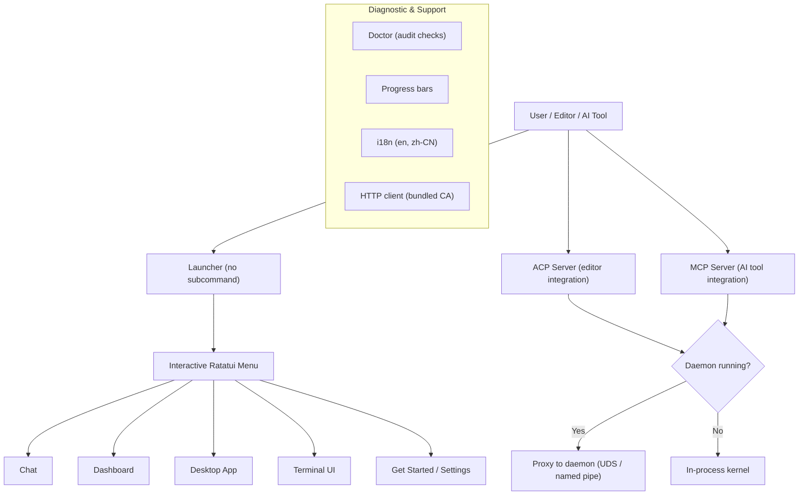

# CLI & Terminal UI

# CLI & Terminal UI Module

The `librefang-cli` crate is the primary user-facing entry point for LibreFang. It provides the interactive launcher, protocol servers (ACP, MCP), diagnostic tooling, desktop app management, and the full terminal UI dashboard built on Ratatui.

## Architecture Overview



## Dual-Mode Execution Model

Most CLI subsystems follow a shared pattern: **try the daemon first, fall back to an in-process kernel**.

1. **Daemon-attached**: If `find_daemon()` locates a running LibreFang daemon, the CLI becomes a thin client — proxying I/O over a Unix domain socket (Linux/macOS) or named pipe (Windows) to the long-running daemon kernel. This lets multiple clients (editor tabs, terminals) share agent state, approval caches, and conversation history.

2. **In-process**: When no daemon is detected, the CLI boots a fresh `LibreFangKernel`, runs the requested operation, and exits. Approval decisions and agent state are scoped to this single invocation.

The mode is always logged to stderr (e.g., `librefang acp: in-process kernel (no daemon detected)`) because the two modes have **different** `allow_always` caches — an approval remembered in one mode does not carry over to the other.

## Key Components

### ACP Server — `acp.rs`

The Agent Client Protocol server lets editors (Zed, VS Code, JetBrains) embed LibreFang as a native agent over stdio.

- **Entry point**: `run_acp_server(config, agent)`
- **Default agent**: `"assistant"` (mirrors the dashboard/TUI default)
- **Platform transport**: UDS at `~/.librefang/acp.sock` on Unix; named pipe `\\.\pipe\librefang-acp` on Windows
- **Stale socket handling**: `locate_acp_socket()` verifies the daemon is reachable *and* the socket file exists. A leftover socket from a crashed daemon causes a graceful fallback to in-process mode.

The proxy (`run_uds_proxy` / `run_pipe_proxy`) is a bidirectional stdin↔socket↔stdout pipe built on Tokio async I/O with 8 KiB buffers. Either direction closing ends the session via `tokio::select!`.

### MCP Server — `mcp.rs`

Exposes LibreFang agents as MCP tools over JSON-RPC 2.0 on stdio, using Content-Length framing. Each agent becomes a callable tool named `librefang_agent_{name}` (hyphens replaced with underscores).

**Protocol flow**:
1. `initialize` — returns server capabilities (`protocolVersion: "2024-11-05"`)
2. `notifications/initialized` — client confirmation (no response)
3. `tools/list` — enumerates agents from the daemon API or in-process kernel registry
4. `tools/call` — sends a message to a resolved agent, returns the response text

**Security**: Messages exceeding 10 MiB are rejected and drained to prevent stream desync. Agent resolution does exact-match name lookup with hyphen/underscore normalization.

### Launcher — `launcher.rs`

The interactive Ratatui menu displayed when `librefang` is invoked with no subcommand in a TTY.

**First-run vs returning users**: The menu structure adapts based on `is_first_run()` (presence of `~/.librefang/config.toml`):

| First-run menu | Returning menu |
|---|---|
| **Get started** (onboarding) | **Chat with an agent** |
| Chat with an agent | Open dashboard |
| Open dashboard | Launch terminal UI |
| Open desktop app | Open desktop app |
| Launch terminal UI | Settings |
| Show all commands | Show all commands |

Quit is keyboard-only (`q`/`Esc`) — never a menu item. Digit keys `1`–`9` jump directly to menu entries.

**Daemon detection** runs in a background thread on launch, querying the daemon URL and agent count. The spinner resolves to a status line showing daemon state and detected API provider (from `PROVIDER_ENV_VARS`: `ANTHROPIC_API_KEY`, `OPENAI_API_KEY`, etc.).

**Migration hints**: If `~/.openclaw` or `~/.openfang` directories are detected on first run, the launcher shows a migration nudge.

### Doctor — `doctor.rs`

Trait-based audit framework for `librefang doctor`. Each check is a standalone struct implementing `AuditCheck`:

```rust
pub trait AuditCheck {
    fn run(&self, ctx: &AuditContext) -> AuditResult;
}
```

**Registered checks** (via `registered_checks()`):

| Check | What it validates |
|---|---|
| `VaultKeyCheck` | `LIBREFANG_VAULT_KEY` base64-decodes to exactly 32 bytes |
| `ApiListenAddrCheck` | `config.toml` `api_listen` parses as `SocketAddr`; warns on privileged/ephemeral ports |
| `ConfigTomlSchemaCheck` | `config.toml` exists and is valid TOML |

**Adding a check**: Create a unit struct implementing `AuditCheck`, add it to `registered_checks()`. No other registration needed.

**Severity levels**: `Pass` (green), `Info` (informational), `Warn` (fixable misconfiguration), `Error` (blocks operation). Every result carries a stable snake_case `name` (for JSON output), a human `summary`, and an optional `hint`.

### Desktop Install — `desktop_install.rs`

Discovers, downloads, and installs the LibreFang desktop app from GitHub releases.

**Discovery order** (`find_desktop_binary()`):
1. Sibling of the current CLI executable
2. PATH lookup
3. Platform-specific standard location (`/Applications/LibreFang.app`, `%LOCALAPPDATA%\LibreFang\`, `~/.local/bin/`)

**Platform installers**:
- **macOS**: DMG mounted via `hdiutil`, `.app` bundle copied to `/Applications`, quarantine attribute cleared
- **Windows**: NSIS silent install (`/S`), binary expected at `%LOCALAPPDATA%\LibreFang\LibreFang.exe`
- **Linux**: AppImage copied to `~/.local/bin/librefang-desktop` with `chmod 0755`

**Launch** (`launch()`): On macOS, detects `.app` bundles and uses `open -a`; elsewhere, spawns the binary detached with null stdio.

### Internationalization — `i18n.rs`

Fluent-based i18n with thread-local state. Supports English (`en`) and Simplified Chinese (`zh-CN`).

**Usage**:
```rust
i18n::init("zh-CN");
let label = t("label-dashboard"); // "控制台"
let msg = t_args("models-available", &[("count", "12")]); // "12 models available"
```

FTL resources are compiled in via `include_str!`. Missing keys fall back to `[key_name]`. Initialization failures silently fall back to the default language (English).

### Log Filter — `log_filter.rs`

Reloadable `EnvFilter` for the daemon's tracing stack, backed by `ArcSwap` so the filter can be swapped at runtime (e.g., from the dashboard) without restarting.

Key design points:
- **Per-layer filter**: The OTel exporter sees the full span tree while stderr stays terse
- **Baseline directives**: Boot-time per-target overrides (e.g., `librefang_kernel=warn`) are stored in `BASELINE_DIRECTIVES` and reapplied on every reload, preventing a dashboard "debug" toggle from unmasking kernel noise
- **Cache invalidation**: `tracing_core::callsite::rebuild_interest_cache()` is called after every swap
- **CLI adapter**: `CliLogLevelReloader` implements the kernel's `LogLevelReloader` trait

### HTTP Client — `http_client.rs`

Blocking `reqwest` client builder with bundled CA roots from `librefang_runtime::http_client::tls_config()`. Used throughout the CLI for GitHub API calls, daemon communication, and release downloads.

### Progress — `progress.rs`

ANSI-based progress reporting (no external TUI dependency for this module). Provides:
- **ProgressBar**: Percentage bar with Unicode block characters (`█░`)
- **Spinner**: Braille-pattern animation frames
- **OSC 9;4**: Terminal progress protocol for Windows Terminal/iTerm2
- **Delay suppression**: Output hidden for operations completing under 200ms
- **`ProgressReporter` trait**: Abstract interface so callers work in both TTY and piped environments

Use `auto(label, total)` to get the right reporter: animated bars on TTY, plain `[n/total]` lines over pipes.

### Bundled Agents — `bundled_agents.rs`

Thin wrapper delegating to `librefang_runtime::registry_sync::sync_registry` for backwards compatibility with existing CLI callers.

## Event System (TUI)

The TUI module (referenced in the call graph but whose source is split across `tui/`) uses a threaded event architecture:

- `spawn_event_thread` is the central dispatcher
- Individual operations (`spawn_daemon_detect`, `spawn_fetch_channels`, `spawn_run_workflow`, etc.) spawn background threads that communicate results back to the main TUI loop via channels
- Daemon communication uses HTTP clients built by `make_daemon_client` / `make_daemon_client_with_timeout`
- Agent streaming falls back via `daemon_fallback` when the daemon is unavailable, using in-process `AgentLoopResult`

## Cross-Cutting Concerns

**Thread safety for env var tests**: Tests that mutate process-global env vars (`LIBREFANG_HOME`, `LIBREFANG_VAULT_KEY`) use module-scoped `Mutex` guards (`ENV_LOCK`, `env_lock()`) to serialize access, since `cargo test` runs in parallel.

**Platform conditionals**: The codebase uses `#[cfg(unix)]`, `#[cfg(windows)]`, and `#[cfg(target_os = "...")]` extensively. Non-applicable platform branches compile to no-ops or stubs, with `#[allow(unused_variables)]` where needed.

**No panics on missing features**: Doctor checks return `Info` for missing config; ACP falls back to in-process mode on stale sockets; desktop install offers manual download URLs when automatic install is unsupported.