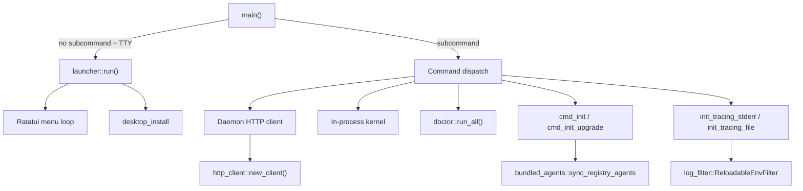

# CLI & Terminal UI

# CLI & Terminal UI (`librefang-cli`)

The command-line interface for LibreFang. When invoked with a subcommand it dispatches to the appropriate handler; when run with no subcommand in a TTY, it presents an interactive launcher menu. Commands either talk to a running daemon over HTTP or boot an in-process kernel for single-shot execution.

## Architecture Overview

## Startup Sequence

`main()` performs the following in order:

1. **Allocator setup** — Jemalloc on non-MSVC targets via `tikv_jemallocator`.
2. **Ctrl+C handler** — `install_ctrlc_handler()` uses `SetConsoleCtrlHandler` on Windows to ensure clean interruption of blocking reads; on Unix the default SIGINT handler suffices.
3. **Dotenv & vault loading** — `librefang_extensions::dotenv::load_dotenv()` reads `.env` files and loads encrypted credentials from the vault.
4. **CLI parsing** — `clap::Parser` parses `Cli` which has an optional `Commands` subcommand.
5. **i18n init** — `i18n::init()` sets up a thread-local `FluentBundle` for the configured language (`en` or `zh-CN`).
6. **Subcommand dispatch** — the giant `match self.command` block routes to `cmd_*` functions. If no subcommand is provided, `launcher::run()` starts the interactive menu.

## Key Components

### Command Definitions (`main.rs`)

All CLI commands are defined via `clap` derive macros. The `Commands` enum contains top-level subcommands, many of which have their own nested subcommand enums (marked with `[*]` in help text):

- **Lifecycle**: `init`, `start`, `stop`, `restart`, `status`, `doctor`, `update`
- **Agent management**: `agent` (new, list, chat, kill, spawn, set), `spawn`, `agents`, `kill`, `chat`, `message`
- **Orchestration**: `workflow`, `trigger`, `cron`, `webhooks`
- **Configuration**: `config` (show, edit, get, set, set-key, delete-key, test-key), `vault`
- **Integrations**: `channel`, `mcp`, `skill`, `hand`, `devices`
- **UI**: `tui`, `dashboard`, `qr`
- **System**: `service`, `system`, `security`, `memory`, `sessions`, `logs`, `health`
- **Setup wizards**: `onboard`, `configure`, `setup`
- **Other**: `models`, `auth`, `new`, `completion`, `hash-password`, `reset`, `uninstall`, `migrate`

The `Cli` struct accepts a global `--config` flag for specifying a config file path.

### Interactive Launcher (`launcher.rs`)

Displayed when `librefang` is run with no subcommand in a TTY. Built with Ratatui as a one-shot menu.

**Menu behavior adapts to user state:**

- **First-run users** (no `~/.librefang/config.toml`): "Get started" is the top item, highlighted with accent color. Migration hints appear if `~/.openclaw` or `~/.openfang` directories are detected.
- **Returning users**: "Chat with an agent" leads, "Settings" is at the bottom.

**Background daemon detection** runs on a spawned thread — checks for a running daemon via `find_daemon()` and queries `/api/agents` for the agent count. The result feeds into the status block shown above the menu.

**Provider detection** checks environment variables (`ANTHROPIC_API_KEY`, `OPENAI_API_KEY`, etc.) and displays whether API keys are configured.

**Key bindings**: `↑/↓` or `j/k` navigate, `1-9` quick-select, `Enter` confirms, `q` quits. The help screen (from "Show all commands") renders the full `--help` output with scrolling.

`LauncherChoice` enum variants map to the corresponding command handlers back in `main.rs`.

### Diagnostic Framework (`doctor.rs`)

A trait-based audit check registry for `librefang doctor`.

**Core types:**

| Type | Purpose |
|---|---|
| `AuditCheck` trait | Single method: `fn run(&self, ctx: &AuditContext) -> AuditResult` |
| `AuditContext` | Carries `librefang_home: PathBuf` — cheap to construct, extend as needed |
| `AuditResult` | `name`, `severity`, `summary`, optional `hint` |
| `Severity` | `Pass`, `Info`, `Warn`, `Error` |

**Registered checks** (via `registered_checks()`):

1. **`VaultKeyCheck`** — verifies `LIBREFANG_VAULT_KEY` base64-decodes to exactly 32 bytes. This is a common gotcha: 32 ASCII characters ≠ 32 bytes after base64 decode. Matches production behavior in `librefang-extensions/src/vault.rs` (no trimming).
2. **`ApiListenAddrCheck`** — parses `api_listen` from `config.toml` as a `SocketAddr`. Warns on privileged ports (<1024) and port 0 (ephemeral, undiscoverable by clients).
3. **`ConfigTomlSchemaCheck`** — verifies `config.toml` exists and parses as valid TOML.

**Adding a new check:**

1. Create a unit struct implementing `AuditCheck`.
2. Add `Box::new(YourCheck)` to the `registered_checks()` vector.

The module runs *alongside* legacy inline checks in `cmd_doctor` — migration is incremental.

### Desktop App Installation (`desktop_install.rs`)

Handles discovery, download, and installation of the LibreFang Desktop app from GitHub releases.

**Binary discovery** (`find_desktop_binary`) searches in order:
1. Sibling of the current CLI executable
2. System `PATH` lookup
3. Platform-specific install location (`/Applications/LibreFang.app` on macOS, `%LOCALAPPDATA%\LibreFang\` on Windows, `~/.local/bin/` on Linux)

**Download flow** (`prompt_and_install` → `download_and_install`):
1. Prompts the user for confirmation
2. Queries `https://api.github.com/repos/librefang/librefang/releases/latest`
3. Finds the asset matching the current platform/arch suffix
4. Streams the download to a temp directory
5. Delegates to platform-specific installation

**Platform installations:**

| Platform | Asset | Install method |
|---|---|---|
| macOS (aarch64) | `_aarch64.dmg` | `hdiutil attach`, copy to `/Applications`, clear quarantine |
| macOS (x86_64) | `_x64.dmg` | Same as aarch64 |
| Windows (x86_64) | `_x64-setup.exe` | Silent NSIS install (`/S`) |
| Linux (x86_64) | `_amd64.AppImage` | Copy to `~/.local/bin/`, `chmod 755` |

**Launching** (`launch`) handles macOS `.app` bundles specially — walks up to find the parent `.app` bundle and uses `open -a` instead of executing the binary directly.

### Internationalization (`i18n.rs`)

Thread-local Fluent-based i18n with bundled FTL resources.

- `init(language)` creates a `FluentBundle` from embedded FTL files (`locales/en/main.ftl`, `locales/zh-CN/main.ftl`)
- `t(key)` — simple lookup, returns `[key]` if not found
- `t_args(key, &[("name", "value")])` — lookup with interpolation
- Falls back to `DEFAULT_LANGUAGE` ("en") for unsupported languages

The `I18N` thread-local is lazily initialized and reused across calls.

### HTTP Client (`http_client.rs`)

Thin wrapper around `reqwest::blocking::Client` with bundled CA roots from `librefang_runtime::http_client::tls_config()`. Two functions:

- `client_builder()` — returns a `ClientBuilder` with preconfigured TLS
- `new_client()` — builds the client, panics on failure (should never fail with bundled roots)

### Reloadable Log Filter (`log_filter.rs`)

Hot-reloadable `EnvFilter` for the daemon's tracing stack. Designed as a per-layer filter so the OpenTelemetry exporter sees the full span tree while stderr stays filtered.

**Problem it solves:** `tracing_subscriber::reload::Layer` has a `Handle` typed to the full subscriber stack, making the signature unwieldy in a `OnceLock`. This module uses `ArcSwap<EnvFilter>` instead.

**Key design decisions:**

- **`ReloadableEnvFilter`** wraps `Arc<ArcSwap<EnvFilter>>` and implements `tracing_subscriber::layer::Filter` by forwarding every method to the current inner filter.
- **Baseline directives** (`install_with_baseline`) preserve per-target overrides (e.g., `librefang_kernel=warn`) across reloads. Without this, a dashboard "set debug" would wipe boot-time masks.
- **`reload_log_level(directive)`** parses a new directive, reapplies baseline, swaps the filter via `ArcSwap::store`, and calls `tracing_core::callsite::rebuild_interest_cache()` to invalidate per-callsite `Interest` caching.
- **`CliLogLevelReloader`** adapts this to the kernel's `LogLevelReloader` trait.

Process-wide state lives in `OnceLock` slots (`LIVE_FILTER`, `BASELINE_DIRECTIVES`) — idempotent for re-init scenarios.

### Registry Sync (`bundled_agents.rs`)

Minimal backwards-compatibility wrapper around `librefang_runtime::registry_sync::sync_registry`. Called during `cmd_init` and `cmd_init_upgrade` to sync bundled agent content to the local `~/.librefang/` directory.

### Tracing Initialization

Two tracing modes set up in `main.rs`:

- **`init_tracing_stderr`** — Used by the daemon. Layers a `ReloadableEnvFilter` (with baseline directives) onto a `fmt::Layer` writing to stderr, plus an optional OpenTelemetry reload layer from `librefang_api::telemetry`.
- **`init_tracing_file`** — Used by detached/background daemon processes. Writes to a log file in the LibreFang home directory.

Both respect `RUST_LOG` environment variable for initial filter configuration.

## Daemon Communication Pattern

Commands that need a running daemon follow this pattern:

1. `find_daemon()` or `find_daemon_in_home()` locates the daemon URL from `~/.librefang/daemon.json`
2. `daemon_client_with_api_key()` builds an HTTP client with the configured API key
3. Requests hit the daemon's REST API (default `http://127.0.0.1:4545`)

When no daemon is running, many commands fall back to in-process kernel execution via `LibreFangKernel`.

## Utility Modules

| Module | Purpose |
|---|---|
| `ui` | Terminal output helpers: `success`, `error`, `hint`, `step`, `kv`, `banner`, `next_steps` |
| `table` | Formatted table rendering with right-alignment support |
| `progress` | Progress bars with OSC 52 integration, delay suppression, and zero-total safety |
| `templates` | Agent template loading from the registry |
| `tui/` | Full-screen terminal dashboard (agents, logs, audit, etc.) |
| `mcp` | MCP server backend construction |