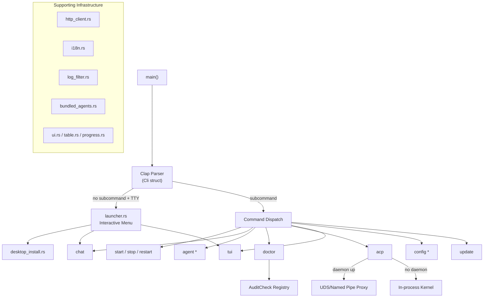

# CLI & Terminal UI

# CLI & Terminal UI Module

## Overview

`librefang-cli` is the primary user-facing binary for LibreFang — the command-line interface that handles everything from daemon management to interactive chat, desktop app installation, and a full Ratatui-based terminal dashboard. When run with no subcommand in a TTY, it presents an interactive launcher menu.

The CLI operates in two fundamental modes:

- **Daemon-attached**: When `librefang start` is running, commands communicate over HTTP to the long-lived daemon kernel.
- **In-process (single-shot)**: When no daemon is available, commands boot a temporary kernel, execute, and exit.

## Architecture


```mermaid
graph TD
    Entry["main()"] --> Clap["Clap Parser<br/>(Cli struct)"]
    Clap -->|"no subcommand + TTY"| Launcher["launcher.rs<br/>Interactive Menu"]
    Clap -->|"subcommand"| Dispatch["Command Dispatch"]

    Dispatch --> Start["start / stop / restart"]
    Dispatch --> Chat["chat"]
    Dispatch --> AgentCmd["agent *"]
    Dispatch --> Doctor["doctor"]
    Dispatch --> ACP["acp"]
    Dispatch --> TUI["tui"]
    Dispatch --> Config["config *"]
    Dispatch --> Update["update"]

    Doctor --> AuditReg["AuditCheck Registry"]
    ACP -->|"daemon up"| UDSProxy["UDS/Named Pipe Proxy"]
    ACP -->|"no daemon"| InProc["In-process Kernel"]
    Launcher --> Desktop["desktop_install.rs"]
    Launcher --> Chat
    Launcher --> TUI

    subgraph "Supporting Infrastructure"
        HttpClient["http_client.rs"]
        I18N["i18n.rs"]
        LogFilter["log_filter.rs"]
        BundledAgents["bundled_agents.rs"]
        UI["ui.rs / table.rs / progress.rs"]
    end
```

## Key Submodules

### `main.rs` — Entry Point & Command Dispatch

The root of the binary. Responsibilities:

- **Argument parsing** via `clap::Parser` on the `Cli` struct, with extensive `long_about` help text for every subcommand.
- **Ctrl+C handling**: Platform-specific — Windows uses `SetConsoleCtrlHandler` to reliably interrupt blocking reads; Unix relies on the default SIGINT handler.
- **Global allocator**: Jemalloc on non-MSVC targets.
- **dotenv loading** at startup via `librefang_extensions::dotenv`.
- **Daemon detection** (`find_daemon`) used throughout to decide between HTTP calls to a running daemon and in-process kernel boot.

Major commands defined in the `Commands` enum include `init`, `start`, `stop`, `restart`, `chat`, `status`, `update`, `doctor`, `agent`, `config`, `channel`, `skill`, `hand`, `workflow`, `trigger`, `migrate`, `spawn`, `agents`, `kill`, and the `acp` and `tui` subcommands.

### `launcher.rs` — Interactive Launcher Menu

Displayed when the user runs `librefang` with no subcommand in an interactive terminal. Built with Ratatui.

**Two menu variants** depending on user state:
- `MENU_FIRST_RUN`: Leads with "Get started" (onboarding). Shown when `~/.librefang/config.toml` doesn't exist.
- `MENU_RETURNING`: Leads with "Chat with an agent". Shown for existing installations.

**Status detection** runs on a background thread:
1. Detects if the daemon is reachable and counts registered agents.
2. Checks for provider API keys (`ANTHROPIC_API_KEY`, `OPENAI_API_KEY`, etc.).
3. Detects `~/.openclaw` or `~/.openfang` for migration hints on first run.

**Key bindings**: `↑/k` `↓/j` navigate, `1-9` quick-select, `Enter` confirm, `q`/`Esc` quit.

**Layout**: Content is capped at 80 columns with a 3-column left margin, vertically centered in the upper third of the terminal. A secondary "Help" screen paginates the full `--help` output with scroll support.

### `acp.rs` — Agent Client Protocol Server

Enables editors (Zed, VS Code, JetBrains) to embed LibreFang as a native agent over stdio.

**Two modes**, selected automatically:

| Mode | Condition | Behavior |
|------|-----------|----------|
| **Daemon-attached** (proxy) | Daemon running + socket exists | Transparent stdio↔socket pipe. Unix uses UDS at `~/.librefang/acp.sock`; Windows uses named pipe `\\.\pipe\librefang-acp`. |
| **In-process** | No daemon | Boots a fresh `LibreFangKernel`, resolves the agent, and runs the ACP server on stdio until EOF. |

**Important**: Approval caches (`allow_always`) are *not shared* between in-process and daemon-attached modes. The mode is logged to stderr so users can diagnose "why did my agent forget this approval?" scenarios.

### `doctor.rs` — Diagnostic Health Checks

A trait-based audit framework for `librefang doctor`. Each check is an independent struct implementing `AuditCheck`:

```rust
pub trait AuditCheck {
    fn run(&self, ctx: &AuditContext) -> AuditResult;
}
```

**Registered checks** (via `registered_checks()`):

| Check | What it validates |
|-------|-------------------|
| `VaultKeyCheck` | `LIBREFANG_VAULT_KEY` base64-decodes to exactly 32 bytes. Catches the common mistake of using 32 ASCII characters (24 bytes decoded). |
| `ApiListenAddrCheck` | `config.toml`'s `api_listen` parses as `SocketAddr`. Warns on privileged ports (<1024) and port 0 (ephemeral, undiscoverable). |
| `ConfigTomlSchemaCheck` | `config.toml` exists and is valid TOML. |

**Severities**: `Pass`, `Info`, `Warn`, `Error`. Each `AuditResult` carries a machine-readable `name`, a human `summary`, and an optional `hint` for remediation.

**Adding a new check**: Create a unit struct implementing `AuditCheck`, add it to `registered_checks()`. No other wiring needed.

### `desktop_install.rs` — Desktop App Discovery & Installation

Handles locating, downloading, and launching the LibreFang desktop application.

**Discovery order** (`find_desktop_binary`):
1. Sibling of the current CLI executable
2. `PATH` lookup (`which_lookup`)
3. Platform-specific install location (`/Applications/LibreFang.app`, `%LOCALAPPDATA%\LibreFang\`, `~/.local/bin/librefang-desktop`)

**Installation flow** (`prompt_and_install` → `download_and_install`):
1. Query GitHub Releases API for the latest release.
2. Select the platform-appropriate asset (`.dmg` for macOS, `-setup.exe` for Windows, `.AppImage` for Linux x86_64).
3. Stream-download to a temp directory.
4. Platform-specific install:
   - **macOS**: Mount DMG via `hdiutil`, copy `.app` to `/Applications`, clear quarantine xattr.
   - **Windows**: Run NSIS installer with `/S` for silent install.
   - **Linux**: Copy AppImage to `~/.local/bin/`, `chmod 755`.

**Launching** (`launch`): On macOS, detects `.app` bundles and uses `open -a`. Otherwise spawns the binary detached with null stdio.

### `i18n.rs` — Internationalization

Thread-local Fluent-based i18n supporting `en` and `zh-CN`.

- **Init**: `init(language)` creates a `FluentBundle` from embedded `.ftl` files. Falls back to English for unsupported languages.
- **Translation**: `t(key)` for simple strings, `t_args(key, &[("name", value)])` for interpolation.
- **Thread safety**: Uses `thread_local!` + `RefCell` — each thread gets its own bundle. The `I18N` cell is lazily populated on first `t()` / `t_args()` call.

### `log_filter.rs` — Reloadable Log Filtering

A per-layer `EnvFilter` that can be hot-reloaded at runtime (used by the daemon's tracing stack).

**Problem it solves**: The daemon uses per-layer filtering so the OpenTelemetry exporter sees the full span tree while stderr stays terse. Standard `tracing_subscriber::reload` carries subscriber type parameters that would pollute the `OnceLock` signature.

**Solution**: `ReloadableEnvFilter` wraps an `ArcSwap<EnvFilter>` and implements `tracing_subscriber::layer::Filter` by delegating every method to the currently loaded inner filter. On reload (`reload_log_level`):
1. Parse the new directive string.
2. Reapply baseline directives (e.g. `librefang_kernel=warn`) stored at install time via `install_with_baseline` — prevents a dashboard "debug" toggle from flooding with kernel noise.
3. Swap the `ArcSwap` and call `tracing_core::callsite::rebuild_interest_cache()`.

The `CliLogLevelReloader` adapter bridges to the kernel's `LogLevelReloader` trait.

### `http_client.rs` — HTTP Client

Thin wrapper providing a `reqwest::blocking::Client` with bundled CA roots (via `librefang_runtime::http_client::tls_config()`). Used by `desktop_install`, `doctor`, update checks, and daemon communication.

### `bundled_agents.rs` — Registry Sync

Backward-compatible wrapper delegating to `librefang_runtime::registry_sync::sync_registry`. Called during `init` to populate the local agent registry from bundled content.

### `tui/` — Terminal Dashboard

A full Ratatui-based interactive dashboard with multiple screens:

| Screen | Purpose |
|--------|---------|
| `chat` | Interactive agent chat with message rendering, model picker, function-call display |
| `settings` | Provider configuration, model selection, tool management |
| `sessions` | Browse active agent sessions |
| `memory` | Key-value memory browser and editor |
| `extensions` | Extension management with health status |
| `peers` | Trusted peer overview |
| `skills` | Skill browsing and FangHub integration |
| `comms` | Messaging channel management |
| `audit` | Audit log viewer |
| `init_wizard` | First-run setup wizard |

Shared TUI infrastructure in `tui/theme.rs` (colors, styles), `tui/widgets.rs` (reusable components like `themed_list`, `empty_state`, `spinner`, `separator`), and `tui/chat_runner.rs` (bridges TUI chat to the kernel/daemon).

### `ui.rs`, `table.rs`, `progress.rs` — CLI Output Utilities

- **`ui.rs`**: Colored terminal output helpers (`success`, `error`, `hint`, `step`, `kv`) for non-interactive CLI commands.
- **`table.rs`**: Aligned table rendering for both ASCII and Unicode box-drawing characters.
- **`progress.rs`**: Progress indicators that detect terminal capability — spinners in TTY, plain text otherwise.

## Execution Modes

### Daemon Mode (`librefang start`)

The daemon starts the kernel and API server. `--foreground` keeps it in the terminal; `--tail` backgrounds it but streams logs; default is fully detached. The daemon writes a PID file and daemon info so subsequent CLI calls can discover it.

### Single-Shot Mode (No Daemon)

Commands like `librefang chat` or `librefang agent list` without a running daemon boot an in-process `LibreFangKernel`, execute the operation, and exit. This is slower per invocation but requires no background process.

### ACP Proxy Mode

`librefang acp` first checks for a running daemon with an ACP listener. If found, the process becomes a thin bidirectional pipe (stdin↔socket↔stdout). If not, it boots an in-process kernel and serves ACP directly. The mode is logged to stderr for debugging.

## Configuration

- **Config file**: `~/.librefang/config.toml` (or `$LIBREFANG_HOME/config.toml`)
- **Environment**: `.env` in the librefang home directory, loaded at startup
- **API keys**: Stored in `.env` or set as environment variables (`ANTHROPIC_API_KEY`, `OPENAI_API_KEY`, etc.)
- **Vault key**: `LIBREFANG_VAULT_KEY` — must be base64-encoded 32 bytes (generate with `openssl rand -base64 32`)

## Platform Notes

| Platform | ACP Transport | Desktop Install | App Location |
|----------|--------------|-----------------|--------------|
| macOS | UDS (`acp.sock`) | DMG → `/Applications/LibreFang.app` | `open -a` |
| Windows | Named pipe (`\\.\pipe\librefang-acp`) | NSIS silent installer | `%LOCALAPPDATA%\LibreFang\` |
| Linux | UDS (`acp.sock`) | AppImage → `~/.local/bin/` | Direct exec |

## Contributing

**Adding a new CLI command**: Add a variant to the `Commands` enum in `main.rs` with clap attributes, then handle it in the `match` dispatch block.

**Adding a doctor check**: Create a unit struct implementing `AuditCheck` in `doctor.rs`, add it to `registered_checks()`.

**Adding a TUI screen**: Create a new module under `tui/screens/`, implement the draw function and event handling, register it in the TUI screen router.

**Adding translations**: Add keys to `locales/en/main.ftl` and `locales/zh-CN/main.ftl`, then use `t("key")` or `t_args("key", &[("param", value)])` in code.