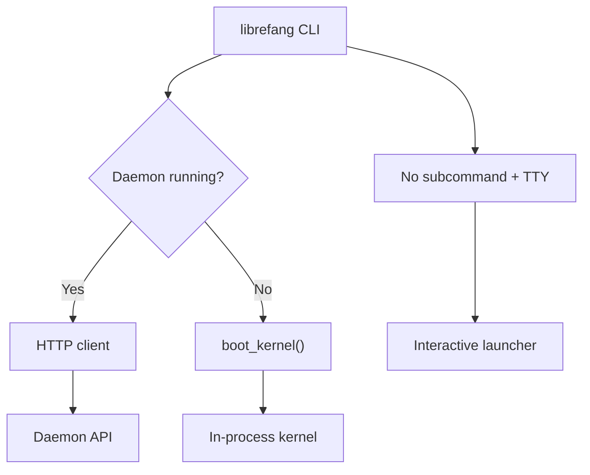

# CLI & TUI

# CLI & TUI Module

The `librefang-cli` crate is the primary user-facing entry point for LibreFang. It provides a command-line interface with ~30 subcommands, an interactive launcher menu, a full-screen TUI dashboard, and supporting infrastructure for desktop app management, diagnostics, internationalization, and runtime log filtering.

## Architecture Overview

The CLI operates in two fundamental modes depending on whether a daemon is already running:



- **Daemon mode**: Commands like `agent list`, `chat`, `status` delegate to a running daemon over HTTP via `find_daemon` → HTTP client.
- **Single-shot mode**: When no daemon is found, `boot_kernel` starts an in-process `LibreFangKernel` for the duration of the command.
- **Launcher mode**: Running `librefang` with no subcommand in a TTY opens the interactive Ratatui menu (`launcher::run`).

## Entry Point — `main.rs`

`main.rs` defines the clap-based CLI structure (`Cli` / `Commands`) and dispatches every subcommand to a dedicated `cmd_*` function. Key patterns:

- **Global allocator**: Uses `tikv_jemallocator::Jemalloc` on non-MSVC targets.
- **Ctrl+C handling**: Platform-specific — on Windows, installs a custom `SetConsoleCtrlHandler` that calls `process::exit` (the default handler doesn't reliably interrupt blocking `read_line` on MINGW). On Unix, the default SIGINT handler suffices.
- **Config loading**: `load_config` is called with the optional `--config` path. `LIBREFANG_HOME` overrides `~/.librefang/`.
- **Daemon discovery**: `find_daemon()` checks `LIBREFANG_HOME` for daemon info, then probes the default address. Returns `Option<String>` (base URL).
- **Kernel boot**: `boot_kernel()` initializes tracing, creates a `LibreFangKernel`, and returns it for single-shot command execution.

### Command Structure

The `Commands` enum organizes subcommands into top-level entries and grouped subcommands (marked with `[*]` in help text):

| Top-level | Description |
|---|---|
| `init`, `start`, `stop`, `restart` | Lifecycle management |
| `chat`, `spawn`, `agents`, `kill` | Agent operations |
| `status`, `health`, `doctor` | Diagnostics |
| `update` | Self-update from GitHub releases |
| `dashboard`, `tui`, `logs` | UI/output |
| `config`, `vault`, `models` | Configuration |
| `channel`, `skill`, `hand`, `mcp` | Integrations |
| `workflow`, `trigger`, `cron` | Automation |
| `security`, `approvals`, `memory` | Operations |
| `completion`, `new`, `migrate`, `uninstall` | Utilities |

## Interactive Launcher — `launcher.rs`

When the user runs `librefang` with no subcommand in a TTY, the launcher displays a Ratatui-based interactive menu with background daemon detection.

### Menu Variants

Two static menu configurations adapt to the user's state:

- **`MENU_FIRST_RUN`**: Shown when `~/.librefang/config.toml` doesn't exist. Leads with "Get started" (onboarding).
- **`MENU_RETURNING`**: Shown for existing installations. Leads with "Chat with an agent" (action-first).

Both menus are capped at 9 items to fit the 1-9 number-shortcut keybinding.

### State and Screens

```
Screen::Menu     →  Main menu with daemon/provider status indicators
Screen::Help     →  Scrollable full --help output (j/k/PgUp/PgDn/g/G navigation)
```

`LauncherState` tracks:
- Daemon detection result (spawned in a background thread, received via `mpsc::channel`)
- Provider detection via environment variables (`ANTHROPIC_API_KEY`, `OPENAI_API_KEY`, etc.)
- First-run status, OpenClaw/OpenFang migration detection

### Desktop App Launch

`launch_desktop_app()` attempts to find an existing desktop binary via `desktop_install::find_desktop_binary()`. If not found, it prompts the user to download and install it.

## Doctor / Audit Framework — `doctor.rs`

The doctor command runs diagnostic health checks. The module provides a trait-based registry so each check is an isolated, testable unit.

### Adding a New Check

1. Create a unit struct implementing `AuditCheck`
2. Add it to `registered_checks()`

```rust
pub trait AuditCheck {
    fn run(&self, ctx: &AuditContext) -> AuditResult;
}
```

`AuditContext` carries `librefang_home` — add fields here as new checks need them.

### Severity Levels

| Severity | Meaning |
|---|---|
| `Pass` | Green case — builds confidence |
| `Info` | Informational — no action needed |
| `Warn` | Fixable misconfiguration |
| `Error` | Blocks correct operation |

### Registered Checks

- **`VaultKeyCheck`**: Verifies `LIBREFANG_VAULT_KEY` base64-decodes to exactly 32 bytes. Catches the common gotcha where 32 ASCII characters ≠ 32 bytes after base64 decode.
- **`ApiListenAddrCheck`**: Validates `config.toml`'s `api_listen` field parses as a valid `SocketAddr`. Warns on privileged ports (<1024) and port 0.
- **`ConfigTomlSchemaCheck`**: Verifies `config.toml` exists and parses as valid TOML.

The framework runs alongside legacy inline checks in `cmd_doctor` — migration to the framework is incremental.

## Desktop App Installation — `desktop_install.rs`

Handles discovery, download, and installation of the LibreFang desktop application across macOS, Windows, and Linux.

### Binary Discovery Order

`find_desktop_binary()` searches in order:
1. Sibling of the current CLI executable
2. PATH lookup (`which_lookup`)
3. Platform-specific standard locations:
   - macOS: `/Applications/LibreFang.app/Contents/MacOS/LibreFang`
   - Windows: `%LOCALAPPDATA%\LibreFang\LibreFang.exe`
   - Linux: `~/.local/bin/librefang-desktop` or `~/Applications/LibreFang.AppImage`

### Download and Install Flow

`prompt_and_install()` → `download_and_install()`:
1. Queries GitHub Releases API (`librefang/librefang`) for the latest release
2. Selects the platform-appropriate asset by suffix:
   - macOS ARM: `_aarch64.dmg`
   - macOS x64: `_x64.dmg`
   - Windows x64: `_x64-setup.exe`
   - Linux x64: `_amd64.AppImage`
3. Downloads to a temp directory
4. Platform-specific install:
   - **macOS**: Mounts DMG via `hdiutil`, copies `.app` to `/Applications`, clears quarantine
   - **Windows**: Runs NSIS installer with `/S` (silent)
   - **Linux**: Copies AppImage to `~/.local/bin/`, sets `0o755` permissions

On macOS, `launch()` detects `.app` bundles and uses `open -a` instead of direct binary execution.

## Internationalization — `i18n.rs`

Thread-local Fluent-based i18n supporting English and Simplified Chinese.

```rust
i18n::init("zh-CN");           // Initialize (fallback to DEFAULT_LANGUAGE on error)
let msg = i18n::t("key");      // Simple lookup
let msg = i18n::t_args("key", &[("count", "12")]);  // With arguments
```

- FTL files loaded at compile time via `include_str!`
- Thread-local storage via `RefCell<Option<I18n>>`
- Missing keys render as `[key_name]` rather than panicking
- `SUPPORTED_LANGUAGES`: `["en", "zh-CN"]`, default: `"en"`

## HTTP Client — `http_client.rs`

Thin wrapper that builds a `reqwest::blocking::Client` with bundled CA roots from `librefang_runtime::http_client::tls_config()`. Used throughout the CLI for daemon communication and GitHub API calls.

```rust
let client = http_client::new_client();  // blocking client with bundled TLS
```

## Reloadable Log Filter — `log_filter.rs`

Provides a hot-reloadable `EnvFilter` for the daemon's tracing stack. The daemon installs per-layer filters so the OTel exporter sees the full span tree while stderr stays terse.

### Key Design Decisions

- Uses `ArcSwap<EnvFilter>` instead of `tracing_subscriber::reload::Layer` to avoid generic type proliferation in the subscriber's `Layered<…>` chain.
- `install_with_baseline()` stores per-target overrides (e.g. `librefang_kernel=warn`) that survive reloads — a dashboard "give me debug" toggle won't unmask kernel chatter that boot had specifically masked.
- `reload_log_level()` calls `tracing_core::callsite::rebuild_interest_cache()` after swapping to ensure per-callsite `Interest` caches are recomputed.
- Process-global state via `OnceLock` — safe because the daemon initializes tracing exactly once.

```rust
let filter = ReloadableEnvFilter::install_with_baseline(
    EnvFilter::new("warn"),
    vec!["librefang_kernel=warn".into()],
);
// Later, from dashboard action:
log_filter::reload_log_level("debug")?;  // baseline directives preserved
```

`CliLogLevelReloader` adapts this for the kernel's `LogLevelReloader` trait.

## Registry Sync — `bundled_agents.rs`

Backwards-compatible wrapper that delegates to `librefang_runtime::registry_sync::sync_registry` with default cache TTL. Called during `init` to populate the local agent registry.

## UI Helpers — `ui.rs`

Provides styled output functions (`success`, `error`, `hint`, `step`, `kv`, `section`, `blank`, `check_warn`, `check_ok`) used throughout command handlers for consistent terminal output.

## Progress Reporting — `progress.rs`

Terminal progress indicators with support for spinners, percentage bars, and timed operations. Adapts rendering based on whether stdout is a TTY (`is_terminal`).

## Table Rendering — `table.rs`

Columnar table output with ASCII and Unicode rendering modes. `render_auto()` selects Unicode when the terminal supports it. Uses `right_alignment()` for numeric column alignment.

## Key Cross-Module Interactions

| CLI component | External dependency |
|---|---|
| `boot_kernel` | `librefang_kernel::LibreFangKernel` |
| `load_config` | `librefang_kernel::config` |
| `find_daemon` | `librefang_api::server::read_daemon_info` |
| HTTP client TLS | `librefang_runtime::http_client::tls_config` |
| Registry sync | `librefang_runtime::registry_sync::sync_registry` |
| Vault operations | `librefang_extensions::vault` |
| dotenv loading | `librefang_extensions::dotenv` |
| Config types | `librefang_types`, `librefang_kernel::config` |
| MCP stdio | `librefang_mcp` via `mcp.rs` |

## Testing Patterns

The module has extensive test coverage with specific patterns worth noting:

- **Process-wide env var mutation**: Tests that modify `LIBREFANG_HOME`, `LIBREFANG_VAULT_KEY`, or `PATH` use a `Mutex` (`ENV_LOCK` / `env_lock()`) to serialize concurrent access, with save-and-restore in the same scope.
- **Tempdir isolation**: All filesystem-mutating tests route writes through `tempfile::TempDir` — nothing escapes to the user's real home directory.
- **Platform-conditional tests**: Desktop install tests use `#[cfg(target_os = "...")]` and dependency-injected variants (e.g., `install_linux_appimage_to`, `linux_install_path_in`) that accept explicit paths instead of probing the real filesystem.