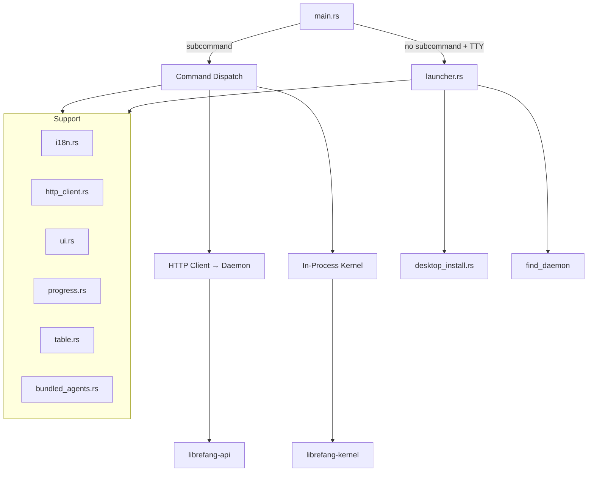

# CLI & TUI

# CLI & TUI Module

The `librefang-cli` crate is the primary user-facing interface for LibreFang. It provides a comprehensive command-line interface with 40+ subcommands, an interactive launcher menu, a full-screen terminal UI (TUI), and internationalization support. When no subcommand is given in a TTY, it opens a Ratatui-based interactive launcher instead of printing help text.

## Architecture Overview

## Entry Point and Lifecycle

`main.rs` is the crate root. It defines the CLI structure via `clap::Parser` with the `Cli` struct and the `Commands` enum containing every subcommand. The lifecycle is:

1. **Allocator setup** — Jemalloc on non-MSVC targets
2. **Signal handling** — `install_ctrlc_handler()` uses `SetConsoleCtrlHandler` on Windows (workaround for broken `read_line` interruption) and relies on default SIGINT on Unix
3. **Environment loading** — `load_dotenv` reads `~/.librefang/.env` and loads the credential vault
4. **i18n init** — Initializes the Fluent-based translation layer
5. **Command dispatch** — If a subcommand is provided, it routes to the appropriate handler. If no subcommand and stdin is a TTY, the interactive launcher opens

The daemon detection pattern is central: `find_daemon()` and `find_daemon_in_home()` check for a running daemon via `read_daemon_info`. Commands that need the daemon (status, chat, agent list, etc.) get a base URL and create an HTTP client. Commands like `start` or `init` work independently.

### Two Execution Modes

- **Daemon mode** — CLI acts as a thin HTTP client to the running daemon at `http://127.0.0.1:4545`
- **Single-shot mode** — When no daemon is running, commands like `chat` or `agent spawn` boot an in-process kernel (`LibreFangKernel`)

## Interactive Launcher (`launcher.rs`)

When `librefang` is run with no subcommand in a terminal, the launcher presents a Ratatui-based full-screen menu. It is not the full TUI dashboard — it is a lightweight one-shot picker.

### Menu Variants

The launcher shows different menus based on user state:

- **First-run menu** — "Get started" is the first and visually prominent option; includes migration hints for OpenClaw/OpenFang users
- **Returning user menu** — Action-first ordering (Chat, Dashboard, TUI), with Settings at the bottom

State detection:
- `is_first_run()` checks for `~/.librefang/config.toml`
- `has_openclaw()` / `has_openfang()` check for legacy directories
- `detect_provider()` scans environment variables for known API keys (ANTHROPIC_API_KEY, OPENAI_API_KEY, DEEPSEEK_API_KEY, etc.)

### LauncherChoice Enum

Each menu item maps to a `LauncherChoice` variant: `GetStarted`, `Chat`, `Dashboard`, `DesktopApp`, `TerminalUI`, `ShowHelp`, `Quit`. The `run()` function returns the user's selection to `main.rs`, which dispatches accordingly.

### Background Daemon Detection

On launch, a background thread calls `find_daemon()` and queries `/api/agents` for the agent count. The main loop polls for the result (50ms intervals) and updates the status indicator with a spinner while detecting, then shows daemon URL and agent count (or "No daemon running").

### Screens

The launcher has two screens:
- **Menu** — Primary menu with status indicators, navigation hints, and optional migration prompts
- **Help** — Full `--help` output rendered as a scrollable view with scrollbar (vim-like keybindings: j/k, g/G, PgUp/PgDn)

### Rendering

Content is constrained to a readable width (max 80 columns) with a left margin. Vertical centering places content in the upper-third of the terminal. A custom panic hook ensures the terminal is restored on panic.

## Desktop App Management (`desktop_install.rs`)

Handles discovering, downloading, and installing the LibreFang desktop application from GitHub releases (`librefang/librefang`).

### Discovery: `find_desktop_binary()`

Search order:
1. Sibling of the current CLI executable
2. PATH lookup (`which_lookup`)
3. Platform-specific locations:
   - macOS: `/Applications/LibreFang.app/Contents/MacOS/LibreFang`
   - Windows: `%LOCALAPPDATA%\LibreFang\LibreFang.exe`
   - Linux: `~/.local/bin/librefang-desktop` or `~/Applications/LibreFang.AppImage`

### Installation Flow: `prompt_and_install()` → `download_and_install()`

1. Prompt the user for confirmation
2. Detect platform asset suffix (e.g., `_aarch64.dmg`, `_x64-setup.exe`, `_amd64.AppImage`)
3. Query GitHub Releases API for the latest release
4. Find the matching asset by filename suffix
5. Download to a temp directory
6. Platform-specific install:
   - **macOS** (`install_macos_dmg`): Mounts DMG via `hdiutil`, copies `.app` bundle to `/Applications`, clears quarantine xattr
   - **Windows** (`install_windows`): Runs NSIS installer with `/S` silent flag
   - **Linux** (`install_linux_appimage`): Copies AppImage to `~/.local/bin/`, sets executable permissions

### Launching: `launch()`

On macOS, detects `.app` bundles and uses `open -a`. Otherwise, spawns the binary detached (null stdio).

## Internationalization (`i18n.rs`)

Fluent-based i18n with English and Simplified Chinese locales bundled at compile time via `include_str!`.

### Thread-Local State

A thread-local `RefCell<Option<I18n>>` stores the active translation bundle. Initialize with `init(language)` before calling translation functions.

### API

- `init(language: &str)` — Load the bundle for the given language; falls back to `DEFAULT_LANGUAGE` ("en") on failure
- `t(key: &str) -> String` — Translate a key with no arguments
- `t_args(key: &str, args: &[(&str, &str)]) -> String` — Translate with Fluent arguments

Missing keys render as `[key_name]`. The `SUPPORTED_LANGUAGES` constant lists valid options: `["en", "zh-CN"]`.

## HTTP Client (`http_client.rs`)

Thin wrapper around `reqwest::blocking` that applies the TLS configuration from `librefang_runtime::http_client::tls_config()`, which bundles CA roots for environments where system roots are unavailable.

- `client_builder()` — Returns a `ClientBuilder` with preconfigured TLS
- `new_client()` — Builds the client (panics on failure, which should never happen with bundled roots)

## Bundled Agents (`bundled_agents.rs`)

A backwards-compatibility shim that delegates to `librefang_runtime::registry_sync::sync_registry()` with default parameters. Called during `init` to populate the local agent registry.

## Supporting Modules

### `ui.rs`

Console output helpers (`success`, `error`, `hint`, `step`, `kv`) for colored, structured terminal output used throughout command handlers.

### `progress.rs`

Terminal progress reporting using OSC progress sequences and spinners. Key functions:
- `tick()` — Advance spinner
- `finish()` / `finish_with_message()` — Complete and clear the progress indicator

### `table.rs`

Simple table renderer for CLI output. Used by agent lists, model listings, channel status, and other tabular data. Provides `basic_table`, `center_alignment`, and fills missing cells.

### `templates.rs`

Agent template loading. `load_all_templates()` discovers and parses agent manifest templates from the registry and local filesystem.

### `mcp.rs`

MCP (Model Context Protocol) stdio server implementation. `handle_message()` dispatches MCP requests, `list_agents()` provides agent discovery, `write_message()` handles response serialization.

## Subcommand Structure

The `Commands` enum defines 40+ top-level commands. Commands marked with [*] have subcommands:

| Command | Description | Subcommands |
|---------|-------------|-------------|
| `init` | Create `~/.librefang/` and default config | — |
| `start` / `stop` / `restart` | Daemon lifecycle | — |
| `chat` | Interactive chat with an agent | — |
| `agent` | Agent management | `new`, `spawn`, `list`, `chat`, `kill`, `set` |
| `models` | Model browsing | `list`, `aliases`, `providers`, `set` |
| `skill` | Skill management | `install`, `list`, `remove`, `search`, `test`, `publish`, `create`, `evolve` |
| `channel` | Channel integrations | `list`, `setup`, `test`, `enable`, `disable` |
| `hand` | Hand management | `list`, `active`, `status`, `install`, `activate`, `deactivate`, `info`, `check-deps`, `install-deps`, `pause`, `resume`, `settings`, `set`, `reload`, `chat` |
| `config` | Configuration | `show`, `edit`, `get`, `set`, `unset`, `set-key`, `delete-key`, `test-key` |
| `trigger` | Event triggers | `list`, `get`, `create`, `update`, `enable`, `disable`, `delete` |
| `workflow` | Workflow management | `list`, `create`, `run` |
| `mcp` | MCP servers | `list`, `catalog`, `add`, `remove` |
| `security` | Security tools | `status`, `audit`, `verify`, `audit-reset` |
| `memory` | Agent KV store | `list`, `get`, `set`, `delete` |
| `cron` | Scheduled jobs | `list`, `create`, `delete`, `enable`, `disable` |
| `gateway` | Low-level daemon control | `start`, `stop`, `restart`, `status` |
| `vault` | Credential vault | `init`, `set`, `list`, `remove` |
| `devices` | Device pairing | `list`, `pair`, `remove` |
| `webhooks` | Webhook management | `list`, `create`, `delete`, `test` |
| `service` | Boot service (systemd/launchd) | `install`, `uninstall`, `status` |

Key aliases: `spawn` → `agent spawn`, `agents` → `agent list`, `kill` → `agent kill`, `tui` → full TUI dashboard, `dashboard` → open web UI in browser.

## Connections to Other Crates

| Crate | Usage |
|-------|-------|
| `librefang-kernel` | In-process kernel for single-shot mode; config loading via `load_config` |
| `librefang-api` | `read_daemon_info` for daemon discovery; server types |
| `librefang-runtime` | Registry sync, TLS config, model catalog, provider detection |
| `librefang-types` | Shared types (`AgentId`, `AgentManifest`), i18n defaults |
| `librefang-extensions` | `dotenv` loading, vault operations |
| `librefang-hands` | Hand discovery and default provider |
| `librefang-migrate` | Migration from OpenClaw/OpenFang (uses `table` module) |

## Adding a New Command

1. Add a variant to the `Commands` enum in `main.rs` with `#[command(...)]` attributes and documentation
2. Create a handler function (e.g., `cmd_my_feature`)
3. Add a match arm in the `main()` dispatch block
4. If the command needs daemon access, use `find_daemon()` → `daemon_client_with_api_key()` to get an HTTP client
5. Use `ui::` helpers for output, `table::basic_table` for tabular data, and `progress::` for long operations