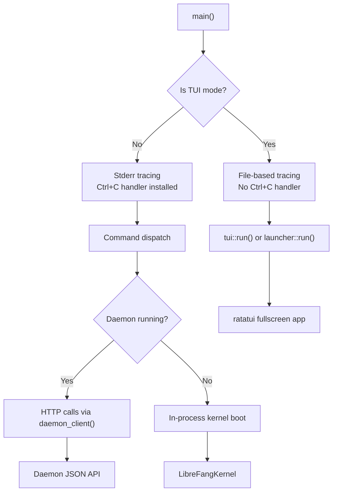

# CLI & TUI

# CLI & TUI Module

## Overview

The `librefang-cli` crate is the primary user-facing interface for LibreFang. It provides a comprehensive command-line tool (`librefang`) and an interactive terminal dashboard (TUI) built with ratatui. The binary serves as both a daemon client and, when no daemon is running, can boot an in-process kernel for single-shot commands.

## Architecture

## Startup Sequence

The `main()` function follows a strict initialization order:

1. **TLS provider** — `rustls::crypto::aws_lc_rs::default_provider()` is installed before any async/TLS operations
2. **Environment** — `dotenv::load_dotenv()` loads `~/.librefang/.env` into the process environment (system env takes priority)
3. **i18n** — Reads `language` from `config.toml` and calls `i18n::init()`
4. **Argument parsing** — `Cli::parse()` via clap
5. **Mode detection** — Determines whether this is a TUI invocation (`Tui`, `Chat`, `Agent::Chat`, or bare invocation in a terminal)
6. **Tracing setup** — TUI modes route logs to `<log_dir>/tui.log` to avoid corrupting the terminal; CLI modes trace to stderr with filtered library noise
7. **Signal handling** — CLI modes install a Ctrl+C handler; TUI modes skip it (ratatui needs to restore terminal state)
8. **Command dispatch** — The `Commands` enum is matched to `cmd_*` handler functions

### Mode Detection

TUI mode is activated when:
- No subcommand is given and stdout is a terminal (launches the interactive picker)
- `librefang tui` is invoked
- `librefang chat` or `librefang agent chat` is invoked (interactive chat is a TUI experience)

When stdout is piped and no subcommand is given, the CLI falls back to printing help text.

## CLI Definition

The command structure is defined using `clap` derive macros:

- **`Cli`** — top-level struct with `--config` (global) and an optional `Commands` subcommand
- **`Commands`** — a flat enum of ~35 top-level commands, many with their own subcommand enums

### Command Categories

| Category | Commands | Notes |
|---|---|---|
| Lifecycle | `init`, `start`, `stop`, `restart`, `gateway *` | Daemon management |
| Agent ops | `agent *`, `spawn`, `agents`, `kill` | Create, list, chat, kill agents |
| Chat | `chat`, `message` | Interactive or one-shot messaging |
| Configuration | `config *`, `vault *` | Show/edit/set config and credentials |
| Models | `models *` | List providers, aliases, set default model |
| Channels | `channel *` | Setup/test/enable messaging integrations |
| Hands | `hand *` | Autonomous execution modules |
| Skills | `skill *` | Install, search, create, evolve skills |
| MCP | `mcp *` | Model Context Protocol server management |
| Scheduling | `cron *` | Cron-style recurring agent jobs |
| Security | `security *` | Audit trail, integrity verification |
| Monitoring | `status`, `health`, `doctor`, `logs` | System diagnostics |
| Triggers | `trigger *` | Event-driven agent invocation |
| Workflows | `workflow *` | Multi-step agent chains |
| System | `system *`, `service *` | Info, version, boot service |
| Other | `tui`, `dashboard`, `completion`, `update`, `migrate`, `uninstall`, `reset`, `hash-password`, `qr`, `webhooks *`, `devices *`, `memory *`, `sessions`, `approvals *` | Misc utilities |

## Daemon Communication

When a command needs runtime data (listing agents, sending messages, etc.), the CLI communicates with the background daemon over HTTP.

### Daemon Discovery

`find_daemon()` → `find_daemon_in_home()` reads daemon info from `~/.librefang/daemon.json` using `librefang_api::server::read_daemon_info()`. It normalizes `0.0.0.0` to `127.0.0.1` (avoids macOS connect hangs), then probes `http://{addr}/api/health` with a 1-second connect timeout and 2-second total timeout.

### HTTP Client

`daemon_client()` builds a `reqwest::blocking::Client` with:
- 120-second timeout for long-running agent operations
- Automatic `Authorization: Bearer <key>` header when `api_key` is configured in `config.toml`
- Custom client builder from `http_client::client_builder()` for TLS/connection pooling

### JSON Response Handling

`daemon_json()` wraps `reqwest` responses with user-friendly error messages:
- Server errors → `error-daemon-returned` / `error-daemon-returned-fix`
- Timeouts → `error-request-timeout` / `error-request-timeout-fix`
- Connection refused → `error-connect-refused` / `error-connect-refused-fix`
- Other errors → generic `error-daemon-comm`

All error messages use the i18n system.

## Initialization Flows

### `cmd_init(quick)`

The init command has three paths:

1. **Upgrade path** — If `config.toml` already exists and not in `--quick` mode, redirects to `cmd_init_upgrade()` to preserve user settings (addresses issue #1862 where the wizard would silently overwrite channels/keys)

2. **Quick mode** (`--quick` or non-terminal stdin) — Calls `detect_best_provider()`, writes default config, prints next steps

3. **Interactive wizard** — Delegates to `tui::screens::init_wizard::run()`, a ratatui-based 5-step onboarding screen

All paths ensure:
- `~/.librefang/` directory exists with restricted permissions (0700 on Unix)
- `~/.librefang/data/` directory exists
- Registry content is synced via `librefang_runtime::registry_sync::sync_registry()`
- Credential vault is initialized via `init_vault_if_missing()`
- Git repo is initialized via `init_git_if_missing()` for config version control

### `cmd_init_upgrade()`

Upgrade flow:
1. Validates that `config.toml` exists
2. Backs up config to `backups/config-YYYYMMDD-HHMMSS.toml` (prunes to last 3)
3. Syncs registry (TTL=0 to force refresh)
4. Finds top-level keys in the default template that are missing from the user's config
5. Appends missing scalar keys before the first `[table]` header and missing table sections at the end — preserving existing comments and formatting
6. Warns about legacy `~/.openclaw` installations
7. Warns about incomplete `require_approval` lists missing `file_write`/`file_delete` (#1861)

### Provider Detection

`detect_best_provider()` probes for API keys in environment variables and vault to auto-select the best available LLM provider and model for initialization.

## TUI System

The TUI module (`tui/`) provides a full-screen ratatui interface:

- **`tui::run()`** — Main entry point; sets up the ratatui terminal, event loop, and rendering
- **`launcher::run()`** — When `librefang` is invoked without arguments in a terminal, presents an interactive menu (`GetStarted`, `Chat`, `Dashboard`, `DesktopApp`, `TerminalUI`, `ShowHelp`, `Quit`)
- **`tui::screens::init_wizard`** — 5-step onboarding wizard returning `InitResult { provider, model, daemon_started, launch }`
- **Tab system** — `handle_key()` → `switch_tab()` → `on_tab_enter()` → `refresh_agents()` → `load_daemon_agents()`

## MCP Server

`librefang mcp` (without subcommand) starts a stdio-based MCP server that exposes LibreFang to MCP-compatible clients (Claude Code, Cursor). The server:
- Reads JSON-RPC messages from stdin
- Dispatches to `handle_message()`
- Sends JSON-RPC responses via `send_message()`

## Internal Modules

| Module | Purpose |
|---|---|
| `desktop_install` | Desktop app installation helpers |
| `http_client` | Shared reqwest client builder |
| `i18n` | Internationalization (loads translations by language code) |
| `launcher` | No-argument interactive menu |
| `mcp` | MCP stdio server and catalog management |
| `progress` | Terminal progress indicators with OSC support |
| `table` | Styled table formatting (used across multiple commands) |
| `templates` | Agent template loading from filesystem |
| `tui` | Full ratatui terminal dashboard |
| `ui` | CLI output helpers: `banner()`, `success()`, `error()`, `error_with_fix()`, `hint()`, `kv()`, `next_steps()` |

## Tracing Configuration

### CLI Mode (`init_tracing_stderr`)

- Uses `tracing_subscriber` with compact format (no timestamps, no target)
- Filters library crates to `warn` level by default to avoid noise during one-shot commands
- Supports OpenTelemetry reload layer when the `telemetry` feature is enabled
- Users can override with `RUST_LOG` environment variable to see full detail

### TUI Mode (`init_tracing_file`)

- Writes to `<log_dir>/tui.log` (or `<home>/logs/tui.log`)
- Falls back to suppressing all output if log file creation fails
- Uses `with_ansi(false)` for clean file output

### Log Level and Directory

Both are read from `config.toml` without full deserialization:
- `load_log_level_from_config()` — reads `log_level` field, defaults to `"info"`
- `load_log_dir_from_config()` — reads `log_dir` field for custom log locations

## Signal Handling

`install_ctrlc_handler()` is called only in CLI mode:

- **Windows** — Uses `SetConsoleCtrlHandler` Win32 API directly. First Ctrl+C prints "Interrupted." and exits cleanly; second press calls `process::exit(130)` for a hard exit. This works around MINGW's unreliable default handler that doesn't interrupt blocking `read_line` calls.
- **Unix** — The default SIGINT handler already works correctly (interrupts `read_line` and terminates). The `CTRLC_PRESSED` flag exists but is not actively used on Unix.

## Global Allocator

On non-MSVC targets, `tikv_jemallocator::Jemalloc` is set as the global allocator for improved performance in allocation-heavy CLI operations.

## Configuration Loading

The CLI reads `config.toml` lazily at two granularities:

1. **Lightweight reads** — `load_log_level_from_config()`, `load_language_from_config()`, `load_update_channel_from_config()`, `load_log_dir_from_config()` parse the TOML without full struct deserialization
2. **Full config** — `daemon_config_context()` calls `librefang_kernel::config::load_config()` to get the complete `DaemonConfigContext` (home directory, API key, log directory)

The `--config` global flag overrides the default `~/.librefang/config.toml` path.

## File Permissions

On Unix, sensitive files are restricted to owner-only:
- `restrict_file_permissions()` — sets mode 0600 (config, vault, backups)
- `restrict_dir_permissions()` — sets mode 0700 (`~/.librefang/`)

These are no-ops on non-Unix platforms.

## Adding a New Command

To add a new top-level command:

1. Add a variant to the `Commands` enum with `#[derive(Subcommand)]` attributes and doc comments
2. If it has subcommands, create a separate `FooCommands` enum
3. Add the `match` arm in `main()`'s command dispatch
4. Implement a `cmd_foo()` handler function
5. If the command talks to the daemon, use `daemon_client()` and `daemon_json()`
6. Use `ui::*` helpers for consistent output formatting
7. Use `i18n::t()` / `i18n::t_args()` for all user-facing strings

## Key Dependencies

- `clap` / `clap_complete` — argument parsing and shell completion generation
- `ratatui` — terminal UI framework (used by `tui` module)
- `reqwest` (blocking) — HTTP client for daemon communication
- `tracing_subscriber` — structured logging
- `colored` — terminal color output
- `tikv_jemallocator` — system allocator (non-MSVC)
- `dirs` — cross-platform home directory resolution
- `librefang_kernel` — in-process kernel for single-shot mode
- `librefang_api` — daemon info reading
- `librefang_extensions` — dotenv loading, credential vault
- `librefang_runtime` — registry sync, model catalog
- `librefang_types` — shared types (AgentId, AgentManifest, config types)