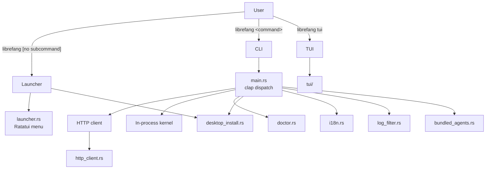
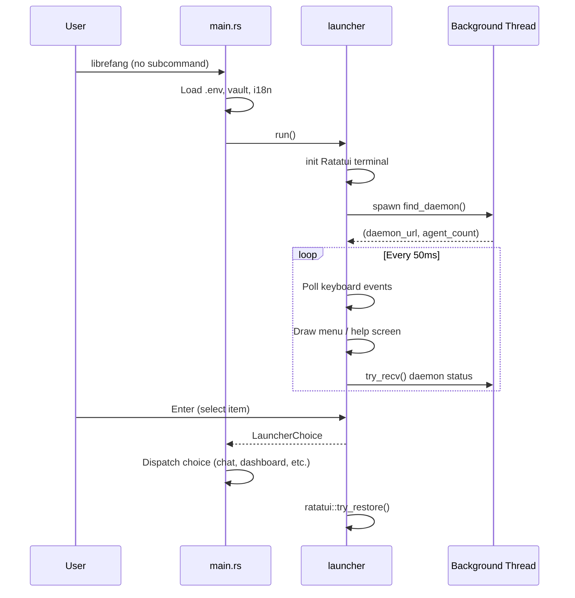

# CLI & TUI

# CLI & TUI Module

The `librefang-cli` crate provides the primary user-facing interface for LibreFang. It operates in three modes: a traditional command-line interface (CLI), a lightweight interactive launcher menu, and a full-screen terminal UI (TUI). When a daemon is running, the CLI communicates over HTTP; otherwise, it boots an in-process kernel for single-shot commands.

## Architecture Overview



## Module Layout

| File | Purpose |
|---|---|
| `main.rs` | Entry point. Clap argument parsing, command dispatch, all `cmd_*` handlers |
| `launcher.rs` | Lightweight Ratatui one-shot menu shown when no subcommand is given in a TTY |
| `desktop_install.rs` | Cross-platform desktop app discovery, GitHub release download, and installation |
| `doctor.rs` | Trait-based audit check framework for `librefang doctor` |
| `http_client.rs` | Blocking `reqwest` client builder with bundled CA roots |
| `i18n.rs` | Fluent-based internationalization (`en`, `zh-CN`) |
| `log_filter.rs` | Hot-reloadable `EnvFilter` backed by `ArcSwap` for daemon tracing |
| `bundled_agents.rs` | Backwards-compatible wrapper around `librefang_runtime::registry_sync` |
| `ui.rs` | Terminal output helpers (`success`, `error`, `hint`, `section`, `kv`) |
| `table.rs` | Columnar table renderer for agent lists, models, etc. |
| `progress.rs` | Progress bar/spinner utilities |
| `templates.rs` | Agent template loading and listing |
| `tui/` | Full-screen interactive terminal dashboard (separate submodule) |

## Entry Point and Command Dispatch

`main.rs` defines a `Cli` struct with clap `Parser` and a `Commands` enum covering all subcommands. The entry flow is:

1. Load `.env` and vault credentials via `librefang_extensions::dotenv`
2. Initialize i18n with the configured language
3. If no subcommand is provided and stdin is a TTY, run the interactive launcher (`launcher::run`)
4. Otherwise, match on the `Commands` variant and dispatch to the appropriate `cmd_*` function

Most `cmd_*` functions follow a pattern:
- Attempt to reach a running daemon via HTTP
- If no daemon is available, boot an in-process kernel (`LibreFangKernel`)
- Print results using `ui::*` helpers or `table::Table`

### Dual-Mode Execution

The CLI transparently supports two execution modes:

- **Daemon mode**: Commands like `status`, `agents`, `chat`, `stop` talk to a running daemon over HTTP at the URL stored in `~/.librefang/daemon.json`
- **In-process mode**: If no daemon is found, the CLI loads the kernel config and runs the operation in the current process

The function `daemon_config_context()` (in `main.rs`) handles daemon lookup, and `find_daemon()` resolves the daemon URL from `daemon.json`.

## Interactive Launcher

When the user runs `librefang` with no subcommand in a TTY, `launcher::run()` displays a Ratatui-based menu. This is a one-shot interface — the user selects an action and the launcher returns a `LauncherChoice` enum variant that `main.rs` then dispatches.

### Menu Variants

The launcher shows different menus based on context:

- **First-run users** (`is_first_run()` checks for `~/.librefang/config.toml`): "Get started" is the top and default option
- **Returning users**: "Chat with an agent" is first; "Settings" is relabeled from "Get started"

### Status Detection

On launch, a background thread runs `find_daemon()` and, if found, queries `/api/agents` to show the daemon status and agent count. Provider detection scans standard environment variables (`ANTHROPIC_API_KEY`, `OPENAI_API_KEY`, etc.) to show which provider is configured.

### Key Bindings

- `↑`/`k` and `↓`/`j` to navigate
- `1`–`9` for direct selection
- `Enter` to confirm
- `q`/`Esc` to quit
- In the help screen: `PgUp`/`PgDn`, `g`/`G` for top/bottom

### Desktop App Launch

Selecting "Open desktop app" calls `launch_desktop_app()`, which locates the desktop binary via `desktop_install::find_desktop_binary()`, offers to download it if not found, and launches it detached from the CLI process.

## Desktop App Installation

`desktop_install.rs` handles the full lifecycle of the native desktop application: discovery, download from GitHub Releases, and platform-specific installation.

### Binary Discovery

`find_desktop_binary()` searches in order:
1. Sibling of the current CLI executable
2. PATH lookup via `which_lookup()`
3. Platform-specific install paths:
   - macOS: `/Applications/LibreFang.app/Contents/MacOS/LibreFang`
   - Windows: `%LOCALAPPDATA%\LibreFang\LibreFang.exe`
   - Linux: `~/.local/bin/librefang-desktop` or `~/Applications/LibreFang.AppImage`

### Download and Installation

`prompt_and_install()` queries the GitHub Releases API, selects the correct asset for the current platform/arch, downloads it to a temp directory, and runs the platform installer:

| Platform | Asset Suffix | Install Method |
|----------|-------------|----------------|
| macOS (aarch64) | `_aarch64.dmg` | Mount with `hdiutil`, copy to `/Applications`, clear quarantine |
| macOS (x86_64) | `_x64.dmg` | Same as above |
| Windows (x86_64) | `_x64-setup.exe` | Run NSIS installer with `/S` (silent) |
| Linux (x86_64) | `_amd64.AppImage` | Copy to `~/.local/bin/`, `chmod 755` |

Platform-specific functions like `install_linux_appimage_to()` accept a `dest_dir` parameter to support testing with temp directories — no writes escape the test sandbox.

## Doctor (Diagnostic Framework)

`doctor.rs` introduces a trait-based registry for audit checks, designed to replace the legacy inline checks in `cmd_doctor`.

### Adding a New Check

1. Create a unit struct implementing `AuditCheck`
2. Add it to `registered_checks()`

Each check receives an `AuditContext` (currently just `librefang_home: PathBuf`) and returns an `AuditResult` with a severity (`Pass`, `Info`, `Warn`, `Error`), summary, and optional hint.

### Registered Checks

| Check | Severity | What It Validates |
|-------|----------|-------------------|
| `VaultKeyCheck` | Error | `LIBREFANG_VAULT_KEY` base64-decodes to exactly 32 bytes |
| `ApiListenAddrCheck` | Warn/Error | `config.toml`'s `api_listen` parses as `SocketAddr`; warns on privileged ports or port 0 |
| `ConfigTomlSchemaCheck` | Warn/Error | `config.toml` exists and parses as valid TOML |

The `VaultKeyCheck` specifically guards against the common mistake where users provide 32 ASCII characters instead of a base64-encoded 32-byte key (which is 44 characters). This matches the production validation in `librefang_extensions::vault::decode_master_key` and does **not** trim whitespace, matching production behavior.

### Integration with `cmd_doctor`

The framework currently runs alongside the legacy inline checks. To migrate a legacy check:
1. Extract it into a struct implementing `AuditCheck`
2. Add it to `registered_checks()`
3. Remove the inline version from `cmd_doctor`

## HTTP Client

`http_client.rs` provides a blocking `reqwest` client with bundled CA roots (delegating TLS configuration to `librefang_runtime::http_client::tls_config()`). Two functions are exposed:

- `client_builder()` → `reqwest::blocking::ClientBuilder` (for custom configuration)
- `new_client()` → `reqwest::blocking::Client` (pre-built, panics on failure — should never fail)

The blocking client is used throughout the CLI for daemon communication and GitHub API calls. The TUI uses async clients separately.

## Internationalization

`i18n.rs` wraps the Fluent localization system with a thread-local `I18n` struct.

### Supported Languages

`en` (default) and `zh-CN`. FTL files are included at compile time via `include_str!` from `locales/en/main.ftl` and `locales/zh-CN/main.ftl`.

### Usage

```rust
// Initialize at startup
i18n::init("en");

// Simple translation
let msg = i18n::t("daemon-starting"); // "Starting daemon..."

// Translation with arguments
let msg = i18n::t_args("models-available", &[("count", "12")]); // "12 models available"
```

If the requested language is unsupported, it falls back to `DEFAULT_LANGUAGE` ("en"). Missing keys return `[key_name]` as a fallback.

## Hot-Reloadable Log Filter

`log_filter.rs` provides `ReloadableEnvFilter` — a per-layer tracing `EnvFilter` that can be replaced at runtime via `reload_log_level()`.

### Why a Custom Filter?

The daemon uses per-layer filtering so the OpenTelemetry exporter sees the full span tree while stderr stays terse. `tracing_subscriber::reload::Layer` requires the subscriber type as a generic parameter, which creates a brittle type signature. Instead, `ReloadableEnvFilter` wraps an `ArcSwap<EnvFilter>` and forwards all `Filter` trait methods to the currently loaded inner filter.

### Baseline Directives

Boot-time tracing init layers per-target overrides (e.g., `librefang_kernel=warn`) on top of the user's log level. `install_with_baseline()` stores these directives in a `OnceLock`. On every reload, `reload_log_level()` re-applies the baseline so a dashboard "set debug" toggle doesn't unmask kernel/runtime noise that boot had specifically suppressed.

### Integration with the Kernel

`CliLogLevelReloader` implements `librefang_kernel::log_reload::LogLevelReloader`, bridging the kernel's hot-reload interface to `reload_log_level()`. After swapping the filter, `tracing_core::callsite::rebuild_interest_cache()` is called to invalidate per-callsite `Interest` caches.

## Bundled Agents

`bundled_agents.rs` is a thin backwards-compatibility wrapper. `sync_registry_agents()` delegates directly to `librefang_runtime::registry_sync::sync_registry()` with the default cache TTL and empty filter. New code should call the runtime function directly.

## Control Flow: `librefang` with No Arguments



## Platform Considerations

- **Ctrl+C handling**: On Windows/MINGW, a custom `SetConsoleCtrlHandler` is installed because the default handler doesn't reliably interrupt blocking `read_line` calls. On Unix, the default SIGINT handler is sufficient.
- **Allocator**: On non-MSVC targets, `tikv_jemallocator::Jemalloc` is used as the global allocator.
- **macOS `.app` bundles**: `launch()` detects `.app` bundles and uses `open -a` instead of executing the binary directly. `find_parent_app_bundle()` walks up from the binary path to locate the enclosing bundle.
- **Linux AppImages**: Installed to `~/.local/bin/librefang-desktop` with executable permissions set via `std::os::unix::fs::PermissionsExt`.

## Testing Patterns

Several modules use dependency injection to avoid filesystem writes during tests:

- `linux_install_path_in(home)` accepts an explicit home directory instead of reading the real one
- `install_linux_appimage_to(src, dest_dir)` accepts an explicit destination
- `desktop_install` tests verify all writes stay within `tempfile::TempDir` boundaries
- `doctor` tests use temp directories for `AuditContext::librefang_home`
- `VaultKeyCheck` tests serialize via a process-wide `Mutex` (`env_lock()`) since environment variable mutation is process-global and `cargo test` runs in parallel