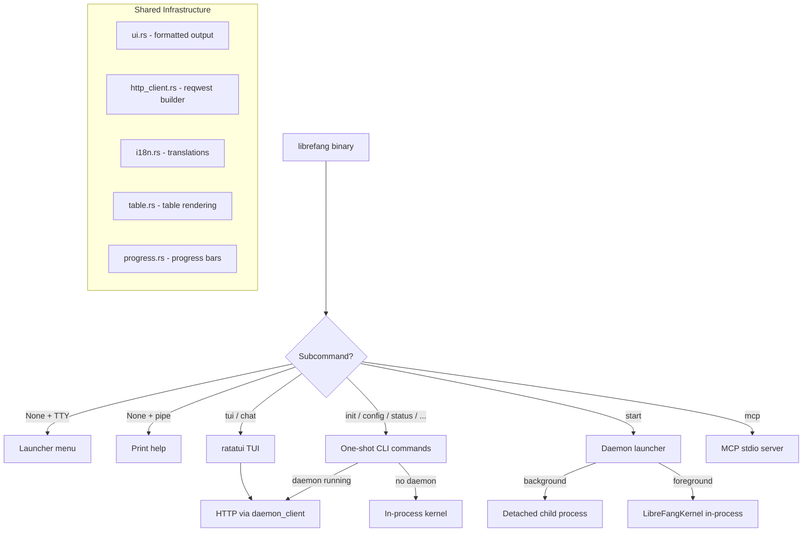

# CLI & TUI

# LibreFang CLI & TUI

The `librefang-cli` crate provides the primary user-facing interface for LibreFang — a `clap`-based command-line tool and a ratatui-powered interactive terminal dashboard. It is the entry point users invoke via the `librefang` binary.

## Architecture Overview

## Execution Modes

The CLI operates in three distinct modes depending on the subcommand and terminal state:

### Single-shot CLI commands
Commands like `status`, `agent list`, `config show`, `doctor`, etc. These either talk to a running daemon over HTTP or fall back to an in-process kernel. Tracing goes to stderr with library-level noise suppressed (only WARN+ from `librefang_kernel`, `librefang_runtime`, `librefang_extensions`). The `RUST_LOG` environment variable overrides this suppression.

### TUI / Interactive chat
Commands `tui`, `chat`, and `agent chat`. Tracing is redirected to a log file (`~/.librefang/logs/tui.log`) because stderr output corrupts the ratatui alternate screen. The Ctrl+C handler is **not** installed for these modes — ratatui needs to restore the terminal via its own cleanup path, and `process::exit` would bypass that.

### Launcher (no subcommand)
When invoked with no subcommand on an interactive TTY, the user is presented with a menu: Get Started, Chat, Dashboard, Desktop App, Terminal UI, Show Help, or Quit. When stdout is piped, help text is printed instead.

## Startup Sequence

`main()` follows this initialization order:

1. **TLS provider** — installs `aws_lc_rs` as the rustls crypto provider before any async/TLS operations
2. **Dotenv** — loads `~/.librefang/.env` into the process environment (system env vars take priority)
3. **i18n** — reads `language` from config and initializes translations via `i18n::init`
4. **CLI parsing** — `Cli::parse()` via clap
5. **Mode detection** — determines if this is a TUI mode based on the subcommand
6. **Log level** — reads `log_level` from config (falls back to `"info"`)
7. **Tracing init** — file-based for TUI modes, stderr for CLI modes
8. **Ctrl+C handler** — installed only for non-TUI modes (Windows: `SetConsoleCtrlHandler`, Unix: default SIGINT)

## Daemon Communication

### Discovery

`find_daemon()` reads daemon info from `~/.librefang/daemon.json` via `read_daemon_info`, then probes `http://{addr}/api/health`. The listen address is normalized — `0.0.0.0` is replaced with `127.0.0.1` to avoid macOS DNS hangs.

### HTTP Client

`daemon_client()` builds a `reqwest::blocking::Client` with:
- 120-second timeout
- Optional `Authorization: Bearer <key>` header if `api_key` is set in config
- Connection via `http_client::client_builder()` (shared builder for consistent TLS/proxy settings)

### Error Handling

`daemon_json()` wraps HTTP responses and maps common errors to user-friendly i18n messages:
- Timeouts → `error-request-timeout`
- Connection refused → `error-connect-refused`
- 5xx responses → `error-daemon-returned`

All exit with code 1 after displaying the error and suggested fix.

## Initialization System (`init`)

The `init` command has three paths:

| Mode | Trigger | Behavior |
|------|---------|----------|
| Quick | `--quick` or non-TTY | Auto-detects provider, writes defaults, no prompts |
| Interactive | TTY + no existing config | Launches ratatui wizard (5-step: provider → API key → model → test → launch) |
| Upgrade | existing `config.toml` | Backs up config, syncs registry, merges missing top-level keys |

### Upgrade Flow

When `config.toml` already exists, the interactive path automatically redirects to upgrade. The upgrade process:

1. Backs up to `~/.librefang/backups/config-YYYYMMDD-HHMMSS.toml` (keeps last 3)
2. Syncs registry content with TTL=0 (forces refresh)
3. Ensures `data/`, vault, and git repo exist
4. Merges missing top-level keys from the default config template
5. Scalar keys are inserted before the first `[table]` header to maintain TOML validity
6. Table sections are appended at the end with a comment separator

### Auto-detection

`detect_best_provider()` checks environment variables for known API keys (e.g., `GROQ_API_KEY`, `OPENAI_API_KEY`, `ANTHROPIC_API_KEY`) and selects the first match. Falls back to a hardcoded default.

## Command Routing

The `Commands` enum is generated by clap's `#[derive(Subcommand)]` and covers ~40 top-level commands. Many have their own nested subcommand trees marked with `[*]` in help text:

- **Agent** — `new`, `spawn`, `list`, `chat`, `kill`, `set`
- **Skill** — `install`, `list`, `remove`, `search`, `test`, `publish`, `create`, `evolve`
- **Channel** — `list`, `setup`, `test`, `enable`, `disable`
- **Hand** — `list`, `active`, `status`, `install`, `activate`, `deactivate`, `info`, `check-deps`, `install-deps`, `pause`, `resume`, `settings`, `set`, `reload`, `chat`
- **Config** — `show`, `edit`, `get`, `set`, `unset`, `set-key`, `delete-key`, `test-key`
- **Models** — `list`, `aliases`, `providers`, `set`
- **Trigger** — `list`, `get`, `create`, `update`, `enable`, `disable`, `delete`
- **Security** — `status`, `audit`, `verify`, `audit-reset`
- **Memory** — `list`, `get`, `set`, `delete`
- **Vault** — `init`, `set`, `list`, `remove`
- **Cron** — `list`, `create`, `delete`, `enable`, `disable`
- **Gateway** — `start`, `stop`, `restart`, `status`
- **Workflow** — `list`, `create`, `run`
- **Service** — `install`, `uninstall`, `status`
- **Webhooks** — `list`, `create`, `delete`, `test`

Convenience aliases exist at the top level: `spawn`, `agents`, `kill`, `chat`, `logs`, `health`, `message`, `sessions`.

## Daemon Lifecycle

### Start

`cmd_start()` handles three scenarios:
- **Background** (default) — spawns a detached child process with `--spawned` flag, writes PID to `daemon.json`
- **Tail** (`--tail`) — background spawn then streams `logs/daemon.log` via `std::io::copy`
- **Foreground** (`--foreground`) — boots `LibreFangKernel` in-process, installs graceful shutdown handler

The spawned child process re-initializes tracing with daemon-appropriate settings (file appender, full log levels).

### Stop

`cmd_stop()` reads the daemon PID from `daemon.json` and sends SIGTERM (Unix) or taskkill (Windows). Falls back to force-kill via `force_kill_pid()` if graceful shutdown times out.

## MCP Server

`librefang mcp` with no subcommand starts a JSON-RPC stdio server that exposes LibreFang to MCP-compatible clients (Claude Code, Cursor, etc.). The server:
- Reads JSON-RPC messages from stdin
- Routes to `handle_message()` which dispatches to tool implementations
- Uses `create_backend()` to establish a connection to the running daemon
- Writes responses to stdout via `write_message()`

Subcommands `list`, `catalog`, `add`, `remove` manage `[[mcp_servers]]` entries in `config.toml`.

## Submodules

| Module | Purpose |
|--------|---------|
| `ui` | Formatted output helpers: `banner()`, `success()`, `error()`, `error_with_fix()`, `hint()`, `kv()`, `section()`, `next_steps()` |
| `table` | Table rendering for agent lists, model lists, etc. Used across the codebase including by other crates |
| `progress` | Progress bar with OSC-based terminal progress reporting |
| `i18n` | Translation system with `t()` and `t_args()` functions, initialized from config `language` field |
| `templates` | Agent template discovery (`load_all_templates`, `discover_template_dirs`) and rendering |
| `launcher` | Interactive menu shown when no subcommand is given on a TTY |
| `tui` | Full ratatui-based terminal dashboard, init wizard screens, agent management |
| `mcp` | MCP stdio server implementation |
| `desktop_install` | Desktop app installation helpers |
| `http_client` | Shared reqwest client builder with consistent TLS/proxy settings |

## Configuration Access Patterns

The module uses several lightweight config readers that avoid full deserialization:

- `load_log_level_from_config()` — reads just `log_level` from config.toml
- `load_language_from_config()` — reads just `language`
- `load_update_channel_from_config()` — reads just `update_channel`
- `load_log_dir_from_config()` — reads just `log_dir`
- `daemon_config_context()` — loads full config via `load_config()` for daemon commands that need `home_dir`, `api_key`, and `log_dir`

## Home Directory Resolution

`cli_librefang_home()` resolves in this order:
1. `LIBREFANG_HOME` environment variable (if set)
2. `~/.librefang/` (default)

This is used throughout the crate for config, data, logs, vault, and daemon info paths.

## Vault Integration

The encrypted credential vault (`vault.enc`) is initialized during `init` via `init_vault_if_missing()`. API keys are also stored in `.env` for backward compatibility. The vault uses `librefang_extensions::vault::CredentialVault` with keyring-backed master key resolution.

## Git-based Config Versioning

`init_git_if_missing()` creates a git repo in `~/.librefang/` during initialization:
- Writes `.gitignore` excluding `secrets.env`, `vault.enc`, `daemon.json`, `logs/`, `cache/`, `registry/`, `data/`, `backups/`, and database files
- Creates an initial commit
- The upgrade flow preserves this repo and adds `.gitignore` entries for `backups/`

## Platform-specific Behavior

### Windows Ctrl+C
On Windows/MSYS, the default signal handler doesn't reliably interrupt blocking `read_line` calls. The custom `SetConsoleCtrlHandler`:
- First Ctrl+C: prints "Interrupted." and exits cleanly (code 0)
- Second Ctrl+C: hard exit (code 130)

### Unix
Default SIGINT handler works correctly for interrupting `read_line` — no custom handler needed.

### File Permissions
On Unix, `restrict_file_permissions()` and `restrict_dir_permissions()` set 0600/0700 modes on sensitive files and directories (config, vault, backups).

## Self-update

`cmd_update()` downloads the latest GitHub release binary:
- Channels: `stable`, `beta`, `rc` (configurable via `update_channel` in config)
- `--check` performs a dry run
- `--version` pins a specific tag
- `--channel` overrides the configured channel for one invocation