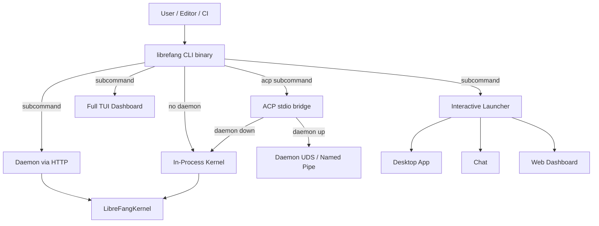

# CLI & TUI

# LibreFang CLI & TUI

The `librefang-cli` crate is the primary user-facing binary for LibreFang. It provides a command-line interface, an interactive terminal UI launcher, and a full-screen TUI dashboard. Every CLI command follows one of two execution paths: it either talks to a running daemon over HTTP, or boots a temporary in-process kernel for single-shot operations.

## Architecture Overview


```mermaid
graph TD
    User[User / Editor / CI] --> CLI[librefang CLI binary]
    CLI -->|subcommand| Launcher[Interactive Launcher]
    CLI -->|subcommand| TUI[Full TUI Dashboard]
    CLI -->|subcommand| Daemon[Daemon via HTTP]
    CLI -->|no daemon| InProcess[In-Process Kernel]
    CLI -->|acp subcommand| ACP[ACP stdio bridge]
    ACP -->|daemon up| DaemonSock[Daemon UDS / Named Pipe]
    ACP -->|daemon down| InProcess
    Daemon --> Kernel[LibreFangKernel]
    InProcess --> Kernel
    Launcher --> DesktopApp[Desktop App]
    Launcher --> ChatCmd[Chat]
    Launcher --> Dashboard[Web Dashboard]
```

## Entry Point and Command Dispatch

`main.rs` defines the top-level `Cli` struct via Clap with these responsibilities:

1. **Load `.env`** — calls `librefang_extensions::dotenv::load_dotenv` before anything else.
2. **Initialize i18n** — reads language from config, falls back to English (`en`).
3. **Install Ctrl+C handler** — on Windows this uses `SetConsoleCtrlHandler` to force-exit on interrupt; on Unix the default SIGINT handler suffices.
4. **Dispatch subcommand** — routes to the appropriate `cmd_*` function.

When no subcommand is given and the process is attached to a TTY, the interactive launcher (`launcher::run`) is shown. In non-interactive contexts (piped stdin, CI), a help message is printed instead.

### Two Execution Modes

| Mode | When | How |
|---|---|---|
| **Daemon-attached** | `librefang start` is running | HTTP client calls to `http://{daemon_url}/api/...` |
| **In-process** | No daemon detected | `LibreFangKernel::boot()` creates a temporary kernel that shuts down when the command finishes |

Helper functions `daemon_client()` and `daemon_client_with_api_key()` construct the HTTP client for daemon communication. `daemon_json()` is a convenience wrapper that deserializes JSON responses.

### Key Subcommands

| Command | Description |
|---|---|
| `init` | Create `~/.librefang/` and default config; `--quick` for CI, `--upgrade` for migrating existing installs |
| `start` | Launch the daemon (background by default, `--foreground` or `--tail` for attached modes) |
| `stop` / `restart` | Daemon lifecycle management |
| `chat` | Interactive REPL with an agent |
| `agent` | Agent CRUD: `new`, `list`, `chat`, `kill`, `set` |
| `doctor` | Run diagnostic health checks |
| `update` | Self-update from GitHub releases (channels: stable/beta/rc) |
| `tui` | Full-screen terminal dashboard |
| `acp` | Agent Client Protocol server for editor integration |
| `mcp` | MCP server management |
| `channel` | Messaging channel sidecar management |
| `skill` | Skill install/list/search/publish |
| `workflow` / `trigger` / `cron` | Automation primitives |
| `config` | Show, edit, get, set config values and API keys |
| `migrate` | Import from OpenClaw, LangChain, AutoGPT |

## Interactive Launcher

**File:** `launcher.rs`

When `librefang` is invoked without a subcommand in a TTY, a Ratatui-based menu appears. The launcher:

- **Detects first-run vs. returning users** — checks for `~/.librefang/config.toml`. First-run users see "Get started" as the top entry; returning users see "Chat" first.
- **Probes daemon and provider status in a background thread** — shows a spinner while checking, then displays daemon URL, agent count, and detected API key provider.
- **Detects migration sources** — checks for `~/.openclaw` or `~/.openfang` directories and shows a migration hint.
- **Provides two screens**: the menu and a scrollable help viewer (generated from Clap's `--help` output with ANSI stripped).

### Menu Navigation

- `↑`/`↓` or `j`/`k` to navigate
- `1`–`9` for direct selection by number
- `Enter` to confirm
- `q`/`Esc` to quit
- The help screen supports `PgUp`/`PgDn`, `g`/`G` (top/bottom), and scrollbar

### Layout

Content is capped at 80 columns with a left margin of 3. On terminals narrower than 10 columns, margins collapse entirely. Content is vertically positioned in the upper third of the terminal for visual comfort.

### LauncherChoice Enum

Each menu item maps to a `LauncherChoice` variant: `GetStarted`, `Chat`, `Dashboard`, `DesktopApp`, `TerminalUI`, `ShowHelp`, `Quit`. The `Quit` variant is never a menu item — it's only reachable via keyboard.

## Agent Client Protocol (ACP)

**File:** `acp.rs`

Provides the `librefang acp` subcommand, which serves the Agent Client Protocol over stdio so editors (Zed, VS Code, JetBrains) can embed LibreFang as a native agent.

### Two Modes

1. **Daemon-attached (preferred):** When the daemon is running and has its ACP listener up, the CLI becomes a transparent bidirectional pipe — stdin → socket, socket → stdout. On Unix this uses a Unix Domain Socket at `~/.librefang/acp.sock`; on Windows it uses the named pipe `\\.\pipe\librefang-acp`. Multiple editor tabs share the daemon's kernel state, including approval decisions.

2. **In-process:** When no daemon is detected, a fresh kernel boots in the current process. ACP runs on stdio until stdin EOF. Approval caches are local to this process and do not persist.

The mode is logged to stderr so users can diagnose why approval decisions might not carry over between modes (they use separate `allow_always` caches).

### Socket Discovery (`locate_acp_socket`)

Checks that the daemon is reachable **and** the socket file exists. A stale socket from a crashed daemon causes a fallback to in-process mode rather than a confusing connection error. Unix-only; Windows uses `find_daemon()` directly.

### Proxy Implementation

Both `run_uds_proxy` (Unix) and `run_pipe_proxy` (Windows) use Tokio to run two concurrent async tasks:

- **Inbound:** stdin → socket (with shutdown on EOF)
- **Outbound:** socket → stdout (with flush after each write)

Either direction closing terminates the session via `tokio::select!`.

## Doctor / Audit Framework

**File:** `doctor.rs`

A trait-based diagnostic framework for `librefang doctor`. Each check is an independent struct implementing `AuditCheck`:

```rust
pub trait AuditCheck {
    fn run(&self, ctx: &AuditContext) -> AuditResult;
}
```

### Adding a New Check

1. Create a unit struct implementing `AuditCheck`.
2. Add it to `registered_checks()`.

Each check is isolated — no shared mutable state, no ordering dependencies.

### AuditContext

Carries pre-resolved paths so checks don't redundantly look up `~/.librefang/`. Currently contains just `librefang_home: PathBuf`; extend as needed.

### AuditResult

Each result has:
- `name` — stable snake_case identifier (machine-readable, appears in JSON output)
- `severity` — `Pass`, `Info`, `Warn`, or `Error`
- `summary` — human-readable one-liner
- `hint` — optional remediation guidance (shown for `Warn`/`Error`)

### Registered Checks

| Check | Severity | What it validates |
|---|---|---|
| `VaultKeyCheck` | Error if set but wrong | `LIBREFANG_VAULT_KEY` must base64-decode to exactly 32 bytes (the classic gotcha: 32 ASCII chars ≠ 32 bytes after decode) |
| `ApiListenAddrCheck` | Error/Warn | `config.toml`'s `api_listen` must parse as `SocketAddr`; warns on port 0 (ephemeral, undiscoverable) and privileged ports (<1024) |
| `ConfigTomlSchemaCheck` | Error if malformed | `config.toml` exists and is valid TOML |

The doctor framework runs **alongside** legacy inline checks in `cmd_doctor` — migration of those legacy checks into the framework is incremental.

## Desktop App Management

**File:** `desktop_install.rs`

Handles discovery, download, and installation of the LibreFang desktop application from GitHub releases (`librefang/librefang`).

### Binary Discovery (`find_desktop_binary`)

Search order:
1. Sibling of the current CLI executable
2. `PATH` lookup (`which_lookup`)
3. Platform-specific standard location:
   - **macOS:** `/Applications/LibreFang.app/Contents/MacOS/LibreFang`
   - **Windows:** `%LOCALAPPDATA%\LibreFang\LibreFang.exe`
   - **Linux:** `~/.local/bin/librefang-desktop`, then `~/Applications/LibreFang.AppImage`

### Download and Install

Triggered when the user selects "Desktop App" but it's not found locally. The flow:

1. Query GitHub Releases API for the latest release
2. Find the asset matching the current platform (`platform_asset_suffix`):
   - macOS aarch64 → `_aarch64.dmg`
   - macOS x86_64 → `_x64.dmg`
   - Windows x86_64 → `_x64-setup.exe`
   - Linux x86_64 → `_amd64.AppImage`
3. Stream-download to a temp directory
4. Platform-specific install:
   - **macOS:** Mount DMG, copy `.app` to `/Applications`, clear quarantine xattr
   - **Windows:** Run NSIS installer with `/S` (silent)
   - **Linux:** Copy AppImage to `~/.local/bin/`, `chmod 755`

### Launching (`launch`)

On macOS, if the binary is inside a `.app` bundle, uses `open -a` for proper bundle launch. Otherwise spawns the binary detached (`Stdio::null()` for all three streams).

## Internationalization

**File:** `i18n.rs`

Fluent-based i18n with two language packs: English (`en`, default) and Simplified Chinese (`zh-CN`). FTL resource files are embedded at compile time via `include_str!`.

### Usage

```rust
i18n::init("zh-CN");       // call once at startup
let msg = i18n::t("daemon-starting");           // simple lookup
let msg = i18n::t_args("models-available", &[("count", "12")]);  // parameterized
```

The module uses a `thread_local!` `RefCell<Option<I18n>>` so it's safe across the CLI's single-threaded main path. Unknown keys return `[key_name]` as a visible fallback. Initialization failures fall back to English with a `tracing::warn`.

## HTTP Client

**File:** `http_client.rs`

Thin wrapper around `reqwest::blocking::Client` that applies the TLS config from `librefang_runtime::http_client::tls_config()` (bundled CA roots for environments without system cert stores). The `new_client()` function panics on construction failure — this is intentional, as a broken TLS config is a startup-fatal problem.

## Logging and Filter Reload

**File:** `log_filter.rs`

Provides `ReloadableEnvFilter` — a per-layer tracing filter backed by `ArcSwap<EnvFilter>` that can be swapped at runtime (e.g., from the dashboard's log level toggle) without restarting the daemon.

### Why Custom Instead of `tracing_subscriber::reload::Layer`

The daemon's subscriber stack is a deeply nested `Layered<...>` type that's impractical to store in a `OnceLock`. The hand-rolled approach keeps the signature simple.

### How Reload Works

1. `ReloadableEnvFilter::install_with_baseline(initial, baseline)` stores the initial filter and remembers baseline directives (e.g., `librefang_kernel=warn`) that should survive reloads.
2. `reload_log_level(directive)` parses the new directive, replays all baseline directives on top of it, swaps the `ArcSwap`, and calls `tracing_core::callsite::rebuild_interest_cache()` to invalidate the per-callsite `Interest` cache.
3. Without `rebuild_interest_cache()`, callsites already resolved to `Always`/`Never` would never re-query the new filter.

### Baseline Preservation

This is critical: without it, a dashboard "set debug" toggle would call `EnvFilter::try_new("debug")` and silently drop per-target overrides like `librefang_kernel=warn` that boot-time init had applied. The reload function always reapplies stored baselines.

### `CliLogLevelReloader`

Implements `librefang_kernel::log_reload::LogLevelReloader` so the kernel can trigger reloads through the same path without depending on CLI internals.

## Bundled Agents / Registry Sync

**File:** `bundled_agents.rs`

A thin backwards-compatibility shim that delegates to `librefang_runtime::registry_sync::sync_registry`. Called during `init` to populate the local LibreFang home directory with built-in agent templates from the registry.

## Tracing Initialization

The CLI configures tracing differently depending on the command:

- **`init_tracing_stderr`** — Used by the daemon path. Installs `ReloadableEnvFilter` with per-target baseline overrides, plus an OTel exporter reload slot.
- **`init_tracing_file`** — Used by the daemon's file logging. Writes structured logs to a timestamped file under `~/.librefang/logs/`.
- **Single-shot commands** — Use a simpler tracing setup appropriate for their lifetime.

Trace IDs are propagated via `WithTraceId` for correlation across daemon boundaries.

## Configuration and Environment

- **Config file:** `~/.librefang/config.toml` (or `$LIBREFANG_HOME`)
- **Environment variables:** Loaded from `.env` at startup; API keys stored in `.env` rather than config for security
- **Daemon info:** Written to `~/.librefang/daemon.json` on start; contains URL, PID, and auth token. Read by `read_daemon_info` to discover the running daemon.
- **Log retention:** Old logs are pruned after `LOG_RETENTION_DAYS` (7 days) during `init --upgrade`.

## Exit Codes

The `status` command uses specific exit codes for scripting:

| Code | Meaning |
|---|---|
| 0 | Daemon running and healthy |
| 1 | Daemon not running (in-process fallback) |
| 2 | Daemon running but degraded |
| 3 | Port open but `/api/health` unreachable |