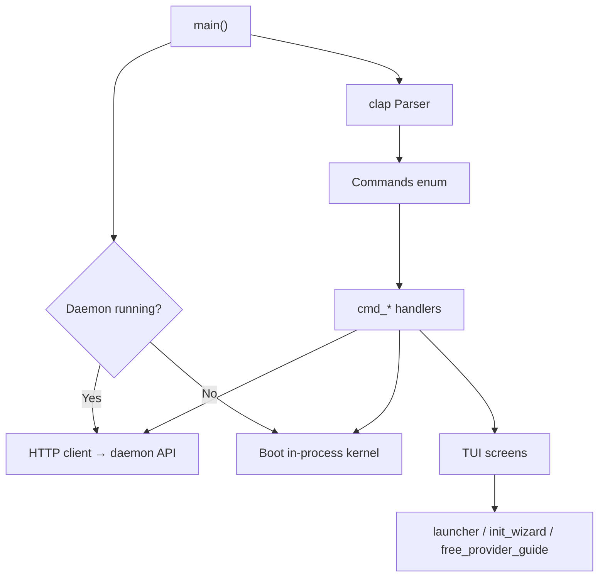

# CLI

# LibreFang CLI Module

## Overview

The CLI (`crates/librefang-cli`) is the primary user-facing interface for LibreFang. It operates in two modes:

- **Daemon client mode** — when a kernel daemon is running (`librefang start`), the CLI communicates over HTTP to `librefang_api::server`.
- **Single-shot mode** — when no daemon is available, commands that need a kernel boot one in-process via `LibreFangKernel::boot`, execute, and exit.

The module is responsible for argument parsing, daemon lifecycle management, interactive onboarding, TUI screens, and all user-facing output formatting.

## Architecture

## Entry Point Flow

`main()` executes in this order:

1. **Initialize rustls crypto provider** — required before any async/TLS operations with rustls 0.23.
2. **Load `.env`** — `dotenv::load_dotenv()` reads `~/.librefang/.env` into the process environment (system env takes priority).
3. **Load language** — `load_language_from_config()` reads the `language` key from config and calls `i18n::init()`.
4. **Parse CLI** — `Cli::parse()` via `clap`.
5. **Determine TUI mode** — checks if the command needs a full-screen terminal (launcher, `tui`, `chat`, `agent chat`). TUI modes use file-based tracing to avoid corrupting the terminal; CLI modes install a Ctrl+C handler and trace to stderr.
6. **Initialize tracing** — either `init_tracing_file` (TUI) or `init_tracing_stderr` (CLI), respecting `log_level` from config.
7. **Dispatch to handler** — the `match cli.command` block routes to `cmd_*` functions.

### No-Command Behavior

When invoked with no subcommand:

- **In a terminal** — launches the interactive `launcher` which presents options (Get Started, Chat, Dashboard, Desktop App, TUI, Help, Quit).
- **Piped/non-terminal** — prints `--help` text.

## Command Structure

The CLI uses `clap` with a `Commands` enum containing top-level commands and nested subcommand groups:

| Top-level command | Subcommands | Purpose |
|---|---|---|
| `init` | — | Create `~/.librefang/`, config, .env |
| `start` | — | Launch daemon (background, foreground, or tail) |
| `stop` / `restart` | — | Daemon lifecycle |
| `agent` | `new`, `spawn`, `list`, `chat`, `kill`, `set` | Agent management |
| `chat` | — | Quick chat with default agent |
| `spawn` | — | Alias for agent creation by template |
| `models` | `list`, `aliases`, `providers`, `set` | LLM model browsing |
| `config` | `show`, `edit`, `get`, `set`, `unset`, `set-key`, `delete-key`, `test-key` | Configuration management |
| `channel` | `list`, `setup`, `test`, `enable`, `disable` | Messaging channel integrations |
| `hand` | `list`, `active`, `status`, `install`, `activate`, `deactivate`, `info`, `check-deps`, `install-deps`, `pause`, `resume`, `settings`, `set`, `reload`, `chat` | Autonomous execution modules |
| `skill` | `install`, `list`, `remove`, `search`, `test`, `publish`, `create` | Skill management |
| `cron` | `list`, `create`, `delete`, `enable`, `disable` | Scheduled jobs |
| `vault` | `init`, `set`, `list`, `remove` | Encrypted credential storage |
| `security` | `status`, `audit`, `verify` | Security audit trail |
| `memory` | `list`, `get`, `set`, `delete` | Agent KV store |
| `webhooks` | `list`, `create`, `delete`, `test` | HTTP callback triggers |
| `workflow` | `list`, `create`, `run` | Multi-step agent workflows |
| `trigger` | `list`, `create`, `delete` | Event-driven triggers |
| `approvals` | `list`, `approve`, `reject` | Human-in-the-loop approvals |
| `gateway` | `start`, `stop`, `restart`, `status` | Low-level daemon control |
| `service` | `install`, `uninstall`, `status` | Boot service (systemd/launchd/Windows) |
| `devices` | `list`, `pair`, `remove` | Device pairing |

Additionally, convenience aliases exist: `agents` → `agent list`, `kill` → `agent kill`, `logs` → tail daemon log, `health` → quick check, `dashboard` → open browser, `qr` → device pairing, `onboard`/`setup`/`configure` → init flows.

## Daemon Communication

### Discovery

`find_daemon()` locates a running daemon by:

1. Reading `~/.librefang/daemon.json` via `read_daemon_info` from `librefang_api`.
2. Normalizing the listen address (replacing `0.0.0.0` with `127.0.0.1` to avoid macOS DNS hangs).
3. Making a health-check GET to `http://{addr}/api/health` with a 1-second connect / 2-second total timeout.

### HTTP Client

`daemon_client()` builds a `reqwest::blocking::Client` configured with:

- 120-second timeout for long-running agent operations.
- Automatic `Authorization: Bearer <key>` header when `api_key` is set in config (read via `read_api_key()`).

`daemon_json()` is the standard response handler that parses JSON and exits with contextual error messages for timeouts, connection refused, or server errors.

## Initialization System

`cmd_init` has three paths:

### Quick Mode (`--quick`)

1. Creates `~/.librefang/` and `data/` subdirectory.
2. Calls `sync_registry` to download provider/integration/assistant definitions.
3. Initializes the credential vault and a git repo for config versioning.
4. Auto-detects the best provider via `detect_best_provider()`.
5. Writes `config.toml` from `INIT_DEFAULT_CONFIG_TEMPLATE` with detected values.
6. Writes `config.example.toml` with the full annotated template.

### Interactive Mode (default)

Redirects to `cmd_init_upgrade()` if `config.toml` already exists (to avoid overwriting user settings — addresses issue #1862). Otherwise launches `tui::screens::init_wizard::run()`, a 5-step ratatui TUI wizard. On completion, executes the user's chosen launch action (Desktop, Dashboard, or Chat).

### Upgrade Mode (`--upgrade`)

1. Backs up existing `config.toml` with timestamp suffix.
2. Forces registry sync (TTL=0).
3. Ensures vault and git exist.
4. Merges missing top-level config keys by appending TOML fragments — scalars are inserted before the first `[table]` header, tables are appended at the end. This preserves user comments and formatting.
5. Checks for legacy `~/.openclaw` installations and outdated `require_approval` settings.

## Provider Detection

`detect_best_provider()` probes in order:

1. **Cloud providers** — `librefang_runtime::drivers::detect_available_provider()` checks 13+ provider API keys (OpenAI, Anthropic, Gemini, Groq, DeepSeek, OpenRouter, Mistral, Together, Fireworks, xAI, Perplexity, Cohere, Azure OpenAI) plus `GOOGLE_API_KEY` alias.
2. **Local Ollama** — TCP probe to `127.0.0.1:11434` with 500ms timeout.
3. **Interactive guide** — launches `tui::screens::free_provider_guide` to help the user pick a free provider.
4. **Fallback** — defaults to Groq with hints about free providers.

## Daemon Lifecycle

### Background Start

`cmd_start` with default flags spawns a detached child process:

1. Resolves the current executable path.
2. Creates the log directory and opens the log file for stdout/stderr.
3. On Unix: calls `setsid()` via `pre_exec` to detach from the terminal.
4. On Windows: uses `DETACHED_PROCESS | CREATE_NEW_PROCESS_GROUP | CREATE_NO_WINDOW` creation flags.
5. The child re-invokes the binary with `start --spawned`.
6. The parent polls `find_daemon_in_home` for up to 10 seconds, then reports success or timeout.

### Foreground Start

With `--foreground` or `--spawned`, boots `LibreFangKernel` in-process and runs `librefang_api::server::run_daemon` on a tokio runtime.

## Ctrl+C Handling

`install_ctrlc_handler()` is only installed for non-TUI CLI modes:

- **Windows**: Uses `SetConsoleCtrlHandler` to intercept `CTRL_C_EVENT`. First press prints "Interrupted." and exits cleanly. Second press hard-exits with code 130.
- **Unix**: Relies on the default SIGINT handler which already interrupts `read_line` and terminates.

TUI modes (`launcher`, `tui`, `chat`) skip this handler because `process::exit` bypasses ratatui's terminal restore, which would leave the terminal in raw mode.

## Tracing Configuration

| Mode | Output | Notes |
|---|---|---|
| CLI subcommands | stderr + `~/.librefang/daemon.log` | `init_tracing_stderr` with dual layers |
| TUI / chat | `~/.librefang/tui.log` | `init_tracing_file` — stderr would corrupt the TUI |
| Log level | From `log_level` in config.toml | Falls back to `"info"`, respects `RUST_LOG` |

## Configuration Helpers

Several functions read single fields from config without full deserialization:

- `load_log_level_from_config()` — reads `log_level`.
- `load_update_channel_from_config()` — reads `update_channel`, parses as `UpdateChannel` enum.
- `load_log_dir_from_config()` — reads custom `log_dir` path.
- `load_language_from_config()` — reads `language` for i18n.

`daemon_config_context()` does full deserialization via `load_config()` and returns a `DaemonConfigContext` with `home_dir`, `api_key`, and `log_dir`.

## File Permissions

On Unix, the module restricts permissions for security:

- `restrict_file_permissions` — sets files to `0600` (owner-only read/write).
- `restrict_dir_permissions` — sets directories to `0700` (owner-only rwx).

Applied to `config.toml`, backups, vault file, log directory, and the `~/.librefang/` directory itself.

## Submodules

| Module | Visibility | Purpose |
|---|---|---|
| `desktop_install` | private | Find, download, and launch the Tauri desktop app binary |
| `http_client` | private | Shared `reqwest::Client` builder with TLS configuration |
| `i18n` | public | Translation system — `t()` and `t_args()` functions for localized strings |
| `launcher` | private | Interactive first-run launcher (Get Started / Chat / Dashboard / Desktop / TUI) |
| `mcp` | private | MCP (Model Context Protocol) server over stdio — bridges to Claude Code, Cursor, etc. |
| `progress` | public | Terminal progress bar rendering with OSC fallback for terminal emulators |
| `table` | public | Shared table formatting used across CLI output and API route responses |
| `templates` | private | Agent template loading and management |
| `tui` | private | Full ratatui-based TUI screens: init wizard, free provider guide, chat interface, channel setup |
| `ui` | private | Low-level terminal output helpers: banners, success/error/hint messages, KV formatting, next-steps blocks |

## Key Integration Points

- **`librefang_kernel`** — `LibreFangKernel::boot()` for in-process kernel, `config::load_config()` for configuration.
- **`librefang_api`** — `server::run_daemon()` for foreground mode, `read_daemon_info()` for daemon discovery.
- **`librefang_types`** — shared types including `AgentId`, `AgentManifest`, `config::UpdateChannel`.
- **`librefang_extensions`** — `dotenv` for `.env` loading, `vault::CredentialVault` for encrypted credential storage.
- **`librefang_runtime`** — `registry_sync::sync_registry()` for provider/integration sync, `drivers::detect_available_provider()` for key detection, `model_catalog::ModelCatalog` for default model resolution.

## Adding a New Command

1. Add a variant to `Commands` (or a subcommand enum like `AgentCommands`) with `#[command(long_about = ...)]` and `#[arg(...)]` annotations.
2. Add the match arm in `main()` dispatching to a `cmd_*` function.
3. Implement the handler function — use `find_daemon()` + `daemon_client()` for daemon communication, or `LibreFangKernel::boot()` for single-shot execution.
4. Use `ui::*` functions for output formatting and `i18n::t()` / `i18n::t_args()` for all user-facing strings.