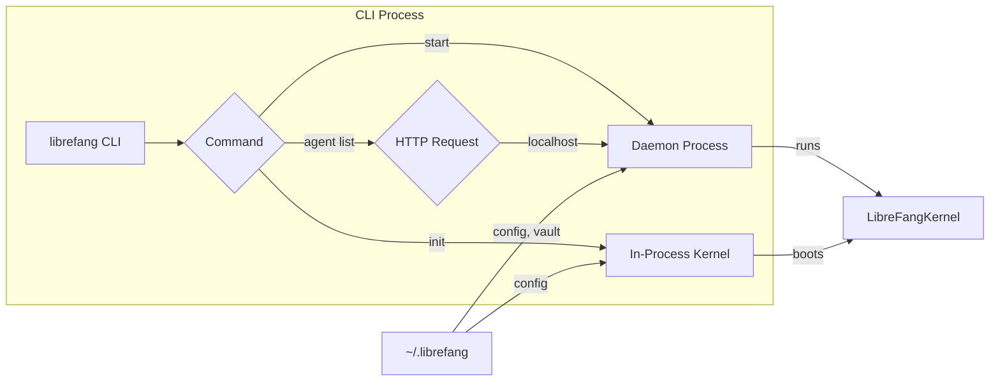

# CLI

# LibreFang CLI

The CLI (`librefang-cli`) is the primary user-facing interface for LibreFang. It provides a comprehensive command-line toolkit for initializing, configuring, and operating the LibreFang Agent OS, as well as managing agents, skills, channels, and the daemon lifecycle.

## Overview

LibreFang operates in two distinct modes:

**Daemon Mode**: When `librefang start` launches the daemon, subsequent CLI invocations communicate with it over HTTP. The CLI becomes a lightweight client, delegating work to the running kernel process.

**Single-Shot Mode**: When no daemon is running, CLI commands boot an in-process `LibreFangKernel` to execute the requested operation. This enables commands like `librefang init` and `librefang doctor` to work without a persistent daemon.



## Entry Point and Command Dispatch

The `main()` function in `main.rs` handles several critical initialization steps before dispatching to command handlers:

1. **rustls Crypto Provider**: Initializes the AWS-LC-RS crypto provider for TLS operations (required by rustls 0.23+)
2. **Environment Loading**: Loads `~/.librefang/.env` into the process environment via `dotenv::load_dotenv()`
3. **Internationalization**: Initializes i18n with the configured language (defaults to English)
4. **Tracing Setup**: Configures logging based on whether the command uses TUI mode or CLI mode
5. **Ctrl+C Handler**: Installs a platform-specific handler for clean interrupt handling (primarily Windows/MINGW)

### TUI vs CLI Mode Detection

The CLI detects whether it's entering TUI mode (terminal user interface) or remaining in standard CLI mode:

```rust
let is_tui_mode = is_launcher
    || matches!(cli.command, Some(Commands::Tui))
    || matches!(cli.command, Some(Commands::Chat { .. }))
    || matches!(cli.command, Some(Commands::Agent(AgentCommands::Chat { .. })));
```

TUI mode requires special handling:
- **No Ctrl+C handler**: TUI mode bypasses the Ctrl+C handler because `process::exit()` bypasses `ratatui::restore()`, leaving the terminal in raw mode
- **File-based tracing**: Logs write to `tui.log` instead of stderr to avoid corrupting the terminal display

### Command Matching

The `main()` function uses exhaustive pattern matching on `cli.command` to dispatch to handler functions. Each command variant maps to a dedicated `cmd_*` function:

```rust
match cli.command {
    Some(Commands::Tui) => tui::run(cli.config),
    Some(Commands::Init { quick, upgrade }) => { ... }
    Some(Commands::Agent(sub)) => match sub {
        AgentCommands::List { json } => cmd_agent_list(cli.config, json),
        AgentCommands::Chat { agent_id } => cmd_agent_chat(cli.config, &agent_id),
        // ...
    },
    // ... 60+ command variants
}
```

## Daemon Communication

### Daemon Detection

When executing commands that require the daemon, the CLI first checks if one is running:

```rust
pub(crate) fn find_daemon() -> Option<String> {
    find_daemon_in_home(&cli_librefang_home())
}

fn find_daemon_in_home(home_dir: &PathBuf) -> Option<String> {
    let info = read_daemon_info(home_dir)?;
    let addr = info.listen_addr.replace("0.0.0.0", "127.0.0.1");
    let url = format!("http://{addr}/api/health");
    // ...
}
```

The daemon writes its connection info to `~/.librefang/daemon.json`, which the CLI reads to discover the API endpoint.

### HTTP Client Building

The `daemon_client()` function constructs an HTTP client with appropriate timeouts and authentication:

```rust
pub(crate) fn daemon_client() -> reqwest::blocking::Client {
    daemon_client_with_api_key(read_api_key().as_deref())
}

fn daemon_client_with_api_key(api_key: Option<&str>) -> reqwest::blocking::Client {
    let mut builder = http_client::client_builder()
        .timeout(Duration::from_secs(120));

    if let Some(key) = api_key {
        let mut headers = HeaderMap::new();
        headers.insert(AUTHORIZATION, HeaderValue::from_str(&format!("Bearer {key}")).unwrap());
        builder = builder.default_headers(headers);
    }
    builder.build().expect("Failed to build HTTP client")
}
```

When `api_key` is configured in `config.toml`, the client automatically includes `Authorization: Bearer <key>` on every request.

### JSON Response Handling

The `daemon_json()` helper parses responses and provides user-friendly error messages:

```rust
pub(crate) fn daemon_json(resp: Result<Response, reqwest::Error>) -> Value {
    match resp {
        Ok(r) => { /* check status, return body */ }
        Err(e) => {
            if msg.contains("Connection refused") {
                ui::error_with_fix(&i18n::t("error-connect-refused"),
                    &i18n::t("error-connect-refused-fix"));
            }
            std::process::exit(1);
        }
    }
}
```

## Daemon Lifecycle Management

### Starting the Daemon

`cmd_start()` handles daemon startup with three modes:

1. **Detached (default)**: Spawns the process in the background, waits for it to become healthy, then returns
2. **Foreground**: Runs the kernel inline within the CLI process
3. **Spawned (internal)**: Used when the detached child relaunches itself with `--spawned`

```rust
fn cmd_start(config: Option<PathBuf>, tail: bool, spawned: bool, foreground: bool) {
    // Check if already running
    if let Some(base) = find_daemon_in_home(&daemon.home_dir) {
        ui::error_with_fix(&i18n::t_args("daemon-already-running", &[("url", &base)]), ...);
    }

    if !spawned && !foreground {
        // Detached mode: spawn and wait
        let log_path = daemon_log_path_for_config(config.as_deref());
        let mut child = spawn_detached_daemon(config.as_deref(), &log_path)?;
        // Wait for health check...
    } else {
        // Foreground mode: boot kernel inline
        let rt = tokio::runtime::Runtime::new().unwrap();
        rt.block_on(async {
            let kernel = LibreFangKernel::boot(config.as_deref())?;
            librefang_api::server::run_daemon(kernel, &listen_addr, ...).await
        });
    }
}
```

### Detached Daemon Spawning

`spawn_detached_daemon()` creates a properly backgrounded process:

- **Unix**: Uses `setsid()` to create a new session, orphaning the process from the terminal
- **Windows**: Uses `DETACHED_PROCESS | CREATE_NEW_PROCESS_GROUP | CREATE_NO_WINDOW` flags
- **Log redirection**: Both stdout and stderr append to the daemon log file

```rust
#[cfg(unix)]
command.pre_exec(|| {
    if libc::setsid() == -1 {
        return Err(io::Error::last_os_error());
    }
    Ok(())
});
```

## Initialization (`librefang init`)

The init command sets up the LibreFang home directory and configuration:

1. **Create directories**: `~/.librefang/` and `~/.librefang/data/` with mode 0700
2. **Sync registry**: Downloads provider/integration metadata from the registry
3. **Initialize vault**: Creates the encrypted credential store
4. **Init git repo**: Sets up version control for configuration
5. **Detect provider**: Auto-detects available API keys
6. **Write config**: Creates `config.toml` with sensible defaults

### Provider Auto-Detection

`detect_best_provider()` probes for available API keys across 13+ providers:

```rust
fn detect_best_provider() -> (String, String, String) {
    // 1. Check cloud providers via runtime registry
    if let Some((provider, _model, env_var)) =
        librefang_runtime::drivers::detect_available_provider()
    {
        return (provider, env_var, default_model_for_provider(provider));
    }

    // 2. Check Ollama (local, no API key needed)
    if check_ollama_available() {
        return ("ollama".to_string(), "OLLAMA_API_KEY".to_string(),
            default_model_for_provider("ollama"));
    }

    // 3. Launch TUI guide for free provider setup
    if let Some(result) = guide_free_provider_setup() {
        return result;
    }
}
```

### Upgrade Path

When `config.toml` already exists, `librefang init` redirects to the upgrade flow (`cmd_init_upgrade()`) to preserve user settings:

```rust
if !quick && librefang_dir.join("config.toml").exists() {
    ui::hint("Existing installation detected — running upgrade to preserve your settings.");
    cmd_init_upgrade();
    return;
}
```

The upgrade process:
1. Backs up existing config with timestamp
2. Syncs registry (TTL=0 forces refresh)
3. Merges new default fields without overwriting existing values
4. Detects and warns about legacy `.openclaw` installations

## Security Features

### File Permission Hardening

On Unix systems, sensitive files and directories receive restricted permissions:

```rust
#[cfg(unix)]
pub(crate) fn restrict_file_permissions(path: &Path) {
    use std::os::unix::fs::PermissionsExt;
    let _ = std::fs::set_permissions(path, std::fs::Permissions::from_mode(0o600));
}

#[cfg(unix)]
pub(crate) fn restrict_dir_permissions(path: &Path) {
    let _ = std::fs::set_permissions(path, std::fs::Permissions::from_mode(0o700));
}
```

Applied to:
- `~/.librefang/` directory (0700)
- `config.toml` (0600)
- Config backups (0600)

### Ctrl+C Handler

Windows/MINGW environments receive special handling because the default signal handler doesn't reliably interrupt blocking `read_line` calls:

```rust
#[cfg(windows)]
unsafe extern "system" fn handler(_ctrl_type: u32) -> i32 {
    if CTRLC_PRESSED.swap(true, Ordering::SeqCst) {
        // Second press: hard exit
        std::process::exit(130);
    }
    // First press: exit cleanly
    let _ = std::io::Write::write_all(&mut std::io::stderr(), b"\nInterrupted.\n");
    std::process::exit(0);
}
```

### Credential Vault

API keys are stored in an encrypted vault (`vault.enc`) rather than plaintext in config files:

```rust
fn init_vault_if_missing(librefang_dir: &Path) {
    let vault_path = librefang_dir.join("vault.enc");
    if vault_path.exists() { return; }

    let mut vault = librefang_extensions::vault::CredentialVault::new(vault_path);
    if let Err(e) = vault.init() {
        tracing::debug!("vault init skipped: {e}"); // Silent failure
    }
}
```

## Configuration

### Home Directory Resolution

The LibreFang home directory resolves with this priority:

```rust
fn cli_librefang_home() -> PathBuf {
    if let Ok(home) = std::env::var("LIBREFANG_HOME") {
        return PathBuf::from(home);
    }
    dirs::home_dir()
        .unwrap_or_else(std::env::temp_dir)
        .join(".librefang")
}
```

### Lightweight Config Reading

Commands that need specific config values without full deserialization use TOML parsing:

```rust
fn load_log_level_from_config() -> String {
    let level = (|| -> Option<String> {
        let config_path = dirs::home_dir()?.join(".librefang").join("config.toml");
        let content = std::fs::read_to_string(&config_path).ok()?;
        let config: toml::Value = toml::from_str(&content).ok()?;
        config.get("log_level")?.as_str().map(|s| s.to_string())
    })();
    level.unwrap_or_else(|| "info".to_string())
}
```

This avoids the overhead of fully deserializing the config struct when only one field is needed.

## Module Structure

| Module | Purpose |
|--------|---------|
| `main.rs` | Entry point, command dispatch, daemon management, init flow |
| `ui.rs` | User-facing output helpers (success, error, hint, banner) |
| `http_client.rs` | Reusable HTTP client configuration |
| `i18n.rs` | Internationalization with runtime language loading |
| `tui/` | Terminal user interface using ratatui |
| `templates.rs` | Agent template loading and management |
| `progress.rs` | OSC-based progress indicators for terminals |
| `table.rs` | ASCII table formatting for CLI output |
| `mcp.rs` | Model Context Protocol server over stdio |
| `launcher.rs` | Interactive launcher for first-time users |
| `dotenv.rs` | `.env` file loading |
| `desktop_install.rs` | Tauri desktop app detection and installation |

## Key Dependencies

- **clap**: Command-line argument parsing with subcommands
- **reqwest**: HTTP client for daemon communication
- **tokio**: Async runtime for daemon foreground mode
- **ratatui**: Terminal UI framework for TUI screens
- **tracing/tracing-subscriber**: Structured logging
- **toml**: Configuration file parsing
- **librefang_kernel**: Core kernel implementation
- **librefang_api**: Daemon HTTP API server
- **librefang_runtime**: Model catalog, registry, drivers