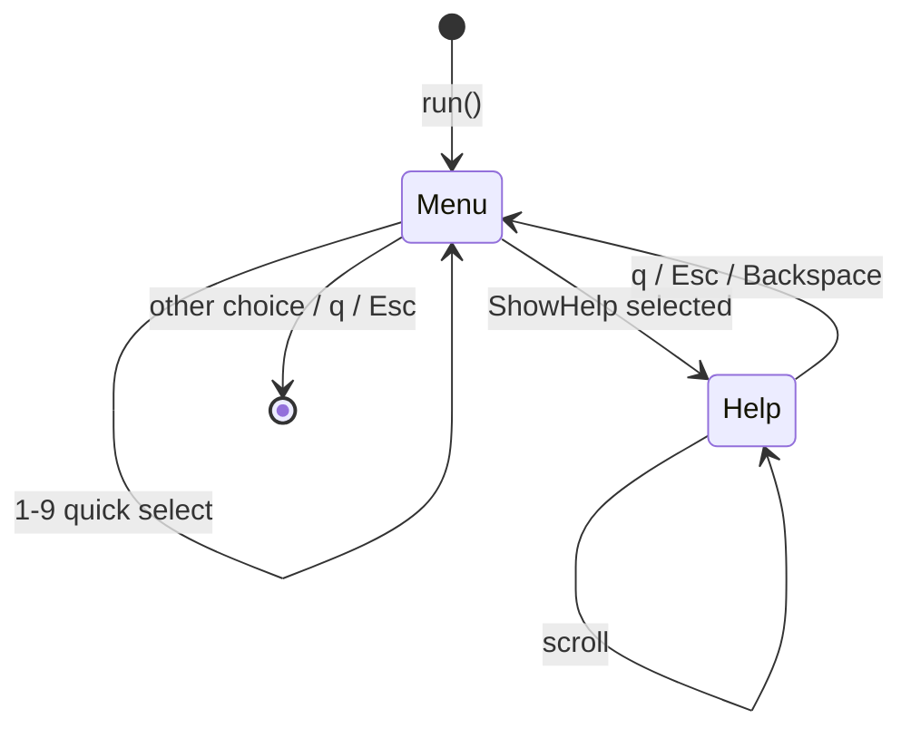

# Command Line Interface

# LibreFang CLI (`librefang-cli`)

The command-line interface for the LibreFang Agent OS. When invoked with a subcommand, it dispatches to the appropriate handler — either talking to a running daemon over HTTP or booting an in-process kernel for single-shot operations. When invoked with no subcommand in a TTY, it presents an interactive launcher menu.

## Architecture Overview

```mermaid
graph TD
    Entry["main()"] -->|i18n init| I18N["i18n module"]
    Entry -->|load .env| Dotenv["librefang-extensions::dotenv"]
    Entry -->|no subcommand + TTY| Launcher["launcher.rs"]
    Entry -->|subcommand| Dispatch["Command dispatch"]

    Dispatch -->|"start / restart"| Daemon["Daemon lifecycle"]
    Dispatch -->|"init / doctor"| Local["Local operations"]
    Dispatch -->|"chat / agents / status"| DaemonClient["Daemon HTTP client"]

    Daemon -->|"foreground"| InProcess["In-process kernel"]
    Daemon -->|"background"| Detached["Detached child process"]

    DaemonClient -->|"daemon running"| HTTP["http_client.rs → daemon API"]
    DaemonClient -->|"no daemon"| Fallback["Single-shot kernel boot"]

    Launcher -->|user picks "Desktop App"| DesktopInstall["desktop_install.rs"]
    Launcher -->|user picks "Doctor"| Doctor["doctor.rs"]
    Launcher -->|background thread| FindDaemon["find_daemon()"]
```

## Startup Sequence

`main()` performs the following in order:

1. **Ctrl+C handler** — On Windows/MINGW, installs a native `SetConsoleCtrlHandler` that force-exits on interrupt (the default handler doesn't reliably interrupt blocking `read_line`). On Unix, the default SIGINT handler is sufficient.

2. **Environment loading** — Calls `librefang_extensions::dotenv::load_dotenv()`, which reads `.env` files and populates the vault via `librefang_extensions::vault`.

3. **i18n initialization** — `i18n::init()` loads the Fluent bundle for the user's configured language (falls back to English). All subsequent `t()` / `t_args()` calls are thread-local lookups.

4. **CLI parsing** — Clap parses arguments into the `Cli` struct. If no subcommand is given and stdout is a TTY, the interactive launcher runs.

5. **Command dispatch** — The matched `Commands` variant maps to a `cmd_*` function. Commands that need the daemon call `find_daemon()` first; others operate locally.

## Key Submodules

### `launcher.rs` — Interactive Menu

A Ratatui one-shot menu shown when `librefang` is run without arguments in a terminal. It detects whether the user is first-time (no `~/.librefang/config.toml`) and adapts the menu order accordingly.

**State machine:**

- **Menu screen** — List of `MenuItem` entries navigable with arrow keys, `j`/`k`, or number keys `1-9`. Returns a `LauncherChoice` enum variant.
- **Help screen** — Renders the full `--help` output with scrolling (PageUp/PageDown, `g`/`G` for top/bottom).

**Background daemon detection:** On launch, a background thread calls `find_daemon()` and queries `/api/agents` for the agent count. The result updates the status area (spinner → daemon URL + agent count, or "No daemon running").

**Provider detection:** Checks `PROVIDER_ENV_VARS` (ANTHROPIC_API_KEY, OPENAI_API_KEY, DEEPSEEK_API_KEY, etc.) and displays the first match. If none are found, shows a hint to configure one.

**Migration detection:** First-run users who have `~/.openclaw` or `~/.openfang` directories see a migration hint in the launcher.



### `doctor.rs` — Diagnostic Audit Framework

A trait-based registry of health checks that runs alongside the legacy inline checks in `cmd_doctor`. Each check is an independent struct implementing `AuditCheck`.

**Adding a new check:**

1. Define a unit struct implementing `AuditCheck`.
2. Add it to `registered_checks()`.

Each check receives an `AuditContext` (currently just `librefang_home: PathBuf`) and returns an `AuditResult` with a stable machine-readable `name`, a `Severity` (Pass / Info / Warn / Error), a human-readable `summary`, and an optional remediation `hint`.

**Registered checks:**

| Check | Name | What it validates |
|---|---|---|
| `VaultKeyCheck` | `vault_key_length` | `LIBREFANG_VAULT_KEY` must base64-decode to exactly 32 bytes. Catches the common mistake of using 32 ASCII characters (which decode to 24 bytes). |
| `ApiListenAddrCheck` | `api_listen_addr` | `api_listen` in config.toml must parse as `SocketAddr`. Warns on privileged ports (<1024) and port 0. |
| `ConfigTomlSchemaCheck` | `config_toml_schema` | config.toml exists and parses as valid TOML. |

**Testing:** Tests use `tempfile::TempDir` for isolation and a process-wide `Mutex` (`env_lock`) for tests that mutate `LIBREFANG_VAULT_KEY`, preventing races under `cargo test` parallel execution.

### `desktop_install.rs` — Desktop App Lifecycle

Handles discovering, downloading, and launching the LibreFang desktop application.

**Discovery** (`find_desktop_binary`):
1. Sibling of the current CLI executable
2. PATH lookup (via `which_lookup`)
3. Platform-specific install locations:
   - macOS: `/Applications/LibreFang.app/Contents/MacOS/LibreFang`
   - Windows: `%LOCALAPPDATA%\LibreFang\LibreFang.exe`
   - Linux: `~/.local/bin/librefang-desktop` or `~/Applications/LibreFang.AppImage`

**Installation** (`prompt_and_install` → `download_and_install`):
- Queries GitHub Releases API for the latest release
- Selects the matching platform asset (DMG for macOS, setup.exe for Windows, AppImage for Linux)
- Streams the download to a temp directory
- Platform-specific install:
  - **macOS:** Mounts DMG via `hdiutil`, copies `.app` to `/Applications`, clears quarantine xattr
  - **Windows:** Runs NSIS installer silently (`/S` flag)
  - **Linux:** Copies AppImage to `~/.local/bin/`, sets executable permission

**Launching** (`launch`):
- On macOS, if the binary is inside a `.app` bundle, uses `open -a` on the bundle
- Otherwise, spawns the process detached (null stdin/stdout/stderr)

### `i18n.rs` — Internationalization

Uses [Fluent](https://projectfluent.org/) for string localization. FTL resources are embedded at compile time via `include_str!` from `locales/en/main.ftl` and `locales/zh-CN/main.ftl`.

**Public API:**

- `init(language)` — Creates a `FluentBundle` for the given language and stores it in a thread-local `RefCell`. Falls back to English if the language is unsupported or the resource fails to parse.
- `t(key)` — Simple lookup. Returns `[key]` if i18n is uninitialized or the key is missing.
- `t_args(key, &[("name", "value"), ...])` — Lookup with interpolation.

Supported languages: `"en"` (default), `"zh-CN"`.

### `log_filter.rs` — Reloadable Tracing Filter

A hand-rolled reloadable `EnvFilter` that wraps `ArcSwap<EnvFilter>` instead of using `tracing_subscriber::reload::Layer` (which would bake the full subscriber type into a `OnceLock` signature).

**Why it exists:** The daemon installs `EnvFilter` as a per-layer filter so the OpenTelemetry exporter sees the full span tree while stderr stays terse. The subscriber stack is complex enough that the generic `reload::Handle` type becomes unwieldy.

**How it works:**

- `ReloadableEnvFilter::install(initial)` stores the filter in a process-global `OnceLock<Arc<ArcSwap<EnvFilter>>>`.
- `ReloadableEnvFilter::install_with_baseline(initial, baseline)` additionally stores baseline directives (e.g. `"librefang_kernel=warn"`) that are reapplied on every reload.
- `reload_log_level(directive)` parses the directive, reapplies baseline directives, swaps the inner filter, and calls `tracing_core::callsite::rebuild_interest_cache()` to invalidate per-callsite `Interest` caches.
- `CliLogLevelReloader` implements the kernel's `LogLevelReloader` trait, bridging this module to the dashboard's hot-reload actions.

### `http_client.rs` — HTTP Client

Thin wrapper around `reqwest::blocking::Client` that uses bundled CA roots from `librefang_runtime::http_client::tls_config()`. This ensures the CLI works in environments where the system certificate store is incomplete or unavailable.

### `bundled_agents.rs` — Registry Sync

Backwards-compatible wrapper that delegates to `librefang_runtime::registry_sync::sync_registry()`. Called during `init` and `init --upgrade` to populate the local agent registry.

## Command Structure

The CLI uses Clap with a deeply nested subcommand tree. Top-level commands include:

| Command | Mode | Description |
|---|---|---|
| `init` | Local | Create `~/.librefang/` and default config |
| `start` | Daemon | Start the kernel daemon (background or foreground) |
| `stop` / `restart` | Daemon | Lifecycle management |
| `chat` | Daemon or single-shot | Interactive chat with an agent |
| `agent` | Daemon or single-shot | Agent management (spawn, list, kill, set) |
| `models` | Local | Browse models, aliases, providers |
| `doctor` | Local | Run diagnostic health checks |
| `tui` | Daemon | Full interactive terminal dashboard |
| `update` | Local | Self-update from GitHub releases |
| `config` | Local | Show, edit, get, set configuration |
| `mcp` | Local + daemon | MCP server management |
| `skill` | Local + daemon | Skill lifecycle (install, list, search, evolve) |
| `channel` | Daemon | Messaging channel integrations |
| `vault` | Local | Encrypted credential vault |
| `security` | Daemon | Security status, audit trail, Merkle verification |
| `migrate` | Local | Import from OpenClaw, LangChain, AutoGPT, OpenFang |

Commands marked "Daemon" require a running daemon; if none is found, they either error or fall back to single-shot kernel boot. Commands marked "Local" operate entirely on the filesystem.

## Daemon Communication

Commands that need the daemon follow this pattern:

```
find_daemon()  →  read_daemon_info()  →  HTTP client to daemon_url
```

`find_daemon()` looks for daemon info in `~/.librefang/` (or `$LIBREFANG_HOME`). If the daemon is running, commands make HTTP requests to its API (default `http://127.0.0.1:4545`). If not, many commands boot an in-process `LibreFangKernel` instance, run the operation, and shut down.

## Memory Allocator

On non-MSVC targets, the CLI uses `tikv-jemallocator` as the global allocator for improved performance with the many small allocations typical of agent orchestration workloads.

## Tracing Initialization

Two tracing modes depending on context:

- **`init_tracing_stderr`** — Used by the daemon. Sets up a per-layer `ReloadableEnvFilter`, stderr formatting, and an optional OpenTelemetry exporter with a reload slot.
- **`init_tracing_file`** — Used for detached daemon processes. Writes structured logs to a file with rotation (7-day retention).