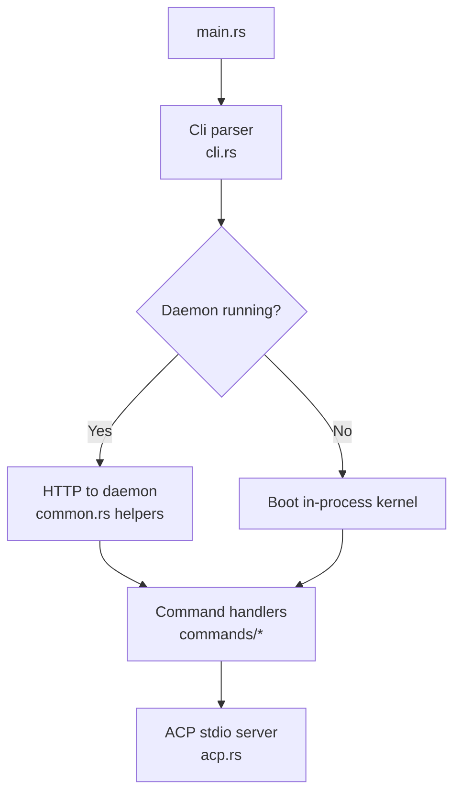
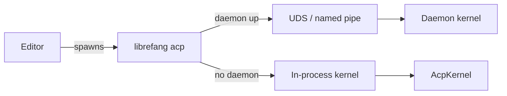

# Command-Line Interface

# LibreFang CLI (`librefang-cli`)

The command-line interface is the primary entry point for LibreFang. It parses arguments via `clap`, dispatches to command handlers, and talks to either a running daemon over HTTP or boots a throwaway in-process kernel when no daemon is available.

## Architecture Overview


```mermaid
graph TD
    A[main.rs] --> B[Cli parser<br/>cli.rs]
    B --> C{Daemon running?}
    C -->|Yes| D[HTTP to daemon<br/>common.rs helpers]
    C -->|No| E[Boot in-process kernel]
    D --> F[Command handlers<br/>commands/*]
    E --> F
    F --> G[ACP stdio server<br/>acp.rs]
```

The crate is split into three layers:

| Layer | Files | Role |
|-------|-------|------|
| **Argument definitions** | `cli.rs` | All `clap` derive types — `Cli`, `Commands`, every subcommand enum and arg struct. No logic. |
| **Command handlers** | `commands/*.rs` | One module per command group. Each handler takes parsed args, calls the daemon API or in-process kernel, and prints output. |
| **Shared infrastructure** | `commands/common.rs`, `main.rs`, `acp.rs`, `bundled_agents.rs` | Daemon discovery, HTTP client construction, kernel bootstrapping, ACP server, registry sync. |

## Command Dispatch

`main.rs` constructs the `Cli` parser from `cli.rs`, matches on the `Commands` enum, and calls the appropriate handler function. Handlers are plain functions — not methods on a struct — and follow a consistent pattern:

1. Check for a running daemon via `find_daemon()` (or `require_daemon()` for commands that strictly need one).
2. If the daemon is up, make HTTP calls through `daemon_client()` / `daemon_json()` helpers in `commands/common.rs`.
3. If not, boot an in-process kernel via `boot_kernel()` and call kernel methods directly.
4. Print results to stdout/stderr using the `ui::*` helpers and `i18n::t()` for localized strings.

### Adding a New Command

1. Define the subcommand variant and its args in `cli.rs` (inside the appropriate parent enum, or a new sub-enum).
2. Add a match arm in `main.rs` that calls your handler.
3. Implement the handler in `commands/<group>.rs` following the daemon-first / in-process-fallback pattern.

## Daemon vs In-Process Execution

Most commands support both modes:

- **Daemon mode** — The preferred path. The CLI is a thin HTTP client; state persists across invocations because the daemon holds the kernel, database, and agent registry in memory. Handlers use `daemon_client()` to get a configured `reqwest::Client` and `daemon_json()` to deserialize responses.
- **In-process mode** — Fallback when no daemon is detected. `boot_kernel()` creates a `LibreFangKernel` in the current process. State is lost when the process exits. Handlers print a warning (`agent-note-lost`) reminding the user to start the daemon for persistence.

Some commands (`channel list`, `hand activate`, `approvals list`, etc.) call `require_daemon()` and exit with an error if no daemon is found — these need the daemon's running sidecars or database.

## Agent Command Handlers (`commands/agent.rs`)

### Agent Lifecycle

The agent commands manage the full lifecycle: creation from templates or manifests, listing, chatting, killing, and identity management.

**Spawning agents** follows two routes:

- `cmd_agent_new` — Interactive template picker or name-based selection from built-in templates loaded by `templates::load_all_templates()`. Delegates to `spawn_template_agent`.
- `cmd_agent_spawn` / `cmd_spawn_alias` — Spawn from a TOML manifest file on disk. The `spawn` alias accepts either a template name or a file path, resolving ambiguity by checking if the path exists on disk first.

Both routes produce a `PreparedAgentManifest` — a validated `AgentManifest` with the raw TOML string and a source label. This prepared struct is then handed to `spawn_prepared_agent`, which POSTs to `POST /api/agents` in daemon mode or calls `kernel.spawn_agent_with_source()` in-process.

**Dry runs** (`--dry-run`) call `preview_agent_manifest`, which prints parsed fields (name, version, model, tools, skills) without actually creating the agent.

### Agent Identity System (#4614)

Agents have a canonical UUID binding stored in `agent_identities.toml`. The identity commands manage this:

| Command | Handler | Behavior |
|---------|---------|----------|
| `agent delete <name>` | `cmd_agent_delete` | Looks up canonical UUID, confirms, issues `DELETE /api/agents/{id}?confirm=true`. Purges the identity binding. |
| `agent reset-uuid <name>` | `cmd_agent_reset_uuid` | Drops the canonical UUID binding without killing the agent. Next spawn gets a fresh UUID. |
| `agent merge-history` | `cmd_agent_merge_history` | Placeholder — not yet implemented. The cross-table reassignment requires transactional surgery across 10+ tables. |

`lookup_canonical_uuid` resolves a name to its UUID by querying `GET /api/agents/identities`.

### Agent Resolution

`resolve_agent_id` (in `commands/common.rs`) accepts either a UUID or an agent name and returns the canonical UUID. This lets users type `librefang agent kill coder` instead of copying a UUID.

## ACP Server (`acp.rs`)

The `librefang acp` subcommand exposes LibreFang agents to ACP-compatible editors (Zed, VS Code, JetBrains) over stdio JSON-RPC.

### Two Modes


```mermaid
graph LR
    E[Editor] -->|spawns| CLI[librefang acp]
    CLI -->|daemon up| UDS[UDS / named pipe]
    UDS --> D[Daemon kernel]
    CLI -->|no daemon| K[In-process kernel]
    K --> ACP[AcpKernel]
```

1. **Daemon-attached (proxy)** — When the daemon is running and has a listener:
   - **Unix**: Connects to `~/.librefang/acp.sock` (UDS). `locate_acp_socket()` verifies both that the daemon is reachable (`find_daemon()`) and the socket file exists (to avoid stale sockets from crashed daemons).
   - **Windows**: Connects to the named pipe `\\.\pipe\librefang-acp`.
   - The CLI becomes a bidirectional pipe: `stdin → socket` and `socket → stdout`. Multiple editor tabs share the same daemon-side kernel, so approval decisions and agent state are consistent.

2. **In-process** — Boots a fresh `LibreFangKernel`, creates a `KernelAdapter`, resolves the requested agent (defaulting to `"assistant"`), and runs `librefang_acp::run()` on a Tokio runtime until stdin EOF.

### Mode Selection

`run_acp_server` tries daemon-attached first (fast path), falling back to in-process. The selected mode is logged to stderr:

```
librefang acp: attached to daemon (UDS /home/user/.librefang/acp.sock)
# or
librefang acp: in-process kernel (no daemon detected)
```

This matters because the two modes have **different** `allow_always` caches — an approval remembered in an earlier in-process run does not carry over to daemon mode, and vice versa.

## Bundled Agents (`bundled_agents.rs`)

A thin backwards-compatibility wrapper around `librefang_runtime::registry_sync::sync_registry`. Called during initialization to sync agent content from the registry to `~/.librefang/`.

## CLI Argument Definitions (`cli.rs`)

All `clap` derive types live here, deliberately separated from `main.rs` to keep that file focused on dispatch. The structure is:

- **`Cli`** — Top-level parser. Holds `--config` and the `Commands` subcommand enum.
- **`Commands`** — Top-level subcommands. Many are leaf commands (e.g., `Start`, `Stop`, `Chat`); others nest further sub-enums (e.g., `Agent(AgentCommands)`, `Skill(SkillCommands)`).
- **Sub-enums** — `AgentCommands`, `SkillCommands`, `ConfigCommands`, `ChannelCommands`, etc. Each corresponds to a command group.
- **Arg structs** — `SpawnAliasArgs`, `AgentSpawnArgs`, `MigrateArgs` — for commands with multiple positional/optional args.

Every subcommand has a `long_about` with examples. The top-level `Cli` has an `after_help` block showing common usage patterns.

### Conventions

- `--json` flags produce machine-readable output for scripting.
- `--dry-run` flags preview without side effects.
- `--confirm` / `--yes` flags skip interactive confirmation.
- `--tail` follows daemon log output after starting.
- `--config <path>` is global — available on every subcommand.

## Common Helpers (`commands/common.rs`)

These are referenced throughout the call graph:

| Helper | Purpose |
|--------|---------|
| `find_daemon()` | Probe for a running daemon. Returns the base URL or `None`. |
| `find_daemon_with_probe()` | Like `find_daemon` but also hits `/api/health` to confirm liveness. |
| `require_daemon(label)` | Like `find_daemon` but exits with an error if absent. |
| `daemon_client()` | Returns a `reqwest::Client` configured for daemon communication. |
| `daemon_client_with_api_key()` | Same, but includes the configured API key for protected endpoints. |
| `daemon_json(resp)` | Sends a request, deserializes the JSON response, exits on HTTP errors. |
| `boot_kernel(config)` | Creates an in-process `LibreFangKernel`. |
| `ensure_initialized(config)` | Verifies `~/.librefang/` exists, exits with guidance if not. |
| `cli_librefang_home()` | Returns the `~/.librefang/` path. |
| `percent_encode_path_segment(s)` | URL-encodes a path segment for API calls. |
| `prompt_yes_no(msg, default)` | Interactive `[y/N]` confirmation. |
| `prompt_input(msg)` | Reads a line from stdin. |

## Key Patterns

### Table Rendering

Agent lists and similar tabular output use `crate::table::Table` — a shared builder that auto-sizes columns to content and falls back to ASCII characters when stdout is piped (#3306). This replaces hardcoded `{:<38}` format specs that truncated or over-padded.

### Internationalization

All user-facing strings use `i18n::t()` and `i18n::t_args()` for localization. Error messages pair the error with a fix hint via `ui::error_with_fix(error, suggestion)`.

### Daemon API Conventions

- `GET /api/agents` → `{"items": [...]}`
- `POST /api/agents` with `{"manifest_toml": "..."}` → `{"agent_id": "...", "name": "..."}`
- `DELETE /api/agents/{id}?confirm=true` → `{"status": "ok"}`
- `GET /api/agents/identities` → `[{"name": "...", "canonical_uuid": "..."}]`
- `POST /api/agents/identities/{name}/reset?confirm=true` → `{"status": "ok", "previous_canonical_uuid": "..."}`