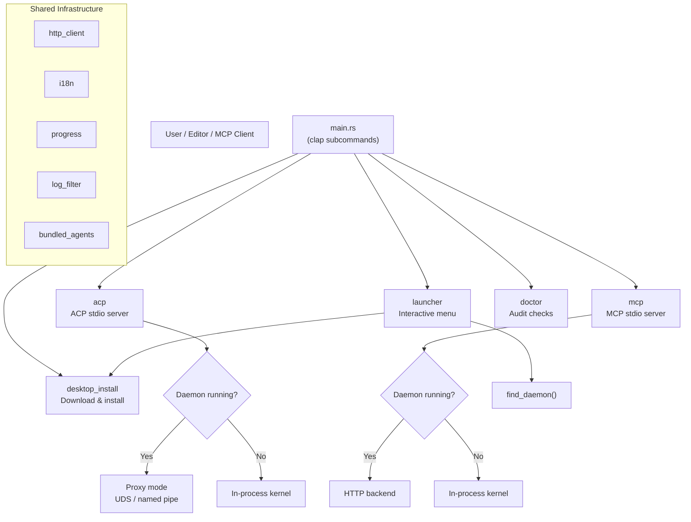

# Command Line Interface

# LibreFang CLI (`librefang-cli`)

The command-line interface crate for LibreFang. It houses the interactive launcher, protocol servers (ACP, MCP), desktop app lifecycle, diagnostics, internationalization, and shared utilities used by all CLI subcommands.

## Architecture

```mermaid
graph TD
    User["User / Editor / MCP Client"]
    Main["main.rs<br/>(clap subcommands)"]

    Main --> Launcher["launcher<br/>Interactive menu"]
    Main --> ACP["acp<br/>ACP stdio server"]
    Main --> MCP["mcp<br/>MCP stdio server"]
    Main --> Doctor["doctor<br/>Audit checks"]
    Main --> Desktop["desktop_install<br/>Download & install"]

    ACP --> Daemon{"Daemon running?"}
    Daemon -->|Yes| Proxy["Proxy mode<br/>UDS / named pipe"]
    Daemon -->|No| InProc1["In-process kernel"]

    MCP --> Daemon2{"Daemon running?"}
    Daemon2 -->|Yes| HTTP["HTTP backend"]
    Daemon2 -->|No| InProc2["In-process kernel"]

    Launcher --> Desktop
    Launcher --> FindDaemon["find_daemon()"]

    subgraph "Shared Infrastructure"
        HTTPClient["http_client"]
        I18N["i18n"]
        Progress["progress"]
        LogFilter["log_filter"]
        Bundled["bundled_agents"]
    end
```

## Submodule Reference

### `acp` — Agent Client Protocol Server

Runs the ACP server over stdio so editors (Zed, VS Code, JetBrains) can embed LibreFang as a native agent.

**Two modes, selected automatically:**

| Mode | Condition | Kernel | State sharing |
|------|-----------|--------|---------------|
| **Daemon-attached** (proxy) | Daemon running with socket listener | Daemon's long-running kernel | Shared across editor tabs |
| **In-process** | No daemon detected | Fresh kernel in this process | Isolated to this invocation |

The mode is logged to stderr on startup — this matters because `allow_always` caches are per-kernel. An approval remembered in one mode does **not** carry over to the other.

**Entry point:** `run_acp_server(config, agent)`

**Daemon-attached transport:**
- Unix: bidirectional proxy over UDS at `~/.librefang/acp.sock` (`run_uds_proxy`)
- Windows: bidirectional proxy over named pipe `\\.\pipe\librefang-acp` (`run_pipe_proxy`)

Stale sockets (daemon crashed) are detected by checking `find_daemon()` first — falls back to in-process mode.

**In-process flow:**
1. Boot `LibreFangKernel` from optional config path
2. Spawn approval sweep task
3. Resolve agent by name (default: `"assistant"`)
4. Create `KernelAdapter`, run `librefang_acp::run()` until stdin EOF

### `mcp` — Model Context Protocol Server

Exposes running agents as MCP tools over JSON-RPC 2.0 on stdio. Each agent becomes a callable tool named `librefang_agent_{name}` (hyphens replaced with underscores).

**Entry point:** `run_mcp_server(config)`

**Backend selection** (`create_backend`):
1. If daemon is reachable → `McpBackend::Daemon` (HTTP-based, 120s timeout)
2. Otherwise → `McpBackend::InProcess` (boots a kernel + tokio runtime)

**Protocol handling** (`handle_message`):

| Method | Behavior |
|--------|----------|
| `initialize` | Returns server capabilities, protocol version `2024-11-05` |
| `notifications/initialized` | No response (notification) |
| `tools/list` | Enumerates agents as tool descriptors with `inputSchema` |
| `tools/call` | Resolves tool name → agent, sends message, returns response text |
| Unknown | JSON-RPC error `-32601` |

**Framing:** Content-Length header protocol (same as LSP). Messages over 10 MB are rejected to prevent OOM.

**Agent resolution:** Tool name `librefang_agent_{name}` is stripped of its prefix, underscores converted to hyphens, then matched case-insensitively against agent names. Falls back to underscore-based matching.

### `launcher` — Interactive Launcher Menu

A Ratatui-based one-shot menu displayed when `librefang` is run with no subcommand in a TTY.

**Entry point:** `run(config) → LauncherChoice`

**Two menu variants:**
- `MENU_FIRST_RUN`: "Get started" first (no `config.toml` exists). Also shows migration hints if `~/.openclaw` or `~/.openfang` is detected.
- `MENU_RETURNING`: "Chat" first (experienced user), settings relabeled as "Settings".

**Detection on startup:**
- Daemon detection runs in a background thread (queries `/api/agents` for agent count)
- Provider detection checks 10 API key environment variables
- First-run detection checks for `config.toml` in `$LIBREFANG_HOME` or `~/.librefang`

**Keybindings:** `↑/k` `↓/j` navigate, `1-9` quick select, `Enter` confirm, `q/Esc` quit. The help screen (`Show all commands`) renders `clap` long help with vim-style scrolling.

**Layout:** Content capped at 80 columns width, 3-column left margin. Vertically centered in upper third. Adapts dynamically based on first-run status and detection results.

### `desktop_install` — Desktop App Lifecycle

Discovers, downloads, and installs the LibreFang desktop application.

**Discovery order** (`find_desktop_binary`):
1. Sibling of current CLI executable
2. PATH lookup (`which_lookup`)
3. Platform-specific standard location:
   - macOS: `/Applications/LibreFang.app/Contents/MacOS/LibreFang`
   - Windows: `%LOCALAPPDATA%\LibreFang\LibreFang.exe`
   - Linux: `~/.local/bin/librefang-desktop` or `~/Applications/LibreFang.AppImage`

**Installation flow** (`prompt_and_install` → `download_and_install`):
1. Query GitHub Releases API for latest release
2. Select asset matching current platform/arch
3. Stream-download to temp directory
4. Platform-specific install:
   - **macOS:** Mount DMG, copy `.app` to `/Applications`, clear quarantine xattr
   - **Windows:** Run NSIS installer with `/S` (silent)
   - **Linux:** Copy AppImage to `~/.local/bin/`, `chmod 755`

**Launch** (`launch`): On macOS, detects `.app` bundles and uses `open -a`. Otherwise spawns detached.

**Testability:** Linux install path resolution (`linux_install_path_in`) and AppImage install (`install_linux_appimage_to`) accept explicit directory arguments for tempdir-based testing.

### `doctor` — Diagnostic Audit Framework

Trait-based registry of audit checks for `librefang doctor`. Designed to be incrementally migrated from the legacy inline checks in `cmd_doctor`.

**Adding a new check:**
1. Create a unit struct implementing `AuditCheck`
2. Add it to `registered_checks()`

**Context:** `AuditContext` carries `librefang_home` — add fields as new checks need them.

**Registered checks:**

| Check | What it validates |
|-------|-------------------|
| `VaultKeyCheck` | `LIBREFANG_VAULT_KEY` base64-decodes to exactly 32 bytes (the classic gotcha: 32 ASCII chars ≠ 32 bytes) |
| `ApiListenAddrCheck` | `config.toml`'s `api_listen` parses as `SocketAddr`; warns on privileged ports (<1024) and port 0 |
| `ConfigTomlSchemaCheck` | `config.toml` exists and parses as valid TOML |

**Severity levels:** `Pass` (green), `Info` (informational), `Warn` (fixable misconfiguration), `Error` (blocks operation).

`VaultKeyCheck` intentionally does **not** trim the env var value — matching production behavior in `librefang-extensions/src/vault.rs::decode_master_key`.

### `http_client` — HTTP Client Builder

Thin wrapper providing a blocking `reqwest::Client` with bundled CA roots from `librefang_runtime::http_client::tls_config()`.

- `client_builder()` → `ClientBuilder` (customize timeout, etc.)
- `new_client()` → built `Client` (panics on failure; used for one-shot calls)

### `i18n` — Internationalization

Fluent-based i18n with thread-local storage. Supports `en` (default) and `zh-CN`.

**Setup:** Call `init(language)` early in startup. Falls back to English on invalid language.

**Usage:**
- `t("key")` — simple lookup
- `t_args("key", &[("name", "value")])` — parameterized lookup

Translation files live at `locales/{lang}/main.ftl`. Missing keys render as `[key]`.

### `log_filter` — Reloadable Log Filtering

A per-layer `EnvFilter` that can be hot-reloaded at runtime (e.g., from the dashboard) without restarting the daemon.

**Why custom:** `tracing_subscriber::reload::Layer` carries the full subscriber type as a generic parameter, making it impractical to store. Instead, `ReloadableEnvFilter` wraps an `ArcSwap<EnvFilter>` and forwards all `Filter` trait methods to the current inner filter.

**Key design decisions:**
- **Baseline directives:** Boot-time per-target overrides (e.g., `librefang_kernel=warn`) are stored in `BASELINE_DIRECTIVES` and reapplied on every reload. Without this, a dashboard "debug" toggle would unmask kernel noise that boot had specifically suppressed.
- **Cache invalidation:** After swapping the filter, calls `tracing_core::callsite::rebuild_interest_cache()` so per-callsite `Interest` values are recomputed.
- **`OnceLock` slots:** Both the live filter and baseline directives are process-global singletons. Re-init (test harnesses) reuses existing slots.

**Entry points:**
- `ReloadableEnvFilter::install(initial)` / `install_with_baseline(initial, baseline)` — set up the filter
- `reload_log_level(directive)` — swap the live filter at runtime
- `CliLogLevelReloader` — adapter implementing the kernel's `LogLevelReloader` trait

### `progress` — Progress Reporting

ANSI-based progress bars and spinners with TTY auto-detection.

**Reporters:**
- `ProgressBar` — percentage bar with unicode block characters, OSC 9;4 support
- `Spinner` — braille animation frames
- `SilentReporter` — no-op for non-TTY environments

**Use `auto(label, total)`** to pick the right reporter based on `stderr.is_terminal()`.

**Features:**
- Delay suppression: operations completing under 200ms produce no output
- OSC 9;4 protocol for terminal taskbar progress (Windows Terminal, iTerm2)
- `ProgressReporter` trait for TTY-agnostic call sites

### `bundled_agents` — Registry Sync

Backward-compatible wrapper delegating to `librefang_runtime::registry_sync::sync_registry`. Syncs content from the registry to the local LibreFang home directory.

## Conventions

- **Error handling:** CLI-facing errors go to stderr via `eprintln!` or the `ui` module; the process exits with code 1. Server-mode functions return exit codes as `i32`.
- **Platform gating:** OS-specific code uses `#[cfg(unix)]` / `#[cfg(windows)]` / `#[cfg(target_os = "...")]` rather than runtime detection. Non-matching platforms get stubs or `allow(unused_variables)`.
- **Test safety:** Tests that mutate environment variables use module-level `Mutex` guards (`ENV_LOCK` / `env_lock()`) to prevent races under `cargo test`'s parallel runner. Filesystem tests use `tempfile::TempDir` exclusively.