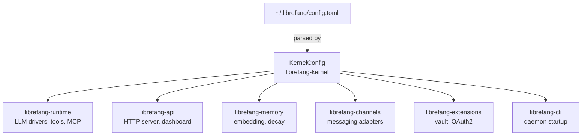

# Configuration

# Configuration

LibreFang uses a single TOML file — `~/.librefang/config.toml` — as the source of truth for all runtime behavior. The config is parsed into the `KernelConfig` struct defined in `librefang-kernel` and consumed by nearly every crate in the workspace.

## File Location

The daemon resolves the config path at startup using the `dirs` crate:

```
~/.librefang/config.toml
```

On first run, `librefang start` auto-initializes this file with sensible defaults. Run `librefang init` for an interactive setup wizard that walks through provider selection and API key configuration.

A complete annotated example ships at `librefang.toml.example` in the repository root.

## Loading and Deserialization

`KernelConfig` derives `serde::Deserialize` and `serde::Serialize`. Every field uses `#[serde(default)]` so that a minimal config file (or a missing file entirely) produces a valid config with default values.

### Adding a New Config Field

The project enforces a strict three-step checklist. Missing any step causes build failures or silent feature disablement:

1. **Struct field** — Add the field to `KernelConfig` in `librefang-kernel`, with `#[serde(default)]`.
2. **`Default` impl** — Add the corresponding entry in the manual `Default` implementation. This is not derived automatically because some fields require non-trivial initialization.
3. **Serde derives** — The struct already has `Serialize`/`Deserialize` at the top level, so individual fields just need the attribute.

```rust
#[derive(Serialize, Deserialize)]
pub struct KernelConfig {
    // ...existing fields...

    /// Max concurrent sub-agent tasks (default: 3)
    #[serde(default)]
    pub subagent_lane: usize,
}

impl Default for KernelConfig {
    fn default() -> Self {
        Self {
            // ...existing defaults...
            subagent_lane: 3,
        }
    }
}
```

## Hot-Reload

The `[reload]` section controls how config changes are picked up without restarting the daemon:

```toml
[reload]
mode = "hybrid"     # off | restart | hot | hybrid
debounce_ms = 500
```

| Mode | Behavior |
|------|----------|
| `off` | No reload. Restart the daemon to apply changes. |
| `restart` | Watch the file and automatically restart the daemon process on change. |
| `hot` | In-process reload — the kernel re-reads the TOML and swaps active settings. |
| `hybrid` | Hot-reload where possible, graceful restart for fields that cannot be changed in-flight. |

The daemon watches `~/.librefang/config.toml` using filesystem change events and applies a debounce window to avoid thrashing on rapid edits.

## Configuration Sections

### Server

```toml
api_listen = "0.0.0.0:4545"    # Bind address. Use "127.0.0.1:4545" for local-only
log_level = "info"             # trace | debug | info | warn | error
mode = "default"               # stable | default | dev
```

`mode` controls feature stability: `stable` locks to tested defaults, `dev` enables experimental features and verbose logging.

### Authentication

**Dashboard login** — HTTP Basic Auth for the web dashboard:

```toml
dashboard_user = "librefang"
dashboard_pass = "librefang"   # Change after first login
```

The password supports vault references and environment variable substitution:

```toml
dashboard_pass = "vault:dashboard_password"              # Encrypted vault lookup
# Or: export LIBREFANG_DASHBOARD_PASS=your-secret
```

**API Bearer auth** — Set `api_key` to require `Authorization: Bearer <key>` on all API endpoints except those on the public allowlist (defined in `middleware.rs` in `librefang-api`).

```toml
api_key = "your-secret-api-key"
```

### Default LLM Model

```toml
[default_model]
provider = "anthropic"                    # Provider ID
model = "claude-sonnet-4-20250514"        # Model identifier
api_key_env = "ANTHROPIC_API_KEY"         # Env var holding the API key
# base_url = ""                           # Override API endpoint
```

Agent manifests (`agent.toml`) can override this per-agent. When no override exists, the kernel falls back to `[default_model]`.

### Embedding Configuration

```toml
[embedding]
provider = "openai"
model = "text-embedding-3-small"
api_key_env = "OPENAI_API_KEY"
dimensions = 1536               # Optional: override auto-detected dimensions
```

Bedrock is also supported — authentication uses standard AWS environment variables (`AWS_ACCESS_KEY_ID`, `AWS_SECRET_ACCESS_KEY`, `AWS_REGION`):

```toml
[embedding]
provider = "bedrock"
model = "amazon.titan-embed-text-v2:0"
# base_url = "eu-west-1"       # Region override (not a full URL)
```

### Memory

```toml
[memory]
decay_rate = 0.05               # Confidence decay per cycle

[memory.decay]
enabled = false                 # Enable time-based expiry
session_ttl_days = 7            # SESSION memories expire after N days
agent_ttl_days = 30             # AGENT memories expire after N days
decay_interval_hours = 1        # Decay sweep frequency
# USER memories never decay.
```

### Proactive Memory

Auto-extract facts from conversations and auto-recall relevant memories during agent execution:

```toml
[proactive_memory]
enabled = true
auto_memorize = true
auto_retrieve = true
max_retrieve = 10               # Max memories per retrieval
# extraction_threshold = 0.7   # Min confidence to save
# session_ttl_hours = 24
# duplicate_threshold = 0.5
# max_memories_per_agent = 1000
```

### Performance

```toml
prompt_caching = true           # Reduce LLM costs (Anthropic/OpenAI)
stable_prefix_mode = true       # Improve cache hit rate
usage_footer = "tokens"         # off | tokens | cost | full
```

### Task Queue Concurrency

Controls parallelism limits for the kernel's task lanes:

```toml
[queue.concurrency]
main_lane = 3                   # Concurrent user messages
cron_lane = 2                   # Concurrent scheduled jobs
subagent_lane = 3               # Concurrent child agents
```

### Shell Execution Policy

Security boundary for the `shell_exec` tool:

```toml
[exec_policy]
mode = "deny"                   # deny | allowlist | full
timeout_secs = 30
max_output_bytes = 102400       # 100 KB
```

- `deny` — Block all shell execution.
- `allowlist` — Only commands in the allowlist are permitted.
- `full` — No restrictions (use with caution in production).

### Approval Policy

Human-in-the-loop gating for dangerous tools:

```toml
[approval]
require_approval = ["shell_exec"]
timeout_secs = 60
auto_approve = false

trusted_senders = ["admin_123"]           # These user IDs bypass approval

[[approval.channel_rules]]
channel = "telegram"
denied_tools = ["shell_exec"]

[[approval.channel_rules]]
channel = "admin_cli"
allowed_tools = ["shell_exec", "file_write", "file_delete"]
```

**TOTP second factor** for critical approvals:

```toml
[approval]
second_factor = "totp"                    # "none" (default) or "totp"
totp_issuer = "LibreFang"
totp_grace_period_secs = 300              # Skip re-verification within window
totp_tools = ["shell_exec"]               # Only these tools require TOTP
```

Setup flow: `POST /api/approvals/totp/setup` → scan QR → `POST /api/approvals/totp/confirm`.

### Session Management

```toml
[session]
retention_days = 30                        # Auto-cleanup idle sessions (0 = unlimited)
max_sessions_per_agent = 100               # 0 = unlimited
cleanup_interval_hours = 24
reset_prompt = "You are a helpful assistant."

# Context injections — named entries injected at specific positions
[[session.context_injection]]
name = "project-rules"
content = "Always follow the project coding standards."
position = "system"                        # "system", "before_user", or "after_reset"
# condition = "agent.tags contains 'chat'" # Optional: conditional injection
```

**Session compaction** — LLM-based context window management:

```toml
[compaction]
threshold = 80                # Compact when messages exceed this count
keep_recent = 20              # Messages to preserve after compaction
max_summary_tokens = 1024     # Token budget for the LLM summary
```

### Provider Overrides

**Region selection** — some providers offer region-specific endpoints:

```toml
[provider_regions]
qwen = "intl"
minimax = "china"
```

**URL overrides** — redirect a provider to a custom endpoint:

```toml
[provider_urls]
ollama = "http://localhost:11434/v1"
vllm = "http://localhost:8000/v1"
```

**API key overrides** — map provider IDs to environment variable names:

```toml
[provider_api_keys]
openai = "OPENAI_API_KEY"
nvidia = "NVIDIA_API_KEY"
```

### Fallback Providers

Chain of LLM providers to try if the primary fails:

```toml
[[fallback_providers]]
provider = "openai"
model = "gpt-4o"
api_key_env = "OPENAI_API_KEY"
```

### Budget and Cost Control

```toml
[budget]
max_hourly_usd = 0.0           # 0 = unlimited
max_daily_usd = 0.0
max_monthly_usd = 0.0
alert_threshold = 0.8          # Alert at 80% of limit
```

### Extended Thinking

Chain-of-thought for supported models (Claude, DeepSeek):

```toml
[thinking]
budget_tokens = 10000
stream_thinking = false
```

### Web Tools

```toml
[web]
search_provider = "auto"       # auto-detect: Tavily → Brave → Jina → Perplexity → DuckDuckGo

[web.fetch]
max_chars = 50000              # Max chars extracted from web pages
timeout_secs = 30
readability = true             # Clean HTML → readable text
```

### Channels

Messaging integrations are enabled by adding their sections. Each channel specifies a `default_agent` that receives incoming messages:

```toml
[channels.telegram]
bot_token_env = "TELEGRAM_BOT_TOKEN"
default_agent = "assistant"
allowed_users = []              # User IDs, usernames, or @handles

[channels.telegram.thread_routes]
"12345" = "research-agent"     # Route forum threads to specific agents

[channels.discord]
bot_token_env = "DISCORD_BOT_TOKEN"
default_agent = "assistant"

[channels.slack]
bot_token_env = "SLACK_BOT_TOKEN"
app_token_env = "SLACK_APP_TOKEN"
default_agent = "assistant"

[channels.whatsapp]
phone_number_id_env = "WHATSAPP_PHONE_ID"
access_token_env = "WHATSAPP_ACCESS_TOKEN"
default_agent = "assistant"
```

### MCP Servers

External tool integration via the Model Context Protocol:

```toml
[[mcp_servers]]
name = "filesystem"
timeout_secs = 30

[mcp_servers.transport]
type = "stdio"
command = "npx"
args = ["-y", "@modelcontextprotocol/server-filesystem", "/tmp"]

[[mcp_servers]]
name = "remote-tools"
timeout_secs = 60

[mcp_servers.transport]
type = "sse"
url = "https://mcp.example.com/events"
```

HTTP-compatible MCP servers with custom tool definitions:

```toml
[[mcp_servers]]
name = "internal-http"
timeout_secs = 30

[mcp_servers.transport]
type = "http_compat"
base_url = "http://127.0.0.1:8080"

[[mcp_servers.transport.headers]]
name = "Authorization"
value_env = "INTERNAL_HTTP_TOKEN"

[[mcp_servers.transport.tools]]
name = "search"
path = "/search"
method = "get"
request_mode = "query"
response_mode = "json"
```

### Privacy Controls

Filter PII before sending to LLM providers:

```toml
[privacy]
mode = "pseudonymize"                     # "off", "redact", or "pseudonymize"
redact_patterns = ["\\bCUST-\\d{6}\\b"]   # Additional regex patterns
```

### Vault

Encrypted credential storage using AES-256-GCM:

```toml
[vault]
enabled = true                 # Auto-detected if vault.enc exists
```

The vault key is provided via the `LIBREFANG_VAULT_KEY` environment variable. It must base64-decode to exactly 32 bytes — generate with `openssl rand -base64 32`.

### File Inbox

Async external commands via filesystem drops:

```toml
[inbox]
enabled = false
directory = "~/.librefang/inbox/"
poll_interval_secs = 5
default_agent = "assistant"
```

Drop text files into the directory. The first line may contain `agent:<name>` to target a specific agent.

### Additional Sections

| Section | Purpose |
|---------|---------|
| `[heartbeat]` | Autonomous agent health monitoring |
| `[browser]` | Playwright-based web automation settings |
| `[docker]` | Container sandbox configuration |
| `[tts]` | Text-to-speech provider settings |
| `[network]` | OFP P2P federation (requires `network_enabled = true`) |
| `[external_auth]` | OAuth2/OIDC integration |
| `[audit]` | Audit log retention |

## Environment Variable Substitution

Fields ending in `_env` (e.g., `api_key_env`, `bot_token_env`) store the **name** of an environment variable, not the secret itself. The daemon reads the actual value at runtime from the process environment. This keeps secrets out of the config file.

## Relationship to Other Crates



- **`librefang-kernel`** owns the `KernelConfig` struct and its `Default` impl. It parses the TOML at startup and distributes settings to subsystems.
- **`librefang-runtime`** reads model config, execution policies, thinking budgets, and tool limits.
- **`librefang-api`** uses `AppState` (built in `server.rs`) to expose config via the `/api/config` endpoint and applies middleware settings like auth.
- **`librefang-memory`** consumes embedding and decay settings.
- **`librefang-channels`** reads channel-specific sections to initialize adapters.
- **`librefang-extensions`** manages the vault, reading vault key material from the environment.
- **`librefang-cli`** handles `init` (wizard) and `start` (daemon launch), triggering the initial config load.

## Common Pitfalls

- **Forgetting the `Default` impl entry** — The build will fail with a "field not initialized" error. Every field in `KernelConfig` must have a corresponding line in the manual `Default` impl.
- **`Option::None` defaults silently disabling features** — When multiple developers add fields in parallel, a field that defaults to `None` compiles fine but the feature won't activate. Always write integration tests at the injection site.
- **Auth middleware allowlist** — New unauthenticated endpoints must be added to the `is_public` allowlist in `middleware.rs`, not by reordering routes in `server.rs`.
- **Vault key size** — `LIBREFANG_VAULT_KEY` must base64-decode to exactly 32 bytes. 32 ASCII characters ≠ 32 bytes. Use `openssl rand -base64 32`.