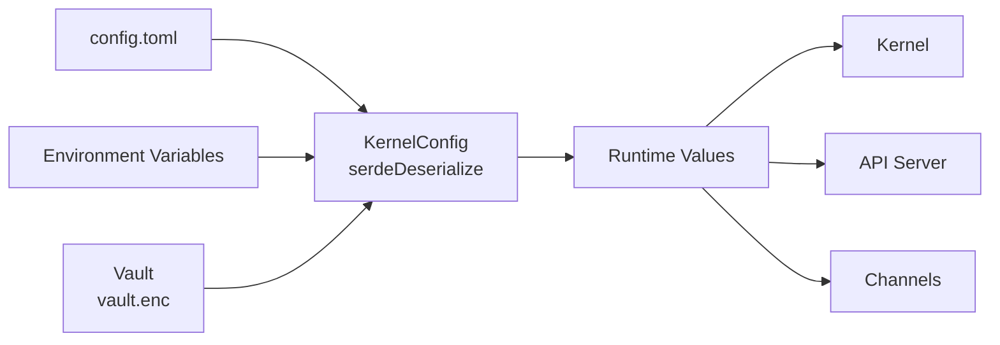

# Configuration

# Configuration Module

LibreFang uses a single TOML configuration file at `~/.librefang/config.toml` to control all aspects of the Agent OS. The configuration system supports environment variable interpolation, hot-reload, vault-based credential storage, and sensible defaults for every field.

## Overview

The configuration system lives in `librefang-kernel` and is represented by the `KernelConfig` struct. Every field has a default value, so the config file is entirely optional — LibreFang boots with sensible defaults on first run.



## Config File Location

| Environment | Path |
|-------------|------|
| Linux/macOS | `~/.librefang/config.toml` |
| Windows | `%USERPROFILE%\.librefang\config.toml` |
| Custom | `LIBREFANG_CONFIG=/path/to/config.toml` |

## Environment Variable Interpolation

Config values support `${VAR_NAME}` syntax for secrets:

```toml
# Environment variable
api_key_env = "ANTHROPIC_API_KEY"

# Vault reference (encrypted storage)
dashboard_pass = "vault:dashboard_password"

# Base64-encoded literal (rare)
# secret_key = "base64:SGVsbG9Xb3JsZAo="
```

## Configuration Reference

### Server

```toml
api_listen = "0.0.0.0:4545"   # Bind address; use "127.0.0.1:4545" for local-only
log_level = "info"            # trace | debug | info | warn | error
mode = "default"              # stable | default | dev
```

### Dashboard Authentication

```toml
dashboard_user = "librefang"
dashboard_pass = "librefang"  # Change this immediately after first login

# Secure storage options:
dashboard_pass = "vault:dashboard_password"  # Encrypted vault
dashboard_pass = "env:LIBREFANG_DASHBOARD_PASS"  # Environment variable
```

### Default LLM Provider

```toml
[default_model]
provider = "anthropic"           # "anthropic", "openai", "gemini", "groq", "ollama", etc.
model = "claude-sonnet-4-20250514"
api_key_env = "ANTHROPIC_API_KEY"
# base_url = ""                 # Optional: override the provider's default endpoint
```

### Performance Tuning

```toml
prompt_caching = true           # Enable Anthropic/OpenAI cache_control (reduces cost)
stable_prefix_mode = true       # Improves cache hit rate by stabilizing prefix tokens
usage_footer = "tokens"         # off | tokens | cost | full
```

### Memory Configuration

```toml
[memory]
decay_rate = 0.05               # Memory confidence decay per cycle
# embedding_model = "all-MiniLM-L6-v2"

# Time-based expiry
[memory.decay]
enabled = false
session_ttl_days = 7            # SESSION memories expire after N days
agent_ttl_days = 30             # AGENT memories expire after N days
decay_interval_hours = 1
```

### Proactive Memory

```toml
[proactive_memory]
enabled = true
auto_memorize = true            # Extract facts from conversations
auto_retrieve = true            # Auto-recall relevant memories at session start
max_retrieve = 10               # Max memories per retrieval
# extraction_threshold = 0.7
# duplicate_threshold = 0.5
```

### Web Tools

```toml
[web]
search_provider = "auto"       # Tavily → Brave → Jina → Perplexity → DuckDuckGo
# cache_ttl_minutes = 15
# timeout_secs = 15

[web.fetch]
max_chars = 50000              # Max chars extracted from pages
timeout_secs = 30
readability = true             # Clean HTML → readable text
```

### Session Management

```toml
[session]
retention_days = 30            # Auto-cleanup idle sessions (0 = unlimited)
max_sessions_per_agent = 100   # Max sessions per agent (0 = unlimited)
cleanup_interval_hours = 24
reset_prompt = "You are a helpful assistant."
# on_session_start_script = "/path/to/hook.sh"

# Context injections — injected at specific positions
[[session.context_injection]]
name = "project-rules"
content = "Follow the project coding standards."
position = "system"            # "system", "before_user", or "after_reset"

[[session.context_injection]]
name = "user-prefs"
content = "The user prefers concise answers."
position = "after_reset"
condition = "agent.tags contains 'chat'"  # Conditional injection

# Session compaction (LLM-based context reduction)
[compaction]
threshold = 80                 # Compact when message count exceeds this
keep_recent = 20               # Keep this many recent messages after compaction
max_summary_tokens = 1024
```

### Task Queue Concurrency

```toml
[queue.concurrency]
main_lane = 3                  # Concurrent user messages
cron_lane = 2                  # Concurrent scheduled jobs
subagent_lane = 3              # Concurrent child agents
```

### Shell Execution Policy

```toml
[exec_policy]
mode = "deny"                  # deny | allowlist | full
timeout_secs = 30
max_output_bytes = 102400      # 100 KB
```

### Config Hot-Reload

```toml
[reload]
mode = "hybrid"                # off | restart | hot | hybrid
debounce_ms = 500
```

### Provider Configuration

```toml
# Region selection (overrides base_url per provider)
[provider_regions]
qwen = "intl"
minimax = "china"

# URL overrides
[provider_urls]
ollama = "http://localhost:11434/v1"
vllm = "http://localhost:8000/v1"

# API key overrides (alternative to env vars)
[provider_api_keys]
openai = "OPENAI_API_KEY"
nvidia = "NVIDIA_API_KEY"

# Fallback providers (LLM failover chain)
[[fallback_providers]]
provider = "openai"
model = "gpt-4o"
api_key_env = "OPENAI_API_KEY"
```

### Budget & Cost Control

```toml
[budget]
max_hourly_usd = 0.0           # 0 = unlimited
max_daily_usd = 0.0
max_monthly_usd = 0.0
alert_threshold = 0.8          # Alert at 80% of limit
```

### Extended Thinking

```toml
[thinking]
budget_tokens = 10000          # Max tokens for chain-of-thought
stream_thinking = false        # Stream thinking tokens to client
```

### Audit Logging

```toml
[audit]
retention_days = 90
```

### Messaging Channels

```toml
[channels.telegram]
bot_token_env = "TELEGRAM_BOT_TOKEN"
default_agent = "assistant"
allowed_users = []              # Empty = allow all

[channels.discord]
bot_token_env =DISCORD_BOT_TOKEN"
default_agent = "assistant"

[channels.slack]
bot_token_env = "SLACK_BOT_TOKEN"
app_token_env = "SLACK_APP_TOKEN"
default_agent = "assistant"

[channels.whatsapp]
phone_number_id_env = "WHATSAPP_PHONE_ID"
access_token_env = "WHATSAPP_ACCESS_TOKEN"
default_agent = "assistant"
```

### MCP Server Connections

```toml
# STDIO transport
[[mcp_servers]]
name = "filesystem"
timeout_secs = 30
[mcp_servers.transport]
type = "stdio"
command = "npx"
args = ["-y", "@modelcontextprotocol/server-filesystem", "/tmp"]

# SSE transport
[[mcp_servers]]
name = "remote-tools"
timeout_secs = 60
[mcp_servers.transport]
type = "sse"
url = "https://mcp.example.com/events"

# HTTP-compatible transport
[[mcp_servers]]
name = "internal-http"
timeout_secs = 30
[mcp_servers.transport]
type = "http_compat"
base_url = "http://127.0.0.1:8080"
[[mcp_servers.transport.headers]]
name = "Authorization"
value_env = "INTERNAL_HTTP_TOKEN"
[[mcp_servers.transport.tools]]
name = "search"
path = "/search"
method = "get"
request_mode = "query"
response_mode = "json"
```

### Privacy Controls

```toml
[privacy]
mode = "pseudonymize"          # off | redact | pseudonymize
redact_patterns = ["\\bCUST-\\d{6}\\b"]
```

### Browser Automation

```toml
[browser]
headless = true
viewport_width = 1280
viewport_height = 720
max_sessions = 5
```

### Docker Sandbox

```toml
[docker]
enabled = false
image = "python:3.12-slim"
memory_limit = "512m"
timeout_secs = 60
```

### Text-to-Speech

```toml
[tts]
enabled = false
provider = "openai"            # or "elevenlabs" or "google_tts"
```

### P2P Federation

```toml
network_enabled = false
[network]
shared_secret = ""
```

### External Auth (OAuth2/OIDC)

```toml
[external_auth]
enabled = false
issuer_url = "https://accounts.google.com"
client_id = ""
client_secret_env = "OAUTH_CLIENT_SECRET"
```

### File Inbox

```toml
[inbox]
enabled = false
directory = "~/.librefang/inbox/"
poll_interval_secs = 5
default_agent = "assistant"    # Used when no `agent:<name>` directive in file
```

### Vault (Encrypted Credential Storage)

```toml
[vault]
enabled = true                # Auto-detected if vault.enc exists
```

### Execution Approval

```toml
[approval]
require_approval = ["shell_exec"]
timeout_secs = 60             # Auto-deny after this many seconds
auto_approve = false
trusted_senders = ["admin_123", "ops_456"]

# Per-channel tool rules
[[approval.channel_rules]]
channel = "telegram"
denied_tools = ["shell_exec"]

[[approval.channel_rules]]
channel = "admin_cli"
allowed_tools = ["shell_exec", "file_write", "file_delete"]

# TOTP second-factor
second_factor = "none"        # "none" or "totp"
totp_issuer = "LibreFang"
totp_grace_period_secs = 300
totp_tools = ["shell_exec"]
```

## Adding New Config Fields

When adding a config option, three changes are required in `librefang-kernel`:

```rust
// 1. Add the field with #[serde(default)]
#[serde(default)]
pub struct KernelConfig {
    // ... existing fields ...
    pub my_new_option: Option<MyType>,
}

// 2. Add to Default impl
impl Default for KernelConfig {
    fn default() -> Self {
        Self {
            // ... existing defaults ...
            my_new_option: None,
        }
    }
}
```

## Hot-Reload Behavior

| Mode | Behavior |
|------|----------|
| `off` | Config changes require restart |
| `restart` | Full restart on any config change |
| `hot` | Apply changes without restart where supported |
| `hybrid` | Hot reload for supported fields, restart for structural changes |

The `debounce_ms` setting prevents rapid-flapping configs from causing excessive reloads.

## Vault Integration

The vault stores sensitive credentials encrypted at rest using AES-256-GCM. Keys are derived from a master password via Argon2.

```bash
# Set a credential
librefang vault set dashboard_password

# Reference in config.toml
dashboard_pass = "vault:dashboard_password"
```

Vault is auto-enabled when `vault.enc` exists in the config directory.