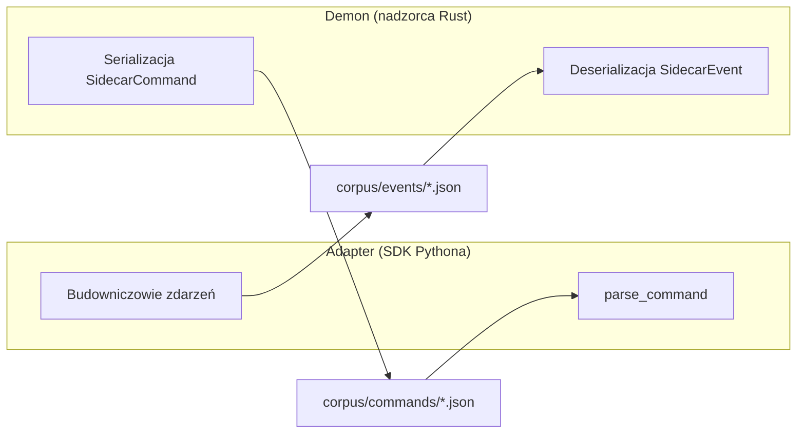

# zgodność

# Korpus zgodności protokołu sidecar

## Cel

Protokół kanału sidecar posiada dwie niezależne implementacje — nadzorcę w Rust oraz SDK w Pythonie — które muszą być zgodne co do formatu na kablu na poziomie poszczególnych pól. Historycznie każda implementacja testowana była względem własnych ręcznie tworzonych fixturek, co oznaczało, że zmiana łamiąca zgodność (zmiana nazwy pola, rozjazd typów, usunięcie parametru) mogła przejść obu suitem testowym i ujawnić się dopiero w środowisku produkcyjnym.

Ten moduł rozwiązuje ten problem, dostarczając **jeden współdzielony korpus kanonicznych ramek na kablu**. Obie implementacje sprawdzają się względem tych samych plików JSON, więc każdy rozjazd jest wyłapywany w czasie testów, niezależnie od tego, która strona go wprowadziła.

Korpus to czyste dane. W tym module nie ma kodu wykonywalnego — jest on konsumowany przez suity testowe w obu codebase'ach:

| Konsument | Plik testowy | Rola |
|----------|-----------|------|
| Nadzorca Rust | `crates/librefang-channels/tests/sidecar_protocol_conformance.rs` | Parsuje komendy z korpusu, serializuje zdarzenia z korpusu |
| SDK Pythona | `sdk/python/tests/test_sidecar_conformance.py` | Serializuje zdarzenia z korpusu, parsuje komendy z korpusu |

## Jak to działa

### Kierunkowość

Każda ramka przepływa w jednym kierunku. Korpus koduje to za pomocą struktury katalogów, a każda suite testowa waliduje ramki z własnej perspektywy:

**Zdarzenia** (`events/`) przepływają adapter → demon. SDK Pythona je *produkuje* (sprawdzając, czy jego zserializowane wyjście jest zgodne z korpusem); strona Rusta je *konsumuje* (sprawdzając, czy potrafi zdeserializować korpus do oczekiwanego `SidecarEvent`).

**Komendy** (`commands/`) przepływają demon → adapter. Strona Rusta je *produkuje* (sprawdzając, czy serializacja `SidecarCommand` jest zgodna z korpusem); SDK Pythona je *konsumuje* (sprawdzając, czy `parse_command` zwraca oczekiwaną strukturę).

### Kontrakt równości

Zgodność to **strukturalna równość wartości JSON**, a nie surowa równość bajtów. Dwa zgodne kodery JSON mogą legitymowanie różnić się kolejnością kluczy, białymi znakami i escapowaniem znaków nie-ASCII. Ustawienie na bajtach testowałoby koder, a nie protokół. Suity testowe parsują zarówno plik korpusu, jak i wyjście implementacji, a następnie rekursywnie porównują wynikowe wartości JSON — te same klucze, te same wartości, te same typy.

Pliki korpusu są pretty-printowane wyłącznie w celu czytelności dla człowieka podczas przeglądu.

## Katalog ramek

### Zdarzenia (adapter → demon)

| Ramka | Metoda | Opis |
|-------|--------|------|
| `ready_minimal` | `ready` | Golędzki formularz dziedzictwa `{"method":"ready"}` bez parametrów. SDK Pythona nigdy go nie emituje — jego budowniczy `ready()` zawsze zapisuje pełne parametry. Istnieje po to, aby ustabilizować akceptację wstecznie kompatybilną przez konsumenta Rusta dla formatu sprzed capabilities. Suite producenta po stronie Pythona dokumentuje go i pomija. |
| `ready_full` | `ready` | Pełne powitanie z capabilities (`typing`, `reaction`, `interactive`, `thread`, `streaming`), `account_id`, `suppress_error_responses`, `notification_recipients`, `header_rules` oraz `protocol_version: 1`. |
| `message_minimal` | `message` | Minimalna wiadomość przychodząca: `user_id`, `user_name`, `text`. |
| `message_text` | `message` | Pełna wiadomość przychodząca z `content` (typowany enum `{"Text": "hello"}`), `text`, `channel_id` oraz `platform`. |
| `typing` | `typing` | Wskaźnik pisania użytkownika: `user_id`, `user_name`, `is_typing`. |
| `qr_ready` | `qr_ready` | Opublikowany kod logowania QR: `qr_code` (surowy URI), `qr_url`, `message`, `expires_at` (ISO 8601). |
| `qr_status` | `qr_status` | Zmiana stanu logowania QR: `status` (np. `"confirmed"`), `message`. |
| `error` | `error` | Zgłoszony przez adapter błąd: `message`. |

### Komendy (demon → adapter)

| Ramka | Metoda | Opis |
|-------|--------|------|
| `ready_ack` | `ready_ack` | Golędzkie potwierdzenie, że demon odebrał zdarzenie `ready` od adaptera. Brak parametrów. |
| `heartbeat` | `heartbeat` | Ping keepalive. Brak parametrów. |
| `shutdown` | `shutdown` | Sygnał grzecznego wyłączenia. Brak parametrów. |
| `send_minimal` | `send` | Wiadomość wychodząca wyłącznie z wymaganymi polami: `channel_id`, `text`, `user` (`platform_id`, `display_name`, `librefang_user: null`). |
| `send_full` | `send` | Pełna wiadomość wychodząca dodająca `content` (typowany enum), `thread_id` oraz wypełniony obiekt `user`. |
| `typing` | `typing` | Wskaźnik pisania na poziomie kanału: `channel_id`. |
| `reaction` | `reaction` | Reakcja emoji: `channel_id`, `message_id`, `reaction`. |
| `interactive` | `interactive` | Karta wiadomości interaktywnej: `channel_id` + `message` zawierający `text` oraz dwuwymiarową tablicę wierszy przycisków. Każdy przycisk posiada `label`, `action` oraz opcjonalny `url`. |
| `stream_start` | `stream_start` | Rozpoczęcie odpowiedzi strumieniowej: `channel_id`, `stream_id`. |
| `stream_start_threaded` | `stream_start` | Jak wyżej, z dodanym `thread_id` dla strumieni w zakresie wątku. |
| `stream_delta` | `stream_delta` | Dopisanie tekstu do aktywnego strumienia: `stream_id`, `text`. |
| `stream_end` | `stream_end` | Zamknięcie strumienia: `stream_id`. |

## Kluczowe decyzje projektowe

**Korpus to kontrakt.** Nie ma osobnego pliku schematu ani IDL. Same ramki JSON są specyfikacją. Oznacza to, że asercje testowe i specyfikacja nie mogą się rozjechać — są tym samym artefaktem.

**Warianty minimalny i pełny.** Dla wiadomości z opcjonalnymi polami (`send`, `ready`, `stream_start`), korpus zawiera zarówno ramkę minimalną, jak i pełną. To ustabilizuje ścieżkę wyłącznie z wymaganymi polami oraz ścieżkę ze wszystkimi wypełnionymi polami, wyłapując regresje, w których pole opcjonalne staje się wymagane lub odwrotnie.

**Ramki dziedzictwa są zachowywane, nie usuwane.** `ready_minimal.json` dokumentuje format na kablu sprzed capabilities. Jest utrzymywany, aby wsteczna kompatybilność była stale weryfikowana, a nie tylko udokumentowana.

## Modyfikacja korpusu

Zmiana pliku korpusu to zmiana protokołu. Postępuj zgodnie z tą procedurą:

1. **Dodaj lub zmodyfikuj ramkę `.json`** w `corpus/events/` lub `corpus/commands/`.
2. **Rozszerz obie suity testowe zgodności** — Rust (`sidecar_protocol_conformance.rs`) oraz Pythona (`test_sidecar_conformance.py`). Wpis w korpusie bez asercji po obu stronach nie jest zgodnością; jest niezweryfikowanym plikiem.
3. **Oceń kompatybilność.** Jeśli zmiana nie jest addytywnie-opcjonalna (tj. konsument, który nie rozumie nowego pola, ulegnie awarii), podbij wersję protokołu i zaktualizuj `docs/architecture/sidecar-protocol.md`. Zmiany addytywnie-opcjonalne (nowe pole opcjonalne, nowy opcjonalny rodzaj ramki) nie wymagają podbicia wersji.

Polityka wersjonowania protokołu, status zamrożonych vs tymczasowych ramek oraz semantyka `protocol_version` są zdefiniowane w `docs/architecture/sidecar-protocol.md`.
