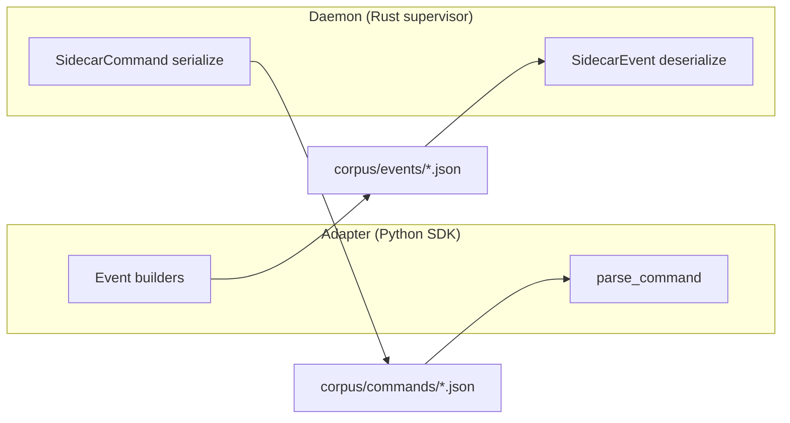

# conformance

# Sidecar Protocol Conformance Corpus

## Purpose

The sidecar channel protocol has two independent implementations—a Rust supervisor and a Python SDK—that must agree on wire format down to the field level. Historically, each implementation tested against its own hand-written fixtures, which meant a breaking change (field rename, type drift, dropped param) could pass both test suites and only surface in production.

This module solves that by providing a **single shared corpus of canonical wire frames**. Both implementations assert against these same JSON files, so any divergence is caught at test time regardless of which side introduced it.

The corpus is pure data. There is no executable code in this module—it is consumed by test suites in both codebases:

| Consumer | Test file | Role |
|----------|-----------|------|
| Rust supervisor | `crates/librefang-channels/tests/sidecar_protocol_conformance.rs` | Parses corpus commands, serializes corpus events |
| Python SDK | `sdk/python/tests/test_sidecar_conformance.py` | Serializes corpus events, parses corpus commands |

## How It Works

### Directionality

Every frame flows in one direction. The corpus encodes this through its directory structure, and each test suite validates frames from its own perspective:

**Events** (`events/`) flow adapter → daemon. The Python SDK *produces* them (asserting its serialized output matches the corpus); the Rust side *consumes* them (asserting it can deserialize the corpus into the expected `SidecarEvent`).

**Commands** (`commands/`) flow daemon → adapter. The Rust side *produces* them (asserting `SidecarCommand` serialization matches the corpus); the Python SDK *consumes* them (asserting `parse_command` yields the expected structure).

### Equality Contract

Conformance is **structural JSON value equality**, not raw byte equality. Two conformant JSON encoders legitimately differ in key ordering, whitespace, and non-ASCII escaping. Pinning bytes would test the encoder, not the protocol. The test suites parse both the corpus file and the implementation's output, then compare the resulting JSON values recursively—same keys, same values, same types.

The corpus files are pretty-printed purely for human readability during review.

## Frame Catalog

### Events (adapter → daemon)

| Frame | Method | Description |
|-------|--------|-------------|
| `ready_minimal` | `ready` | Bare legacy form `{"method":"ready"}` with no params. The Python SDK never emits this—its `ready()` builder always writes full params. It exists to pin the Rust consumer's backward-compatible acceptance of the pre-capability format. The Python producer suite documents-and-skips it. |
| `ready_full` | `ready` | Full handshake with capabilities (`typing`, `reaction`, `interactive`, `thread`, `streaming`), `account_id`, `suppress_error_responses`, `notification_recipients`, `header_rules`, and `protocol_version: 1`. |
| `message_minimal` | `message` | Minimal inbound message: `user_id`, `user_name`, `text`. |
| `message_text` | `message` | Full inbound message with `content` (typed enum `{"Text": "hello"}`), `text`, `channel_id`, and `platform`. |
| `typing` | `typing` | User typing indicator: `user_id`, `user_name`, `is_typing`. |
| `qr_ready` | `qr_ready` | QR login code published: `qr_code` (raw URI), `qr_url`, `message`, `expires_at` (ISO 8601). |
| `qr_status` | `qr_status` | QR login state change: `status` (e.g. `"confirmed"`), `message`. |
| `error` | `error` | Adapter-reported error: `message`. |

### Commands (daemon → adapter)

| Frame | Method | Description |
|-------|--------|-------------|
| `ready_ack` | `ready_ack` | Bare acknowledgment that the daemon received the adapter's `ready` event. No params. |
| `heartbeat` | `heartbeat` | Keepalive ping. No params. |
| `shutdown` | `shutdown` | Graceful shutdown signal. No params. |
| `send_minimal` | `send` | Outbound message with required fields only: `channel_id`, `text`, `user` (`platform_id`, `display_name`, `librefang_user: null`). |
| `send_full` | `send` | Full outbound message adding `content` (typed enum), `thread_id`, and a populated `user` object. |
| `typing` | `typing` | Channel-level typing indicator: `channel_id`. |
| `reaction` | `reaction` | Emoji reaction: `channel_id`, `message_id`, `reaction`. |
| `interactive` | `interactive` | Interactive message card: `channel_id` + `message` containing `text` and a 2D array of button rows. Each button has `label`, `action`, and optional `url`. |
| `stream_start` | `stream_start` | Begin a streaming response: `channel_id`, `stream_id`. |
| `stream_start_threaded` | `stream_start` | Same as above with `thread_id` for thread-scoped streams. |
| `stream_delta` | `stream_delta` | Append text to an active stream: `stream_id`, `text`. |
| `stream_end` | `stream_end` | Close a stream: `stream_id`. |

## Key Design Decisions

**The corpus is the contract.** There is no separate schema file or IDL. The JSON frames themselves are the specification. This means the test assertions and the spec cannot drift apart—they are the same artifact.

**Minimal and full variants.** For messages with optional fields (`send`, `ready`, `stream_start`), the corpus includes both a minimal and a full frame. This pins both the required-fields-only path and the all-fields-populated path, catching regressions where an optional field becomes required or vice versa.

**Legacy frames are retained, not deleted.** `ready_minimal.json` documents the pre-capability wire format. It is kept so backward compatibility is continuously verified, not just documented.

## Modifying the Corpus

Changing a corpus file is changing the protocol. Follow this procedure:

1. **Add or modify the `.json` frame** in `corpus/events/` or `corpus/commands/`.
2. **Extend both conformance test suites**—Rust (`sidecar_protocol_conformance.rs`) and Python (`test_sidecar_conformance.py`). A corpus entry without assertions on both sides is not conformance; it is an unverified file.
3. **Assess compatibility.** If the change is not additive-optional (i.e., a consumer that does not understand the new field will break), bump the protocol version and update `docs/architecture/sidecar-protocol.md`. Additive-optional changes (new optional field, new optional frame kind) do not require a version bump.

The protocol versioning policy, frozen-vs-provisional frame status, and `protocol_version` semantics are defined in `docs/architecture/sidecar-protocol.md`.