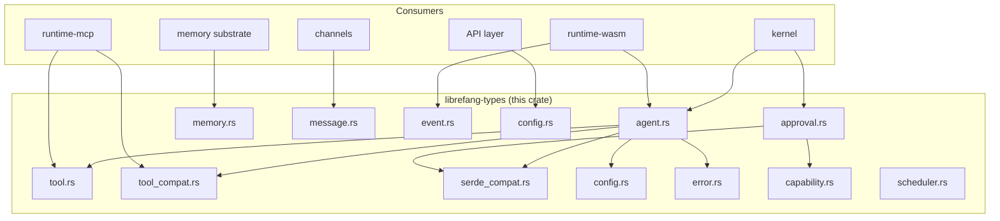
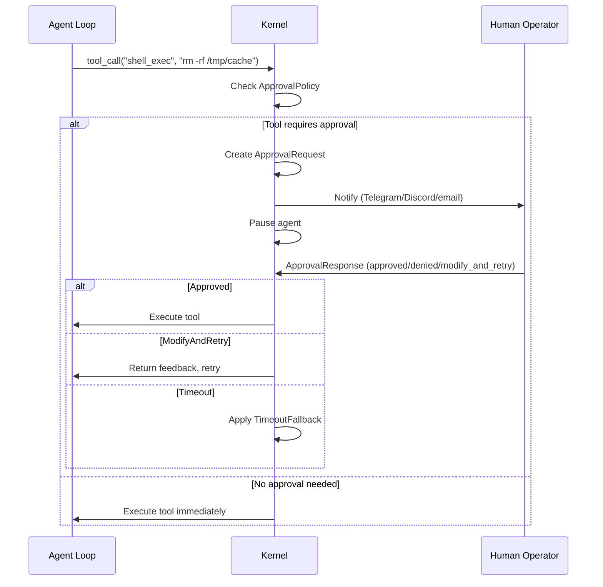

# Core Types & Configuration

# Core Types & Configuration (`librefang-types`)

## Purpose

`librefang-types` is the shared vocabulary crate for the LibreFang Agent Operating System. It defines every data structure that crosses a crate boundary — between the kernel, runtime, memory substrate, channel adapters, wire protocol, and API layer. The crate contains **no business logic**: it is purely types, serialization helpers, and validation.

Every other crate in the workspace depends on `librefang-types`, and nothing depends on it in return. Changing a struct here is a workspace-wide event.

## Architecture



## Module Layout

| Module | Domain | Key Types |
|--------|--------|-----------|
| `agent` | Agent identity, manifests, scheduling | `AgentId`, `SessionId`, `AgentManifest`, `ToolProfile`, `AgentMode` |
| `approval` | Tool authorization flow | `ApprovalRequest`, `ApprovalResponse`, `ApprovalPolicy`, `ApprovalDecision` |
| `capability` | Capability matching / glob logic | `glob_matches` (used by approval channel rules) |
| `config` | Global daemon configuration | `ExecPolicy`, `ThinkingConfig`, `ResponseFormat`, `ContextInjection` |
| `error` | Unified error enum | `LibreFangError` |
| `event` | Internal event bus types | `AgentMessage`, hook payloads |
| `goal` | Goal tracking | `GoalId` |
| `i18n` | Internationalization | `t()`, `t_args()` |
| `manifest_signing` | Manifest integrity / signing | Envelope verification |
| `media` | Image/TTS generation | `ImageGenRequest`, `MediaTtsRequest` |
| `memory` | Memory substrate types | `MemoryKey`, session structures |
| `message` | LLM message types | `Message`, `TokenUsage`, `text_content()` |
| `model_catalog` | Model metadata registry | Provider capability flags (`supports_tools`) |
| `registry_schema` | Agent registry on-disk format | Registry entries |
| `scheduler` | Job scheduling types | Cron jobs, webhook validation |
| `serde_compat` | Lenient deserialization helpers | `vec_lenient`, `map_lenient`, `exec_policy_lenient` |
| `subagent` | Sub-agent orchestration | `SubagentContext`, preamble formatting |
| `taint` | PII / security scanning | `payload_contains_pii`, `scan_mcp_arguments_for_taint` |
| `tool` | Tool definitions | `ToolDefinition`, `normalize_schema_for_provider` |
| `tool_compat` | Legacy tool name mapping | `map_tool_name`, `normalize_tool_name` |
| `tool_policy` | Tool execution policy | Per-tool allow/deny rules |
| `webhook` | Webhook payloads | `AgentHookPayload` |
| `workflow_template` | Workflow/template types | Reusable agent blueprints |

---

## Identity System

### `AgentId` — Deterministic and Random

`AgentId` wraps a `Uuid` and provides three construction strategies:

| Constructor | UUID Version | Use Case |
|-------------|-------------|----------|
| `AgentId::new()` | v4 (random) | One-off agents, testing |
| `AgentId::from_name(name)` | v5 (SHA-1) | Named agents that must survive restarts |
| `AgentId::from_hand_id(hand_id)` | v5 | Multi-agent hand instances |
| `AgentId::from_hand_agent(hand, role, instance_id)` | v5 | Specific role within a hand |

All v5 derivation uses a single fixed namespace UUID with typed prefixes (`agent:`, `hand:`, bare `hand_id`) to prevent collisions between different entity kinds sharing the same name.

**Backward compatibility note**: `from_hand_agent` with `instance_id: None` produces the legacy format `"{hand_id}:{role}"` so existing single-instance hands retain their original IDs (no orphaned cron jobs or memory keys).

### `SessionId` — Channel-Derived

```rust
let sid = SessionId::for_channel(agent_id, "telegram");
```

`SessionId::for_channel` uses UUID v5 with a dedicated namespace so the `(agent_id, channel)` pair always maps to the same session across process restarts. This is how the kernel reconnects a Telegram user to their existing conversation after a reboot.

The namespace is intentionally not an RFC 4122 well-known namespace (DNS/URL/OID/X500) to avoid collisions with other UUID v5 consumers.

### `SessionMode`

Controls session reuse for automated (non-channel) invocations:

- **`Persistent`** (default) — background ticks, triggers, and `agent_send` reuse the agent's long-lived session.
- **`New`** — each invocation gets a fresh session.

---

## Agent Manifest (`AgentManifest`)

`AgentManifest` is the central configuration object for every agent. It's loaded from TOML on disk (or generated by the dashboard wizard) and drives the kernel's spawn logic.

### Core Fields

```toml
name = "research-agent"
version = "1.0.0"
description = "Deep research with web search"
author = "ops"
module = "builtin:chat"
schedule = "reactive"          # or { periodic = { cron = "0 9 * * *" } }
session_mode = "persistent"    # or "new"
enabled = true
```

### Model Configuration (`ModelConfig`)

```toml
[model]
provider = "anthropic"
model = "claude-sonnet-4-20250514"
max_tokens = 4096
temperature = 0.7
system_prompt = """
You are a research assistant.
Use web_search to find current information.
"""
# Optional: provider-specific extensions flattened into the API body
enable_memory = true
```

The `model` field accepts an alias `name` for backward compatibility with older TOML configs. Provider-specific extension parameters go in `extra_params` (via `#[serde(flatten)]`), which are merged directly into the API request body. If a key conflicts with a standard field, `extra_params` wins.

### Fallback Model Chain

```toml
[[fallback_models]]
provider = "groq"
model = "llama-3.3-70b-versatile"
api_key_env = "GROQ_API_KEY"

[[fallback_models]]
provider = "ollama"
model = "gemma3:27b"
base_url = "http://localhost:11434"
```

The kernel tries the primary model first, then each fallback in order on failure.

### Tool Configuration

Three mechanisms control tool availability, evaluated in this order:

1. **`tools_disabled = true`** — hard kill switch, overrides everything.
2. **`profile`** — named preset (`Minimal`, `Coding`, `Research`, `Messaging`, `Automation`, `Full`, `Custom`) that expands to a tool list and derived capabilities.
3. **`tool_allowlist` / `tool_blocklist`** — fine-grained allow/deny on top of the profile.

#### Tool Profiles

| Profile | Tools |
|---------|-------|
| `Minimal` | `file_read`, `file_list` |
| `Coding` | `file_read`, `file_write`, `file_list`, `shell_exec`, `web_fetch` |
| `Research` | `web_fetch`, `web_search`, `file_read`, `file_write` |
| `Messaging` | `agent_send`, `agent_list`, `channel_send`, `memory_store`, `memory_list`, `memory_recall` |
| `Automation` | All 12 tools from Coding + Messaging |
| `Full` / `Custom` | `"*"` (all tools) |

`ToolProfile::implied_capabilities()` derives a `ManifestCapabilities` struct from the tool list — e.g., `Coding` implies `network = ["*"]` and `shell = ["*"]` but not `agent_spawn`.

### `AgentMode` — Runtime Permission Filter

`AgentMode` is set on `AgentEntry` at runtime (not in the manifest) and filters the tool list before each agent loop iteration:

- **`Observe`** — no tools at all.
- **`Assist`** — read-only tools only: `file_read`, `file_list`, `memory_list`, `memory_recall`, `web_fetch`, `web_search`, `agent_list`.
- **`Full`** (default) — all granted tools.

### Resource Quotas

```toml
[resources]
max_memory_bytes = 268_435_456    # 256 MB
max_cpu_time_ms = 30_000          # 30 seconds
max_tool_calls_per_minute = 60
max_llm_tokens_per_hour = 100_000  # None = inherit global, Some(0) = unlimited
max_cost_per_hour_usd = 0.0        # 0.0 = unlimited
max_cost_per_day_usd = 5.0
max_cost_per_month_usd = 50.0
```

`effective_token_limit()` normalizes the `Option<u64>` to a plain `u64`: both `None` and `Some(0)` yield `0` (unlimited), which callers check before enforcement.

### Autonomous Configuration

For 24/7 agents:

```toml
[autonomous]
quiet_hours = "0 22 * * *"      # cron expression
max_iterations = 50
max_restarts = 10
heartbeat_interval_secs = 30
heartbeat_timeout_secs = 90      # optional per-agent override
heartbeat_keep_recent = 5        # optional: how many NO_REPLY turns to keep
heartbeat_channel = "telegram"   # where to send heartbeat alerts
```

### Scheduling (`ScheduleMode`)

```toml
# Reactive (default) — wake on message/event
schedule = "reactive"

# Periodic — wake on cron
schedule = { periodic = { cron = "0 9 * * mon-fri" } }

# Proactive — wake on condition thresholds
schedule = { proactive = { conditions = ["queue_depth > 10"] } }

# Continuous — persistent loop
schedule = { continuous = { check_interval_secs = 300 } }
```

### Context and Thinking Overrides

Per-agent overrides that fall back to global config:

```toml
thinking = { budget_tokens = 5000, stream_thinking = true }

[[context_injection]]
position = "after_system"
content = "Current time: {{now}}"
```

### Dream Consolidation

```toml
auto_dream_enabled = true
auto_dream_min_hours = 4.0       # override global [auto_dream] min_hours
auto_dream_min_sessions = 10     # override global min_sessions
```

Opt-in per agent because consolidation costs tokens. Requires global `[auto_dream] enabled = true`.

---

## Approval System

### Flow



### `ApprovalPolicy`

Controls which operations require human authorization:

```toml
[approval]
# Boolean shorthand: true = default set, false = nothing
# Or a list: ["shell_exec", "file_delete"]
require_approval = true

timeout_secs = 60                  # 10..300
auto_approve_autonomous = false    # bypass for autonomous agents
auto_approve = false               # if true, clears require_approval at boot
timeout_fallback = "deny"          # "deny" | "skip" | { escalate = { extra_timeout_secs = 120 } }

# Trusted senders bypass approval entirely
trusted_senders = ["admin_123", "ops_456"]

# Per-channel tool rules (evaluated in order, first match wins)
[[approval.channel_rules]]
channel = "telegram"
denied_tools = ["shell_exec"]      # deny-wins over allow

[[approval.channel_rules]]
channel = "discord"
allowed_tools = ["file_read", "web_fetch"]

# Second-factor authentication
second_factor = "totp"             # "none" | "totp" | "login" | "both"
totp_issuer = "LibreFang"
totp_grace_period_secs = 300       # skip re-verification within window
totp_tools = ["shell_exec"]        # empty = all approval tools need TOTP
```

#### Default Approval Set

```rust
["shell_exec", "file_write", "file_delete", "apply_patch", "skill_evolve_*"]
```

The `skill_evolve_*` glob ensures that skill mutation tools (which write to `~/.librefang/skills/`) are gated at the same level as direct filesystem writes.

### `ApprovalDecision`

Five outcomes, with custom serialization:

| Decision | Serialized As | Terminal? |
|----------|---------------|-----------|
| `Approved` | `"approved"` | Yes |
| `Denied` | `"denied"` | Yes |
| `TimedOut` | `"timed_out"` | Yes |
| `Skipped` | `"skipped"` | Yes |
| `ModifyAndRetry` | `{"type":"modify_and_retry","feedback":"..."}` | No — agent retries |

Simple variants serialize as plain strings for backward compatibility with existing API clients. `ModifyAndRetry` is an object because it carries feedback data.

### `ChannelToolRule`

Per-channel authorization with wildcard glob support:

```rust
let rule = ChannelToolRule {
    channel: "telegram".into(),
    allowed_tools: vec!["file_*".into()],     // glob pattern
    denied_tools: vec!["file_delete".into()],  // deny-wins
};
rule.check_tool("file_read");   // Some(true)
rule.check_tool("file_delete"); // Some(false) — denied despite matching allow glob
rule.check_tool("shell_exec");  // Some(false) — not in allow list
```

### `TimeoutFallback`

When no human responds within `timeout_secs`:

- **`Deny`** (default) — treat as `Denied`.
- **`Skip`** — agent continues without executing the tool.
- **`Escalate`** — re-notify with additional timeout. `escalation_count` tracks iterations (max 3).

### Risk Levels

Each `ApprovalRequest` carries a `RiskLevel` with a display emoji:

| Level | Emoji | Hex |
|-------|-------|-----|
| Low | ℹ️ | `\u{2139}\u{fe0f}` |
| Medium | ⚠️ | `\u{26a0}\u{fe0f}` |
| High | 🚨 | `\u{1f6a8}` |
| Critical | ☠️ | `\u{2620}\u{fe0f}` |

---

## Agent Identity and Registry

### `AgentEntry`

The kernel's live registry entry for a spawned agent:

```rust
pub struct AgentEntry {
    pub id: AgentId,
    pub name: String,
    pub manifest: AgentManifest,
    pub state: AgentState,         // Created | Running | Suspended | Terminated | Crashed
    pub mode: AgentMode,           // Observe | Assist | Full
    pub session_id: SessionId,
    pub parent: Option<AgentId>,   // spawned-by relationship
    pub children: Vec<AgentId>,
    pub identity: AgentIdentity,   // emoji, color, archetype, vibe
    pub onboarding_completed: bool,
    pub is_hand: bool,             // set by hand spawner, survives restart
    pub source_toml_path: Option<PathBuf>,
    // ...
}
```

### `AgentIdentity`

Visual and personality metadata for the dashboard:

```toml
[identity]
emoji = "🔥"
color = "#FF5C00"
archetype = "devops"
vibe = "technical"
greeting_style = "brief"
```

---

## Prompt Experiments (A/B Testing)

The types crate defines the data model for prompt versioning and A/B experiments:

- **`PromptVersion`** — versioned system prompt with content hash and variable tracking.
- **`PromptExperiment`** — an experiment with traffic split, success criteria, and variants.
- **`ExperimentVariant`** — a named variant pointing to a prompt version.
- **`ExperimentStatus`** — `Draft`, `Running`, `Paused`, `Completed`.
- **`SuccessCriteria`** — configurable pass conditions (`require_user_helpful`, `require_no_tool_errors`, custom score thresholds).

---

## Utility Functions

### `truncate_str`

```rust
pub fn truncate_str(s: &str, max_bytes: usize) -> &str
```

Safely truncates a string to at most `max_bytes`, never splitting a UTF-8 character. Steps backward from the cut point to the nearest character boundary. This exists because LLM output can contain multi-byte characters (em dashes, CJK, emoji) and a naive byte-slice would panic.

**Historical note**: This function was introduced after production panics in `kernel.rs` and `session.rs` caused by em dashes (U+2014, 3 bytes) appearing at exactly the truncation boundary (issue #104).

### `serde_compat` Module

Lenient deserializers that prevent config loading from failing on common mistakes:

- `vec_lenient` — treats `null` as empty vec, accepts single values as one-element vecs.
- `map_lenient` — treats `null` as empty map.
- `exec_policy_lenient` — accepts string shorthands (`"allow"`, `"deny"`, `"full"`, `"allowlist"`) or full table for `ExecPolicy`.

These are applied via `#[serde(deserialize_with = "...")]` on manifest fields so that minor config errors don't prevent agent loading.

---

## Validation

Both `ApprovalRequest` and `ApprovalPolicy` expose a `validate()` method that checks:

- Tool name format: alphanumeric + underscores only (plus `*` for wildcards), max 64 chars, single wildcard per name.
- Timeout bounds: 10–300 seconds.
- List size limits: max 100 trusted senders, 50 channel rules, 50 tools per rule.
- TOTP grace period: max 3600 seconds.
- Required non-empty fields.

Validation is called at config load time and when creating approval requests, before they enter the workflow.

---

## Web Search Augmentation

`WebSearchAugmentationMode` controls automatic web search injection before LLM calls:

| Mode | Behavior |
|------|----------|
| `Off` | Disabled |
| `Auto` (default) | Search only when the model catalog reports `supports_tools == false` |
| `Always` | Search before every call |

This enables models without tool/function calling support (e.g., Ollama Gemma) to benefit from web search without requiring the `web_search` tool.

---

## Integration Points

### Consumed by the kernel (`src/`)
The kernel reads `AgentManifest` from TOML, constructs `AgentEntry` at spawn time, and uses `ApprovalPolicy` to gate dangerous tool calls. `SessionId::for_channel` reconnects users to existing sessions after restart.

### Consumed by runtimes (`librefang-runtime-wasm`, `librefang-runtime-mcp`)
WASM host functions check `capability_matches()` from the `capability` module. The MCP runtime registers tools using `ToolDefinition` and scans arguments with `scan_mcp_arguments_for_taint()`.

### Consumed by channels (`librefang-channels`)
Channel adapters use `Message` and `TokenUsage` types. The `i18n` module's `t()` and `t_args()` functions provide localized strings for channel-facing messages.

### Consumed by memory (`librefang-memory`)
The memory substrate uses `MemoryKey`, session structures, and `extract_text_content()` from the `message` module for session persistence.

### Consumed by skills (`librefang-skills`)
The skills system uses `map_tool_name()` and `is_known_librefang_tool()` from `tool_compat` for backward compatibility with legacy skill definitions.