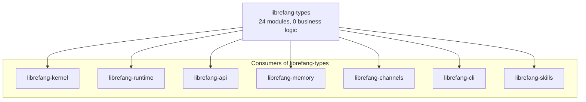
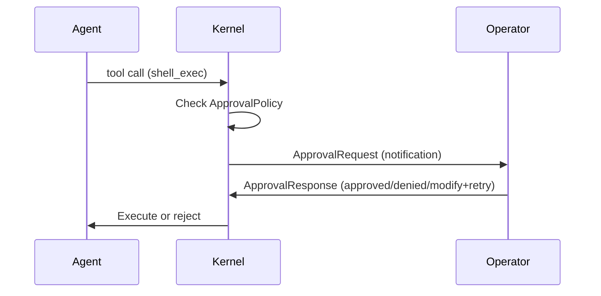

# Core Types & Configuration

# Core Types & Configuration (`librefang-types`)

## Purpose

`librefang-types` is the shared type definitions crate for the LibreFang Agent Operating System. It contains **no business logic** — only data structures, serialization helpers, and validation methods that every other crate in the workspace depends on. If a struct or enum appears in more than one crate, it lives here.



## Module Layout

| Module | Responsibility |
|--------|---------------|
| `agent` | Agent identity, manifests, lifecycle state, scheduling, resource quotas, model config, experiments |
| `approval` | Execution approval workflow — requests, decisions, policies, TOTP, channel rules |
| `capability` | Capability matching and glob pattern logic |
| `comms` | Inter-agent communication types |
| `config` | Global configuration structures (`ThinkingConfig`, `ResponseFormat`, `ExecPolicy`, `ContextInjection`) |
| `error` | Unified `LibreFangError` enum |
| `event` | Event types for the agent event loop |
| `goal` | Goal tracking types |
| `i18n` | Internationalization message lookup |
| `manifest_signing` | Cryptographic manifest signing and verification |
| `media` | Media/attachment types |
| `memory` | Memory substrate types (scopes, extraction, embeddings) |
| `message` | LLM message types (`TokenUsage`, content blocks) |
| `model_catalog` | Model capability registry |
| `registry_schema` | Agent registry serialization schema |
| `scheduler` | Job scheduling types (cron, intervals, delivery) |
| `serde_compat` | Lenient deserialization helpers (fallback on malformed input) |
| `subagent` | Subagent spawning and context types |
| `taint` | PII detection and taint tracking for tool I/O |
| `tool` | Tool definitions, decision traces, schema normalization |
| `tool_compat` | Cross-platform tool name mapping (OpenClaw compatibility) |
| `tool_policy` | Tool execution policy rules |
| `webhook` | Outbound webhook configuration |
| `workflow_template` | Reusable workflow definitions |

The compile-time version constant is exported at the crate root:

```rust
pub const VERSION: &str = env!("CARGO_PKG_VERSION");
```

---

## Agent Identity & Deterministic IDs

The crate provides three core identity types, each wrapping a `Uuid`:

### `AgentId`

```rust
let random = AgentId::new();                    // UUID v4
let named  = AgentId::from_name("brand-guardian"); // UUID v5, deterministic
let hand   = AgentId::from_hand_id("browser");     // UUID v5, deterministic
```

Deterministic IDs use UUID v5 (SHA-1) with a fixed namespace so that the **same logical name always produces the same ID across daemon restarts**. This preserves session history, cron job associations, and memory key ownership.

For multi-agent hands (where a single hand definition spawns multiple role-specific agents), use `from_hand_agent`:

```rust
// Legacy single-instance: "hand_id:role"
let legacy = AgentId::from_hand_agent("researcher", "lead", None);

// Multi-instance: "hand_id:role:instance_id"
let instance = AgentId::from_hand_agent("researcher", "lead", Some(instance_uuid));
```

The internal namespace uses typed prefixes (`agent:`, `hand:`) to prevent collisions between agents and hands that share the same name.

### `SessionId`

```rust
let random = SessionId::new();
let channel = SessionId::for_channel(agent_id, "telegram");
```

`SessionId::for_channel` derives a deterministic UUID v5 from the `(agent_id, channel)` pair. The channel name is lowercased before hashing, so `"Telegram"` and `"telegram"` resolve to the same session. Each channel gets its own session per agent, and cron/trigger sessions are distinct from channel sessions.

### `UserId`

Simple UUID v4 wrapper with standard `Display`/`FromStr` implementations.

---

## Agent Manifest (`AgentManifest`)

The `AgentManifest` is the central configuration structure for every agent. It's typically loaded from TOML files and deserialized with lenient defaults so that agents only need to specify the fields they care about.

### Key Sections

**Model configuration** — `ModelConfig` specifies the LLM provider, model identifier, temperature, max tokens, and system prompt. The `model` field accepts a `name` alias for TOML backward compatibility. Provider-specific extension parameters (e.g., Qwen's `enable_memory`) go in `extra_params`, which is flattened into the API request body via `#[serde(flatten)]`.

**Fallback chain** — `fallback_models: Vec<FallbackModel>` defines an ordered list of alternative providers/models to try if the primary fails.

**Tool configuration** — Controlled by three layers:
1. `profile: Option<ToolProfile>` — Named presets (`Minimal`, `Coding`, `Research`, `Messaging`, `Automation`, `Full`) that expand to tool lists and derived capabilities.
2. `tool_allowlist` / `tool_blocklist` — Fine-grained per-tool filtering.
3. `tools_disabled: bool` — Emergency kill switch.

**Resource quotas** — `ResourceQuota` enforces memory, CPU time, tool call rate, token consumption, and cost limits (hourly/daily/monthly). Token limits follow a convention: `None` inherits the global default, `Some(0)` means unlimited, and `Some(n)` enforces `n` tokens per hour. Use `effective_token_limit()` to resolve this to a plain `u64`.

**Scheduling** — `ScheduleMode` controls when an agent wakes up:
- `Reactive` — on message/event arrival (default)
- `Periodic { cron }` — cron schedule
- `Proactive { conditions }` — condition monitoring
- `Continuous { check_interval_secs }` — persistent loop

**Session behavior** — `SessionMode` controls whether automated invocations (cron ticks, triggers, `agent_send`) reuse the agent's persistent session (`Persistent`, default) or create a fresh one (`New`).

**Autonomous configuration** — `AutonomousConfig` provides guardrails for 24/7 agents: quiet hours (cron expression), max iterations per invocation, max restarts before permanent stop, heartbeat interval with optional timeout override, and heartbeat notification channel.

**Thinking configuration** — Per-agent `ThinkingConfig` (budget tokens, stream thinking) overrides the global `[thinking]` config when set.

**Web search augmentation** — `WebSearchAugmentationMode` automatically searches the web before LLM calls. `Auto` (default) only augments when the model catalog reports `supports_tools == false`, enabling models like Ollama Gemma4 that don't support function calling to benefit from web search.

**Auto-dream** — `auto_dream_enabled`, `auto_dream_min_hours`, and `auto_dream_min_sessions` control per-agent participation in background memory consolidation, with optional overrides for the global time/session gates.

### TOML Deserialization

The crate uses lenient deserializers (`crate::serde_compat`) for all list and map fields. This means:
- Missing fields default to empty collections rather than causing parse errors.
- Malformed entries in lists/maps are silently dropped instead of failing the entire manifest load.
- The `exec_policy` field accepts both string shorthands (`"allow"`, `"deny"`) and full table definitions.

Multi-line system prompts in TOML use triple-quoted strings:

```toml
[model]
system_prompt = """
You are a coding assistant.

Rules:
- Always use proper indentation
- Test your code
"""
```

---

## Agent Lifecycle & Modes

### `AgentState`

```rust
enum AgentState {
    Created,    // Spawned but not started
    Running,    // Actively processing
    Suspended,  // Paused, not processing
    Terminated, // Cannot be resumed
    Crashed,    // Awaiting recovery
}
```

### `AgentMode`

Permission-based operational mode that filters available tools:

| Mode | Behavior |
|------|----------|
| `Observe` | No tools available (read-only observation) |
| `Assist` | Only read-only tools: `file_read`, `file_list`, `memory_list`, `memory_recall`, `web_fetch`, `web_search`, `agent_list` |
| `Full` | All granted tools available (default) |

`AgentMode::filter_tools()` applies the filter at runtime based on the current mode.

---

## Tool Profiles

`ToolProfile` expands to both a tool name list and derived `ManifestCapabilities`:

```rust
let tools = ToolProfile::Coding.tools();
// → ["file_read", "file_write", "file_list", "shell_exec", "web_fetch"]

let caps = ToolProfile::Coding.implied_capabilities();
// → network: ["*"], shell: ["*"], agent_spawn: false, ...
```

Profile expansion derives capabilities by inspecting the tool list. For example, `Coding` includes `web_fetch` so `network` is set to `["*"]`. `Messaging` includes `agent_send` so `agent_spawn` is `true` and `agent_message` is `["*"]`.

---

## Approval System (`approval` module)

The approval system gates dangerous agent operations behind human review. When an agent attempts a tool in the `require_approval` list, the kernel creates an `ApprovalRequest`, pauses the agent, and notifies operators.

### Core Flow



### `ApprovalPolicy`

Configuration for the approval gate:

| Field | Default | Purpose |
|-------|---------|---------|
| `require_approval` | `["shell_exec", "file_write", "file_delete", "apply_patch", "skill_evolve_*"]` | Tools requiring human approval |
| `timeout_secs` | 60 | Auto-deny timeout (range: 10–300) |
| `auto_approve` | `false` | If true, clears the require list entirely |
| `auto_approve_autonomous` | `false` | Auto-approve when agent is in autonomous mode |
| `trusted_senders` | `[]` | User IDs that bypass approval |
| `channel_rules` | `[]` | Per-channel tool allow/deny rules |
| `timeout_fallback` | `Deny` | Behavior on timeout: `Deny`, `Skip`, or `Escalate` |
| `second_factor` | `None` | TOTP enforcement scope |
| `totp_tools` | `[]` | Tools requiring TOTP (empty = all gated tools) |

The `require_approval` field accepts a boolean shorthand in TOML:
- `require_approval = false` → empty list (no approval needed)
- `require_approval = true` → the default mutation set

Tool names support glob patterns with a single `*` wildcard (e.g., `"file_*"`, `"skill_evolve_*"`).

### `ApprovalDecision`

Five possible outcomes:

| Decision | Description |
|----------|-------------|
| `Approved` | Tool may execute |
| `Denied` | Tool is blocked, agent receives error |
| `TimedOut` | No response within timeout window |
| `ModifyAndRetry { feedback }` | Human requests modification, agent retries with feedback |
| `Skipped` | Timeout fallback: tool is skipped, agent continues |

`ModifyAndRetry` serializes as a JSON object `{"type": "modify_and_retry", "feedback": "..."}` while all other variants serialize as plain strings for backward compatibility.

### Channel Rules

`ChannelToolRule` provides per-channel authorization:

```toml
[[approval.channel_rules]]
channel = "telegram"
allowed_tools = ["file_read", "web_fetch"]
denied_tools = ["shell_exec"]
```

Evaluation is deny-wins: if a tool matches both allowed and denied patterns, it's denied. Patterns support single-`*` glob matching. Rules are evaluated in order; the first rule matching the request's channel wins.

### Second Factor (TOTP)

`SecondFactor` controls where TOTP verification is enforced:

- `None` — no TOTP (default)
- `Totp` — approvals only
- `Login` — dashboard login only
- `Both` — approvals and login

A grace period (`totp_grace_period_secs`, default 300s, max 3600s) allows subsequent approvals to skip TOTP re-verification within the window.

### Validation

Both `ApprovalRequest` and `ApprovalPolicy` expose `validate()` methods that check field bounds (name lengths, timeout ranges, list sizes) and return descriptive error messages. The kernel should call these before persisting or acting on the data.

---

## Utility Functions

### `truncate_str`

```rust
pub fn truncate_str(s: &str, max_bytes: usize) -> &str
```

Truncates a string to at most `max_bytes` without splitting a UTF-8 character boundary. This was introduced to fix production panics (issue #104) caused by slicing strings at mid-character byte offsets — particularly em dashes (`—`, 3 bytes) and emoji (4 bytes).

The function walks backward from `max_bytes` to the nearest char boundary, so truncation never produces invalid UTF-8 or mojibake.

---

## Serialization Compatibility (`serde_compat`)

The `serde_compat` module provides lenient deserializers used throughout the manifest and config types:

- `vec_lenient` — Deserializes sequences, silently dropping malformed entries instead of failing.
- `map_lenient` — Same for maps.
- `exec_policy_lenient` — Accepts string shorthands or full table definitions for `ExecPolicy`.

These ensure that a single malformed field in a TOML file doesn't prevent the entire agent from loading.