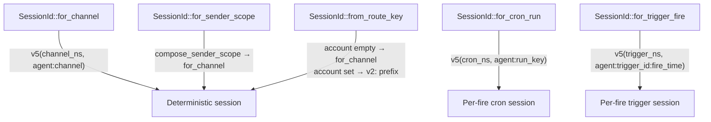

# Core Types & Configuration

# Core Types & Configuration — `librefang-types::agent`

## Purpose

This module defines every data type that describes **what an agent is, how it runs, and what it's allowed to do**. It is the shared vocabulary between the kernel runtime, the API layer, the config loader, and on-disk serialization — no other crate re-defines these shapes.

The central design tension is **determinism vs. randomness**. Random UUIDs make cross-restart correlation impossible, so most identifiers are derived via UUID v5 from stable inputs (names, channel keys, timestamps). The places that *do* use random UUIDs (`AgentId::new()`, `SessionId::new()`) are explicitly documented as exceptional.

---

## Identifier Architecture

Every first-class entity has a typed ID wrapper (`AgentId`, `UserId`, `SessionId`) that implements `Display`, `FromStr`, `Serialize`/`Deserialize`, and `Hash`. This prevents mixing IDs at the type level.

### Deterministic ID derivation

```
AgentId::from_name("researcher")   → UUID v5(agent namespace, "agent:researcher")
AgentId::from_hand_id("browser")   → UUID v5(agent namespace, "browser")
AgentId::from_hand_agent("browser", "coder", None)
                                   → UUID v5(agent namespace, "browser:coder")
UserId::from_name("Alice")         → UUID v5(user namespace, "Alice")
```

All derivation functions use **UUID v5** (SHA-1) so the same input always produces the same output across process restarts and across nodes. Each domain uses a **separate namespace UUID** to prevent collisions:

| Namespace | Constant | Scope |
|---|---|---|
| `AgentId::NAMESPACE` | `9b6ae32d-...` | All agent IDs (agents, hands, hand-roles) — typed prefixes (`agent:`, `hand:`) distinguish sub-spaces |
| `LIBREFANG_USER_NAMESPACE` | `4c46_4147_...` | User IDs |
| `CHANNEL_SESSION_NAMESPACE` | `a34e7c01-...` | Channel-scoped sessions |
| `CRON_RUN_SESSION_NAMESPACE` | `7e912c4f-...` | Per-fire cron sessions |
| `TRIGGER_FIRE_SESSION_NAMESPACE` | `e1e39b22-...` | Per-fire trigger sessions |

**Critical invariant**: namespace constants are frozen. Changing any of them re-keys every existing ID and breaks audit-log correlation across the fleet.

### `AgentId` multi-source derivation

```rust
// Standalone agent — typed prefix avoids collision with hands of the same name
AgentId::from_name("researcher")
// → v5(namespace, "agent:researcher")

// Hand (backward-compat: bare hand_id, no prefix)
AgentId::from_hand_id("browser")
// → v5(namespace, "browser")

// Hand role — instance-aware for multi-instance hands
AgentId::from_hand_agent("browser", "coder", None)       // legacy: "browser:coder"
AgentId::from_hand_agent("browser", "coder", Some(uuid)) // multi-instance: "browser:coder:{uuid}"
```

### Reserved names

The `_operator:` prefix is reserved for synthetic workflow-engine step names. `validate_agent_name` rejects user-supplied names starting with this prefix at the registry boundary.

---

## Session ID Resolution

`SessionId` is the most complex identifier because it must be stable across restarts *and* correctly isolate different communication channels.


```mermaid
graph TD
    A[SessionId::for_channel] -->|"v5(channel_ns, agent:channel)"| B[Deterministic session]
    C[SessionId::for_sender_scope] -->|"compose_sender_scope → for_channel"| B
    D[SessionId::for_cron_run] -->|"v5(cron_ns, agent:run_key)"| E[Per-fire cron session]
    F[SessionId::for_trigger_fire] -->|"v5(trigger_ns, agent:trigger_id:fire_time)"| G[Per-fire trigger session]
    H[SessionId::from_route_key] -->|"account empty → for_channel<br>account set → v2: prefix"| B
```

### Scope construction

`compose_sender_scope(channel, chat_id)` is the **single source of truth** for the channel:chat_id scope formula. It returns:
- `None` when channel is empty (no scope)
- `Some("channel")` when chat_id is absent/empty
- `Some("channel:chat_id")` when both are present

Both `SessionId::for_sender_scope` and the kernel's `sender_chat_scope` metadata stamp call this helper. If they ever drift, memories written under one chat leak into another's isolated history.

### `for_route_key` backward compatibility

When `account` is empty, `from_route_key` falls through to `for_channel` with the same scope string, preserving existing session IDs. When `account` is non-empty, a `v2:` byte prefix makes the hash space disjoint from the legacy format.

---

## Agent Manifest (`AgentManifest`)

The manifest is the complete declarative specification for an agent, deserialized from `agent.toml`. It has ~60 fields organized into several functional groups:

### Model configuration

| Field | Type | Purpose |
|---|---|---|
| `model` | `ModelConfig` | Primary LLM provider/model/prompt |
| `fallback_models` | `Option<Vec<FallbackModel>>` | Chain tried on primary failure |
| `routing` | `Option<ModelRoutingConfig>` | Auto-select cheap/mid/expensive models |
| `pinned_model` | `Option<String>` | Override for Stable mode |
| `thinking` | `Option<ThinkingConfig>` | Per-agent extended thinking budget |

`fallback_models` uses a **three-state** convention:
- `None` → inherit the global `fallback_providers` chain
- `Some([])` → explicitly disable all fallbacks
- `Some([a, b, ...])` → use this specific chain

`ModelConfig.extra_params` is flattened into the API request body via `#[serde(flatten)]`, allowing provider-specific parameters (e.g., Qwen's `enable_memory`) without schema changes. Conflicting keys in `extra_params` take precedence over standard fields.

### Scheduling and sessions

```rust
pub enum ScheduleMode {
    Reactive,                                    // on message/event
    Periodic { cron: String },                   // cron schedule
    Proactive { conditions: Vec<String> },       // condition monitor
    Continuous { check_interval_secs: u64 },     // persistent loop (default 300s)
}
```

```rust
pub enum SessionMode {
    Persistent,  // reuse agent's session (default)
    New,         // fresh session per invocation
}
```

Session resolution priority (highest wins):
1. Explicit `session_id_override` from the dispatch caller
2. Per-trigger `session_mode` override
3. Channel branch — always uses `SessionId::for_channel(agent, "channel:chat")`
4. Cron — synthesizes `channel:"cron"` unless per-job override fires
5. Manifest `session_mode` — final fallback

### Tool access

Tools are filtered through a layered pipeline:

```rust
// 1. AgentMode gates
AgentMode::Observe  → no tools
AgentMode::Assist   → read-only subset (file_read, file_list, memory_list, memory_recall, web_fetch, web_search, agent_list)
AgentMode::Full     → all tools

// 2. ToolProfile expansion (Minimal, Coding, Research, Messaging, Automation, Full/Custom)
//    Each profile also derives ManifestCapabilities (network, shell, agent_spawn, etc.)

// 3. Explicit allowlist + blocklist (applied in order)
// 4. tools_disabled master switch (overrides everything)
```

### Resource quotas (`ResourceQuota`)

```rust
max_memory_bytes: 256 MB (default)
max_cpu_time_ms: 30_000 (default)
max_tool_calls_per_minute: 60 (default)
max_llm_tokens_per_hour: Option<u64>  // None = inherit global, Some(0) = unlimited
burst_ratio: Option<f32>              // fraction of hourly budget per minute, clamped [0.01, 1.0]
max_cost_per_hour_usd / max_cost_per_day_usd / max_cost_per_month_usd
```

`effective_burst_ratio(global_default)` resolves the cascade: agent override → global default → compiled `0.2`. NaN/Inf fall back to `0.2`.

### Workspace declarations

```toml
[workspaces]
library = { path = "shared/library", mode = "rw" }
vault   = { mount = "/home/user/obsidian-vault", mode = "r" }
```

`path` is relative to `workspaces_dir` (auto-created). `mount` is an absolute host path that must be whitelisted in `config.toml: allowed_mount_roots`. Identity files (SOUL.md, etc.) live in the agent's private `.identity/` subdirectory, never in shared workspaces.

### Triggers (`ManifestTrigger`)

Declarative event triggers in TOML, reconciled against the runtime trigger store on spawn/reload. The `pattern` field is an opaque `serde_json::Value` to avoid coupling to the kernel's `TriggerPattern` enum.

Orphan policy (`reconcile_orphans`) controls what happens to runtime-only triggers with no TOML entry:
- `Keep` (default) — safe, never silently deletes
- `Warn` — log + keep (migration aid)
- `Delete` — TOML is canonical source of truth

### Compaction overrides (`CompactionOverrides`)

Per-agent overrides for the kernel-global `[compaction]` policy. Each field is `Option`; when set, it supersedes the matching global field. `resolve(&self, global)` merges with clamping (e.g., `token_threshold_ratio` is clamped to `[0.0, 1.0]`).

### Async tasks (`AsyncTasksConfig`)

```rust
default_timeout_secs: Option<u64>,  // None = no kernel-imposed default
notify_on_timeout: bool,            // default true: surface in session
```

Timeout ownership stays with the spawning agent — the kernel does not impose a hard ceiling.

### Skill workshop (`SkillWorkshopConfig`)

After-turn capture of reusable workflows. Default **off** — operators opt in via `[skill_workshop] enabled = true`.

```rust
enabled: false,              // master switch
auto_capture: true,          // pause capture without flipping master
approval_policy: Pending,    // Pending (human review) or Auto (skip review)
review_mode: Heuristic,      // Heuristic (free), ThresholdLlm (LLM confirmation), None (dry run)
max_pending: 20,             // LRU eviction cap per agent
max_pending_age_days: None,  // optional TTL
```

### Concurrency control

`max_concurrent_invocations` caps the per-agent trigger-dispatch semaphore. Only trigger fires are throttled — channel messages, cron, and `agent_send` use their own locks. Caps > 1 require `session_mode = "new"` on the manifest (parallel writes to a persistent session are undefined). The semaphore is sized once on first dispatch and is **not** hot-reloaded.

---

## Agent Entry (`AgentEntry`)

The runtime representation of a registered agent — the manifest plus mutable state:

| Field | Purpose |
|---|---|
| `state` | Lifecycle: `Created` → `Running` → `Suspended` / `Terminated` / `Crashed` |
| `mode` | Permission gate: `Observe` / `Assist` / `Full` |
| `session_id` | Currently active session |
| `force_session_wipe` | Next invocation clears history (keeps session ID) |
| `resume_pending` | Agent was interrupted, recovery expected on same transcript |
| `has_processed_message` | Sticky flag — true after first real inbound message; prevents heartbeat monitor from flagging never-used agents |
| `is_hand` | Whether spawned by a Hand (survives restarts) |
| `identity` | Visual metadata (emoji, avatar, color, archetype, vibe) |
| `onboarding_completed` / `onboarding_completed_at` | Bootstrap state |

`has_processed_message` replaces a fragile time-window heuristic (`last_active - created_at <= IDLE_GRACE_SECS`) — administrative `set_state` calls that bump `last_active` must not flip this flag.

---

## Hook System

```rust
pub enum HookEvent {
    BeforeToolCall,        // can block execution
    AfterToolCall,         // post-execution notification
    TransformToolResult,   // rewrite result string (first Ok(Some(s)) wins)
    BeforePromptBuild,     // pre-system-prompt interception
    AgentLoopEnd,          // post-loop cleanup
}
```

---

## Prompt Experiments

A/B testing infrastructure for system prompts:

- `PromptExperiment` — traffic split, success criteria, variant set
- `ExperimentVariant` — named prompt version
- `SuccessCriteria` — automated quality gates (user helpful, no tool errors, non-empty, min score)
- `ExperimentVariantMetrics` — aggregated per-variant stats (success rate, latency, cost)

---

## Key Design Patterns

### Three-state Optional collections

Several fields use `Option<Vec<T>>` or `Option<Vec<T>>` to distinguish "not configured" from "explicitly empty":

| Field | `None` | `Some([])` | `Some([...])` |
|---|---|---|---|
| `fallback_models` | inherit global chain | disable fallbacks | use this chain |
| `compaction` | inherit global config | N/A | override specific fields |

### Serde leniency

Collections use custom deserializers (`vec_lenient`, `map_lenient`, `option_vec_lenient`) that coerce invalid entries (e.g., a non-array value for `tags`) into the default rather than failing. This prevents a single malformed field from blocking the entire agent load.

### Per-agent override resolution

The pattern `agent override → global config → compiled default` appears consistently across:
- `ResourceQuota.effective_burst_ratio`
- `CompactionOverrides.resolve`
- `AgentManifest.thinking` vs global `ThinkingConfig`
- `AgentManifest.max_history_messages` vs `KernelConfig.max_history_messages`
- `AgentManifest.tool_exec_backend` vs `KernelConfig.tool_exec.kind`

### Stability metadata key

`STABLE_PREFIX_MODE_METADATA_KEY = "stable_prefix_mode"` is a metadata flag that changes how agent IDs are derived for naming — agents with this flag use a prefix-based scheme. This key is stored in `AgentManifest.metadata`.