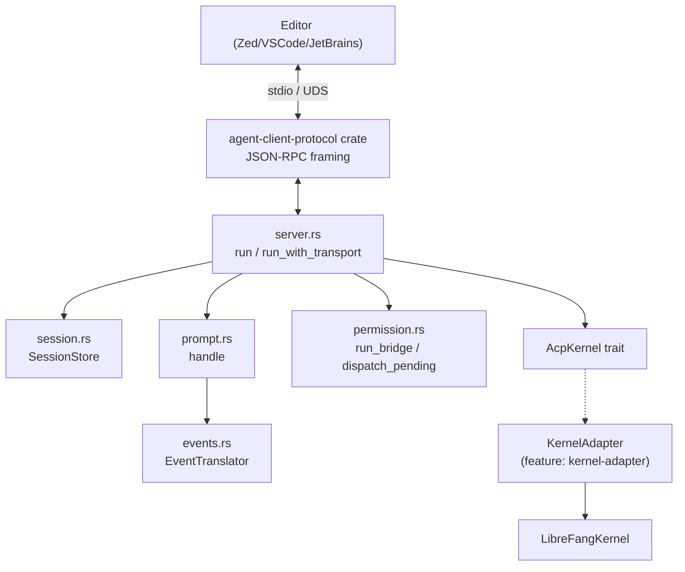
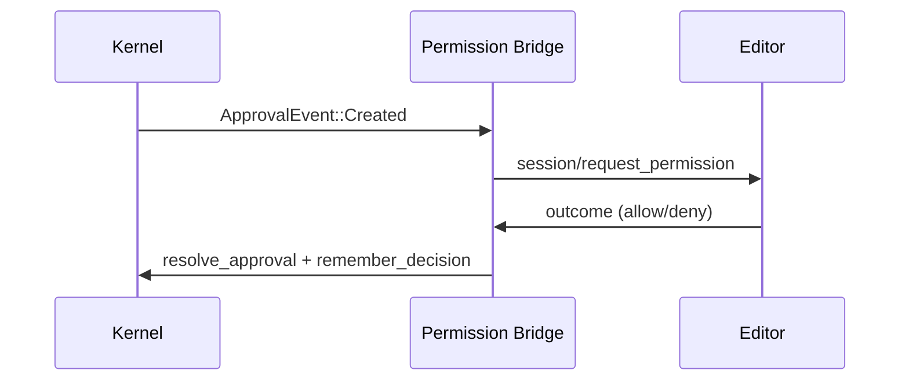

# crates — librefang-acp

# librefang-acp — Agent Client Protocol Adapter

## Purpose

`librefang-acp` bridges LibreFang's agent runtime to the [Agent Client Protocol](https://agentclientprotocol.com/) (ACP), a JSON-RPC 2.0 protocol over a duplex byte stream (typically stdio). This lets editors like Zed, VS Code, and JetBrains embed a LibreFang agent natively — with the editor providing approval modals, file references, image attachments, and prompt streaming through its own UI rather than the LibreFang dashboard or TUI.

The crate handles only the LibreFang-specific glue. The wire-level JSON-RPC framing is delegated to the `agent-client-protocol` crate (published by Zed).

## Feature Gates

| Feature | Default | Purpose |
|---------|---------|---------|
| `kernel-adapter` | off | Pulls in `librefang-kernel` and provides `KernelAdapter` — the concrete `AcpKernel` impl over `Arc<LibreFangKernel>`. Enabled by `librefang-cli` (in-process stdio) and `librefang-api` (daemon-attached UDS). Pure-protocol consumers leave this off and implement `AcpKernel` directly. |

Without `kernel-adapter`, the crate is a thin protocol layer with zero heavy dependencies — integration tests in `tests/acp_integration.rs` use stub kernels that return canned `StreamEvent` sequences.

## Architecture

## Key Components

### `AcpKernel` Trait (`lib.rs`)

The central abstraction. Defines the minimal kernel surface the ACP server needs:

- **`resolve_agent`** — map a name or UUID string to an `AgentId` at startup.
- **`send_prompt`** — begin a streaming prompt turn; returns an `mpsc::Receiver<StreamEvent>`.
- **`subscribe_approvals`** — subscribe to `ApprovalEvent`s from the kernel's approval manager.
- **`resolve_approval`** — feed an editor decision back to the kernel.
- **`remember_decision`** — persist an "always" approval choice (default no-op).
- **`set_fs_client` / `register_session_fs` / `unregister_session_fs`** — wire up the `fs/*` reverse-RPC channel.
- **`set_terminal_client` / `register_session_terminal` / `unregister_session_terminal`** — wire up the `terminal/*` reverse-RPC channel.
- **`fetch_session_history`** — pull persisted message turns for chat panel rehydration (default empty).

The trait exists so the server is testable without booting a real kernel, and so the crate doesn't pull in the full `librefang-kernel` dependency tree by default.

**Type alias:** `SharedAcpKernel = Arc<dyn AcpKernel>`.

### `KernelAdapter` (`kernel_adapter.rs`)

Concrete `AcpKernel` impl behind the `kernel-adapter` feature. Wraps `Arc<LibreFangKernel>` and bridges:

- **Agent resolution** — accepts UUID or human-readable name, validates against the registry.
- **Prompt streaming** — calls `send_message_streaming_with_routing_and_session_override` on the kernel.
- **Approval routing** — critically routes through `KernelHandle::resolve_tool_approval` (not `ApprovalManager::resolve` directly) so deferred-approval tools actually execute. See the in-code comment on `resolve_approval` for the full rationale.
- **`fs/*` and `terminal/*` client lifecycle** — stored in `Arc<RwLock<Option<...>>>`, populated at `initialize`, registered per-session on `session/{new,load,resume}`, unregistered on `session/close`.
- **History fetch** — pulls from the memory substrate, filters out system messages, extracts text blocks.

### Session Management (`session.rs`)

`SessionStore` is a `DashMap<AcpSessionId, SessionState>` shared (via `Arc`) across all handler closures.

Each `SessionState` holds:
- `librefang_session_id` — derived **deterministically** from the ACP session id via `Uuid::new_v5(ACP_SESSION_NS, ...)`. Same ACP session string always maps to the same kernel-side session, so a reconnecting editor rejoins the same persisted history.
- `cwd` — the editor's declared project root.
- `cancel: CancellationToken` — triggered by `session/cancel`.

Key operations: `insert`, `get`, `remove`, `find_by_librefang_id` (reverse lookup for the permission bridge), `cancel`, `drain_active` (cleanup on disconnect).

### Event Translation (`events.rs`)

`EventTranslator` is a stateful translator that converts `librefang_llm_driver::StreamEvent` values into ACP `SessionUpdate` notifications. One instance per prompt turn.

**Mapping summary:**

| `StreamEvent` | ACP `SessionUpdate` |
|---------------|---------------------|
| `TextDelta` | `AgentMessageChunk` |
| `ThinkingDelta` | `AgentThoughtChunk` |
| `OwnerNotice` | `AgentMessageChunk` (Phase 2 may add dedicated treatment) |
| `ToolUseStart` | `ToolCall` (status: Pending) |
| `ToolInputDelta` | *suppressed* (not streamed to avoid hundreds of tiny notifications) |
| `ToolUseEnd` | `ToolCallUpdate` (status: InProgress, raw_input attached) |
| `ToolExecutionResult` | `ToolCallUpdate` (status: Completed/Failed, content) |
| `ContentComplete` / `PhaseChange` | *no wire update* — consumed by the prompt pump for stop-reason |

**Tool call correlation:** The translator maintains `in_flight_by_name: HashMap<String, VecDeque<ToolCallId>>`. `ToolUseStart` pushes onto the queue; `ToolExecutionResult` pops from the front (FIFO). Entries are reaped when their queue drains (fixes #5144 leak).

**Known limitation:** When multiple same-named tool calls are in flight and complete out of start-order, the FIFO pop may misattribute the result. The runtime doesn't yet carry the originating `tool_use_id` on `ToolExecutionResult`. Until that lands, the translator prepends a disambiguation note to the result content when ≥2 calls are pending.

**`infer_tool_kind`** maps tool names to ACP `ToolKind` categories (Read, Edit, Delete, Move, Search, Execute, Think, Fetch, Other) via heuristic prefix/substring matching.

### Prompt Handling (`prompt.rs`)

`handle()` drives a single `session/prompt` turn:

1. Look up the ACP session, resolve to a LibreFang `SessionId`.
2. Concatenate prompt content blocks via `concat_text_blocks` — text blocks are joined; image/audio/resource blocks degrade to bracketed placeholders (true multimodal is a separate epic). The byte count of binary attachments is deliberately omitted from placeholders to avoid leaking attachment size as a prompt-injection signal.
3. Call `kernel.send_prompt()` to start streaming.
4. Race `events.recv()` against the session's `CancellationToken` in a `tokio::select!` (biased toward cancel).
5. Each event is translated and pushed as a `session/update` notification.
6. On channel close or cancel, map the last `StopReason` and return a `PromptResponse`.

**Stop reason mapping:** `EndTurn` and `MaxTokens` pass through; `ToolUse`/`StopSequence` surface as `EndTurn`; `ContentFiltered` surfaces as `Refusal`.

### Permission Bridge (`permission.rs`)

A background task (`run_bridge`) subscribes to kernel `ApprovalEvent`s and forwards matching ones to the editor via `session/request_permission`.

**Flow:**

**Key behaviors:**

- **Session filtering** — only approvals tagged with a LibreFang `SessionId` that maps to an active ACP session are forwarded.
- **60-second timeout** — if the editor doesn't respond, the decision defaults to `Denied`.
- **High-risk tool suppression** — `shell_exec`, `file_write`, `file_delete`, `apply_patch`, and `skill_evolve_*` never get an "Allow always" option in the modal. The `ApprovalManager::remember` cache keys on `(agent_id, tool_name)` only, so a blanket allow would grant outsized blast radius. "Deny always" is always available (fail-closed).
- **Defense in depth** — `sanitize_remember` strips the `remember` flag for high-risk *allow* decisions even if a misbehaving client echoes `allow_always`. High-risk *deny* decisions keep their flag.
- **Tool call ID** — prefers the LLM-assigned `tool_use_id` so the modal attaches to the streaming `ToolCall` card. Falls back to `approval-{req_id}` for paths without one.

### `fs/*` Reverse-RPC (`fs.rs`)

ACP defines `fs/read_text_file` and `fs/write_text_file` as **agent → client** requests — the editor is the file source, not the agent's local disk.

`FsClientHandle` wraps the protocol connection and exposes:
- `read_text_file(session_id, path, line, limit)` — with 60s timeout (`FS_RPC_TIMEOUT`).
- `write_text_file(session_id, path, content)` — same timeout.
- `capabilities()` — returns `FsCapabilities` (read/write bools) captured at `initialize`.

It implements `librefang_kernel_handle::AcpFsClient` so the kernel can route runtime tool calls through the editor without depending on the ACP schema crate. When the kernel calls `read_text_file`, a dummy ACP `SessionId` (empty string) is used — editors echo it without inspecting contents.

### `terminal/*` Reverse-RPC (`terminal.rs`)

Five-method PTY lifecycle: `create` → `wait_for_exit` → `output` → `kill` → `release`.

`TerminalClientHandle` wraps the connection and exposes each method individually, plus `run_command()` (via the `AcpTerminalClient` trait) which does the full create → wait → collect → release dance in one call, mirroring synchronous `shell_exec` semantics.

**Timeouts:**
- Most calls: 60s (`TERMINAL_RPC_TIMEOUT`).
- `wait_for_exit`: 600s / 10 minutes (`TERMINAL_WAIT_TIMEOUT`) — allows long compiles.
- `release` is always called (even on intermediate failure) so the editor doesn't leak terminals.

### Server Assembly (`server.rs`)

`run()` and `run_with_transport()` are the public entry points. They:

1. Create a shared `SessionStore`.
2. Register handlers on an `Agent.builder()` for: `initialize`, `session/{new,load,resume,list,close,prompt}`, `session/cancel`, and a catch-all dispatch (returns `method_not_found` for unimplemented methods like `authenticate`).
3. Spawn the permission bridge as a background task via `with_spawned`.
4. Drive the JSON-RPC loop via `connect_to(transport)`.
5. **Drop-guard cleanup** — after the loop ends (clean or not), `drain_active()` collects every session that didn't get an explicit `session/close` and unregisters their `fs/*` and `terminal/*` handles. Without this, a recycled `SessionId` would land alongside a dead handle and tool calls would block for 60s before falling back.

**Session ID generation:** UUID v4 for `session/new`. The deterministic `Uuid::new_v5` derivation in `SessionState::for_acp_id` means `session/load` / `session/resume` with the same ACP id rejoin the same kernel session.

**History replay** (`session/load`, `session/resume`): fetches up to `MAX_REPLAY_TURNS` (50) most recent text turns and emits them as `session/update` notifications. User turns → `UserMessageChunk`, assistant turns → `AgentMessageChunk`. Tool-call detail is not replayed.

**Capabilities declared at `initialize`:** `load_session = true`, `list`/`resume`/`close` capabilities enabled. `PromptCapabilities` defaults all multimodal flags to `false` so editors know up front.

### Error Handling (`error.rs`)

`AcpError` wraps kernel-level (`LibreFangError`) and transport-level (`agent_client_protocol::Error`) errors. `into_acp_error()` maps:

| Variant | JSON-RPC response |
|---------|-------------------|
| `Transport(e)` | passed through verbatim |
| `UnknownSession` / `AgentNotFound` | `invalid_params` with reason |
| Everything else | `internal_error` |

## Integration Points

### Consumers

- **`librefang-cli`** (`src/acp.rs`) — calls `run()` for in-process stdio ACP. Constructs a `KernelAdapter` over a booted `LibreFangKernel`.
- **`librefang-api`** (`src/acp_pipe.rs`, `src/acp_uds.rs`) — calls `run_with_transport()` with a framed Unix domain socket stream for daemon-attached mode.
- **Integration tests** (`tests/acp_integration.rs`) — call `run_with_transport()` over a `tokio::io::duplex` pipe with a stub kernel.

### Dependencies

| Crate | Role |
|-------|------|
| `librefang-types` | Core types: `AgentId`, `SessionId`, `ApprovalEvent`, `ApprovalDecision`, message types |
| `librefang-llm-driver` | `StreamEvent` — the flat event stream from the agent loop |
| `librefang-kernel-handle` | `AcpFsClient` / `AcpTerminalClient` traits the kernel expects |
| `librefang-kernel` (optional) | `LibreFangKernel`, `KernelHandle`, registry/memory/governance APIs |
| `agent-client-protocol` | Wire protocol: schema types, `Agent` builder, `ConnectionTo<Client>`, `Stdio` |
| `dashmap` | Concurrent session store |
| `tokio-util` | `CancellationToken` for `session/cancel` |

## Security Considerations

1. **High-risk tool suppression** — "Allow always" is never offered for `shell_exec`, `file_write`, `file_delete`, `apply_patch`, or `skill_evolve_*`. The `remember` cache in `ApprovalManager` keys on `(agent_id, tool_name)` only — no args binding — so a blanket allow would grant permanent access regardless of command. Operators can still set blanket policy via dashboard/config where scope is visible up front.

2. **Client-echoed option IDs** — `sanitize_remember` strips the persist flag for high-risk allows even if the client sends `allow_always` outside the offered options. Deny-always persists unconditionally (fail-closed).

3. **Attachment size leakage** — `concat_text_blocks` renders binary attachments as `[image attachment: image/png]` without including the base64 byte count, preventing prompt-injection probes from sniffing attachment metadata.

4. **Permission timeout** — 60s with deny-on-timeout. Matches `FS_RPC_TIMEOUT` so failure modes are consistent across reverse-RPC families.