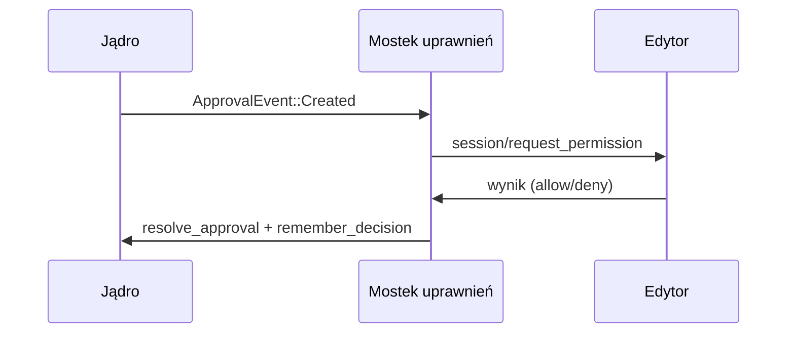

# crates — librefang-acp

# librefang-acp — Adapter Protokołu Klienta Agenta

## Przeznaczenie

`librefang-acp` łączy środowisko uruchomieniowe agenta LibreFang z [Agent Client Protocol](https://agentclientprotocol.com/) (ACP) — protokołem JSON-RPC 2.0 ponad dwukierunkowym strumieniem bajtów (zazwyczaj stdio). Dzięki temu edytory takie jak Zed, VS Code i JetBrains mogą osadzić agenta LibreFang natywnie — z edytorem dostarczającym modale zatwierdzeń, odwołania do plików, załączniki obrazów i strumieniowanie promptów przez własny interfejs użytkownika, zamiast przez panel kontrolny LibreFang lub TUI.

Ten crate obsługuje jedynie specyficzny dla LibreFang kod łączący. Ramkowanie JSON-RPC na poziomie protokołu jest delegowane do crate'u `agent-client-protocol` (opublikowanego przez Zed).

## Flagi funkcji

| Funkcja | Domyślnie | Przeznaczenie |
|---------|-----------|---------------|
| `kernel-adapter` | wyłączone | Pobiera `librefang-kernel` i dostarcza `KernelAdapter` — konkretną implementację `AcpKernel` nad `Arc<LibreFangKernel>`. Włączane przez `librefang-cli` (stdio w procesie) i `librefang-api` (UDS dołączony do demona). Konsumenci używający wyłącznie protokołu zostawiają to wyłączone i implementują `AcpKernel` bezpośrednio. |

Bez `kernel-adapter`, crate jest cienką warstwą protokołu z zerowymi ciężkimi zależnościami — testy integracyjne w `tests/acp_integration.rs` używają atrap jądra zwracających gotowe sekwencje `StreamEvent`.

## Architektura

## Kluczowe komponenty

### Trait `AcpKernel` (`lib.rs`)

Główna abstrakcja. Definiuje minimalny interfejs jądra wymagany przez serwer ACP:

- **`resolve_agent`** — mapuje nazwę lub ciąg UUID na `AgentId` podczas uruchamiania.
- **`send_prompt`** — rozpoczyna strumieniową turę promptu; zwraca `mpsc::Receiver<StreamEvent>`.
- **`subscribe_approvals`** — subskrybuje zdarzenia `ApprovalEvent` z menedżera zatwierdzeń jądra.
- **`resolve_approval`** — przesyła decyzję edytora z powrotem do jądra.
- **`remember_decision`** — utrwala wybór zatwierdzenia „zawsze" (domyślnie operacja pusta).
- **`set_fs_client` / `register_session_fs` / `unregister_session_fs`** — podłącza kanał odwrotnego RPC `fs/*`.
- **`set_terminal_client` / `register_session_terminal` / `unregister_session_terminal`** — podłącza kanał odwrotnego RPC `terminal/*`.
- **`fetch_session_history`** — pobiera utrwalone tury wiadomości do odtworzenia panelu czatu (domyślnie puste).

Trait istnieje, aby serwer był testowalny bez uruchamiania prawdziwego jądra, oraz aby crate nie pobierał domyślnie pełnego drzewa zależności `librefang-kernel`.

**Alias typu:** `SharedAcpKernel = Arc<dyn AcpKernel>`.

### `KernelAdapter` (`kernel_adapter.rs`)

Konkretna implementacja `AcpKernel` za flagą funkcji `kernel-adapter`. Opakowuje `Arc<LibreFangKernel>` i mostkuje:

- **Rozpoznawanie agenta** — akceptuje UUID lub czytelną nazwę, weryfikuje względem rejestru.
- **Strumieniowanie promptu** — wywołuje `send_message_streaming_with_routing_and_session_override` na jądrze.
- **Trasowanie zatwierdzeń** — krytycznie trasy przez `KernelHandle::resolve_tool_approval` (nie bezpośrednio przez `ApprovalManager::resolve`), aby narzędzia z odroczonym zatwierdzeniem faktycznie się wykonały. Zobacz komentarz w kodzie przy `resolve_approval` dotyczący pełnego uzasadnienia.
- **Cykl życia klientów `fs/*` i `terminal/*`** — przechowywane w `Arc<RwLock<Option<...>>>`, wypełniane przy `initialize`, rejestrowane na sesję przy `session/{new,load,resume}`, wyrejestrowywane przy `session/close`.
- **Pobieranie historii** — pobiera z podłoża pamięci, filtruje komunikaty systemowe, wyciąga bloki tekstowe.

### Zarządzanie sesjami (`session.rs`)

`SessionStore` to `DashMap<AcpSessionId, SessionState>` współdzielony (przez `Arc`) między wszystkimi domknięciami obsługi.

Każdy `SessionState` przechowuje:
- `librefang_session_id` — wyznaczany **deterministycznie** z identyfikatora sesji ACP przez `Uuid::new_v5(ACP_SESSION_NS, ...)`. Ten sam ciąg sesji ACP zawsze mapuje na tę samą sesję po stronie jądra, więc ponownie łączący się edytor dołącza do tej samej utrwalonej historii.
- `cwd` — zadeklarowany przez edytor katalog główny projektu.
- `cancel: CancellationToken` — aktywowany przez `session/cancel`.

Kluczowe operacje: `insert`, `get`, `remove`, `find_by_librefang_id` (odwrotne wyszukiwanie dla mostka uprawnień), `cancel`, `drain_active` (czyszczenie przy rozłączeniu).

### Tłumaczenie zdarzeń (`events.rs`)

`EventTranslator` to stanowy tłumacz konwertujący wartości `librefang_llm_driver::StreamEvent` na powiadomienia ACP `SessionUpdate`. Jedna instancja na turę promptu.

**Podsumowanie mapowania:**

| `StreamEvent` | ACP `SessionUpdate` |
|---------------|---------------------|
| `TextDelta` | `AgentMessageChunk` |
| `ThinkingDelta` | `AgentThoughtChunk` |
| `OwnerNotice` | `AgentMessageChunk` (faza 2 może dodać dedykowane traktowanie) |
| `ToolUseStart` | `ToolCall` (status: Pending) |
| `ToolInputDelta` | *pominięte* (nie strumieniowane, aby uniknąć setek drobnych powiadomień) |
| `ToolUseEnd` | `ToolCallUpdate` (status: InProgress, dołączony raw_input) |
| `ToolExecutionResult` | `ToolCallUpdate` (status: Completed/Failed, zawartość) |
| `ContentComplete` / `PhaseChange` | *brak aktualizacji na sieci* — konsumowane przez pompę promptów dla stop-reason |

**Korelacja wywołań narzędzi:** Tłumacz utrzymuje `in_flight_by_name: HashMap<String, VecDeque<ToolCallId>>`. `ToolUseStart` odkłada na kolejkę; `ToolExecutionResult` zdejmuje z przodu (FIFO). Wpisy są usuwane, gdy ich kolejka się wyczerpie (naprawia wyciek z #5144).

**Znane ograniczenie:** Gdy wiele wywołań narzędzi o tej samej nazwie jest w toku i kończy się w innej kolejności niż startowa, zdejmowanie FIFO może błędnie przypisać wynik. Środowisko uruchomieniowe nie przenosi jeszcze `tool_use_id` pochodzącego z `ToolExecutionResult`. Dopóki to nie nastąpi, tłumacz dodaje notę ujednoznaczniającą do treści wyniku, gdy ≥2 wywołania są oczekujące.

**`infer_tool_kind`** mapuje nazwy narzędzi na kategorie ACP `ToolKind` (Read, Edit, Delete, Move, Search, Execute, Think, Fetch, Other) poprzez heurystyczne dopasowywanie prefiksu/podciągu.

### Obsługa promptów (`prompt.rs`)

`handle()` napędza pojedynczą turę `session/prompt`:

1. Wyszukuje sesję ACP, rozwiązuje do `SessionId` LibreFang.
2. Łączy bloki zawartości promptu przez `concat_text_blocks` — bloki tekstowe są łączone; bloki obrazu/audio/zasobów degenerują do zastępczych symboli w nawiasach (prawdziwa multimodalność to osobny epick). Liczba bajtów załączników binarnych jest celowo pomijana w zastępczych symbolach, aby uniknąć wycieku rozmiaru załącznika jako sygnału iniekcji promptu.
3. Wywołuje `kernel.send_prompt()` w celu rozpoczęcia strumieniowania.
4. Konkuruje `events.recv()` z `CancellationToken` sesji w `tokio::select!` (z biasem na anulowanie).
5. Każde zdarzenie jest tłumaczone i wysyłane jako powiadomienie `session/update`.
6. Po zamknięciu kanału lub anulowaniu, mapuje ostatni `StopReason` i zwraca `PromptResponse`.

**Mapowanie przyczyn zakończenia:** `EndTurn` i `MaxTokens` przechodzą dalej; `ToolUse`/`StopSequence` pojawiają się jako `EndTurn`; `ContentFiltered` pojawia się jako `Refusal`.

### Mostek uprawnień (`permission.rs`)

Zadanie w tle (`run_bridge`) subskrybuje zdarzenia `ApprovalEvent` jądra i przekazuje pasujące do edytora przez `session/request_permission`.

**Przepływ:**

**Kluczowe zachowania:**

- **Filtrowanie sesji** — przekazywane są tylko zatwierdzenia oznaczone identyfikatorem `SessionId` LibreFang, który mapuje do aktywnej sesji ACP.
- **60-sekundowy limit czasu** — jeśli edytor nie odpowiada, decyzja domyślnie to `Denied`.
- **Tłumienie narzędzi wysokiego ryzyka** — `shell_exec`, `file_write`, `file_delete`, `apply_patch` oraz `skill_evolve_*` nigdy nie otrzymują opcji „Zezwól zawsze" w modalu. Pamięć podręczna `ApprovalManager::remember` używa jako kluczy wyłącznie `(agent_id, tool_name)`, więc globalne zezwolenie nadałoby nadmierne prawo dostępu. „Odmów zawsze" jest zawsze dostępne (fail-closed).
- **Obrona w głąb** — `sanitize_remember` usuwa flagę `remember` dla decyzji *zezwalających* wysokiego ryzyka nawet, jeśli źle zachowujący się klient odsyła `allow_always`. Decyzje *odmawiające* wysokiego ryzyka zachowują swoją flagę.
- **ID wywołania narzędzia** — preferuje przypisany przez LLM `tool_use_id`, aby modal był przypisany do strumieniowej karty `ToolCall`. Powraca do `approval-{req_id}` dla ścieżek bez jednego.

### Odwrotne RPC `fs/*` (`fs.rs`)

ACP definiuje `fs/read_text_file` i `fs/write_text_file` jako żądania **agent → klient** — edytor jest źródłem pliku, a nie lokalnym dyskiem agenta.

`FsClientHandle` opakowuje połączenie protokołu i eksponuje:
- `read_text_file(session_id, path, line, limit)` — z 60-sekundowym limitem czasu (`FS_RPC_TIMEOUT`).
- `write_text_file(session_id, path, content)` — ten sam limit czasu.
- `capabilities()` — zwraca `FsCapabilities` (wartości bool read/write) przechwycone przy `initialize`.

Implementuje `librefang_kernel_handle::AcpFsClient`, aby jądro mogło trasować wywołania narzędzi w czasie wykonywania przez edytor bez zależności od crate'u schematu ACP. Gdy jądro wywołuje `read_text_file`, używany jest pusty identyfikator ACP `SessionId` (pusty ciąg) — edytory go odsyłają bez sprawdzania zawartości.

### Odwrotne RPC `terminal/*` (`terminal.rs`)

Pięciometodowy cykl życia PTY: `create` → `wait_for_exit` → `output` → `kill` → `release`.

`TerminalClientHandle` opakowuje połączenie i eksponuje każdą metodę osobno, plus `run_command()` (przez trait `AcpTerminalClient`), który wykonuje pełny ciąg create → wait → collect → release w jednym wywołaniu, odzwierciedlając semantykę synchronicznego `shell_exec`.

**Limity czasu:**
- Większość wywołań: 60s (`TERMINAL_RPC_TIMEOUT`).
- `wait_for_exit`: 600s / 10 minut (`TERMINAL_WAIT_TIMEOUT`) — pozwala na długie kompilacje.
- `release` jest zawsze wywoływane (nawet przy pośrednim błędzie), aby edytor nie wyciekł terminali.

### Montaż serwera (`server.rs`)

`run()` i `run_with_transport()` to publiczne punkty wejścia. Wykonują one:

1. Tworzą współdzielony `SessionStore`.
2. Rejestrują procedury obsługi na `Agent.builder()` dla: `initialize`, `session/{new,load,resume,list,close,prompt}`, `session/cancel` oraz ogólną obsługę (zwraca `method_not_found` dla niezaimplementowanych metod takich jak `authenticate`).
3. Uruchamiają mostek uprawnień jako zadanie w tle przez `with_spawned`.
4. Napędzają pętlę JSON-RPC przez `connect_to(transport)`.
5. **Czyszczenie przy drop-guard** — po zakończeniu pętli (poprawnie lub nie), `drain_active()` zbiera każdą sesję, która nie otrzymała jawnego `session/close` i wyrejestrowuje ich uchwyty `fs/*` i `terminal/*`. Bez tego, odtworzony `SessionId` zostałby przypisany do martwego uchwytu, a wywołania narzędzi blokowałyby przez 60s przed powrotem do rezerwy.

**Generowanie identyfikatora sesji:** UUID v4 dla `session/new`. Deterministyczne wyprowadzenie `Uuid::new_v5` w `SessionState::for_acp_id` oznacza, że `session/load` / `session/resume` z tym samym identyfikatorem ACP dołączają do tej samej sesji jądra.

**Odtwarzanie historii** (`session/load`, `session/resume`): pobiera do `MAX_REPLAY_TURNS` (50) najnowszych tur tekstowych i emituje je jako powiadomienia `session/update`. Tury użytkownika → `UserMessageChunk`, tury asystenta → `AgentMessageChunk`. Szczegóły wywołań narzędzi nie są odtwarzane.

**Zgłaszane możliwości przy `initialize`:** `load_session = true`, włączone możliwości `list`/`resume`/`close`. `PromptCapabilities` domyślnie ustawia wszystkie flagi multimodalne na `false`, aby edytory wiedziały z góry.

### Obsługa błędów (`error.rs`)

`AcpError` opakowuje błędy poziomu jądra (`LibreFangError`) i poziomu transportu (`agent_client_protocol::Error`). `into_acp_error()` mapuje:

| Wariant | Odpowiedź JSON-RPC |
|---------|-------------------|
| `Transport(e)` | przekazane dosłownie |
| `UnknownSession` / `AgentNotFound` | `invalid_params` z przyczyną |
| Wszystko inne | `internal_error` |

## Punkty integracji

### Konsumenci

- **`librefang-cli`** (`src/acp.rs`) — wywołuje `run()` dla stdio ACP w procesie. Tworzy `KernelAdapter` nad uruchomionym `LibreFangKernel`.
- **`librefang-api`** (`src/acp_pipe.rs`, `src/acp_uds.rs`) — wywołuje `run_with_transport()` z strumieniem gniazda domeny Unix z ramkowaniem dla trybu dołączonego do demona.
- **Testy integracyjne** (`tests/acp_integration.rs`) — wywołują `run_with_transport()` przez rurę `tokio::io::duplex` z atrapą jądra.

### Zależności

| Crate | Rola |
|-------|------|
| `librefang-types` | Typy podstawowe: `AgentId`, `SessionId`, `ApprovalEvent`, `ApprovalDecision`, typy wiadomości |
| `librefang-llm-driver` | `StreamEvent` — płaski strumień zdarzeń z pętli agenta |
| `librefang-kernel-handle` | Trait'y `AcpFsClient` / `AcpTerminalClient` oczekiwane przez jądro |
| `librefang-kernel` (opcjonalne) | `LibreFangKernel`, `KernelHandle`, API rejestru/pamięci/governance |
| `agent-client-protocol` | Protokół sieciowy: typy schematu, builder `Agent`, `ConnectionTo<Client>`, `Stdio` |
| `dashmap` | Współbieżny magazyn sesji |
| `tokio-util` | `CancellationToken` dla `session/cancel` |

## Uwagi dotyczące bezpieczeństwa

1. **Tłumienie narzędzi wysokiego ryzyka** — opcja „Zezwól zawsze" nigdy nie jest oferowana dla `shell_exec`, `file_write`, `file_delete`, `apply_patch` ani `skill_evolve_*`. Pamięć podręczna `remember` w `ApprovalManager` używa jako kluczy wyłącznie `(agent_id, tool_name)` — bez wiązania argumentów — więc globalne zezwolenie nadałoby stały dostęp niezależnie od polecenia. Operatorzy mogą nadal ustawić ogólną politykę przez panel konfiguracyjny, gdzie zakres jest widoczny z góry.

2. **Identyfikatory opcji odsyłane przez klienta** — `sanitize_remember` usuwa flagę utrwalania dla zezwoleń wysokiego ryzyka nawet, jeśli klient wysyła `allow_always` poza oferowanymi opcjami. Odmowa-zawsze utrwala się bezwarunkowo (fail-closed).

3. **Wyciek rozmiaru załącznika** — `concat_text_blocks` renderuje załączniki binarne jako `[image attachment: image/png]` bez uwzględniania liczby bajtów base64, zapobiegając sondom iniekcji promptu w podsłuchiwaniu metadanych załączników.

4. **Limit czasu uprawnień** — 60s z odmową po upływie czasu. Odpowiada `FS_RPC_TIMEOUT`, aby tryby awarii były spójne w rodzinach odwrotnego RPC.
