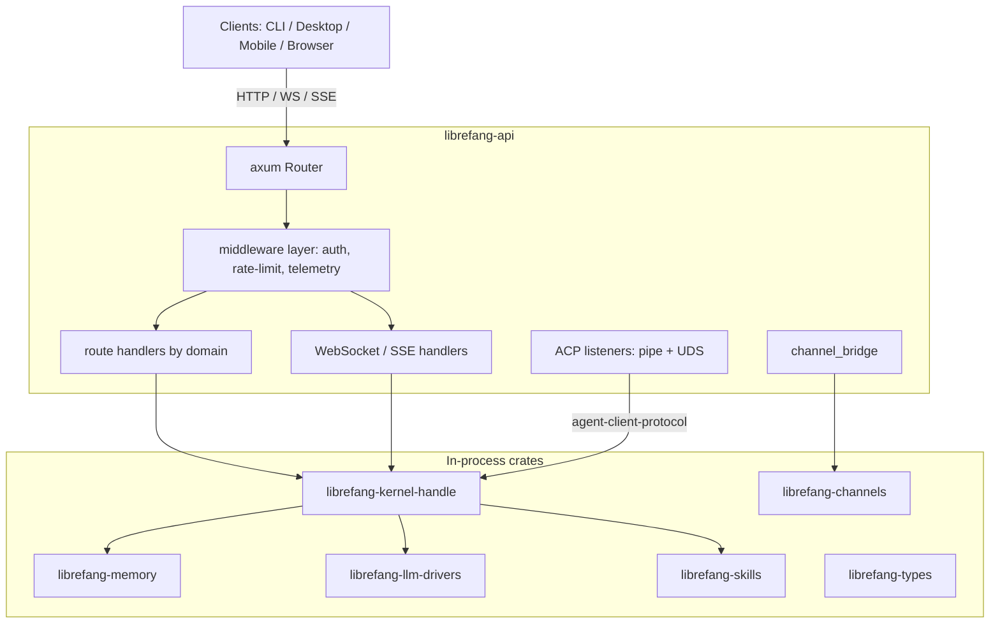

# crates — librefang-api

# librefang-api

HTTP/WebSocket API server for the LibreFang Agent OS daemon. Exposes agent lifecycle, sessions, channels, approvals, MCP, peer/A2A networking, budget/metering, audit, and the bundled React dashboard SPA over JSON REST, SSE, and WebSocket endpoints. The kernel runs in-process; CLI, desktop, and mobile clients all connect over this surface.

## Architecture

The crate is an axum application assembled by `server::build_router(kernel, addr)`, which wires the kernel handle into a shared `AppState` and mounts route groups, middleware, and the embedded SPA.



## Server Construction and Routing

`server::build_router(kernel, addr)` is the primary entry point. It:

1. Wraps the kernel handle in an `Arc<AppState>` shared across all handlers.
2. Registers middleware layers (auth, rate limiting via `governor`, CORS, request tracing).
3. Mounts route groups under `routes::*`, organized by domain.
4. Embeds the dashboard SPA via `include_dir!("static/react")` and serves it as a fallback for non-API paths.

Route handlers live in `src/routes/` and are grouped by domain — agents (lifecycle, config, sessions, memory, files), channels, approvals, MCP, A2A networking, budget, audit, auth, backups, catalog, comms, skills, workflows, auto-dream, ClawHub, and system config. Each handler receives `State<AppState>` and returns axum `Response` types, with request/response shapes annotated via `utoipa` for OpenAPI generation.

## Middleware

The middleware layer (`src/middleware.rs`) enforces authentication, rate limiting, and telemetry.

### Authentication

Three sets of public-route allowlists control which endpoints skip auth:

- **`PUBLIC_ROUTES_ALWAYS`** — endpoints that never require authentication (health checks, version info, `.well-known/agent.json`).
- **`PUBLIC_ROUTES_GET_ONLY`** — endpoints where GET is public but writes require auth.
- **`PUBLIC_ROUTES_DASHBOARD_READS`** — dashboard read endpoints that may be public depending on configuration mode.

The auth middleware resolves the caller's identity from one of three token sources: the `librefang_session` cookie, `Authorization: Bearer <jwt>`, or `X-API-Key`. JWTs are validated against the configured JWKS endpoint with a caching layer (`validate_jwt_cached`). Dashboard credential login uses Argon2id with transparent fallback from legacy plaintext passwords.

### Rate Limiting

Per-IP rate limiting is implemented with the `governor` crate. The limiter is applied as a tower layer before route dispatch.

## ACP Listeners

The crate provides two transport backends for the Agent Client Protocol, allowing local agents to connect without going through HTTP:

- **Unix domain sockets** (`src/acp_uds.rs`) — used on Unix targets. `bind_atomic_owner_only` creates the socket file atomically with mode `0600`, sweeping stale PID-locked orphans from crashed daemon instances before binding. `run_listener` spawns per-connection tasks that call `run_with_transport` from `librefang-acp`.
- **Named pipes** (`src/acp_pipe.rs`) — used on Windows. The pipe DACL is restricted to the daemon owner SID via SDDL → `SECURITY_DESCRIPTOR` conversion (`windows-sys`), preventing other local users from connecting. `handle_connection` splits the stream and delegates to the same `librefang-acp` server.

Both listeners call `librefang-acp`'s `run_with_transport` for protocol handling, so the agent-facing contract is identical regardless of platform.

## Channel Bridge

`src/channel_bridge.rs` connects channel adapters to the agent loop. Key responsibilities:

- **Session routing** — `route_assistant_by_metadata_for_channel` uses `best_alias_match` from `librefang-channels` to resolve incoming messages to the correct agent, and `for_sender_scope` scopes session operations (reset, reboot, compact) per channel sender.
- **Reply classification** — `classify_reply_intent` determines whether an inbound message is a new instruction, a continuation, or a silent acknowledgment (delegating to `is_silent_response` from `librefang-runtime`).
- **Scheduled message handling** — `manage_schedule_text` parses cron directives using `CronJob` from `librefang-types`.
- **Pending approval lookup** — `resolve_no_pending_message` checks the audit log via `query_audit` to suppress duplicate bot pings when an approval is still outstanding.

### Sidecar Channel Model

Channel adapters no longer run in-process. Every adapter is an out-of-process sidecar (`librefang.sidecar.adapters.*` in the SDK). The historical `core-channels` / `all-channels` / `channel-*` Cargo features have been removed.

Sidecar configuration is schema-driven. `configure_sidecar_channel` (`POST /api/channels/sidecar/{name}/configure`) splits form values across `secrets.env` and `config.toml`, writes a new `[[sidecar_channels]]` block, and triggers a hot-reload so the kernel picks up the change without a restart. `SIDECAR_CATALOG` in `src/routes/channels.rs` is the registry of known sidecar adapters.

QR-login state for channel sidecars (e.g., WeChat) is exposed via `GET /api/channels/{name}/qr`, which reads the cached `ChannelStatus.qr` published by the sidecar. Status codes: `200` (QR published), `204` (sidecar running but no QR needed), `404` (no sidecar registered).

## Streaming

Two streaming mechanisms serve real-time data:

- **SSE** — `send_message_stream` (`POST /api/agents/:id/message/stream`) streams LLM token deltas. `attach_session_stream` (`GET /api/agents/{id}/sessions/{session_id}/stream`) allows late-joining clients to subscribe to an in-flight turn's events. `comms_events_stream` (`GET /api/comms/events/stream`) polls the audit log every 500ms for inter-agent events.
- **WebSocket** (`src/ws.rs`) — handles WebSocket auth handshake and bidirectional streaming, used for terminal sessions and live agent interaction.

## Auth System

Authentication supports multiple modes:

| Mode | Mechanism | Endpoint |
|------|-----------|----------|
| OAuth2/OIDC | External IdP with JWKS validation | `GET /api/auth/login/{provider}` → callback |
| Dashboard credentials | Argon2id password hash | `POST /api/auth/dashboard-login` |
| API key | Static key in `X-API-Key` header | All endpoints |
| WebAuthn/Passkey | `webauthn-rs` registration + assertion | Dashboard flow |

`dashboard_auth_check` (`GET /api/auth/dashboard-check`) returns the configured mode (`none`, `credentials`, or `oauth`) so the SPA can render the appropriate login dialog. Token refresh is handled by `POST /api/auth/refresh`, and introspection follows RFC 7662 at `POST /api/auth/introspect`.

Session tokens are randomly generated with expiration metadata. `POST /api/auth/logout` invalidates the session and clears the cookie. `POST /api/auth/change-password` verifies the current password, updates credentials, and invalidates all existing sessions.

The `openssl` dependency is unconditionally vendored because `webauthn-rs` pulls in `openssl-sys` on every target. Without vendoring, cross-compiled release builds probe the host's incompatible system library.

## Dashboard SPA

The dashboard is a React 19 + TanStack Router v1 + TanStack Query v5 single-page application under `dashboard/`. It is built by `cargo xtask build-web` and embedded into the binary via `include_dir!("static/react")`. When the embedded directory is empty (fresh clone, no web build), the runtime directory `~/.librefang/dashboard/` serves the assets instead.

### Data Layer Rules

All data access goes through the shared hooks layer in `src/lib/`. Pages and components must never call `fetch()` or `api.*` directly.

- **`src/lib/queries/keys.ts`** — query-key factories. Every sub-key is anchored with `[...fooKeys.all]` so broad invalidation works hierarchically.
- **`src/lib/queries/<domain>.ts`** — `queryOptions` + `useXxx` hooks per domain. Domains: `agents`, `analytics`, `approvals`, `channels`, `config`, `goals`, `hands`, `mcp`, `media`, `memory`, `models`, `network`, `overview`, `plugins`, `providers`, `runtime`, `schedules`, `sessions`, `skills`, `workflows`.
- **`src/lib/mutations/<domain>.ts`** — mutation hooks with cache invalidation inside the hook. Callers never need to know which keys a mutation touches.

Mutation invalidation uses the narrowest matching keys by default: `fooKeys.detail(id) + fooKeys.lists()` for per-id patches, `fooKeys.lists()` for create/delete, `fooKeys.all` only for bulk operations or cache resets.

### Canonical Type Source

`src/api.ts` is the hand-maintained, canonical TypeScript type source consumed by the SPA. `openapi/generated.ts` (produced by `openapi-typescript`) is a regenerable cross-reference — never imported by application code. Refresh it with `pnpm openapi:types`.

### ESLint Policy

ESLint 9 flat config (`eslint.config.js`) enforces two security-critical rules as errors:

- `react/jsx-no-target-blank` — blocks `target="_blank"` without `rel="noopener noreferrer"`.
- `react/no-danger-withchildren` — rejects `dangerouslySetInnerHTML` combined with children.
- `no-restricted-properties` / `no-restricted-syntax` — ban raw `navigator.clipboard` access outside `lib/clipboard.ts`, which falls back to `document.execCommand('copy')` for non-secure contexts (plain HTTP on LAN IPs).

### Build and Verify

```bash
pnpm lint          # eslint — errors fail, warnings allowed
pnpm typecheck     # tsc --noEmit
pnpm test --run    # vitest
pnpm build         # vite build
```

All four must pass after changes to `src/lib/queries/`, `src/lib/mutations/`, or `src/api.ts`. Key-factory tests catch anchoring regressions that the TypeScript compiler cannot.

### E2E Tests

Playwright tests (`dashboard/e2e/`) verify request paths, body shapes, and write ordering against a vite-served dashboard with all backend calls stubbed via `page.route`. The EveryAPI connect test pins that the registry entry is written before the API key (`POST /api/registry/content/provider` before `POST /api/providers/everyapi/key`), and that `models: []` arms the daemon's initial catalog refresh.

## Build Script

`build.rs` captures build metadata:

- **Git SHA** — prefers `GITHUB_SHA` / `CI_COMMIT_SHA` env vars; falls back to `which("git")` + `git rev-parse --short HEAD`; defaults to `"unknown"`.
- **Build date** — `chrono::Utc::now()` formatted as `%Y-%m-%d` (no shell-out to `date`).
- **Rustc version** — `rustc --version` output.

The script also ensures `static/react/` exists so `include_dir!` never fails on fresh clones.

## OpenAPI

The committed `openapi.json` at the workspace root is regenerated by `cargo xtask codegen --openapi` and verified for drift in CI against hash baselines in `xtask/baselines/`. Route handlers use `utoipa` annotations (`#[utoipa::path(...)]`) to derive the spec at compile time.

The `dashboard/openapi/generated.ts` file is produced from this spec by `openapi-typescript` and serves only as a cross-reference — application code imports types from `src/api.ts`.

## Key Dependencies

| Crate | Role |
|-------|------|
| `librefang-kernel` / `librefang-kernel-handle` | In-process kernel + handle for state access |
| `librefang-acp` | Agent Client Protocol server (`run_with_transport`) |
| `librefang-types` | Shared domain types (i18n, scheduler, agent IDs) |
| `librefang-memory` | KV memory substrate |
| `librefang-channels` | Channel adapter registry and bridge routing |
| `librefang-llm-drivers` | LLM provider drivers |
| `librefang-skills` | Skill installation, evolution, verification |
| `librefang-http` | HTTP client construction with TLS config |
| `axum` / `tower` / `tower-http` | Web framework, middleware, CORS |
| `utoipa` | OpenAPI spec generation |
| `governor` | Rate limiting |
| `webauthn-rs` | WebAuthn/passkey support |
| `argon2` | Dashboard password hashing |
| `jsonwebtoken` | JWT creation and validation |

## Feature Flags

- **`default = ["telemetry"]`** — enables OpenTelemetry tracing export and Prometheus metrics.
- **`telemetry`** — pulls in `opentelemetry`, `opentelemetry-otlp`, `tracing-opentelemetry`, `metrics-exporter-prometheus`.
- **`test-util`** — exposes test-only utilities and seams to integration tests.

Platform-specific dependencies:

- **Unix** — `rustix` (process introspection), `libc`.
- **Windows** — `windows-sys` (`Win32_Security_Authorization` for named-pipe DACL restriction).

## Testing

Integration tests live in `tests/` and use the `test-util` feature for access to internal seams. Notable test suites:

- **`auth_public_allowlist.rs`** — verifies the three public-route allowlists.
- **OIDC enforcement** (`#5128`) — generates RSA keypairs in-process, signs JWTs, and serves a local JWKS endpoint to drive `validate_jwt_cached` end-to-end without a live IdP.
- **Storage failure routes** (`#6653`/`#6654`) — writes non-JSON blobs through the memory connection pool to verify that goals routes return 500 on substrate read failure rather than empty 200.
- **Tool-exec backend** (`#3332`) — integration tests against `librefang-runtime`.

Dev dependencies include `wiremock` for HTTP mocking, `rsa` for test JWT signing, and `rusqlite` for direct substrate manipulation.