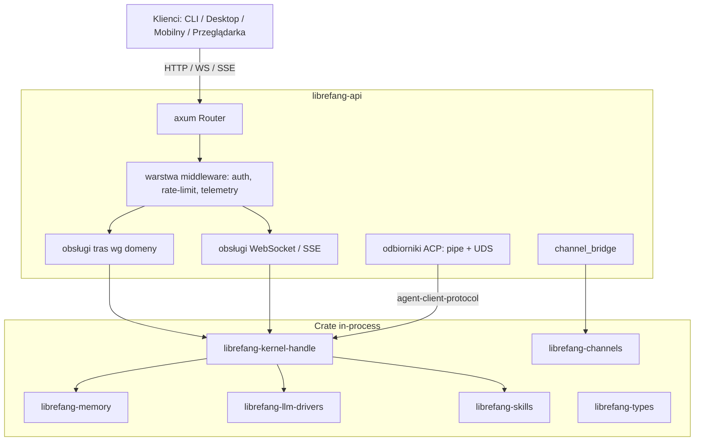

# crates — librefang-api

# librefang-api

Serwer HTTP/WebSocket API dla demona LibreFang Agent OS. Udostępnia cykl życia agenta, sesje, kanały, zatwierdzenia, MCP, sieć peer/A2A, budżet/odliczanie, audyt oraz wbudowany panel SPA React w formacie JSON REST, SSE oraz WebSocket. Jądro działa w-procesie; klienci CLI, desktopowi i mobilni łączą się przez ten interfejs.

## Architektura

Crate to aplikacja axum składana przez `server::build_router(kernel, addr)`, która podłącza uchwyt jądra do współdzielonego `AppState` oraz montuje grupy tras, middleware i osadzony SPA.



## Konstrukcja serwera i routingu

`server::build_router(kernel, addr)` to główny punkt wejścia. Funkcja ta:

1. Opakowuje uchwyt jądra w `Arc<AppState>` współdzielony przez wszystkie handlery.
2. Rejestruje warstwy middleware (autoryzacja, ograniczanie rate via `governor`, CORS, śledzenie żądań).
3. Montuje grupy tras w `routes::*`, zorganizowane wg domen.
4. Osadza panel SPA przez `include_dir!("static/react")` i serwuje go jako fallback dla ścieżek nie-API.

Handlery tras znajdują się w `src/routes/` i są pogrupowane wg domen — agenci (cykl życia, konfiguracja, sesje, pamięć, pliki), kanały, zatwierdzenia, MCP, sieć A2A, budżet, audyt, autoryzacja, kopie zapasowe, katalog, komunikacja, umiejętności, workflow, auto-dream, ClawHub oraz konfiguracja systemowa. Każdy handler odbiera `State<AppState>` i zwraca typy `Response` axum, z kształtami żądań/odpowiedzi oznaczonymi przez `utoipa` do generowania OpenAPI.

## Middleware

Warstwa middleware (`src/middleware.rs`) wymusza autoryzację, ograniczanie rate i telemetrię.

### Autoryzacja

Trzy zestawy list dozwolonych tras publicznych kontrolują, które endpointy pomijają auth:

- **`PUBLIC_ROUTES_ALWAYS`** — endpointy, które nigdy nie wymagają autoryzacji (sprawdzanie kondycji, informacje o wersji, `.well-known/agent.json`).
- **`PUBLIC_ROUTES_GET_ONLY`** — endpointy, gdzie GET jest publiczny, ale zapisy wymagają auth.
- **`PUBLIC_ROUTES_DASHBOARD_READS`** — endpointy odczytu dashboardu, które mogą być publiczne w zależności od trybu konfiguracji.

Middleware autoryzacyjny ustala tożsamość dzwoniącego z jednego z trzech źródeł tokenów: ciasteczka `librefang_session`, nagłówka `Authorization: Bearer <jwt>` lub `X-API-Key`. Tokeny JWT są walidowane względem skonfigurowanego endpointu JWKS z warstwą pamięci podręcznej (`validate_jwt_cached`). Logowanie hasłami dashboardu używa Argon2id z przezroczystym powrotem do starszych haseł w plaintext.

### Ograniczanie rate

Ograniczanie rate per-IP jest zrealizowane za pomocą crate `governor`. Limitator jest stosowany jako warstwa tower przed dispatchem tras.

## Odbiorniki ACP

Crate dostarcza dwa backendy transportowe dla Agent Client Protocol, umożliwiając lokalnym agentom łączenie się bez HTTP:

- **Gniazda domeny Unix** (`src/acp_uds.rs`) — używane na celach Unixowych. `bind_atomic_owner_only` tworzy plik gniazda atomowo z uprawnieniami `0600`, czyszcząc przestarzałe osierocone PID z awarii demona przed bindowaniem. `run_listener` uruchamia zadania per-połączenie, które wywołują `run_with_transport` z `librefang-acp`.
- **Potoki nazwane** (`src/acp_pipe.rs`) — używane na Windows. DACL potoku jest ograniczony do SID właściciela demona przez konwersję SDDL → `SECURITY_DESCRIPTOR` (`windows-sys`), zapobiegając łączeniu się innych lokalnych użytkowników. `handle_connection` dzieli strumień i deleguje do tego samego serwera `librefang-acp`.

Oba odbiorniki wywołują `run_with_transport` z `librefang-acp` do obsługi protokołu, więc kontrakt agent-facing jest identyczny niezależnie od platformy.

## Channel Bridge

`src/channel_bridge.rs` łączy adaptery kanałów z pętlą agenta. Kluczowe obowiązki:

- **Routing sesji** — `route_assistant_by_metadata_for_channel` używa `best_alias_match` z `librefang-channels` do przypisywania wiadomości przychodzących do właściwego agenta, a `for_sender_scope` zakresowuje operacje sesji (reset, reboot, compact) per nadawca kanału.
- **Klasyfikacja odpowiedzi** — `classify_reply_intent` określa, czy wiadomość przychodząca jest nową instrukcją, kontynuacją, czy cichym potwierdzeniem (delegując do `is_silent_response` z `librefang-runtime`).
- **Obsługa zaplanowanych wiadomości** — `manage_schedule_text` parsuje dyrektywy cron używając `CronJob` z `librefang-types`.
- **Wyszukiwanie oczekujących zatwierdzeń** — `resolve_no_pending_message` sprawdza log audytu przez `query_audit`, aby pominąć duplikaty pingów bota, gdy zatwierdzenie jest nadal oczekujące.

### Model kanałów sidecar

Adaptery kanałów nie działają już w-process. Każdy adapter to sidecar out-of-process (`librefang.sidecar.adapters.*` w SDK). Historyczne feature Cargo `core-channels` / `all-channels` / `channel-*` zostały usunięte.

Konfiguracja sidecar jest sterowana schemą. `configure_sidecar_channel` (`POST /api/channels/sidecar/{name}/configure`) dzieli wartości formularza między `secrets.env` i `config.toml`, zapisuje nowy blok `[[sidecar_channels]]` i wyzwala hot-reload, aby jądro odebrało zmianę bez restartu. `SIDECAR_CATALOG` w `src/routes/channels.rs` to rejestr znanych adapterów sidecar.

Stan logowania QR dla sidecarów kanałów (np. WeChat) jest eksponowany przez `GET /api/channels/{name}/qr`, który odczytuje buforowany `ChannelStatus.qr` publikowany przez sidecar. Kody statusu: `200` (QR opublikowany), `204` (sidecar działa, ale nie potrzebuje QR), `404` (brak zarejestrowanego sidecara).

## Streaming

Dwa mechanizmy streamingowe serwują dane w czasie rzeczywistym:

- **SSE** — `send_message_stream` (`POST /api/agents/:id/message/stream`) streamuje deltę tokenów LLM. `attach_session_stream` (`GET /api/agents/{id}/sessions/{session_id}/stream`) pozwala klientom dołączającym późno subskrybować wydarzenia trwającej tury. `comms_events_stream` (`GET /api/comms/events/stream`) odpytuje log audytu co 500ms o wydarzenia inter-agent.
- **WebSocket** (`src/ws.rs`) — obsługuje handshake autoryzacji WebSocket i dwukierunkowy streaming, używany do sesji terminalowych i interakcji z agentem w czasie rzeczywistym.

## System autoryzacji

Autoryzacja obsługuje wiele trybów:

| Tryb | Mechanizm | Endpoint |
|------|-----------|----------|
| OAuth2/OIDC | Zewnętrzny IdP z walidacją JWKS | `GET /api/auth/login/{provider}` → callback |
| Poświadczenia dashboardu | Hash hasła Argon2id | `POST /api/auth/dashboard-login` |
| Klucz API | Klucz statyczny w nagłówku `X-API-Key` | Wszystkie endpointy |
| WebAuthn/Passkey | Rejestracja + asercja `webauthn-rs` | Przepływ dashboardu |

`dashboard_auth_check` (`GET /api/auth/dashboard-check`) zwraca skonfigurowany tryb (`none`, `credentials` lub `oauth`), aby SPA mogło renderować odpowiedni dialog logowania. Odświeżanie tokenów jest obsługiwane przez `POST /api/auth/refresh`, a introspekcja następuje po RFC 7662 na `POST /api/auth/introspect`.

Tokeny sesyjne są generowane losowo z metadanymi wygaśnięcia. `POST /api/auth/logout` unieważnia sesję i czyści ciasteczko. `POST /api/auth/change-password` weryfikuje obecne hasło, aktualizuje poświadczenia i unieważnia wszystkie istniejące sesje.

Zależność `openssl` jest bezwarunkowo vendored, ponieważ `webauthn-rs` dołącza `openssl-sys` na każdym celu. Bez vendorowania, skompilowane release buildy cross-target badają niezgodną bibliotekę systemową hosta.

## Dashboard SPA

Dashboard to aplikacja jednostronicowa React 19 + TanStack Router v1 + TanStack Query v5 w `dashboard/`. Jest budowany przez `cargo xtask build-web` i osadzany w binary przez `include_dir!("static/react")`. Gdy katalog osadzony jest pusty (świeży clone, brak buildu web), katalog runtime `~/.librefang/dashboard/` serwuje zasoby zamiast tego.

### Reguły warstwy danych

Cały dostęp do danych przechodzi przez współdzieloną warstwę hooks w `src/lib/`. Strony i komponenty nie mogą nigdy wywoływać `fetch()` ani `api.*` bezpośrednio.

- **`src/lib/queries/keys.ts`** — fabryki kluczy zapytań. Każdy podklucz jest zakotwiczony przez `[...fooKeys.all]`, aby szeroka invalidacja działała hierarchicznie.
- **`src/lib/queries/<domain>.ts`** — `queryOptions` + hooki `useXxx` per domena. Domeny: `agents`, `analytics`, `approvals`, `channels`, `config`, `goals`, `hands`, `mcp`, `media`, `memory`, `models`, `network`, `overview`, `plugins`, `providers`, `runtime`, `schedules`, `sessions`, `skills`, `workflows`.
- **`src/lib/mutations/<domain>.ts`** — hooki mutacji z invalidacją pamięci podręcznej wewnątrz hooka. Wywołujący nie muszą wiedzieć, które klucze dotyka mutacja.

Invalidacja mutacji używa domyślnie najwęższych pasujących kluczy: `fooKeys.detail(id) + fooKeys.lists()` dla łat per-id, `fooKeys.lists()` dla tworzenia/usuwania, `fooKeys.all` tylko dla operacji hurtowych lub resetów pamięci podręcznej.

### Kanoniczne źródło typów

`src/api.ts` to ręcznie utrzymywane, kanoniczne źródło typów TypeScript konsumowane przez SPA. `openapi/generated.ts` (produkowane przez `openapi-typescript`) to odnawialna krzyżowa referencja — nigdy importowana przez kod aplikacji. Odśwież ją przez `pnpm openapi:types`.

### Polityka ESLint

ESLint 9 flat config (`eslint.config.js`) wymusza dwie krytyczne dla bezpieczeństwa reguły jako błędy:

- `react/jsx-no-target-blank` — blokuje `target="_blank"` bez `rel="noopener noreferrer"`.
- `react/no-danger-withchildren` — odrzuca `dangerouslySetInnerHTML` połączone z dziećmi.
- `no-restricted-properties` / `no-restricted-syntax` — zabrania surowego dostępu `navigator.clipboard` poza `lib/clipboard.ts`, który cofa do `document.execCommand('copy')` dla kontekstów niebezpiecznych (czyste HTTP na IP LAN).

### Build i weryfikacja

```bash
pnpm lint          # eslint — błędy zawodzą, ostrzeżenia dozwolone
pnpm typecheck     # tsc --noEmit
pnpm test --run    # vitest
pnpm build         # vite build
```

Wszystkie cztery muszą przejść po zmianach w `src/lib/queries/`, `src/lib/mutations/` lub `src/api.ts`. Testy fabryk kluczy wyłapują regresje kotwiczenia, których kompilator TypeScript nie może.

### Testy E2E

Testy Playwright (`dashboard/e2e/`) weryfikują ścieżki żądań, kształty body i kolejność zapisów względem dashboardu serwowanego przez vite z wszystkimi wywołaniami backend mockowanymi przez `page.route`. Test EveryAPI connect przypina, że wpis rejestru jest zapisany przed kluczem API (`POST /api/registry/content/provider` przed `POST /api/providers/everyapi/key`), a `models: []` uzbraja początkowe odświeżenie katalogu demona.

## Skrypt buildu

`build.rs` przechwytuje metadane buildu:

- **Git SHA** — preferuje zmienne env `GITHUB_SHA` / `CI_COMMIT_SHA`; cofa do `which("git")` + `git rev-parse --short HEAD`; domyślnie `"unknown"`.
- **Data buildu** — `chrono::Utc::now()` sformatowana jako `%Y-%m-%d` (bez wywołań powłoki do `date`).
- **Wersja rustc** — wyjście `rustc --version`.

Skrypt zapewnia również istnienie `static/react/`, aby `include_dir!` nigdy nie zawodził na świeżych clone'ach.

## OpenAPI

Zacommitowany `openapi.json` w root workspace'u jest regenerowany przez `cargo xtask codegen --openapi` i weryfikowany pod kątem dryfu w CI względem baz linii hash w `xtask/baselines/`. Handlery tras używają adnotacji `utoipa` (`#[utoipa::path(...)]`) do wyprowadzania specyfikacji w czasie kompilacji.

Plik `dashboard/openapi/generated.ts` jest produkowany z tej specyfikacji przez `openapi-typescript` i służy jedynie jako krzyżowa referencja — kod aplikacji importuje typy z `src/api.ts`.

## Kluczowe zależności

| Crate | Rola |
|-------|------|
| `librefang-kernel` / `librefang-kernel-handle` | Jądro in-process + uchwyt dostępu do stanu |
| `librefang-acp` | Serwer Agent Client Protocol (`run_with_transport`) |
| `librefang-types` | Współdzielone typy domenowe (i18n, scheduler, ID agentów) |
| `librefang-memory` | Podłoże pamięci KV |
| `librefang-channels` | Rejestr adapterów kanałów i routing bridge |
| `librefang-llm-drivers` | Sterowniki dostawców LLM |
| `librefang-skills` | Instalacja, ewolucja, weryfikacja umiejętności |
| `librefang-http` | Konstrukcja klienta HTTP z konfiguracją TLS |
| `axum` / `tower` / `tower-http` | Framework web, middleware, CORS |
| `utoipa` | Generowanie specyfikacji OpenAPI |
| `governor` | Ograniczanie rate |
| `webauthn-rs` | Obsługa WebAuthn/passkey |
| `argon2` | Hashowanie haseł dashboardu |
| `jsonwebtoken` | Tworzenie i walidacja JWT |

## Flagi feature

- **`default = ["telemetry"]`** — włącza eksport tracingu OpenTelemetry i metryki Prometheus.
- **`telemetry`** — dołącza `opentelemetry`, `opentelemetry-otlp`, `tracing-opentelemetry`, `metrics-exporter-prometheus`.
- **`test-util`** — eksponuje narzędzia testowe i seamy do testów integracyjnych.

Zależności specyficzne dla platformy:

- **Unix** — `rustix` (introspekcja procesów), `libc`.
- **Windows** — `windows-sys` (`Win32_Security_Authorization` dla ograniczenia DACL potoku nazwanego).

## Testowanie

Testy integracyjne znajdują się w `tests/` i używają feature `test-util` do dostępu do wewnętrznych seamów. Godne uwagi zestawy testowe:

- **`auth_public_allowlist.rs`** — weryfikuje trzy listy tras publicznych.
- **Wymuszanie OIDC** (`#5128`) — generuje pary kluczy RSA in-process, podpisuje tokeny JWT i serwuje lokalny endpoint JWKS do napędzania `validate_jwt_cached` end-to-end bez aktywnego IdP.
- **Ścieżki awarii pamięci** (`#6653`/`#6654`) — zapisuje nie-JSON bloby przez pulę połączeń pamięci, aby weryfikować, że trasy goals zwracają 500 przy awarii odczytu podłoża, zamiast pustego 200.
- **Backend wykonania narzędzi** (`#3332`) — testy integracyjne względem `librefang-runtime`.

Zależności deweloperskie obejmują `wiremock` do mockowania HTTP, `rsa` do podpisywania testowych JWT oraz `rusqlite` do bezpośredniej manipulacji podłożem.
