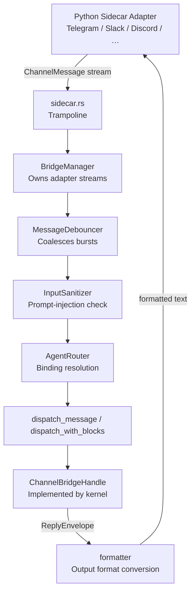

# crates — librefang-channels

# librefang-channels

Channel Bridge Layer for LibreFang. Connects messaging-platform adapters to the kernel, converts platform messages into unified `ChannelMessage` events, routes them to the correct agent, and delivers agent replies back out.

All channel adapters run out-of-process as Python sidecars (`librefang.sidecar.adapters.*` in `sdk/python/`). This crate owns the **trampoline** that connects the kernel to those sidecars (`sidecar.rs`), the shared bridge types every adapter speaks, and the supporting infrastructure (routing, formatting, rate limiting, sanitization, debouncing, attachment enrichment, crash-recovery journaling).

## Architecture



## Module map

Every module compiles unconditionally — there are no `channel-*` / `all-channels` cargo feature gates.

| Module | Responsibility |
|---|---|
| `bridge` | Core dispatch loop, `BridgeManager`, `ChannelBridgeHandle` trait, message debouncing, sanitization gating, group/DM policy enforcement |
| `sidecar` | Trampoline connecting the kernel to out-of-process Python sidecar adapters |
| `router` | `AgentRouter` — resolves which agent handles an inbound message via bindings, defaults, sticky holders, and metadata-based routing |
| `types` | Shared types: `ChannelMessage`, `ChannelContent`, `ChannelAdapter` trait, `ChannelUser`, `SenderContext`, `AgentPhase`, message splitting helpers |
| `formatter` | Converts markdown agent output to platform-specific formats (Telegram HTML, Slack mrkdwn, plain text) |
| `sanitizer` | `InputSanitizer` — detects prompt-injection patterns in inbound messages (Warn / Block modes) |
| `rate_limiter` | `ChannelRateLimiter` — per-user throttling |
| `message_journal` | Crash-recovery journal: records in-flight messages so they survive daemon restart |
| `message_truncator` | UTF-16-aware splitting for platform length limits (`split_to_utf16_chunks`, `DISCORD_MESSAGE_LIMIT`, etc.) |
| `attachment_enrich` | Content-aware enrichment of downloaded attachments (PDF text extraction, inline text/code files) |
| `group_history` | In-memory group conversation buffer with TTL eviction |
| `roster` | Group member roster tracking |
| `thread_ownership` | Suppresses duplicate replies when multiple agents share a group thread |
| `commands` | Channel slash-command parsing and handling |
| `http_client` | Shared HTTP client with rustls TLS |
| `embedded_sdk` | Embeds `sdk/python/librefang/` into the daemon binary for zero-pip sidecar bootstrap |

## Core abstractions

### `ChannelBridgeHandle` trait

Defined in `bridge.rs` to avoid a circular dependency on `librefang-kernel`. The kernel (via `librefang-api`) provides the concrete implementation. This trait is the entire contract between the channel layer and the kernel:

- **Message delivery**: `send_message`, `send_message_with_blocks`, `send_message_streaming_with_sender` — plain, multimodal, and streaming variants. The `_status` variant additionally returns a oneshot that resolves to the terminal success/error, so the bridge can set accurate lifecycle reactions and delivery metrics.
- **Agent lookup / spawning**: `find_agent_by_name`, `list_agents`, `spawn_agent_by_name`.
- **Session scoping**: `reset_channel_session`, `reboot_channel_session`, `compact_channel_session` — these operate on the per-channel session derived from `(channel, chat_id)`, not the agent's global registry session. This is the contract for channel `/new`, `/reboot`, `/compact`.
- **Routing consultation**: `resolve_conversation_override` (explicit `/agent` override, upper binding level), `resolve_instance_default` (instance-seeded default, lower binding level), `route_assistant_by_metadata_for_channel` (alias/trigger-pattern matching).
- **Channel overrides**: `channel_overrides`, `agent_channel_overrides`, `agent_channel_allowlist` — per-channel-type and per-agent configuration (group policy, DM policy, output format, threading, debounce, command allow/deny lists).
- **Media processing**: `transcribe_inbound_audio`, `describe_inbound_image` — delegate to the kernel's `MediaEngine`. Both default to `Ok(None)` (feature off) so mocks work without overrides.
- **Automation surface**: workflow/triggers/schedules/approvals methods, plus `subscribe_events` for `ApprovalRequested` notifications.
- **Delivery tracking**: `record_delivery` for outbound metrics.
- **Consumer lag reporting**: `record_consumer_lag` — has no default impl on purpose, so future handles can't silently swallow broadcast lag drops.

### `BridgeManager`

Owns all running adapters and dispatches inbound messages. Construction:

```rust
let manager = BridgeManager::with_sanitizer(handle, router, &sanitize_config)
    .with_journal(journal);
```

`start_adapter` subscribes to the adapter's message stream and spawns a dispatch task per message. A semaphore (permits = 32) bounds concurrent dispatches to prevent memory growth under burst traffic. Per-agent serialization is handled by the kernel's `agent_msg_locks`, so multiple messages to the same agent queue safely.

The manager tracks both `JoinHandle`s (for graceful `stop()`) and `AbortHandle`s (for hard-stop through shared `&self`) in lockstep via `track()`.

### `AgentRouter`

Resolves which agent should handle an inbound message. Resolution chain (highest to lowest precedence):

1. **Conversation override** (`/agent` command) — explicit user choice
2. **Sticky conversation holder** (#5323) — agent that "owns" an in-flight multi-agent group conversation
3. **Peer binding** — `AgentBinding` match rules (channel, peer_id, guild_id, roles)
4. **Instance default** — seeded from `[[sidecar_channels]] agent`
5. **Channel default** — bare `<channel_type>` or `<channel_type>:<account_id>`
6. **Global default** — `set_default`

`resolve_with_context` takes a `BindingContext` (channel, peer_id, guild_id, roles) for rich matching. `route_assistant_by_metadata_for_channel` scores agents by trigger-pattern (alias) matches when no explicit binding fires.

### `ChannelAdapter` trait

The interface every sidecar implements (via the trampoline). Key methods:

- `start` / `create_webhook_routes` — provides the inbound message stream
- `send` — delivers a reply to a recipient
- `send_interactive` — delivers inline-keyboard messages (with text fallback for non-interactive channels)
- `channel_type` / `name` / `account_id` — identity
- `channel_overrides` — per-instance config
- `typing_events` — typing indicators for debounce flushing
- `notification_recipients` — operator inbox for approval broadcasts

### `ChannelMessage` and `ChannelContent`

`ChannelMessage` is the unified inbound representation:

```rust
ChannelMessage {
    channel: ChannelType,
    platform_message_id: String,
    sender: ChannelUser,
    content: ChannelContent,
    target_agent: Option<AgentId>,
    timestamp: DateTime<Utc>,
    is_group: bool,
    thread_id: Option<String>,
    metadata: HashMap<String, Value>,
}
```

`ChannelContent` is an enum covering every inbound payload type: `Text`, `Command`, `Image`, `File`, `FileData`, `Voice`, `Audio`, `Video`, `Animation`, `Sticker`, `Location`, `Interactive`, `ButtonCallback`, `EditInteractive`, `DeleteMessage`, `MediaGroup`, `Poll`, `PollAnswer`. The `content_to_text` function renders any variant to a prompt-safe text placeholder; `sanitizer_text_to_check` extracts the attacker-controlled fields from each variant for injection scanning — the two are kept in lockstep by deliberate wildcard-free matching.

## Message dispatch flow

### Immediate path (debounce disabled)

Each message spawns a task that acquires a semaphore permit, then calls `dispatch_message`:

1. **Sanitization**: `InputSanitizer::check` inspects attacker-controlled text. `Block` mode rejects and sends a generic "could not be processed" reply. `Warn` mode logs but allows through.
2. **Routing**: `resolve_or_fallback` consults the router chain (conversation override → sticky holder → binding → instance default → channel default → global default).
3. **Policy gate**: group messages check `group_policy` (`mention_only`, `ignore`, `all`); DMs check `dm_policy`. Rate limiter applies per-user throttling.
4. **Thread ownership**: in shared group threads, `ThreadOwnershipRegistry` suppresses duplicate replies when a different agent already claimed the thread (#3334).
5. **Kernel send**: calls the appropriate `send_message*` variant on the bridge handle, with sender context propagated for peer-scoped memory.
6. **Formatting**: the agent's reply is converted via `format_for_channel` to the channel's `OutputFormat` (Telegram HTML, Slack mrkdwn, plain text, or markdown passthrough).
7. **Delivery**: adapter sends the formatted reply. `record_delivery` tracks the outcome.

### Debounced path (debounce_ms > 0)

When channel overrides configure `message_debounce_ms`, the `MessageDebouncer` coalesces rapid messages from the same sender:

- Messages bucket by `(channel_type, chat_id, sender_id)`.
- A debounce timer fires after `debounce_ms` of quiet.
- A max timer hard-flushes at `debounce_max_ms` regardless of activity.
- Typing-stop events trigger early flush.
- Buffer count reaching `max_buffer` triggers immediate flush.
- Media attachments are pre-downloaded at ingest time; LLM enrichment (image description, audio transcription, PDF extraction) is deferred to the flush task.

`drain` merges coalesced messages: same-type consecutive messages concatenate text; same-name consecutive commands merge args; mixed types produce a text block joining all `content_to_text` placeholders.

The flush channel is bounded at 1024 entries (`FLUSH_CHANNEL_CAP`) to prevent unbounded RSS growth when the dispatcher stalls (#3580).

### Media path

When a message carries downloadable media:

1. **Download**: `download_media_blocks` streams the attachment to disk under `effective_channels_download_dir()`.
2. **Enrich**: `enrich_saved_file` inspects content type and produces `ContentBlock`s:
   - `application/pdf` → extracts text via `pdf_extract` (panic-isolated, truncated at 200K chars)
   - Text-like files (code, JSON, YAML, markdown, etc.) → inlined with a header
   - Images → returned as `ContentBlock::ImageFile`; optionally described via `describe_inbound_image`
   - Audio/voice → optionally transcribed via `transcribe_inbound_audio`
   - Binary/unknown → empty vec (path block only)
3. **Dispatch**: `dispatch_with_blocks` sends the structured blocks to the kernel. The media path runs the same group/DM policy and rate-limit gates as the text path (`media_dispatch_allowed`) to prevent bypassing restrictions by sending media instead of text.

## Attachment enrichment (`attachment_enrich.rs`)

Content-aware extraction so the LLM sees file contents directly instead of just a path. The enrichment is **additive** — the `[File: …] saved to …` path block is still emitted so tools that need raw bytes still work.

Key behaviors:

- **PDF detection**: trusts `application/pdf` MIME; for ambiguous MIMEs (`application/octet-stream`, empty), falls back to `.pdf` extension then `%PDF-` magic bytes.
- **Text-like detection**: checks `text/*` MIME, known application MIMEs (`application/json`, `application/xml`, etc.), and a large extension list covering code files (`.rs`, `.py`, `.go`, `.ts`, …), config formats (`.yaml`, `.toml`, `.ini`, …), and markup (`.md`, `.rst`, `.html`, …).
- **Truncation**: hard cap at `MAX_ENRICHED_TEXT_CHARS` (200,000) with a visible marker.
- **Panic isolation**: `pdf_extract` / `lopdf` can panic on malformed PDFs; the call is wrapped in `catch_unwind` and surfaces a `[Could not extract text: …]` note instead of crashing the bridge.

## Output formatting (`formatter.rs`)

`format_for_channel(text, OutputFormat)` converts agent markdown to platform-native markup:

- `Markdown` — passthrough
- `TelegramHtml` — `<b>`, `<i>`, `<code>`, `<a href="…">` 
- `SlackMrkdwn` — `*bold*`, `_italic_`, `` `code` ``
- `PlainText` — strips all formatting

## Message truncation (`message_truncator.rs` / `types.rs`)

Platform-specific length limits with UTF-16 awareness:

- `split_message(text, limit)` — splits at `limit` UTF-16 code units, preferring newline boundaries
- Constants: `DISCORD_MESSAGE_LIMIT` (2000), `TELEGRAM_MESSAGE_LIMIT` (4096), `TELEGRAM_CAPTION_LIMIT` (1024)
- Re-exported helpers: `split_to_utf16_chunks`, `truncate_to_utf16_limit`, `utf16_len`

## Sidecar-only policy

No new in-process channel adapters. The pre-commit hook and `cargo xtask channel-policy` (CI) reject any `ChannelAdapter for` impl under `src/` whose basename isn't in `channels-allowlist.txt`. That allowlist contains only `sidecar` and is documented to only ever shrink.

To add a new channel, create a Python sidecar adapter under `sdk/python/librefang/sidecar/adapters/`. See `docs/architecture/sidecar-channels.md` for the onboarding flow.

## Embedded SDK (`embedded_sdk.rs`)

The Python SDK tree (`sdk/python/librefang/`) is embedded into the daemon binary via `include_dir`. At runtime it extracts to `<home>/sidecar-python/<content_hash>/` and injects the path into `PYTHONPATH` so a user with only `python3` on PATH can enable a sidecar channel without `pip install`. The content hash drives the directory name so a daemon upgrade extracts to a fresh subdirectory.

## Key dependencies

- `librefang-types` — shared config and type definitions
- `librefang-subprocess` — supervised task spawning
- `pdf-extract` — PDF text extraction for attachment enrichment
- `image` — image format detection (JPEG, PNG, WebP)
- `rustls` + `webpki-roots` + `rustls-native-certs` — TLS for the shared HTTP client
- `include_dir` + `sha2` — embedded SDK extraction
- `axum` — webhook route types for sidecar adapters

## Benchmarks

`benches/dispatch.rs` covers three hot paths via Criterion:

- **Serialization**: `message_serialize`, `message_deserialize`, `message_roundtrip`
- **Routing**: `router_resolve_direct`, `router_resolve_default_fallback`, `router_resolve_binding_match`, `router_resolve_with_context`
- **Formatting**: `format_markdown_passthrough`, `format_telegram_html`, `format_slack_mrkdwn`, `format_plain_text`, `split_message_short/long`, `default_phase_emoji_all`