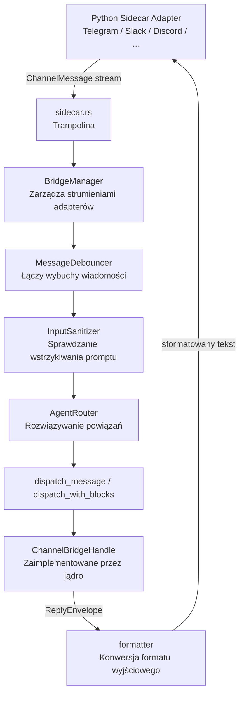

# crates — librefang-channels

# librefang-channels

Warstwa mostu kanałowego dla LibreFang. Łączy adaptery platform komunikacyjnych z jądrem, konwertuje wiadomości platform na ujednolicone zdarzenia `ChannelMessage`, kieruje je do właściwego agenta i dostarcza odpowiedzi agenta z powrotem.

Wszystkie adaptery kanałów działają poza procesem jako sidecary w Pythonie (`librefang.sidecar.adapters.*` w `sdk/python/`). Ten crate zarządza **trampoliną** łączącą jądro z tymi sidecarami (`sidecar.rs`), wspólnymi typami mostka, z których korzysta każdy adapter, oraz infrastrukturą wspomagającą (routing, formatowanie, limitowanie szybkości, sanityzację, debouncing, wzbogacanie załączników, logowanie awarii do dziennika odzyskiwania).

## Architektura



## Mapa modułów

Każdy moduł kompiluje się bezwarunkowo — nie ma żadnych bramek funkcji cargo `channel-*` / `all-channels`.

| Moduł | Odpowiedzialność |
|---|---|
| `bridge` | Główna pętla dystrybucji, `BridgeManager`, cecha `ChannelBridgeHandle`, debouncing wiadomości, bramkowanie sanityzacji, wymuszanie polityki grup/DM |
| `sidecar` | Trampolina łącząca jądro z zewnętrznoprocesowymi adapterami sidecar w Pythonie |
| `router` | `AgentRouter` — rozwiązuje, który agent obsługuje wiadomość przychodzącą za pomocą powiązań, wartości domyślnych, przylepnych właścicieli i routingu opartego na metadanych |
| `types` | Typy współdzielone: `ChannelMessage`, `ChannelContent`, cecha `ChannelAdapter`, `ChannelUser`, `SenderContext`, `AgentPhase`, funkcje pomocnicze dzielenia wiadomości |
| `formatter` | Konwertuje wyjście markdown agenta na formaty specyficzne dla platformy (Telegram HTML, Slack mrkdwn, zwykły tekst) |
| `sanitizer` | `InputSanitizer` — wykrywa wzorce wstrzykiwania promptu w wiadomościach przychodzących (tryby Warn / Block) |
| `rate_limiter` | `ChannelRateLimiter` — ograniczanie szybkości per użytkownik |
| `message_journal` | Dziennik odzyskiwania po awarii: zapisuje wiadomości w trakcie przetwarzania, aby przetrwały restart demona |
| `message_truncator` | Dzielenie z uwzględnieniem UTF-16 dla limitów długości platformy (`split_to_utf16_chunks`, `DISCORD_MESSAGE_LIMIT` itd.) |
| `attachment_enrich` | Wzbogacanie pobranych załączników z uwzględnieniem typu zawartości (ekstrakcja tekstu PDF, pliki tekstowe/kodowe inline) |
| `group_history` | Bufor konwersacji grupowych w pamięci z ewikcją TTL |
| `roster` | Śledzenie składu członków grupy |
| `thread_ownership` | Tłumi zduplikowane odpowiedzi, gdy wielu agentów współdzieli wątek grupowy |
| `commands` | Analizowanie i obsługa komend slash kanału |
| `http_client` | Współdzielony klient HTTP z TLS rustls |
| `embedded_sdk` | Osadza `sdk/python/librefang/` w binarium demona do bootstrapu sidecara bez pip |

## Główne abstrakcje

### Cecha `ChannelBridgeHandle`

Zdefiniowana w `bridge.rs`, aby uniknąć zależności cyklicznej z `librefang-kernel`. Jądro (przez `librefang-api`) dostarcza konkretną implementację. Ta cecha jest całym kontraktem między warstwą kanału a jądrem:

- **Dostarczanie wiadomości**: `send_message`, `send_message_with_blocks`, `send_message_streaming_with_sender` — warianty zwykły, multimodalny i strumieniowy. Wariant `_status` dodatkowo zwraca kanał oneshot, który rozwiązuje się do końcowego sukcesu/błędu, dzięki czemu mostek może ustawić dokładne reakcje cyklu życia i metryki dostarczenia.
- **Wyszukiwanie / uruchamianie agentów**: `find_agent_by_name`, `list_agents`, `spawn_agent_by_name`.
- **Zakres sesji**: `reset_channel_session`, `reboot_channel_session`, `compact_channel_session` — operują na sesji per kanał pochodzącej z `(channel, chat_id)`, a nie na globalnej sesji rejestru agenta. To jest kontrakt dla `/new`, `/reboot`, `/compact` kanału.
- **Konsultacja routingu**: `resolve_conversation_override` (jawne nadpisanie `/agent`, wyższy poziom powiązania), `resolve_instance_default` (domyślny zainicjowany z instancji, niższy poziom powiązania), `route_assistant_by_metadata_for_channel` (dopasowanie aliasu/wzorca wyzwalacza).
- **Nadpisania kanału**: `channel_overrides`, `agent_channel_overrides`, `agent_channel_allowlist` — konfiguracja per typ kanału i per agent (polityka grupowa, polityka DM, format wyjściowy, wątkowanie, debouncing, listy dozwolonych/zabronionych komend).
- **Przetwarzanie multimediów**: `transcribe_inbound_audio`, `describe_inbound_image` — deleguje do `MediaEngine` jądra. Oba domyślnie zwracają `Ok(None)` (funkcja wyłączona), aby moki działały bez nadpisań.
- **Powierzchnia automatyzacji**: metody workflow/triggerów/harmonogramów/approbacji oraz `subscribe_events` dla powiadomień `ApprovalRequested`.
- **Śledzenie dostarczenia**: `record_delivery` dla metryk wychodzących.
- **Raportowanie opóźnienia konsumenta**: `record_consumer_lag` — celowo nie ma domyślnej implementacji, aby przyszłe handle nie mogły po cichu połykać spadków opóźnienia broadcastu.

### `BridgeManager`

Zarządza wszystkimi działającymi adapterami i dystrybuuje wiadomości przychodzące. Konstrukcja:

```rust
let manager = BridgeManager::with_sanitizer(handle, router, &sanitize_config)
    .with_journal(journal);
```

`start_adapter` subskrybuje strumień wiadomości adaptera i uruchamia zadanie dystrybucji per wiadomość. Semafor (pozwolenia = 32) ogranicza współbieżne dystrybucje, aby zapobiec wzrostowi pamięci przy nagłym ruchu. Serializacja per agent jest obsługiwana przez `agent_msg_locks` jądra, więc wiele wiadomości do tego samego agenta bezpiecznie trafia do kolejki.

Menedżer śledzi zarówno `JoinHandle` (dla łagodnego `stop()`), jak i `AbortHandle` (dla twardego stop przez współdzielone `&self`) równolegle za pomocą `track()`.

### `AgentRouter`

Rozwiązuje, który agent powinien obsłużyć wiadomość przychodzącą. Łańcuch rozwiązywania (od najwyższego do najniższego priorytetu):

1. **Nadpisanie konwersacji** (komenda `/agent`) — jawny wybór użytkownika
2. **Przylepny właściciel konwersacji** (#5323) — agent, który „posiada" trwającą wieloagentową konwersację grupową
3. **Powiązanie peer** — reguły dopasowania `AgentBinding` (kanał, peer_id, guild_id, role)
4. **Domyślny instancji** — zainicjowany z `[[sidecar_channels]] agent`
5. **Domyślny kanału** — goły `<channel_type>` lub `<channel_type>:<account_id>`
6. **Domyślny globalny** — `set_default`

`resolve_with_context` przyjmuje `BindingContext` (kanał, peer_id, guild_id, role) do bogatego dopasowywania. `route_assistant_by_metadata_for_channel` ocenia agentów na podstawie dopasowań wzorca wyzwalacza (aliasu), gdy nie uruchamia się żadne jawne powiązanie.

### Cecha `ChannelAdapter`

Interfejs, który implementuje każdy sidecar (przez trampolinę). Kluczowe metody:

- `start` / `create_webhook_routes` — dostarcza strumień wiadomości przychodzących
- `send` — dostarcza odpowiedź do odbiorcy
- `send_interactive` — dostarcza wiadomości z klawiaturą inline (z tekstem zastępczym dla kanałów nieinteraktywnych)
- `channel_type` / `name` / `account_id` — tożsamość
- `channel_overrides` — konfiguracja per instancja
- `typing_events` — wskaźniki pisania do opróżniania debouncing'u
- `notification_recipients` — skrzynka operatora dla broadcastów aprobacji

### `ChannelMessage` i `ChannelContent`

`ChannelMessage` to ujednolicona reprezentacja przychodząca:

```rust
ChannelMessage {
    channel: ChannelType,
    platform_message_id: String,
    sender: ChannelUser,
    content: ChannelContent,
    target_agent: Option<AgentId>,
    timestamp: DateTime<Utc>,
    is_group: bool,
    thread_id: Option<String>,
    metadata: HashMap<String, Value>,
}
```

`ChannelContent` to enum obejmujący każdy typ ładunku przychodzącego: `Text`, `Command`, `Image`, `File`, `FileData`, `Voice`, `Audio`, `Video`, `Animation`, `Sticker`, `Location`, `Interactive`, `ButtonCallback`, `EditInteractive`, `DeleteMessage`, `MediaGroup`, `Poll`, `PollAnswer`. Funkcja `content_to_text` renderuje dowolny wariant na bezpieczny tekst zastępczy promptu; `sanitizer_text_to_check` ekstrahuje kontrolowane przez atakującego pola z każdego wariantu do skanowania wstrzykiwania — oba są utrzymywane w równym kroku przez celowe dopasowywanie bez wieloznaczników.

## Przepływ dystrybucji wiadomości

### Ścieżka natychmiastowa (debouncing wyłączony)

Każda wiadomość uruchamia zadanie, które uzyskuje pozwolenie semafora, a następnie wywołuje `dispatch_message`:

1. **Sanityzacja**: `InputSanitizer::check` sprawdza kontrolowany przez atakującego tekst. Tryb `Block` odrzuca i wysyła ogólną odpowiedź „nie można przetworzyć". Tryb `Warn` loguje, ale przepuszcza.
2. **Routing**: `resolve_or_fallback` konsultuje łańcuch routera (nadpisanie konwersacji → przylepny właściciel → powiązanie → domyślne instancji → domyślne kanału → domyślne globalne).
3. **Bramka polityki**: wiadomości grupowe sprawdzają `group_policy` (`mention_only`, `ignore`, `all`); DM sprawdzają `dm_policy`. Limit szybkości stosuje ograniczanie per użytkownik.
4. **Własność wątku**: we współdzielonych wątkach grupowych, `ThreadOwnershipRegistry` tłumi zduplikowane odpowiedzi, gdy inny agent już przejął wątek (#3334).
5. **Wysyłka do jądra**: wywołuje odpowiedni wariant `send_message*` na handle mostka, z propagowanym kontekstem nadawcy dla pamięci w zakresie peer'a.
6. **Formatowanie**: odpowiedź agenta jest konwertowana przez `format_for_channel` na `OutputFormat` kanału (Telegram HTML, Slack mrkdwn, zwykły tekst lub bezpośrednie przekazanie markdown).
7. **Dostarczenie**: adapter wysyła sformatowaną odpowiedź. `record_delivery` śledzi wynik.

### Ścieżka z debouncingiem (debounce_ms > 0)

Gdy nadpisania kanału konfigurują `message_debounce_ms`, `MessageDebouncer` łączy szybkie wiadomości od tego samego nadawcy:

- Wiadomości są kubłkowane według `(channel_type, chat_id, sender_id)`.
- Timer debouncingu uruchamia się po `debounce_ms` ciszy.
- Timer maksymalny wymusza opróżnienie po `debounce_max_ms` niezależnie od aktywności.
- Zdarzenia zatrzymania pisania wyzwalają przedwczesne opróżnienie.
- Osiągnięcie licznika bufora `max_buffer` wyzwala natychmiastowe opróżnienie.
- Załączniki multimedialne są pobierane z góry w momencie przyjęcia; wzbogacanie LLM (opis obrazu, transkrypcja audio, ekstrakcja PDF) jest odroczone do zadania opróżniania.

`drain` łączy skumulowane wiadomości: kolejne wiadomości tego samego typu konkatenują tekst; kolejne komendy o tej samej nazwie łączą argumenty; typy mieszane tworzą blok tekstowy łączący wszystkie symbole zastępcze `content_to_text`.

Kanał opróżniania jest ograniczony do 1024 wpisów (`FLUSH_CHANNEL_CAP`), aby zapobiec nieograniczonemu wzrostowi RSS, gdy dyspozytor się zatrzymuje (#3580).

### Ścieżka multimediów

Gdy wiadomość niesie pobieralne multimedia:

1. **Pobranie**: `download_media_blocks` strumieniuje załącznik na dysk w `effective_channels_download_dir()`.
2. **Wzbogacenie**: `enrich_saved_file` sprawdza typ zawartości i tworzy `ContentBlock`:
   - `application/pdf` → ekstrahuje tekst przez `pdf_extract` (izolowane przed panikiem, przycinane do 200K znaków)
   - Pliki tekstopodobne (kod, JSON, YAML, markdown itd.) → wstawiane inline z nagłówkiem
   - Obrazy → zwracane jako `ContentBlock::ImageFile`; opcjonalnie opisywane przez `describe_inbound_image`
   - Audio/głos → opcjonalnie transkrybowane przez `transcribe_inbound_audio`
   - Binaria/nieznane → pusty wektor (tylko blok ścieżki)
3. **Dystrybucja**: `dispatch_with_blocks` wysyła ustrukturyzowane bloki do jądra. Ścieżka multimediów przechodzi przez te same bramki polityki grup/DM i limitu szybkości co ścieżka tekstowa (`media_dispatch_allowed`), aby zapobiec obejściu ograniczeń poprzez wysyłanie multimediów zamiast tekstu.

## Wzbogacanie załączników (`attachment_enrich.rs`)

Ekstrakcja z uwzględnieniem typu zawartości, aby LLM widział zawartość pliku bezpośrednio zamiast samej ścieżki. Wzbogacenie jest **addytywne** — blok ścieżki `[File: …] saved to …` jest nadal emitowany, aby narzędzia potrzebujące surowych bajtów nadal działały.

Kluczowe zachowania:

- **Wykrywanie PDF**: ufa MIME `application/pdf`; dla niejednoznacznych MIME (`application/octet-stream`, puste), cofa się do rozszerzenia `.pdf`, a następnie do magicznych bajtów `%PDF-`.
- **Wykrywanie tekstopodobne**: sprawdza MIME `text/*`, znane MIME aplikacji (`application/json`, `application/xml` itd.) oraz dużą listę rozszerzeń obejmującą pliki kodu (`.rs`, `.py`, `.go`, `.ts`, …), formaty konfiguracji (`.yaml`, `.toml`, `.ini`, …) i znaczniki (`.md`, `.rst`, `.html`, …).
- **Przycinanie**: twardy limit `MAX_ENRICHED_TEXT_CHARS` (200 000) z widocznym znacznikiem.
- **Izolacja paniki**: `pdf_extract` / `lopdf` mogą panikować przy zniekształconych PDF-ach; wywołanie jest opakowane w `catch_unwind` i zwraca uwagę `[Nie można wydobyć tekstu: …]` zamiast awarii mostka.

## Formatowanie wyjściowe (`formatter.rs`)

`format_for_channel(text, OutputFormat)` konwertuje markdown agenta na znaczniki natywne dla platformy:

- `Markdown` — bezpośrednie przekazanie
- `TelegramHtml` — `<b>`, `<i>`, `<code>`, `<a href="…">`
- `SlackMrkdwn` — `*bold*`, `_italic_`, `` `code` ``
- `PlainText` — usuwa całe formatowanie

## Przycinanie wiadomości (`message_truncator.rs` / `types.rs`)

Limity długości specyficzne dla platformy z uwzględnieniem UTF-16:

- `split_message(text, limit)` — dzieli przy `limit` jednostkach kodu UTF-16, preferując granice nowej linii
- Stałe: `DISCORD_MESSAGE_LIMIT` (2000), `TELEGRAM_MESSAGE_LIMIT` (4096), `TELEGRAM_CAPTION_LIMIT` (1024)
- Ponownie eksportowane pomocnicze: `split_to_utf16_chunks`, `truncate_to_utf16_limit`, `utf16_len`

## Polityka wyłącznie sidecar

Brak nowych adapterów kanałów w procesie. Hook pre-commit i `cargo xtask channel-policy` (CI) odrzucają każdą implementację `ChannelAdapter for` w `src/`, której nazwa bazowa nie znajduje się w `channels-allowlist.txt`. Ta lista dozwolonych zawiera tylko `sidecar` i jest udokumentowana jako mogąca się tylko kurczyć.

Aby dodać nowy kanał, utwórz adapter sidecar w Pythonie w `sdk/python/librefang/sidecar/adapters/`. Zobacz `docs/architecture/sidecar-channels.md` dla procesu dołączania.

## Osadzony SDK (`embedded_sdk.rs`)

Drzewo Python SDK (`sdk/python/librefang/`) jest osadzone w binarium demona przez `include_dir`. W czasie działania jest wypakowywane do `<home>/sidecar-python/<content_hash>/` i wstrzykiwane do `PYTHONPATH`, aby użytkownik mający tylko `python3` na PATH mógł włączyć kanał sidecar bez `pip install`. Hash zawartości wymusza nazwę katalogu, więc aktualizacja demona wypakowuje do nowego podkatalogu.

## Kluczowe zależności

- `librefang-types` — współdzielone definicje konfiguracji i typów
- `librefang-subprocess` — nadzorowane uruchamianie zadań
- `pdf-extract` — ekstrakcja tekstu PDF dla wzbogacania załączników
- `image` — wykrywanie formatu obrazu (JPEG, PNG, WebP)
- `rustls` + `webpki-roots` + `rustls-native-certs` — TLS dla współdzielonego klienta HTTP
- `include_dir` + `sha2` — ekstrakcja osadzonego SDK
- `axum` — typy ścieżek webhook dla adapterów sidecar

## Benchmarki

`benches/dispatch.rs` obejmuje trzy gorące ścieżki przez Criterion:

- **Serializacja**: `message_serialize`, `message_deserialize`, `message_roundtrip`
- **Routing**: `router_resolve_direct`, `router_resolve_default_fallback`, `router_resolve_binding_match`, `router_resolve_with_context`
- **Formatowanie**: `format_markdown_passthrough`, `format_telegram_html`, `format_slack_mrkdwn`, `format_plain_text`, `split_message_short/long`, `default_phase_emoji_all`
