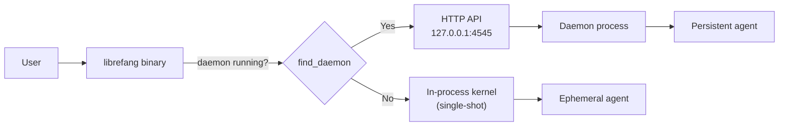
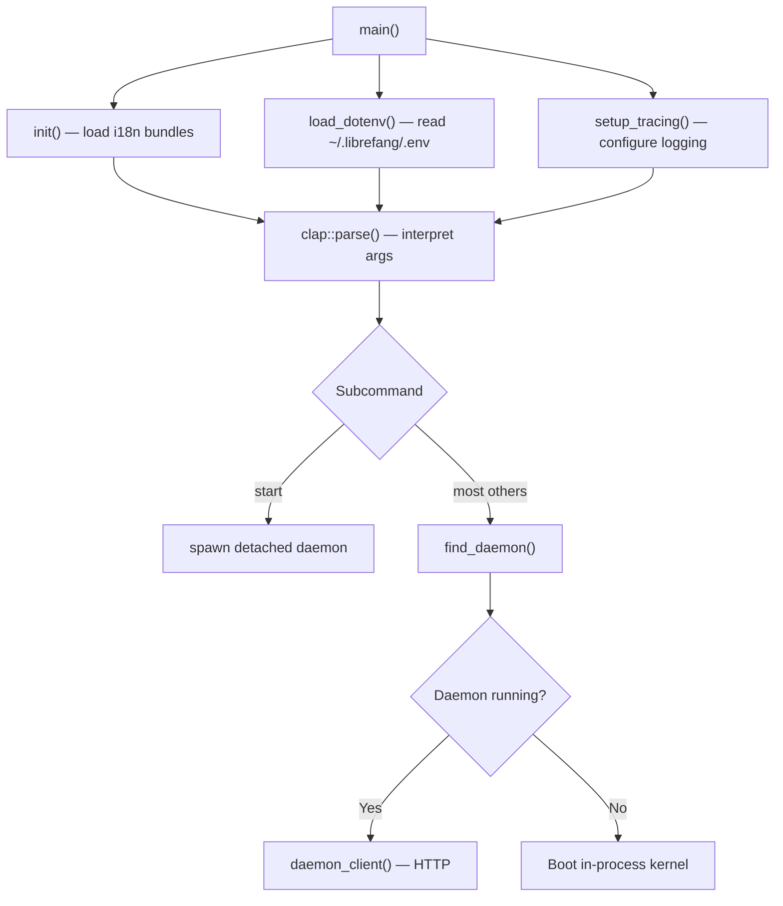
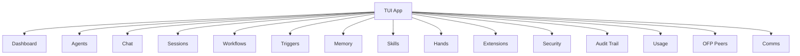
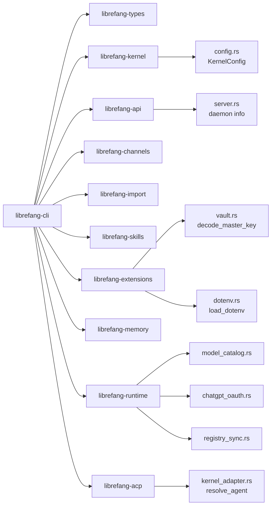

# crates — librefang-cli

# librefang-cli

The command-line interface for the LibreFang Agent OS. Ships the `librefang` binary, which serves as the primary user-facing entry point for daemon management, agent lifecycle, configuration, diagnostics, and an interactive terminal UI.

## Purpose

The CLI operates in one of two modes depending on whether a daemon is running:

- **Daemon mode** — when a daemon is listening on `http://127.0.0.1:4545` (default), the CLI forwards commands over HTTP to the running daemon's API. This is the primary workflow for persistent agents and multi-session operation.
- **In-process mode** — when no daemon is detected, the CLI boots a kernel directly in-process for single-shot commands (e.g., `librefang chat`, `librefang spawn`). Agents spawned this way are lost when the process exits, and several features that require daemon-side state are unavailable (session management, workflow creation, skill installation, etc.).



## Build System

The build script (`build.rs`) stamps three compile-time environment variables into the binary:

| Variable | Source | Purpose |
|---|---|---|
| `GIT_SHA` | `GITHUB_SHA` / `CI_COMMIT_SHA` env var, or `git rev-parse --short HEAD` | Short commit hash shown in `--version` and `doctor` |
| `BUILD_DATE` | `chrono::Utc::now()` | UTC date of the build |
| `RUSTC_VERSION` | `rustc --version` | Compiler version for diagnostics |

`resolve_git_sha()` prefers CI-provided environment variables to avoid spawning a `git` subprocess on hosted runners, and locates the `git` binary via `which::which()` rather than relying on shell PATH lookup. The `SOURCE_DATE_EPOCH` env var is tracked for reproducibility re-runs.

### Cargo Features

| Feature | Description |
|---|---|
| `default` | Enables `telemetry` |
| `telemetry` | Activates `opentelemetry` and `tracing-opentelemetry` for distributed tracing, propagated through `librefang-api/telemetry` |
| `mini` | Empty legacy alias. Retained so existing `cli_*_mini` release jobs continue producing `librefang-${target}-mini.tar.gz` artifacts. Byte-identical to the default build since per-channel cargo features were removed. |

Historical feature flags (`core-channels`, `all-channels`, `android`) have been removed. All channel adapters now run as out-of-process sidecars via the SDK package (`pip install librefang-sdk`).

### Global Allocator

On non-MSVC targets, `tikv-jemallocator` replaces the default global allocator with `disable_initial_exec_tls` enabled to avoid TLS initialization conflicts in dynamically linked binaries.

## Architecture

### Entry Point and Command Dispatch

`src/main.rs` defines the top-level `clap` command tree and dispatches to handler functions. The CLI uses `clap` with subcommands organized by domain:

```
librefang
├── start / stop / restart / status    — daemon lifecycle
├── init / upgrade                      — first-run setup and migration
├── agent / spawn / chat                — agent management
├── config (get/set/edit/show/set-key)  — configuration
├── doctor                              — environment diagnostics
├── vault (init/unlock/set/get/...)     — credential vault
├── channel (setup/list/rm/reload)      — channel sidecar management
├── skill (install/list/remove/test/...) — skill lifecycle
├── hand (install/activate/deactivate/...) — hand management
├── mcp (add/remove/catalog/list)       — MCP server configuration
├── auth (pool/hash/...)                — authentication and credential pools
├── models (connect/list/set)           — model catalog and routing
├── automation (workflow/trigger/cron)  — automation rules
├── service (install/uninstall/status)  — OS auto-start service
├── update / uninstall / reset          — maintenance
├── tui                                 — interactive terminal UI
└── acp                                 — Agent Communication Protocol server
```

### Startup Sequence



The `main` function initializes three subsystems before dispatching:

1. **Internationalization** (`src/i18n.rs`) — loads Fluent `.ftl` resource bundles for the user's locale. `init()` calls `bundle_for()` to resolve language identifiers via `unic-langid` and compile translation messages from `locales/`.

2. **Environment loading** — `load_dotenv()` from `librefang-extensions` reads `~/.librefang/.env`, calling `preseed_vault_key_from()` and `parse_env_line()` which invokes `unescape_env_value()` for each entry.

3. **Tracing** — configures `tracing-subscriber`, conditionally with `tracing-opentelemetry` when the `telemetry` feature is active.

### Command Implementation Pattern

Commands are organized in `src/commands/` by domain. Each file follows a consistent pattern:

- A public `cmd_*` function receives parsed `clap` arguments.
- Commands that require a running daemon call `require_daemon()` or `daemon_client()` from `src/commands/common.rs`.
- Commands that can operate with or without a daemon call `find_daemon()` first, branching between HTTP and in-process code paths.

**`src/commands/common.rs`** is the shared infrastructure layer:

| Function | Purpose |
|---|---|
| `daemon_client()` | Builds an authenticated `reqwest::blocking::Client` targeting the daemon's HTTP API |
| `daemon_json()` | Convenience wrapper that GETs a JSON endpoint and deserializes |
| `find_daemon()` / `find_daemon_with_probe()` | Reads `daemon.json` (via `librefang-api/src/server.rs::read_daemon_info`) to check if a daemon is running |
| `require_daemon()` | Returns an error with a fix hint if no daemon is found, used by commands that cannot work in-process |
| `resolve_agent_id()` | Resolves agent names/IDs through the daemon |
| `cli_librefang_home()` | Resolves the `~/.librefang` directory |
| `restrict_file_permissions()` | Sets `0600` permissions on sensitive files (`.env`, secrets) |
| `test_api_key()` | Validates an LLM provider API key by issuing a lightweight request |
| `copy_dir_recursive_skips_symlinks()` | Used during migration to copy agent/channel/skill directories |

### Daemon Lifecycle Management

The daemon lifecycle commands (`src/commands/daemon.rs`) handle:

- **`start`** — launches the daemon as a detached background process. Writes a log file, polls for health readiness, and reports the daemon URL. On first run, triggers quick setup via `daemon-first-run-setup`.
- **`stop`** — sends a `POST /api/shutdown` request. Handles the 401 fallback scenario (issue #4693) where a CLI upgrade rotates API credentials while the old daemon is still running, falling back to PID-based termination.
- **`restart`** — combines stop + start with graceful error handling.
- **`status`** — queries daemon health, active agents, sessions, memory, and channels.

### Internationalization

All user-facing strings are externalized to Fluent translation files in `locales/`. The primary bundle is `locales/en/main.ftl`, containing hundreds of message keys organized by domain:

- Messages use Fluent's ICU pluralization and variable interpolation: `{ $count } agent(s) loaded`, `{ $count -> [one] ... *[other] ... }`
- Error messages are paired with fix hints: `shutdown-401-detected` / `shutdown-401-explainer` / `shutdown-401-fallback-attempt` / `shutdown-401-fallback-fix`
- TUI-specific strings are namespaced with `tui-` prefixes

The `i18n` module resolves the user's locale from system settings and falls back to English. Messages are retrieved at call sites using the Fluent bundle's `get_message()` + pattern formatting.

## Terminal UI

The TUI subsystem (`src/tui/`) provides a full-screen interactive dashboard built with `ratatui`. It is launched via `librefang tui` or the interactive setup wizard.

### Tab Architecture



Each tab is implemented in `src/tui/` or `tui/screens/` and follows a pattern of:

1. `on_tab_enter()` — called when the tab becomes active, triggers data refresh
2. Event handlers process keyboard input via `handle_key()` → `switch_tab()` → `on_tab_enter()` → `refresh_dashboard()`
3. State mutations propagate through `to_ref()` which provides mutable access to the active tab's state

### Key TUI Components

- **`tui/mod.rs`** — core app loop, tab switching, global key handling, slash commands (`/help`, `/model`, `/status`, `/clear`, `/new`, `/kill`, `/exit`)
- **`tui/screens/init_wizard.rs`** — multi-step setup wizard: migration detection → provider selection → API key entry → model selection → smart routing configuration. Calls `load_models_for_provider()` and `default_model_for_provider()` from `librefang-runtime/src/model_catalog.rs`
- **`tui/screens/welcome.rs`** — landing screen with daemon detection, showing provider status and agent count
- **Chat interface** — streaming responses, model picker (Ctrl+M), token estimation, tool call rendering with `thinking…` / `running…` states
- **Security tab** — displays active security features (path traversal prevention, SSRF protection, WASM dual metering, taint tracking, Merkle audit trail) and allows on-demand chain verification

### In-Process Limitations

The TUI detects in-process mode and disables operations that require daemon-side state. When operating without a daemon, the following show explicit "not available in-process" messages:

- Workflow execution and creation
- Trigger creation, deletion, and toggling
- Session management and deletion
- Memory KV store operations
- Skill installation/uninstallation
- Provider key management and testing
- Hand activation/deactivation
- Extension install/remove/reconnect
- Inter-agent messaging and task posting

## ACP Server

`src/acp.rs` implements the Agent Communication Protocol server, which can attach to a running daemon or boot an in-process kernel:

- **UDS mode** (`acp-attached-uds`) — connects to the daemon via Unix domain socket
- **Named pipe mode** (`acp-attached-pipe`) — Windows equivalent
- **In-process mode** (`acp-in-process`) — boots a kernel directly when no daemon is detected

`run_acp_server()` calls `resolve_agent()` from `librefang-acp/src/kernel_adapter.rs` to locate the target agent by name. `run_pipe_proxy()` handles bidirectional I/O, using `split()` from `librefang-memory-wiki` for stream demultiplexing.

## Credential and Security Management

### Vault

The vault subsystem provides encrypted credential storage:

- **`vault init`** — initializes the vault with a master key derived from `LIBREFANG_VAULT_KEY` (32-byte base64)
- **`vault set/get/remove`** — CRUD operations on individual secrets
- **`vault rotate-key`** (`cmd_vault_rotate_key`) — re-encrypts the entire vault under a new master key. Reads old/new keys from `LIBREFANG_VAULT_KEY_OLD` / `LIBREFANG_VAULT_KEY_NEW` env vars or `--from-stdin`. Calls `decode_master_key()` from `librefang-extensions/src/vault.rs`, verifies the sentinel under the old key, rewraps all entries, and preserves the original file on failure.

### Authentication

`src/commands/auth.rs` handles:

- **API key hashing** — `cmd_hash_api_key()` generates bearer tokens via `generate_bearer_token()` and hashes via `hash_device_token()` from `librefang-api/src/password_hash.rs`
- **Password hashing** — `cmd_hash_password()` uses `hash_password()` for dashboard credentials
- **Credential pools** — multi-key rotation with strategies: `fill_first`, `round_robin`, `random`, `least_used`. Pools track per-key request counts, cooldown timers, and health status (`healthy`, `exhausted`, `cooldown`, `env-missing`, `invalid`)
- **ChatGPT OAuth** — `authenticate_chatgpt()` orchestrates the full OAuth flow via `librefang-runtime/src/chatgpt_oauth.rs`: device auth flow (`start_device_auth_flow` → `poll_device_auth_flow`) with browser fallback (`start_oauth_flow` → `run_oauth_callback_server` → `exchange_code_for_tokens`). Tokens are persisted via `write_chatgpt_secrets()` with owner-only file permissions verified by `write_chatgpt_secrets_is_owner_only_on_fresh_file()`

### EveryAPI Gateway Integration

`src/commands/everyapi.rs` (`librefang models connect everyapi`) registers an EveryAPI gateway as a provider:

1. `load_credentials()` — reads the EveryAPI credentials file, validating JSON structure and required fields (`api_base`, `relay_key`)
2. Fetches the gateway's model catalog and pricing feed
3. Filters models that lack context window or output limit metadata (borrowing values from the built-in OpenRouter snapshot when possible)
4. `write_provider_file()` — writes the provider definition to the LibreFang config directory
5. Optionally pins the gateway URL in `config.toml` and sets the default model

## Doctor Diagnostics

`src/commands/doctor_cmd.rs` implements `librefang doctor`, a comprehensive environment diagnostic that checks:

- **Filesystem** — `~/.librefang` directory, `.env` permissions (should be `0600`), config file existence and syntax
- **Database** — SQLite validity and connectivity
- **Daemon** — running status, health endpoint, uptime, MCP server health, database connectivity
- **Providers** — API key validity (tests against provider endpoints, detecting 401/403 rejections), endpoint reachability
- **Config validation** — TOML parse, `KernelConfig` deserialization, `api_listen` address validity (rejects port 0, privileged ports, malformed addresses), include file existence
- **MCP servers** — validates command/URL fields, `http_compat` tool/header configuration
- **Skills** — load count, prompt injection scan
- **Runtime tools** — Rust, Python, and Node.js availability
- **Desktop dependencies** — GTK/WebKit stack via `pkg-config` (Linux only)
- **Vault key** — base64 validity, 32-byte length requirement

With `--repair`, the doctor can auto-fix common issues (create missing directories, fix `.env` permissions, remove stale `daemon.json`, create default config).

## OS Service Management

`src/commands/maintenance.rs` handles auto-start service installation and removal across platforms:

| Platform | Mechanism | Notes |
|---|---|---|
| Linux | systemd user service | Recommends `loginctl enable-linger` for headless servers |
| macOS | LaunchAgent (per-user) or LaunchDaemon (`--system`, requires root) | Detects and prevents conflicting per-user + boot-time installations |
| Windows | `HKCU\Software\Microsoft\Windows\CurrentVersion\Run` registry entry | |

`librefang update` performs self-update by checking GitHub Releases, downloading the appropriate asset, and swapping the binary. It detects installation method (official path, cargo install, package manager) and blocks unsupported scenarios (e.g., updating a `cargo install` binary in-place).

## Integration with Workspace Crates



The CLI is the orchestration layer — it rarely contains business logic directly. Instead, it:

- Calls `librefang-kernel/src/config.rs::load_config()` for configuration parsing
- Talks to `librefang-api` for HTTP daemon communication and daemon info discovery
- Uses `librefang-extensions` for vault operations and `.env` management
- Delegates model catalog queries to `librefang-runtime/src/model_catalog.rs`
- Relies on `librefang-runtime/src/registry_sync.rs::sync_registry()` for agent template synchronization (called from `src/bundled_agents.rs::sync_registry_agents()`)
- Uses `librefang-acp` with the `kernel-adapter` feature for ACP agent resolution

## Migration Support

The CLI supports migration from legacy installations:

- **`librefang init`** with `init-upgrade-existing` — detects existing `config.toml` and runs an upgrade flow that backs up the config, syncs the registry, merges new config fields, and reports what changed
- **`librefang migrate --from openclaw`** (`src/commands/system.rs`) — migrates from OpenClaw/OpenFang installations, importing agents, channels, skills, memory files, sessions, and configuration
- The TUI init wizard includes a migration detection step with summary reporting (imported/skipped/warnings counts)

## Logging and Observability

- The `telemetry` feature enables `opentelemetry` + `tracing-opentelemetry` for distributed tracing export
- Non-telemetry builds use `tracing-subscriber` for local structured logging
- Daemon logs are tailable via `librefang logs --follow`
- The TUI Logs tab provides filtering by level (Error/Warn/Info/All), text search, and auto-refresh toggling