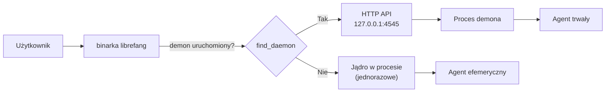
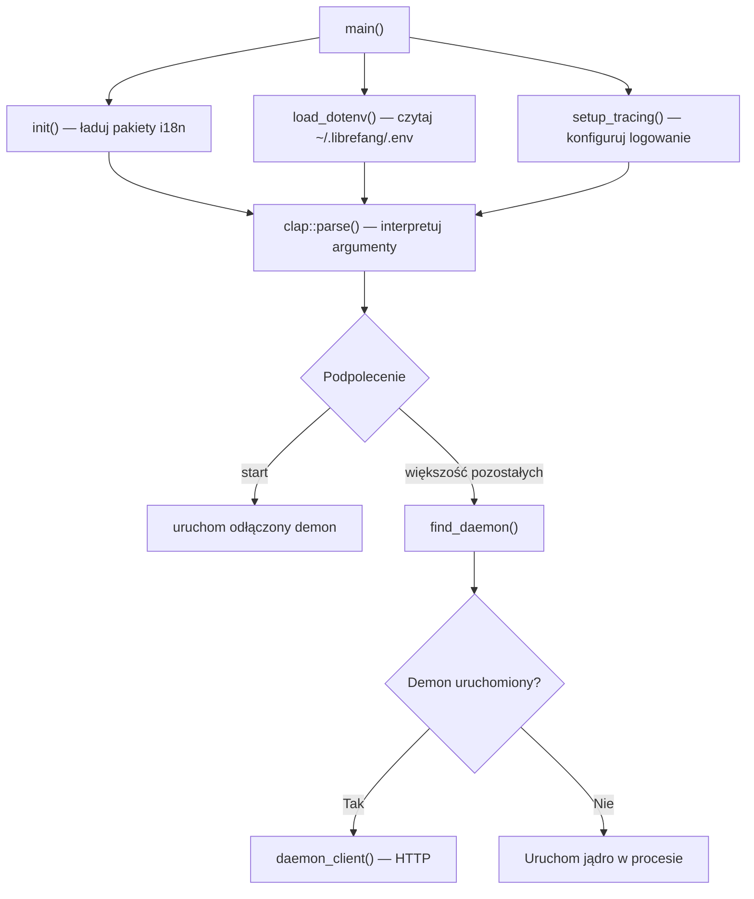
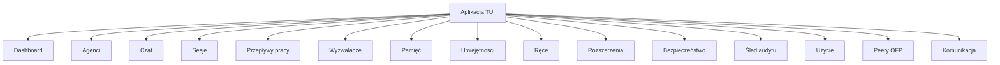
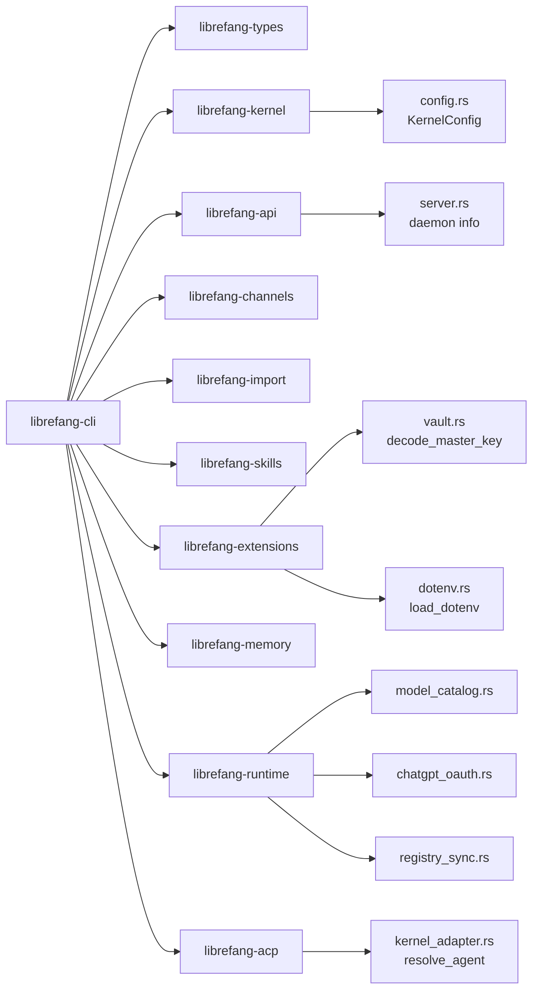

# crates — librefang-cli

# librefang-cli

Interfejs wiersza poleceń dla LibreFang Agent OS. Dostarcza binarkę `librefang`, która służy jako główne wejście użytkownika do zarządzania demonem, cyklem życia agentów, konfiguracją, diagnostyką oraz interaktywnym interfejsem terminalowym.

## Przeznaczenie

CLI działa w jednym z dwóch trybów, w zależności od tego, czy demon jest uruchomiony:

- **Tryb demona** — gdy demon nasłuchuje na `http://127.0.0.1:4545` (domyślnie), CLI przekazuje polecenia przez HTTP do API uruchomionego demona. To jest główny przepływ pracy dla agentów trwałych i operacji wielosesyjnych.
- **Tryb w procesie** — gdy nie wykryto demona, CLI uruchamia jądro bezpośrednio w procesie dla poleceń jednorazowych (np. `librefang chat`, `librefang spawn`). Agenci uruchomieni w ten sposób są traćni po zakończeniu procesu, a kilka funkcji wymagających stanu po stronie demona jest niedostępnych (zarządzanie sesjami, tworzenie przepływów pracy, instalacja umiejętności itp.).



## System budowania

Skrypt budowania (`build.rs`) wbudowuje trzy zmienne środowiskowe czasu kompilacji do binarki:

| Zmienna | Źródło | Przeznaczenie |
|---|---|---|
| `GIT_SHA` | Zmienna środowiskowa `GITHUB_SHA` / `CI_COMMIT_SHA`, lub `git rev-parse --short HEAD` | Krótki skrót commita wyświetlany w `--version` i `doctor` |
| `BUILD_DATE` | `chrono::Utc::now()` | Data UTC budowania |
| `RUSTC_VERSION` | `rustc --version` | Wersja kompilatora do diagnostyki |

`resolve_git_sha()` preferuje zmienne środowiskowe dostarczane przez CI, aby unikać uruchamiania podprocesu `git` na runnerach hostowanych, i lokalizuje binarkę `git` za pomocą `which::which()` zamiast polegać na wyszukiwaniu w PATH powłoki. Zmienna środowiskowa `SOURCE_DATE_EPOCH` jest śledzona na potrzeby ponownych uruchomień powtarzalnych.

### Funkcje Cargo

| Funkcja | Opis |
|---|---|
| `default` | Włącza `telemetry` |
| `telemetry` | Aktywuje `opentelemetry` i `tracing-opentelemetry` do śledzenia rozproszonego, propagowane przez `librefang-api/telemetry` |
| `mini` | Pusty pusty alias. Zachowany, aby istniejące zadania wydawnicze `cli_*_mini` nadal produkowały artefakty `librefang-${target}-mini.tar.gz`. Identyczny bajtowo z domyślną kompilacją, ponieważ per-kanałowe funkcje cargo zostały usunięte. |

Historyczne flagi funkcji (`core-channels`, `all-channels`, `android`) zostały usunięte. Wszystkie adaptery kanałów uruchamiają się teraz jako procesy poboczne spoza procesu przez pakiet SDK (`pip install librefang-sdk`).

### Globalny alokator

Na celach innych niż MSVC, `tikv-jemallocator` zastępuje domyślny globalny alokator z włączonym `disable_initial_exec_tls`, aby uniknąć konfliktów inicjalizacji TLS w binarkach dynamicznie linkowanych.

## Architektura

### Punkt wejścia i dyspozyczja poleceń

`src/main.rs` definiuje drzewo poleceń najwyższego poziomu `clap` i przekazuje je do funkcji obsługi. CLI używa `clap` z podpoleceniami zorganizowanymi według domeny:

```
librefang
├── start / stop / restart / status    — cykl życia demona
├── init / upgrade                      — konfiguracja pierwszego uruchomienia i migracja
├── agent / spawn / chat                — zarządzanie agentami
├── config (get/set/edit/show/set-key)  — konfiguracja
├── doctor                              — diagnostyka środowiska
├── vault (init/unlock/set/get/...)     — magazyn poświadczeń
├── channel (setup/list/rm/reload)      — zarządzanie procesami pobocznymi kanałów
├── skill (install/list/remove/test/...) — cykl życia umiejętności
├── hand (install/activate/deactivate/...) — zarządzanie rękami
├── mcp (add/remove/catalog/list)       — konfiguracja serwerów MCP
├── auth (pool/hash/...)                — uwierzytelnianie i pule poświadczeń
├── models (connect/list/set)           — katalog modeli i routing
├── automation (workflow/trigger/cron)  — reguły automatyzacji
├── service (install/uninstall/status)  — usługa autostartu systemu operacyjnego
├── update / uninstall / reset          — konserwacja
├── tui                                 — interaktywny interfejs terminalowy
└── acp                                 — serwer Agent Communication Protocol
```

### Sekwencja uruchamiania



Funkcja `main` inicjalizuje trzy podsystemy przed dyspozycją:

1. **Internacjonalizacja** (`src/i18n.rs`) — ładuje pakiety zasobów Fluent `.ftl` dla locale użytkownika. `init()` wywołuje `bundle_for()`, aby rozwiązać identyfikatory języków przez `unic-langid` i kompilować komunikaty tłumaczeń z `locales/`.

2. **Ładowanie środowiska** — `load_dotenv()` z `librefang-extensions` czyta `~/.librefang/.env`, wywołując `preseed_vault_key_from()` i `parse_env_line()`, które wywołuje `unescape_env_value()` dla każdego wpisu.

3. **Śledzenie** — konfiguruje `tracing-subscriber`, warunkowo z `tracing-opentelemetry` gdy funkcja `telemetry` jest aktywna.

### Wzór implementacji poleceń

Polecenia są zorganizowane w `src/commands/` według domeny. Każdy plik podąża za spójnym wzorem:

- Publiczna funkcja `cmd_*` odbiera sparsowane argumenty `clap`.
- Polecenia wymagające uruchomionego demona wywołują `require_daemon()` lub `daemon_client()` z `src/commands/common.rs`.
- Polecenia, które mogą działać z demonem lub bez niego, wywołują najpierw `find_daemon()`, rozgałęziając się między ścieżkami kodu HTTP i w procesie.

**`src/commands/common.rs`** to współdzielona warstwa infrastruktury:

| Funkcja | Przeznaczenie |
|---|---|
| `daemon_client()` | Buduje uwierzytelnionego `reqwest::blocking::Client` celującego w HTTP API demona |
| `daemon_json()` | Wygodny wrapper, który GET-uje punkt końcowy JSON i deserializuje |
| `find_daemon()` / `find_daemon_with_probe()` | Czyta `daemon.json` (przez `librefang-api/src/server.rs::read_daemon_info`), aby sprawdzić czy demon jest uruchomiony |
| `require_daemon()` | Zwraca błąd z podpowiedzią naprawy, jeśli nie znaleziono demona — używane przez polecenia, które nie mogą działać w procesie |
| `resolve_agent_id()` | Rozwiązuje nazwy/identyfikatory agentów przez demona |
| `cli_librefang_home()` | Rozwiązuje katalog `~/.librefang` |
| `restrict_file_permissions()` | Ustawia uprawnienia `0600` na plikach wrażliwych (`.env`, sekrety) |
| `test_api_key()` | Waliduje klucz API dostawcy LLM, wydając lekki żądanie |
| `copy_dir_recursive_skips_symlinks()` | Używane podczas migracji do kopiowania katalogów agentów/kanalów/umiejętności |

### Zarządzanie cyklem życia demona

Polecenia cyklu życia demona (`src/commands/daemon.rs`) obsługują:

- **`start`** — uruchamia demona jako odłączony proces w tle. Zapisuje plik logów, odpytuje o gotowość zdrowotną i raportuje URL demona. Przy pierwszym uruchomieniu wyzwala szybka konfiguracja przez `daemon-first-run-setup`.
- **`stop`** — wysyła żądanie `POST /api/shutdown`. Obsługuje scenariusz awaryjny 401 (zagadnienie #4693), gdzie aktualizacja CLI rotuje poświadczenia API, podczas gdy stary demon nadal działa — następuje powrót do terminacji opartej na PID.
- **`restart`** — łączy stop + start z łagodną obsługą błędów.
- **`status`** — odpytuje zdrowie demona, aktywne agentów, sesje, pamięć i kanały.

### Internacjonalizacja

Wszystkie ciągi znaków widoczne dla użytkownika są externalizowane do plików tłumaczeń Fluent w `locales/`. Głównym pakietem jest `locales/en/main.ftl`, zawierający setki kluczy komunikatów zorganizowanych według domeny:

- Komunikaty używają liczby mnogiej ICU i interpolacji zmiennych Fluent: `{ $count } agent(s) loaded`, `{ $count -> [one] ... *[other] ... }`
- Komunikaty błędów są sparowane z podpowiedziami naprawy: `shutdown-401-detected` / `shutdown-401-explainer` / `shutdown-401-fallback-attempt` / `shutdown-401-fallback-fix`
- Ciągi specyficzne dla TUI są przestrzenione prefiksami `tui-`

Moduł `i18n` rozwiązuje locale użytkownika z ustawień systemowych i przechodzi do angielskiego. Komunikaty są pobierane w punktach wywołania używając `get_message()` + formatowania wzorców pakietu Fluent.

## Interfejs Terminalowy

Podsystem TUI (`src/tui/`) zapewnia interaktywny pełnoekranowy dashboard zbudowany z `ratatui`. Jest uruchamiany przez `librefang tui` lub interaktywny kreator konfiguracji.

### Architektura zakładek



Każda zakładka jest zaimplementowana w `src/tui/` lub `tui/screens/` i podąża za wzorem:

1. `on_tab_enter()` — wywoływane gdy zakładka staje się aktywna, wyzwala odświeżenie danych
2. Obsługa zdarzeń przetwarza wejście klawiatury przez `handle_key()` → `switch_tab()` → `on_tab_enter()` → `refresh_dashboard()`
3. Mutacje stanu propagują się przez `to_ref()`, który zapewnia mutowalny dostęp do stanu aktywnej zakładki

### Kluczowe komponenty TUI

- **`tui/mod.rs`** — główna pętla aplikacji, przełączanie zakładek, globalna obsługa klawiszy, polecenia ukośnikowe (`/help`, `/model`, `/status`, `/clear`, `/new`, `/kill`, `/exit`)
- **`tui/screens/init_wizard.rs`** — wieloetapowy kreator konfiguracji: wykrywanie migracji → wybór dostawcy → wprowadzenie klucza API → wybór modelu → konfiguracja inteligentnego routingu. Wywołuje `load_models_for_provider()` i `default_model_for_provider()` z `librefang-runtime/src/model_catalog.rs`
- **`tui/screens/welcome.rs`** — ekran powitalny z wykrywaniem demona, pokazujący status dostawcy i liczbę agentów
- **Interfejs czatu** — strumieniowe odpowiedzi, wybór modelu (Ctrl+M), szacowanie tokenów, renderowanie wywołań narzędzi ze stanami `thinking…` / `running…`
- **Zakładka bezpieczeństwa** — wyświetla aktywne funkcje bezpieczeństwa (zapobieganie traversowaniu ścieżek, ochrona SSRF, podwójny pomiar WASM, śledzenie zanieczyszczeń, ślad audytu Merkle) i pozwala na na żądanie weryfikację łańcucha

### Ograniczenia w procesie

TUI wykrywa tryb w procesie i wyłącza operacje wymagające stanu po stronie demona. Podczas pracy bez demona, następujące pokazują jawne komunikaty „niedostępne w procesie”:

- Wykonanie i tworzenie przepływów pracy
- Tworzenie, usuwanie i przełączanie wyzwalaczy
- Zarządzanie sesjami i usuwanie sesji
- Operacje na magazynie KV pamięci
- Instalacja/deinstalacja umiejętności
- Zarządzanie kluczami dostawcy i testowanie
- Aktywacja/dezaktywacja rąk
- Instalacja/usunięcie/ponowne połączenie rozszerzeń
- Komunikacja międzyagentowa i publikowanie zadań

## Serwer ACP

`src/acp.rs` implementuje serwer Agent Communication Protocol, który może podłączyć się do uruchomionego demona lub uruchomić jądro w procesie:

- **Tryb UDS** (`acp-attached-uds`) — łączy się z demonem przez gniazdo domeny Unix
- **Tryb nazwanego potoku** (`acp-attached-pipe`) — odpowiednik dla Windows
- **Tryb w procesie** (`acp-in-process`) — uruchamia jądro bezpośrednio gdy nie wykryto demona

`run_acp_server()` wywołuje `resolve_agent()` z `librefang-acp/src/kernel_adapter.rs`, aby zlokalizować docelowego agenta po nazwie. `run_pipe_proxy()` obsługuje dwukierunkowe I/O, używając `split()` z `librefang-memory-wiki` do demultiplekserowania strumieni.

## Zarządzanie poświadczeniami i bezpieczeństwem

### Magazyn

Podsystem magazynu zapewnia zaszyfrowane przechowywanie poświadczeń:

- **`vault init`** — inicjalizuje magazyn kluczem głównym pochodzącym z `LIBREFANG_VAULT_KEY` (32-bajtowy base64)
- **`vault set/get/remove`** — operacje CRUD na poszczególnych sekretach
- **`vault rotate-key`** (`cmd_vault_rotate_key`) — szyfruje ponownie cały magazyn nowym kluczem głównym. Czyta stare/nowe klucze ze zmiennych środowiskowych `LIBREFANG_VAULT_KEY_OLD` / `LIBREFANG_VAULT_KEY_NEW` lub `--from-stdin`. Wywołuje `decode_master_key()` z `librefang-extensions/src/vault.rs`, weryfikuje wartownik pod starym kluczem, przepakowuje wszystkie wpisy i zachowuje oryginalny plik w przypadku niepowodzenia.

### Uwierzytelnianie

`src/commands/auth.rs` obsługuje:

- **Haszowanie kluczy API** — `cmd_hash_api_key()` generuje tokeny bearer przez `generate_bearer_token()` i haszuje przez `hash_device_token()` z `librefang-api/src/password_hash.rs`
- **Haszowanie haseł** — `cmd_hash_password()` używa `hash_password()` dla poświadczeń dashboardu
- **Pule poświadczeń** — rotacja wielokluczowa ze strategiami: `fill_first`, `round_robin`, `random`, `least_used`. Pule śledzą liczbę żądań na klucz, timery cooldown i status zdrowia (`healthy`, `exhausted`, `cooldown`, `env-missing`, `invalid`)
- **ChatGPT OAuth** — `authenticate_chatgpt()` orkiestruje pełny przepływ OAuth przez `librefang-runtime/src/chatgpt_oauth.rs`: przepływ uwierzytelniania urządzenia (`start_device_auth_flow` → `poll_device_auth_flow`) z awaryjnym przeglądarkowym (`start_oauth_flow` → `run_oauth_callback_server` → `exchange_code_for_tokens`). Tokeny są utrwalane przez `write_chatgpt_secrets()` z weryfikacją uprawnień tylko dla właściciela przez `write_chatgpt_secrets_is_owner_only_on_fresh_file()`

### Integracja z bramką EveryAPI

`src/commands/everyapi.rs` (`librefang models connect everyapi`) rejestruje bramkę EveryAPI jako dostawcę:

1. `load_credentials()` — czyta plik poświadczeń EveryAPI, weryfikując strukturę JSON i wymagane pola (`api_base`, `relay_key`)
2. Pobiera katalog modeli i źródło cenowe bramki
3. Filtruje modele, którym brakuje metadanych okna kontekstu lub limitu wyjścia (korzystając z wartości z wbudowanej migawki OpenRouter, gdy możliwe)
4. `write_provider_file()` — zapisuje definicję dostawcy w katalogu konfiguracyjnym LibreFang
5. Opcjonalnie przypina URL bramki w `config.toml` i ustawia domyślny model

## Diagnostyka Doctor

`src/commands/doctor_cmd.rs` implementuje `librefang doctor`, kompleksową diagnostykę środowiska sprawdzającą:

- **System plików** — katalog `~/.librefang`, uprawnienia `.env` (powinny być `0600`), istnienie i składnia pliku konfiguracyjnego
- **Baza danych** — ważność SQLite i łączność
- **Demon** — status uruchomienia, punkt końcowy zdrowia, uptime, zdrowie serwerów MCP, łączność z bazą danych
- **Dostawcy** — ważność kluczy API (testuje względem punktów końcowych dostawców, wykrywając odrzucenia 401/403), osiągalność punktów końcowych
- **Walidacja konfiguracji** — parsowanie TOML, deserializacja `KernelConfig`, ważność adresu `api_listen` (odrzuca port 0, uprzywilejowane porty, nieprawidłowo sformułowane adresy), istnienie plików include
- **Serwery MCP** — weryfikuje pola command/URL, konfigurację narzędzi/nagłówków `http_compat`
- **Umiejętności** — liczba załadowanych, skanowanie wstrzykiwania promptów
- **Narzędzia środowiska uruchomieniowego** — dostępność Rust, Python i Node.js
- **Zależności desktopowe** — stos GTK/WebKit przez `pkg-config` (tylko Linux)
- **Klucz magazynu** — ważność base64, wymóg 32-bajtowej długości

Z opcją `--repair`, doctor może automatycznie naprawiać typowe problemy (tworzyć brakujące katalogi, naprawić uprawnienia `.env`, usunąć przestarzały `daemon.json`, utworzyć domyślną konfigurację).

## Zarządzanie usługą systemu operacyjnego

`src/commands/maintenance.rs` obsługuje instalację i usuwanie usługi autostartu na różnych platformach:

| Platforma | Mechanizm | Uwagi |
|---|---|---|
| Linux | Usługa użytkownika systemd | Rekomenduje `loginctl enable-linger` dla serwerów headless |
| macOS | LaunchAgent (na użytkownika) lub LaunchDaemon (`--system`, wymaga roota) | Wykrywa i zapobiega konfliktom instalacji per-użytkownika + boot-time |
| Windows | Wpis rejestru `HKCU\Software\Microsoft\Windows\CurrentVersion\Run` | |

`librefang update` wykonuje samodzielną aktualizację, sprawdzając GitHub Releases, pobierając odpowiedni artefakt i podmieniając binarkę. Wykrywa metodę instalacji (oficjalna ścieżka, cargo install, menedżer pakietów) i blokuje nieobsługiwane scenariusze (np. aktualizacja w miejscu binarki `cargo install`).

## Integracja z pakietami workspace



CLI jest warstwą orkiestracji — rzadko zawiera bezpośrednio logikę biznesową. Zamiast tego:

- Wywołuje `librefang-kernel/src/config.rs::load_config()` do parsowania konfiguracji
- Komunikuje się z `librefang-api` w celu komunikacji HTTP z demonem i odkrywania informacji o demonie
- Używa `librefang-extensions` do operacji na magazynie i zarządzania `.env`
- Deleguje zapytania katalogu modeli do `librefang-runtime/src/model_catalog.rs`
- Polega na `librefang-runtime/src/registry_sync.rs::sync_registry()` do synchronizacji szablonów agentów (wywoływane z `src/bundled_agents.rs::sync_registry_agents()`)
- Używa `librefang-acp` z funkcją `kernel-adapter` do rozwiązywania agentów ACP

## Wsparcie migracji

CLI wspiera migrację z przestarzałych instalacji:

- **`librefang init`** z `init-upgrade-existing` — wykrywa istniejący `config.toml` i uruchamia przepływ aktualizacji, który kopiuje zapasową konfigurację, synchronizuje rejestr, łączy nowe pola konfiguracyjne i raportuje co się zmieniło
- **`librefang migrate --from openclaw`** (`src/commands/system.rs`) — migruje z instalacji OpenClaw/OpenFang, importując agentów, kanały, umiejętności, pliki pamięci, sesje i konfigurację
- Kreator konfiguracji TUI zawiera krok wykrywania migracji z raportowaniem podsumowania (liczby zaimportowanych/pominiętych/ostrzeżeń)

## Logowanie i obserwowalność

- Funkcja `telemetry` włącza `opentelemetry` + `tracing-opentelemetry` do eksportu śledzenia rozproszonego
- Kompilacje bez telemetry używają `tracing-subscriber` do lokalnego logowania strukturalnego
- Logi demona mogą być obserwowane przez `librefang logs --follow`
- Zakładka logów TUI zapewnia filtrowanie według poziomu (Błąd/Ostrzeżenie/Info/Wszystkie), wyszukiwanie tekstowe i przełączanie autoodświeżania
