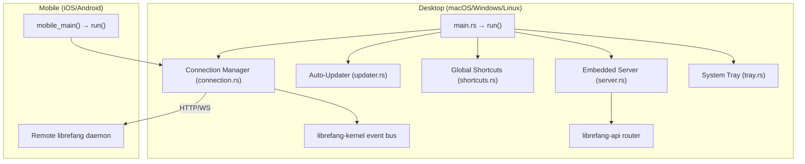

# crates — librefang-desktop

# librefang-desktop

The native desktop and mobile application shell for the LibreFang Agent OS. Built on **Tauri 2.0**, this crate produces both a full-featured desktop binary (macOS, Windows, Linux) and a mobile thin client (iOS, Android) from a single codebase.

---

## Purpose

`librefang-desktop` serves two distinct deployment modes from one crate:

| Mode | Platform | Behavior |
|------|----------|----------|
| **Full desktop** | macOS, Windows, Linux | Embeds and runs the `librefang-api` HTTP/WS server locally, renders a system tray icon, registers global shortcuts, and manages auto-updates. |
| **Mobile thin client** | iOS, Android | Renders a dashboard webview that connects over HTTP/WS to a remote `librefang` daemon. No local daemon is embedded. |

The mobile architecture is intentional: LibreFang runs cron jobs, autodream, channel adapters, and triggers 24×7 — workloads that iOS/Android background execution limits cannot sustain.

---

## Architecture



---

## Entry Points

### `src/main.rs`

Desktop binary entry point. Loads environment configuration via `librefang_extensions::dotenv::load_dotenv`, then delegates to `run()`.

### `src/lib.rs`

Contains the two public entry points:

- **`run()`** — Orchestrates the full application lifecycle: initializes i18n, loads `.env`, initializes the secret vault (`librefang_extensions::vault::init`), sets up the system tray (`setup_tray`), configures global keyboard shortcuts (`build_shortcut_plugin`), loads saved connection preferences, validates any configured server URL, and starts forwarding kernel events to the frontend.
- **`mobile_main()`** — Mobile entry point that calls into `run()` with mobile-appropriate configuration. Platform-specific plugins (tray, single-instance, autostart, global-shortcut, updater, shell) are compiled out via `cfg` gates.

Kernel events are bridged to the Tauri frontend via `forward_kernel_events`, which calls `librefang_kernel::event_bus::recv_event_skipping_lag` in a loop and emits each event to the webview.

---

## Key Components

### Connection Manager (`src/connection.rs`)

Manages whether the app runs a local daemon or connects to a remote one. Core types and functions:

- **`DesktopConfig`** — Persisted user preferences (serialized to TOML). Written atomically via `librefang_runtime::mcp_migrate::write`.
- **`ConnectionPreference`** — Enum representing the user's choice between local and remote operation.
- **`load_saved_preference()`** — Reads the last saved config from disk.
- **`save_preference()`** — Persists a new `DesktopConfig`.
- **`start_local()`** — Spawns the embedded daemon process via `librefang_subprocess::spawn` and records the `ConnectionPreference`.
- **`connect_remote()`** — Validates the server URL (via `validate_server_url`), persists the preference, and determines the `navigation_target` for the frontend.
- **`navigation_target()`** — Returns the URL the webview should load (local server vs. remote URL).
- **`connection_html()`** — Renders an HTML status snippet used by the tray's "Change Server" dialog.

### System Tray (`src/tray.rs`)

Platform-divergent tray implementation:

- **macOS / Windows** — Uses Tauri's native `tray-icon` feature (`NSStatusItem` / `Shell_NotifyIconW`).
- **Linux** — Uses [`ksni`](https://crates.io/crates/ksni) (pure D-Bus StatusNotifierItem), implemented through `LibreFangLinuxTray`. The `ksni` dependency is pinned to `default-features = false, features = ["async-io"]` — the `tokio` backend triggers a nested-runtime panic when Tauri/notify-rust makes blocking session-bus calls inside a Tokio worker thread.

**`setup_tray()`** builds the tray menu with these actions:

| Action | Handler |
|--------|---------|
| Open dashboard | `open_browser` |
| Toggle launch-at-login | `toggle_launch_at_login` |
| Change server | `change_server` |
| Open config directory | `open_config_dir` |
| Check for updates | `check_updates` |
| View agent count | `get_agent_count` |
| View status | `get_status_text` |

The tray also uses `librefang_types::backoff::next_delay` for polling intervals (e.g., agent count refresh).

### Embedded Server (`src/server.rs`)

On desktop, the app embeds the `librefang-api` HTTP/WebSocket server:

- **`run_embedded_server()`** — Calls `librefang_api::server::build_router` to construct the Axum router, spawns the server via `librefang_subprocess::spawn`, and wires up `librefang_api::webchat::sync_dashboard` for real-time dashboard state.
- **`start_server()`** — Returns a `ServerHandle` for lifecycle management.

### Global Shortcuts (`src/shortcuts.rs`)

**`build_shortcut_plugin()`** constructs the `tauri-plugin-global-shortcut` plugin instance with the keyboard shortcuts configured for the app.

### Auto-Updater (`src/updater.rs`)

Manages checking for and applying application updates:

- **`spawn_startup_check()`** — Runs on app launch. First verifies the update manifest is reachable (`manifest_reachable`), then calls `do_check()`. If an update is found, it calls `download_and_install_update()`.
- **`do_check()`** — Performs the actual update manifest query, returning `UpdateInfo` if a newer version exists.
- **`download_and_install_update()`** — Downloads and applies the update binary.
- **`check_for_update` (tray.rs)** — User-triggered path from the tray menu; spawns the update check asynchronously.

The Tauri command `install_update` (in `commands.rs`) also calls `download_and_install_update`.

### Tauri Commands (`src/commands.rs`)

Commands exposed to the frontend webview via the Tauri IPC layer:

- **`install_update`** — Triggers update download + install.
- **`import_agent_toml`** — Writes agent configuration TOML to disk via `librefang_runtime::mcp_migrate::write`.
- **`uninstall_app`** — Removes application files, including catalog sync data (`librefang_runtime::catalog_sync::remove_file`).

---

## Platform Compilation Matrix

Desktop-only plugins are gated behind `cfg(not(any(target_os = "ios", target_os = "android")))`:

| Plugin | macOS/Windows | Linux | iOS/Android |
|--------|:---:|:---:|:---:|
| `tauri` (tray-icon) | ✅ | — (ksni instead) | ❌ |
| `tauri-plugin-single-instance` | ✅ | ✅ | ❌ |
| `tauri-plugin-autostart` | ✅ | ✅ | ❌ |
| `tauri-plugin-global-shortcut` | ✅ | ✅ | ❌ |
| `tauri-plugin-updater` | ✅ | ✅ | ❌ |
| `tauri-plugin-shell` | ✅ | ✅ | ❌ |
| `tauri-plugin-barcode-scanner` | ❌ | ❌ | ✅ |
| `keyring` | ❌ | ❌ | ✅ |
| `ksni` | ❌ | ✅ | ❌ |

### Crate-Type Note

The `[lib]` section declares `crate-type = ["staticlib", "cdylib", "lib"]`. The `staticlib` and `cdylib` outputs are required for iOS (Xcode) and Android (Gradle) mobile shells to link the Rust library. Cargo cannot conditionalize crate-type on `cfg(mobile)` at the manifest level, so desktop builds also produce these artifacts — adding roughly 10–20% to clean-link time.

---

## Capabilities (Permissions)

Two capability files control IPC access from the webview:

### `capabilities/default.json` (Desktop)

Grants the `main` window access to: core APIs, notifications, shell (open links), dialogs, global-shortcut (register/unregister/is-registered), autostart, and updater.

### `capabilities/mobile.json` (iOS/Android)

Grants the `main` window access to: core APIs, notifications, and dialogs only. Desktop plugins (shell, global-shortcut, autostart, updater) are not bundled on mobile.

---

## Build & Development

### Desktop

```bash
cargo run -p librefang-desktop
# or with Tauri CLI:
cargo tauri dev
```

### Mobile (after one-time init)

```bash
cd crates/librefang-desktop

# Android
cargo tauri android init    # one-time scaffold
cargo tauri android dev

# iOS (macOS only)
cargo tauri ios init        # one-time scaffold
cargo tauri ios dev
```

The `gen/android/` and `gen/apple/` directories are generated by the Tauri CLI and should be committed to the repository.

### Minimum OS Versions

| Platform | Minimum |
|----------|---------|
| iOS | 14.0 |
| Android | API 26 (Android 8.0) |

---

## Dependencies on Workspace Crates

| Crate | Usage |
|-------|-------|
| `librefang-kernel` | Event bus forwarding (`recv_event_skipping_lag`) |
| `librefang-api` | Embedded HTTP/WS server (`build_router`, `sync_dashboard`) |
| `librefang-types` | Backoff delay calculation (`next_delay`) |
| `librefang-extensions` | `.env` loading, vault initialization |
| `librefang-subprocess` | Daemon process spawning |
| `librefang-runtime` | Config persistence (`mcp_migrate::write`), catalog sync |

### Feature Flags

```toml
[features]
default = ["librefang-api/default"]
custom-protocol = ["tauri/custom-protocol"]   # production builds
mobile = []                                     # no-op; mobile targets are cfg-gated
```

The previously existing `all-channels`, `mini`, and `mobile-no-email` features have been removed — channel adapters are now sidecars, not Rust features. CI workflows referencing these flags must drop the `-f` argument.

---

## Linux Tray: `ksni` Runtime Constraint

The `ksni` crate is configured with `default-features = false, features = ["async-io"]`. This is mandatory — the default `tokio` backend pulls in `zbus/tokio`, which triggers a nested-runtime panic (`"Cannot start a runtime from within a runtime"`) when Tauri or `notify-rust` invokes blocking D-Bus session bus connection calls from inside a Tokio worker thread. The `async-io` backend avoids this entirely.

GTK3 remains in the Linux build graph transitively through Tauri's webview runtime (WebKitGTK), but `libappindicator` has been eliminated as a direct dependency.