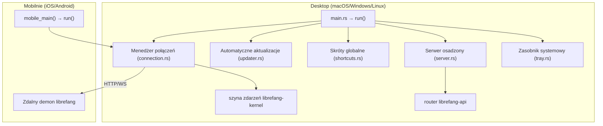

# crates — librefang-desktop

# librefang-desktop

Natywna powłoka aplikacji desktopowej i mobilnej dla LibreFang Agent OS. Zbudowana na **Tauri 2.0**, ta crate generuje zarówno pełnoprawny binar desktopowy (macOS, Windows, Linux), jak i mobilnego klienta typu thin client (iOS, Android) z jednej bazy kodu.

---

## Przeznaczenie

`librefang-desktop` obsługuje dwa różne tryby wdrożenia z jednej cratety:

| Tryb | Platforma | Zachowanie |
|------|-----------|------------|
| **Pełny desktop** | macOS, Windows, Linux | Osadza i uruchamia lokalnie serwer HTTP/WS `librefang-api`, wyświetla ikonę w zasobniku systemowym, rejestruje skróty globalne i zarządza automatycznymi aktualizacjami. |
| **Mobilny thin client** | iOS, Android | Wyświetla panel nawigacyjny w webview, który łączy się przez HTTP/WS ze zdalnym demonem `librefang`. Żaden lokalny demon nie jest osadzany. |

Architektura mobilna jest celowa: LibreFang uruchamia zadania cron, autodream, adaptery kanałów i wyzwalacze 24×7 — obciążenia, których limity wykonania w tle iOS/Android nie są w stanie utrzymać.

---

## Architektura



---

## Punkty wejścia

### `src/main.rs`

Punkt wejścia binarny desktopowy. Ładuje konfigurację środowiska za pomocą `librefang_extensions::dotenv::load_dotenv`, a następnie deleguje do `run()`.

### `src/lib.rs`

Zawiera dwa publiczne punkty wejścia:

- **`run()`** — Orkiestruje pełny cykl życia aplikacji: inicjalizuje i18n, ładuje `.env`, inicjalizuje magazyn sekretów (`librefang_extensions::vault::init`), konfiguruje zasobnik systemowy (`setup_tray`), konfiguruje globalne skróty klawiszowe (`build_shortcut_plugin`), ładuje zapisane preferencje połączeń, weryfikuje skonfigurowany adres URL serwera i rozpoczyna przekazywanie zdarzeń kernela do frontendu.
- **`mobile_main()`** — Mobilny punkt wejścia wywołujący `run()` z konfiguracją odpowiednią dla platformy mobilnej. Wtyczki specyficzne dla platformy (tray, single-instance, autostart, global-shortcut, updater, shell) są wykluczane z kompilacji za pomocą bramek `cfg`.

Zdarzenia kernela są przekazywane do frontendu Tauri za pomocą `forward_kernel_events`, który w pętli wywołuje `librefang_kernel::event_bus::recv_event_skipping_lag` i emituje każde zdarzenie do webview.

---

## Kluczowe komponenty

### Menedżer połączeń (`src/connection.rs`)

Zarządza tym, czy aplikacja uruchamia lokalnego demona, czy łączy się ze zdalnym. Kluczowe typy i funkcje:

- **`DesktopConfig`** — Utrwalone preferencje użytkownika (serializowane do TOML). Zapisywane atomowo za pomocą `librefang_runtime::mcp_migrate::write`.
- **`ConnectionPreference`** — Enum reprezentujący wybór użytkownika między trybem lokalnym a zdalnym.
- **`load_saved_preference()`** — Odczytuje ostatnio zapisaną konfigurację z dysku.
- **`save_preference()`** — Utrwala nową `DesktopConfig`.
- **`start_local()`** — Uruchamia proces osadzonego demona za pomocą `librefang_subprocess::spawn` i zapisuje `ConnectionPreference`.
- **`connect_remote()`** — Weryfikuje adres URL serwera (za pomocą `validate_server_url`), utrwala preferencję i określa `navigation_target` dla frontendu.
- **`navigation_target()`** — Zwraca adres URL, który webview powinien załadować (lokalny serwer vs zdalny URL).
- **`connection_html()`** — Renderuje fragment HTML ze statusem używany w oknie dialogowym zasobnika „Zmień serwer”.

### Zasobnik systemowy (`src/tray.rs`)

Implementacja zasobnika różniąca się w zależności od platformy:

- **macOS / Windows** — Używa natywnej funkcji `tray-icon` z Tauri (`NSStatusItem` / `Shell_NotifyIconW`).
- **Linux** — Używa [`ksni`](https://crates.io/crates/ksni) (czysty D-Bus StatusNotifierItem), zaimplementowane przez `LibreFangLinuxTray`. Zależność `ksni` jest przypięta do `default-features = false, features = ["async-io"]` — backend `tokio` powoduje panikę zagnieżdżonego runtime-u, gdy Tauri/notify-rust wykonuje blokujące wywołania szyny sesji D-Bus wewnątrz wątku roboczego Tokio.

**`setup_tray()`** buduje menu zasobnika z następującymi akcjami:

| Akcja | Obsługa |
|-------|---------|
| Otwórz panel nawigacyjny | `open_browser` |
| Przełącz autostart | `toggle_launch_at_login` |
| Zmień serwer | `change_server` |
| Otwórz katalog konfiguracji | `open_config_dir` |
| Sprawdź aktualizacje | `check_updates` |
| Wyświetl liczbę agentów | `get_agent_count` |
| Wyświetl status | `get_status_text` |

Zasobnik używa również `librefang_types::backoff::next_delay` do interwałów odpytywania (np. odświeżanie liczby agentów).

### Serwer osadzony (`src/server.rs`)

Na desktopie aplikacja osadza serwer HTTP/WebSocket `librefang-api`:

- **`run_embedded_server()`** — Wywołuje `librefang_api::server::build_router` w celu skonstruowania routera Axum, uruchamia serwer za pomocą `librefang_subprocess::spawn` i podłącza `librefang_api::webchat::sync_dashboard` do stanu panelu nawigacyjnego w czasie rzeczywistym.
- **`start_server()`** — Zwraca `ServerHandle` do zarządzania cyklem życia.

### Skróty globalne (`src/shortcuts.rs`)

**`build_shortcut_plugin()`** konstruuje instancję wtyczki `tauri-plugin-global-shortcut` ze skonfigurowanymi skrótami klawiszowymi aplikacji.

### Automatyczne aktualizacje (`src/updater.rs`)

Zarządza sprawdzaniem i stosowaniem aktualizacji aplikacji:

- **`spawn_startup_check()`** — Uruchamiany przy starcie aplikacji. Najpierw weryfikuje dostępność manifestu aktualizacji (`manifest_reachable`), a następnie wywołuje `do_check()`. Jeśli znaleziono aktualizację, wywołuje `download_and_install_update()`.
- **`do_check()`** — Wykonuje właściwe zapytanie o manifest aktualizacji, zwracając `UpdateInfo`, jeśli istnieje nowsza wersja.
- **`download_and_install_update()`** — Pobiera i stosuje binarną aktualizację.
- **`check_for_update` (tray.rs)** — Ścieżka wyzwalana przez użytkownika z menu zasobnika; asynchronicznie uruchamia sprawdzanie aktualizacji.

Polecenie Tauri `install_update` (w `commands.rs`) również wywołuje `download_and_install_update`.

### Polecenia Tauri (`src/commands.rs`)

Polecenia udostępnione frontendowi webview przez warstwę IPC Tauri:

- **`install_update`** — Inicjuje pobieranie i instalację aktualizacji.
- **`import_agent_toml`** — Zapisuje konfigurację agenta w formacie TOML na dysku za pomocą `librefang_runtime::mcp_migrate::write`.
- **`uninstall_app`** — Usuwa pliki aplikacji, w tym dane synchronizacji katalogu (`librefang_runtime::catalog_sync::remove_file`).

---

## Macierz kompilacji platform

Wtyczki dostępne tylko na desktopie są uwarunkowane bramką `cfg(not(any(target_os = "ios", target_os = "android")))`:

| Wtyczka | macOS/Windows | Linux | iOS/Android |
|---------|:---:|:---:|:---:|
| `tauri` (tray-icon) | ✅ | — (zamiast tego ksni) | ❌ |
| `tauri-plugin-single-instance` | ✅ | ✅ | ❌ |
| `tauri-plugin-autostart` | ✅ | ✅ | ❌ |
| `tauri-plugin-global-shortcut` | ✅ | ✅ | ❌ |
| `tauri-plugin-updater` | ✅ | ✅ | ❌ |
| `tauri-plugin-shell` | ✅ | ✅ | ❌ |
| `tauri-plugin-barcode-scanner` | ❌ | ❌ | ✅ |
| `keyring` | ❌ | ❌ | ✅ |
| `ksni` | ❌ | ✅ | ❌ |

### Uwaga dotycząca crate-type

Sekcja `[lib]` deklaruje `crate-type = ["staticlib", "cdylib", "lib"]`. Wyniki `staticlib` i `cdylib` są wymagane do konsolidacji biblioteki Rust przez mobilne powłoki iOS (Xcode) i Android (Gradle). Cargo nie może warunkowo zmieniać crate-type przez `cfg(mobile)` na poziomie manifestu, więc kompilacje desktopowe również produkują te artefakty — co wydłuża czas konsolidacji o około 10–20%.

---

## Uprawnienia (Capabilities)

Dwa pliki uprawnień kontrolują dostęp IPC z webview:

### `capabilities/default.json` (Desktop)

Nadaje oknu `main` dostęp do: podstawowych API, powiadomień, powłoki (otwieranie linków), okien dialogowych, global-shortcut (rejestracja/wyrejestrowanie/czy-zarejestrowany), autostartu i aktualizatora.

### `capabilities/mobile.json` (iOS/Android)

Nadaje oknu `main` dostęp wyłącznie do: podstawowych API, powiadomień i okien dialogowych. Wtyczki desktopowe (powłoka, global-shortcut, autostart, aktualizator) nie są dołączane w wersji mobilnej.

---

## Budowanie i rozwój

### Desktop

```bash
cargo run -p librefang-desktop
# lub za pomocą Tauri CLI:
cargo tauri dev
```

### Mobilnie (po jednorazowej inicjalizacji)

```bash
cd crates/librefang-desktop

# Android
cargo tauri android init    # jednorazowe rusztowanie
cargo tauri android dev

# iOS (tylko macOS)
cargo tauri ios init        # jednorazowe rusztowanie
cargo tauri ios dev
```

Katalogi `gen/android/` i `gen/apple/` są generowane przez Tauri CLI i powinny być commitowane do repozytorium.

### Minimalne wersje systemu operacyjnego

| Platforma | Minimum |
|-----------|---------|
| iOS | 14.0 |
| Android | API 26 (Android 8.0) |

---

## Zależności od cratety workspace

| Crate | Zastosowanie |
|-------|--------------|
| `librefang-kernel` | Przekazywanie szyny zdarzeń (`recv_event_skipping_lag`) |
| `librefang-api` | Osadzony serwer HTTP/WS (`build_router`, `sync_dashboard`) |
| `librefang-types` | Obliczanie opóźnienia wycofania (`next_delay`) |
| `librefang-extensions` | Ładowanie `.env`, inicjalizacja magazynu sekretów |
| `librefang-subprocess` | Uruchamianie procesu demona |
| `librefang-runtime` | Utrwalanie konfiguracji (`mcp_migrate::write`), synchronizacja katalogu |

### Flagi funkcji

```toml
[features]
default = ["librefang-api/default"]
custom-protocol = ["tauri/custom-protocol"]   # kompilacje produkcyjne
mobile = []                                     # brak operacji; platformy mobilne są uwarunkowane przez cfg
```

Dawniej istniejące flagi funkcji `all-channels`, `mini` i `mobile-no-email` zostały usunięte — adaptery kanałów są teraz sidecarami, a nie funkcjami Rusta. Workflowsy CI odwołujące się do tych flag muszą usunąć argument `-f`.

---

## Zasobnik systemowy na Linuxie: ograniczenie runtime-u `ksni`

Crate `ksni` jest skonfigurowana z `default-features = false, features = ["async-io"]`. Jest to obowiązkowe — domyślny backend `tokio` ciągnie `zbus/tokio`, co powoduje panikę zagnieżdżonego runtime-u („Cannot start a runtime from within a runtime”), gdy Tauri lub `notify-rust` wywołuje blokujące połączenia szyny sesji D-Bus z wnętrza wątku roboczego Tokio. Backend `async-io` całkowicie tego unika.

GTK3 pozostaje w grafie kompilacji Linuksa przechodnio przez runtime webview Tauri (WebKitGTK), ale `libappindicator` został wyeliminowany jako bezpośrednia zależność.