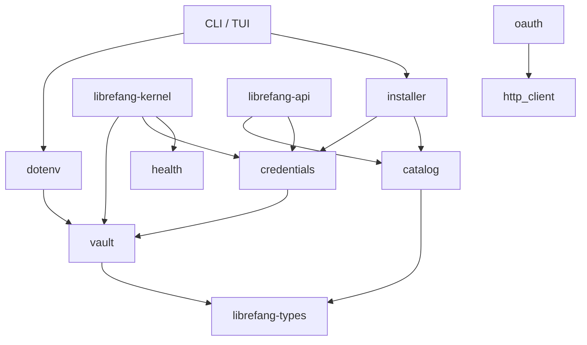

# crates — librefang-extensions

# librefang-extensions

Zestaw narzędzi „wszystko-po-stronie-agenta" dla LibreFang. Ten crate zarządza infrastrukturą otaczającą agenta MCP (Model Context Protocol) bez dotykania okablowania wywołań zwrotnych jądra, routingu HTTP ani adapterów kanałów. Znajduje się powyżej `librefang-kernel` i poniżej warstw API / CLI / desktop.

## Za co odpowiada ten crate

- **Katalog serwerów MCP** — metadane szablonów tylko do odczytu, buforowane w `~/.librefang/mcp/catalog/`
- **Magazyn poświadczeń** — szyfrowane AES-256-GCM przechowywanie sekretów z integracją z pęklą kluczy systemu operacyjnego
- **Rozwiązywanie poświadczeń** — ujednolicony łańcuch wyszukiwania w magazynie, dotenv i zmiennych środowiskowych
- **Ładowanie `.env`** — wstrzykiwanie sekretów w zakresie całego procesu z `~/.librefang/.env` i `secrets.env`
- **OAuth2 PKCE** — przepływy wywołań zwrotnych localhost z tokenami stanu podpisanymi HMAC
- **Monitor zdrowia** — śledzenie dostępności serwerów MCP z automatycznym ponownym łączeniem i wykładniczym wycofywaniem
- **Instalator** — czyste transformacje z wpisów katalogu na wartości `McpServerConfigEntry`
- **Klient HTTP** — współdzielony konstruktor `reqwest` z natywnymi + dołączonymi głównymi certyfikatami CA

## Za co ten crate NIE odpowiada

Cecha `McpOAuthProvider` znajduje się w `librefang-runtime`; implementacja znajduje się w `librefang-api`. Ten crate nie obsługuje okablowania wywołań zwrotnych jądra, routingu HTTP ani adapterów kanałów. Nic w tym crate nie może zależeć od warstw API / CLI / desktop.

## Architektura

## Odniesienie do modułów

### `catalog` — Rejestr szablonów MCP

Widok tylko do odczytu w pamięci szablonów serwerów MCP przechowywanych jako pliki TOML w `~/.librefang/mcp/catalog/`. Szablony są synchronizowane z nadrzędnego `librefang-registry` przez `librefang_runtime::registry_sync`; ten crate je tylko odczytuje.

`McpCatalog` obsługuje dwa układy na dysku:

- **Płaski:** `<id>.toml` — identyfikator pochodzi z nazwy pliku.
- **Oparty na katalogach:** `<id>/MCP.toml` — identyfikator pochodzi z nazwy katalogu. Używany dla wieloplikowych pakietów MCP.

`load()` wykonuje pełne przeładowanie: mapa w pamięci jest czyszczona przed odczytem z dysku, aby usunięte lub przemianowane wpisy nie pozostawały. Kluczowe metody:

| Metoda | Opis |
|---|---|
| `new(home_dir)` | Tworzy pusty katalog z korzeniem w `home_dir/mcp/catalog/` |
| `load(home_dir)` | Przeładowuje wszystkie szablony z dysku; zwraca liczbę załadowanych wpisów |
| `get(id)` | Pobiera konkretny wpis po ID |
| `list()` | Wszystkie wpisy posortowane po ID |
| `list_by_category(category)` | Filtruje po `McpCategory` |
| `search(query)` | Dopasowanie bez uwzględniania wielkości liter względem id, nazwy, opisu i tagów |

Katalog zawiera wyłącznie metadane. Zainstalowane serwery MCP znajdują się w `config.toml` w sekcji `[[mcp_servers]]` z opcjonalnym `template_id` wskazującym na wpis w katalogu, z którego pochodzą.

### `vault` — Szyfrowane przechowywanie AES-256-GCM

`CredentialVault` przechowuje sekrety w `~/.librefang/vault.enc`. Format na dysku zaczyna się od bajtów magicznych `OFV1` i zawiera sól Argon2id, nonce AES-256-GCM oraz szyfrogram — wszystko zakodowane w base64.

**Rozwiązywanie klucza głównego** następuje w ścisłym łańcuchu priorytetów:

1. Zmienna środowiskowa `LIBREFANG_VAULT_KEY`
2. Pętla kluczy systemu operacyjnego (Menedżer poświadczeń Windows, Keychain macOS, Secret Service Linux)
3. Awaryjny plik AES-256-GCM w `<data_local_dir>/librefang/.keyring` (tryb 0600)

Backend pętli kluczy systemu operacyjnego jest warunkowany na platformę docelową w `Cargo.toml`. Na Linuxie musl-static i Androidzie crate `keyring` nie jest dołączany, aby uniknąć problemów z C-FFI libdbus-sys. Magazyn bezproblemowo przechodzi na magazyn oparty na plikach.

**Domyślne na macOS:** `default_use_os_keyring_for_platform()` zwraca `false` na macOS, ponieważ ACL Keychain jest per-podpis binarny — każdy `cargo build` unieważnia go i wyzwala monit. Linux i Windows mają stabilne ACL i domyślnie zwracają `true`. Można nadpisać za pomocą:

- `LIBREFANG_VAULT_NO_KEYRING=1` — wymusza awaryjny magazyn plikowy niezależnie od platformy/konfiguracji
- `CredentialVault::init_with_config(use_os_keyring)` — globalne nadpisanie w zakresie procesu, pierwsze wywołanie wygrywa

**Strażnik startowy (#3651):** Każdy magazyn powstaje ze znanym tekstem jawnym pod `SENTINEL_KEY` (`__sentinel__`) ustawionym na `SENTINEL_VALUE` (`librefang-vault-sentinel-v1`). Przy każdym `unlock()` strażnik jest odczytywany i porównywany; niezgodność oznacza, że klucz nie pasuje do klucza szyfrującego i uruchomienie jest blokowane. To powoduje `ExtensionError::VaultKeyMismatch` zamiast pozwalania demonowi na ciche uruchomienie w stanie, gdzie każdy odczyt z magazynu kończy się ogólnym błędem deszyfrowania. Zapisy pod `SENTINEL_KEY` są odrzucane przez `set()`.

**Rotacja kluczy** jest obsługiwana przez `rewrap_with_new_key()`, który ponownie szyfruje cały magazyn (włącznie ze strażnikiem) nowym kluczem głównym. Wywołujący jest odpowiedzialny za utrwalenie nowego klucza. Polecenie CLI `vault rotate-key` realizuje to kompleksowo.

**Leniwa inicjalizacja:** `set()` na niezamkniętym uchwycie, gdzie `vault.enc` nie istnieje, automatycznie uruchomi `init()`, aby poświadczenie trafiło do rzeczywistego utrwalonego magazynu zamiast zostać utracone. To spełnia kontrakt udokumentowany przez `kernel::vault_handle()`.

`init()` przeprowadza weryfikację po zapisie: tworzy świeży `CredentialVault::new` na tej samej ścieżce i uruchamia `unlock()`, aby potwierdzić, że plik jest deszyfrowalny. Jeśli weryfikacja się nie powiedzie, zapisany plik jest wycofywany (usuwany) i zwracany jest błąd z wyjaśnieniem rozbieżności init/unlock.

### `credentials` — Ujednolicony łańcuch rozwiązywania

`CredentialResolver` ujednolica wyszukiwanie sekretów z czterech źródeł, sprawdzanych w kolejności:

1. **Magazyn** — `~/.librefang/vault.enc` (jeśli odblokowany)
2. **Dotenv** — migawka `~/.librefang/.env` załadowana w momencie tworzenia
3. **Środowisko procesu** — `std::env::var()`
4. **Interaktywny monit** — odczyt ze stdin, tylko gdy ustawiono `with_interactive(true)`

Dwa konstruktory obejmują dwa wzorce wywołań:

- `new(vault, dotenv_path)` — dla krótkotrwałych wywołań (podkomendy CLI, testy), które są właścicielami swojego magazynu.
- `with_vault_handle(handle, dotenv_path)` — dla długotrwałych wywołań (obsługa żądań API), które kierują przez buforowany, już odblokowany magazyn jądra przez `Arc<RwLock<CredentialVault>>`. To unika ponownego uruchamiania Argon2id KDF przy każdym żądaniu (#3598).

Wszystkie rozwiązane wartości są opakowane w `Zeroizing<String>`. Pamięć podręczna dotenv może zostać unieważniona w czasie działania przez `clear_dotenv_cache(key)`, aby klucz usunięty przez panel nie zwracał nieaktualnej migawki z czasu uruchomienia.

Analizator pliku dotenv zawiera zabezpieczenie `len() >= 2` przed usunięciem otaczających cudzysłowów. Bez niego pojedynczy znak apostrofu (`KEY="`) spełniałby warunki `starts_with('"')` i `ends_with('"')` na tym samym bajcie, a `value[1..0]` spowodowałby panikę.

### `dotenv` — Wstrzykiwanie sekretów w zakresie całego procesu

`load_dotenv()` jest zaprojektowane do wywołania dokładnie raz z synchronicznej funkcji `main()` binary, **przed** uruchomieniem runtime tokio. `std::env::set_var` to niezdefiniowane zachowanie w Rust 1.80+ po istnieniu innych wątków.

Kolejność ładowania jest starannie ułożona:

1. **Wstępne zasiewanie `LIBREFANG_VAULT_KEY`** z `.env` / `secrets.env` do środowiska procesu (ale tylko jeśli środowisko systemowe go jeszcze nie ma — środowisko systemowe wygrywa). Jest to konieczne, ponieważ `CredentialVault::resolve_master_key()` odczytuje klucz ze `std::env`, a magazyn musi być odblokowany przed wstrzyknięciem jego sekretów. Bez wstępnego zasiewania magazyn cicho nie udaje się odblokować i każdy sekret przechowywany w magazynie staje się niedostępny na czas życia procesu (#5139).
2. **Załadowanie magazynu** — odblokowanie i wstrzyknięcie wszystkich sekretów magazynu do `std::env`.
3. **Załadowanie `.env`** — wstrzyknięcie pozostałych wpisów, z pominięciem już ustawionych kluczy.
4. **Załadowanie `secrets.env`** — analogicznie, z pominięciem istniejących kluczy.

Ogólny priorytet to: **środowisko systemowe > magazyn > .env > secrets.env**. Istniejące zmienne środowiskowe procesu nigdy nie są nadpisywane.

`parse_env_line()` obsługuje usuwanie cudzysłowów i sekwencje ucieczki:
- Wartości w podwójnych cudzysłowach podlegają odwrotnemu przetwarzaniu ucieczki (`\n`, `\r`, `\"`, `\\`)
- Wartości w pojedynczych cudzysłowach są dosłowne (bez przetwarzania ucieczki)
- Zabezpieczenie `len() >= 2` zapobiega panice pojedynczego cudzysłowu

`write_env_file()` zapisuje atomowo: tworzony jest plik tymczasowy (nazwany z PID dla unikalności) z trybem 0600 w momencie otwarcia na Unix, zapisywany, opróżniany, fsyncowany, a następnie zmieniany jako nazwa docelowa. To zamyka trzy problemy ze starej ścieżki `std::fs::write`: awarie w trakcie zapisu zostawiające obcięte pliki, okna TOCTOU z domyślnymi uprawnieniami oraz współbieżne zapisy współdzielące ścieżkę tymczasową.

### `oauth` — OAuth2 PKCE z dynamiczną rejestracją klienta

Realizuje kompletny przepływ PKCE dla dostawców zintegrowanych z MCP (Google, GitHub, Microsoft, Slack). Przepływ to:

1. Wygenerowanie pary weryfikator/wyzwanie PKCE (S256)
2. Powiązanie losowego portu localhost przez `tokio::net::TcpListener`
3. Zbudowanie tokenu stanu podpisanego HMAC łączącego `(provider, client_id, redirect_uri, nonce, expiry)` z TTL 10 minut
4. Otwarcie przeglądarki pod adresem URL autoryzacji
5. Obsługa jednorazowego wywołania zwrotnego axum, które weryfikuje stan, odrzuca powtórki i wyodrębnia kod autoryzacji
6. Wymiana kodu na tokeny przez endpoint tokenów
7. Zwrócenie `OAuthTokens`

**Bezpieczeństwo stanu (#3791):** Token stanu to `base64url(payload_json).base64url(hmac)`. Klucz HMAC jest globalny w zakresie procesu i ponownie zasiewany przy każdym restarcie demona, unieważniając wszystkie trwające przepływy z poprzedniego procesu. `verify_signed_state()` odrzuca:

- Zniekształcone tokeny
- Błędne sygnatury HMAC (porównanie w stałym czasie przez `subtle::ct_eq`)
- Przeterminowane ładunki
- Niedopasowania provider, client_id lub redirect_uri

Procedura obsługi wywołania zwrotnego wymusza również równość nonce i honoruje tylko pierwsze prawidłowe wywołanie zwrotne — kolejne trafienia na tym samym nasłuchiwaczu otrzymują odpowiedź „Gone".

Client ID są rozwiązywane z `resolve_client_ids()`, który nakłada nadpisania z konfiguracji (`OAuthConfig.google_client_id` itd.) na `default_client_ids()`.

`run_pkce_flow()` ma 5-minutowy limit czasu. Jeśli dostawca zwróci parametr `error`, wywołanie zwrotne sygnalizuje oczekujący natychmiast, zamiast pozwalania mu czekać do limitu czasu.

### `health` — Monitorowanie dostępności serwerów MCP

`HealthMonitor` śledzi stan zdrowia dla każdego serwera w `DashMap<String, McpHealth>`. Ścieżka przeładowania konfiguracji jądra wywołuje `register()` / `unregister()` gdy serwery są dodawane lub usuwane przez hot-reload.

Stany zdrowia śledzone dla każdego serwera:
- Bieżący `McpStatus` (Available, Ready, Error)
- Liczba narzędzi z ostatniego udanego sprawdzenia
- Znacznik czasu ostatniego udanego sprawdzenia
- Liczba kolejnych niepowodzeń
- Stan ponownego łączenia (w trakcie, liczba prób)
- Znacznik czasu połączenia od

Automatyczne ponowne łączenie używa wykładniczego wycofywania: `5s * 2^próba`, ograniczone do `max_backoff_secs` (domyślnie 300s/5min), z maksymalnie 10 próbami przed poddaniem się. `should_reconnect()` zwraca `false` gdy automatyczne ponowne łączenie jest wyłączone, serwer jest zdrowy lub budżet prób jest wyczerpany.

### `http_client` — Współdzielony konstruktor klienta TLS

`client_builder()` i `new_client()` tworzą klienta `reqwest` wstępnie skonfigurowanego z:

- Natywnymi głównymi certyfikatami CA ładowanymi przez `rustls-native-certs`, z awaryjnym przejściem na `webpki-roots` jeśli nie dodano żadnych natywnych certyfikatów
- 10-sekundowym limitem czasu połączenia, 30-sekundowym limitem czasu odczytu (ogranicza zawieszone żądania / amplifikację SSRF)
- Polityką przekierowań ograniczoną do 5 przeskoków (zapobiega amplifikacji SSRF przez pętle przekierowań)

Nie ma `shared_client()` — wywołujący powinni używać `client_builder()` do konfiguracji niestandardowej lub `new_client()` dla wartości domyślnych.

### `installer` — Czyste transformacje katalog-konfiguracja

`install_integration()` jest czystą funkcją, która przekształca wpis katalogu plus dostarczone poświadczenia w `InstallResult` zawierający gotowy do utrwalenia `McpServerConfigEntry`. Bez skutków ubocznych — wywołujący decyduje, kiedy zapisać do `config.toml` i wyzwolić przeładowanie jądra.

Transformacja:

1. Wyszukuje szablon po ID z katalogu
2. Przechowuje dostarczone klucze w magazynie (best-effort, niekrytyczne przy niepowodzeniu)
3. Sprawdza, których wymaganych zmiennych środowiskowych nadal brakuje poświadczeń (wykluczając te właśnie dostarczone)
4. Mapuje transport szablonu + wymagane zmienne środowiskowe na `McpServerConfigEntry`
5. Zwraca status `Ready` (wszystkie poświadczenia obecne) lub `Setup` (brakuje poświadczeń)

Zwrócony `InstallResult` konwertuje na `IntegrationOutcome` z `librefang-types` przez `From`, zachowując wszystkie dane pól, aby fasada jądra `install_integration` mogła zwrócić typ bez zależności.

`catalog_entry_to_mcp_server()` ustawia `template_id` na ID katalogu, aby panel mógł śledzić, które wpisy pochodzą z katalogu. `oauth_template_to_config()` mapuje `OAuthTemplate` na `McpOAuthConfig` z `client_id` pozostawionym jako `None` (rozwiązanym później przez przepływ OAuth).

`scaffold_integration()` i `scaffold_skill()` generują pliki szablonów dla użytkowników budujących niestandardowe serwery MCP lub umiejętności.

## Obsługa błędów

`ExtensionError` to crate-owa wyliczenie błędów. Istotne warianty:

- `NotFound` — wpis katalogu nie znaleziony
- `VaultLocked` — magazyn wymaga odblokowania przed operacjami
- `VaultKeyMismatch` — zawiera pole `hint` z instrukcjami odzyskiwania dla operatora; wynika ze sprawdzenia strażnika i wyzwala `BootFailed` w demona
- `Vault` — ogólne błędy magazynu

`From<ExtensionError> for IntegrationError` łączy przestrzeń błędów tego crate z wolnym od zależności `IntegrationError` w `librefang-types`. Mapowanie zachowuje dyskryminant, na którym warstwa API opiera kody statusu HTTP: `NotFound` → 404, warianty magazynu → `Vault`, wszystko inne → `Other` z zachowaniem oryginalnej wiadomości `Display` dosłownie.

## Punkty integracji

| Odbiorca | Jak się łączy |
|---|---|
| **CLI (`librefang-cli`)** | Wywołuje `dotenv::load_dotenv()` z `main()` przed uruchomieniem runtime; wywołuje `vault::CredentialVault::init()` z launchera, kreatora inicjalizacji i ekranów free-provider-guide; wywołuje `installer::install_integration()` z `cmd_mcp_add`; wywołuje `installer::scaffold_integration/scaffold_skill` z `cmd_scaffold`; wywołuje `dotenv::save_env_key/remove_env_key` z poleceń konfiguracyjnych |
| **Jądro (`librefang-kernel`)** | Wywołuje `HealthMonitorConfig` i `CredentialVault::init_with_config()` z `boot_with_config`; wywołuje `credentials::CredentialResolver::with_vault_handle()` z `install_integration`; wywołuje `health::HealthMonitor::register/unregister` z akcji hot-reload konfiguracji |
| **API (`librefang-api`)** | Wywołuje `credentials::CredentialResolver::with_vault_handle()` do rozwiązywania w zakresie żądania; wywołuje `health::HealthMonitor::get_health()` do wyświetlania statusu |
| **TUI** | Wywołuje `vault::CredentialVault::init()` z chat runner i inicjalizacji modułów; wywołuje `dotenv::save_env_key()` z kreatora inicjalizacji i ekranów free-provider-guide |

## Zasady poprzeczne

Zagadnienia poprzeczne (URL-e wywołań zwrotnych Docker, własność przepływu OAuth między demonem a API, obsługa kluczy magazynu, ograniczenia `LIBREFANG_VAULT_KEY`, lista dozwolonych middleware autoryzacji) są zdefiniowane w nadrzędnym `CLAUDE.md` i powinny być konsultowane przed dodawaniem kodu przekraczającego granicę crate. Są celowo nie dublowane tutaj, aby uniknąć rozbieżności.
