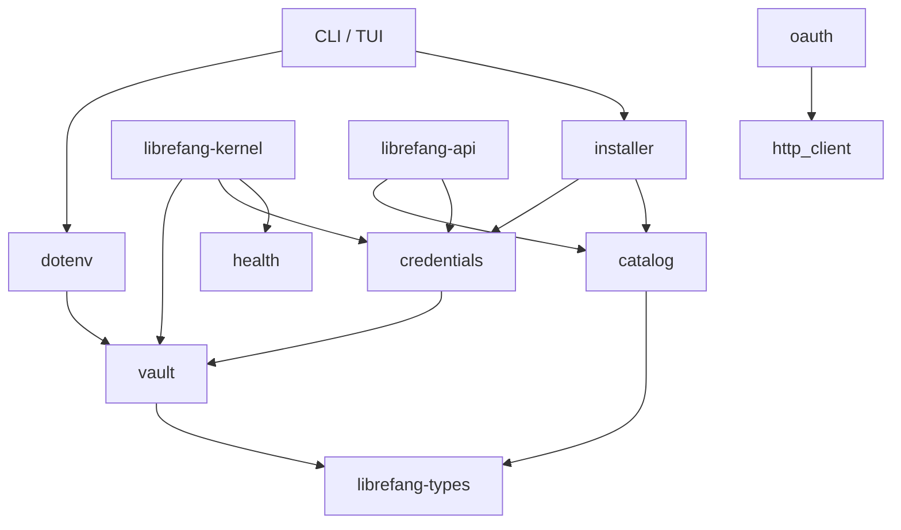

# crates — librefang-extensions

# librefang-extensions

The "everything-side-of-an-agent" toolkit for LibreFang. This crate owns the infrastructure that surrounds an MCP (Model Context Protocol) agent without touching kernel callback wiring, HTTP routing, or channel adapters. It sits above `librefang-kernel` and below the API / CLI / desktop layers.

## What This Crate Owns

- **MCP Server Catalog** — read-only template metadata cached at `~/.librefang/mcp/catalog/`
- **Credential Vault** — AES-256-GCM encrypted secret storage with OS keyring integration
- **Credential Resolution** — unified lookup chain across vault, dotenv, and environment variables
- **`.env` Loading** — process-wide secret injection from `~/.librefang/.env` and `secrets.env`
- **OAuth2 PKCE** — localhost callback flows with HMAC-signed state tokens
- **Health Monitor** — MCP server liveness tracking with auto-reconnect and exponential backoff
- **Installer** — pure transforms from catalog entries into `McpServerConfigEntry` values
- **HTTP Client** — shared `reqwest` builder with native + bundled CA roots

## What This Crate Does NOT Own

The `McpOAuthProvider` trait lives in `librefang-runtime`; the implementation lives in `librefang-api`. This crate does not handle kernel callback wiring, HTTP routing, or channel adapters. Nothing in this crate may depend on the API / CLI / desktop layers.

## Architecture

## Module Reference

### `catalog` — MCP Template Registry

Read-only in-memory view of MCP server templates stored as TOML files under `~/.librefang/mcp/catalog/`. Templates are synced from the upstream `librefang-registry` by `librefang_runtime::registry_sync`; this crate only reads them.

`McpCatalog` supports two on-disk layouts:

- **Flat:** `<id>.toml` — id derived from the filename.
- **Directory-backed:** `<id>/MCP.toml` — id derived from the directory name. Used for multi-file MCP packages.

`load()` performs a full reload: the in-memory map is cleared before reading disk so deleted or renamed entries don't linger. Key methods:

| Method | Description |
|---|---|
| `new(home_dir)` | Create an empty catalog rooted at `home_dir/mcp/catalog/` |
| `load(home_dir)` | Reload all templates from disk; returns count loaded |
| `get(id)` | Fetch a specific entry by ID |
| `list()` | All entries sorted by ID |
| `list_by_category(category)` | Filter by `McpCategory` |
| `search(query)` | Case-insensitive match against id, name, description, and tags |

The catalog is purely metadata. Installed MCP servers live in `config.toml` under `[[mcp_servers]]` with an optional `template_id` pointing back to the catalog entry they originated from.

### `vault` — AES-256-GCM Encrypted Storage

`CredentialVault` stores secrets at `~/.librefang/vault.enc`. The on-disk format begins with magic bytes `OFV1` and contains an Argon2id salt, AES-256-GCM nonce, and ciphertext — all base64-encoded.

**Master key resolution** follows a strict priority chain:

1. `LIBREFANG_VAULT_KEY` environment variable
2. OS keyring (Windows Credential Manager, macOS Keychain, Linux Secret Service)
3. AES-256-GCM file fallback at `<data_local_dir>/librefang/.keyring` (mode 0600)

The OS keyring backend is target-gated in `Cargo.toml`. On musl-static Linux and Android, the `keyring` crate is not pulled to avoid libdbus-sys C-FFI issues. The vault transparently falls back to the file-based store.

**macOS default:** `default_use_os_keyring_for_platform()` returns `false` on macOS because the Keychain ACL is per-binary signature — every `cargo build` invalidates it and triggers a prompt. Linux and Windows have stable ACLs and default to `true`. Override with:

- `LIBREFANG_VAULT_NO_KEYRING=1` — force file fallback regardless of platform/config
- `CredentialVault::init_with_config(use_os_keyring)` — process-global override, first call wins

**Startup sentinel (#3651):** Every vault is born with a known plaintext under `SENTINEL_KEY` (`__sentinel__`) set to `SENTINEL_VALUE` (`librefang-vault-sentinel-v1`). On every `unlock()`, the sentinel is read and compared; a mismatch means the key doesn't match the encryption key and boot refuses to start. This surfaces `ExtensionError::VaultKeyMismatch` instead of letting the daemon silently boot into a state where every vault read fails with a generic decryption error. Writes to `SENTINEL_KEY` are rejected by `set()`.

**Key rotation** is supported via `rewrap_with_new_key()`, which re-encrypts the entire vault (including the sentinel) under a new master key. The caller is responsible for persisting the new key. The CLI's `vault rotate-key` command drives this end-to-end.

**Lazy initialization:** `set()` on an unopened handle where `vault.enc` does not exist will run `init()` automatically, so the credential lands in a real persisted vault instead of being dropped. This satisfies the contract documented by `kernel::vault_handle()`.

`init()` performs a post-write verification: it constructs a fresh `CredentialVault::new` on the same path and runs `unlock()` to confirm the file is decryptable. If verification fails, the written file is rolled back (unlinked) and an error is returned explaining the init/unlock divergence.

### `credentials` — Unified Resolution Chain

`CredentialResolver` unifies secret lookup across four sources, tried in order:

1. **Vault** — `~/.librefang/vault.enc` (if unlocked)
2. **Dotenv** — `~/.librefang/.env` snapshot loaded at construction time
3. **Process environment** — `std::env::var()`
4. **Interactive prompt** — stdin read, only when `with_interactive(true)` is set

Two constructors cover the two caller patterns:

- `new(vault, dotenv_path)` — for short-lived callers (CLI subcommands, tests) that own their vault.
- `with_vault_handle(handle, dotenv_path)` — for long-lived callers (API request handlers) that route through the kernel's cached, already-unlocked vault via `Arc<RwLock<CredentialVault>>`. This avoids re-running the Argon2id KDF on every request (#3598).

All resolved values are wrapped in `Zeroizing<String>`. The dotenv cache can be invalidated at runtime via `clear_dotenv_cache(key)` so a key deleted through the dashboard doesn't return a stale boot-time snapshot.

The dotenv file parser includes a `len() >= 2` guard before stripping surrounding quotes. Without it, a bare single-quote character (`KEY="`) satisfies both `starts_with('"')` and `ends_with('"')` on the same byte, and `value[1..0]` would panic.

### `dotenv` — Process-Wide Secret Injection

`load_dotenv()` is designed to be called exactly once from a binary's synchronous `main()`, **before** the tokio runtime starts. `std::env::set_var` is UB in Rust 1.80+ once other threads exist.

The loading order is carefully sequenced:

1. **Pre-seed `LIBREFANG_VAULT_KEY`** from `.env` / `secrets.env` into the process environment (but only if the system environment doesn't already have it — system env wins). This is necessary because `CredentialVault::resolve_master_key()` reads the key from `std::env`, and the vault must be unlocked before its secrets are injected. Without pre-seeding, the vault silently fails to unlock and every vault-stored secret becomes unavailable for the process lifetime (#5139).
2. **Load vault** — unlock and inject all vault secrets into `std::env`.
3. **Load `.env`** — inject remaining entries, skipping any key already set.
4. **Load `secrets.env`** — same, skipping existing keys.

The overall priority is: **system env > vault > .env > secrets.env**. Existing process environment variables are never overridden.

`parse_env_line()` handles quote stripping and escape sequences:
- Double-quoted values undergo escape unescaping (`\n`, `\r`, `\"`, `\\`)
- Single-quoted values are literal (no escape processing)
- The `len() >= 2` guard prevents the bare-quote panic

`write_env_file()` writes atomically: a temp file (named with PID for uniqueness) is created with mode 0600 at open time on Unix, written, flushed, fsynced, then renamed over the target. This closes three issues from the old `std::fs::write` path: mid-write crashes leaving truncated files, default-perms TOCTOU windows, and concurrent saves sharing a staging path.

### `oauth` — OAuth2 PKCE with Dynamic Client Registration

Implements the complete PKCE flow for MCP-integrated providers (Google, GitHub, Microsoft, Slack). The flow is:

1. Generate a PKCE verifier/challenge pair (S256)
2. Bind a random localhost port via `tokio::net::TcpListener`
3. Build an HMAC-signed state token binding `(provider, client_id, redirect_uri, nonce, expiry)` with a 10-minute TTL
4. Open the browser to the authorization URL
5. Serve a one-shot axum callback handler that verifies state, rejects replays, and extracts the authorization code
6. Exchange the code for tokens via the token endpoint
7. Return `OAuthTokens`

**State security (#3791):** The state token is `base64url(payload_json).base64url(hmac)`. The HMAC key is process-global and re-seeded on every daemon restart, invalidating any in-flight flows from a prior process. `verify_signed_state()` rejects:

- Malformed tokens
- Bad HMAC signatures (constant-time comparison via `subtle::ct_eq`)
- Expired payloads
- Provider, client_id, or redirect_uri mismatches

The callback handler also enforces nonce equality and only honors the first valid callback — subsequent hits on the same listener receive a "Gone" response.

Client IDs resolve from `resolve_client_ids()` which overlays config overrides (`OAuthConfig.google_client_id`, etc.) on top of `default_client_ids()`.

`run_pkce_flow()` has a 5-minute timeout. If the provider returns an `error` parameter, the callback signals the waiter immediately rather than letting it hang until timeout.

### `health` — MCP Server Liveness Monitoring

`HealthMonitor` tracks per-server health state in a `DashMap<String, McpHealth>`. The kernel's config-reload path calls `register()` / `unregister()` as servers are added or removed via hot-reload.

Health states tracked per server:
- Current `McpStatus` (Available, Ready, Error)
- Tool count from last successful check
- Last successful check timestamp
- Consecutive failure count
- Reconnect state (in-progress, attempt count)
- Connected-since timestamp

Auto-reconnect uses exponential backoff: `5s * 2^attempt`, capped at `max_backoff_secs` (default 300s/5min), with a maximum of 10 attempts before giving up. `should_reconnect()` returns `false` when auto-reconnect is disabled, the server is healthy, or the attempt budget is exhausted.

### `http_client` — Shared TLS Client Builder

`client_builder()` and `new_client()` produce a `reqwest` client preconfigured with:

- Native CA roots loaded via `rustls-native-certs`, falling back to `webpki-roots` if zero native certs are added
- 10-second connect timeout, 30-second read timeout (bounds hung requests / SSRF amplification)
- Redirect policy limited to 5 hops (prevents redirect-loop SSRF amplification)

There is no `shared_client()` — callers should use `client_builder()` for custom configuration or `new_client()` for the defaults.

### `installer` — Pure Catalog-to-Config Transforms

`install_integration()` is a pure function that transforms a catalog entry plus provided credentials into an `InstallResult` containing a ready-to-persist `McpServerConfigEntry`. No side effects — the caller decides when to write to `config.toml` and trigger a kernel reload.

The transform:

1. Looks up the template by ID from the catalog
2. Stores provided keys in the vault (best-effort, non-fatal on failure)
3. Checks which required env vars still lack credentials (excluding those just provided)
4. Maps the template transport + required env into a `McpServerConfigEntry`
5. Returns a status of `Ready` (all creds present) or `Setup` (creds still missing)

The returned `InstallResult` converts into `IntegrationOutcome` from `librefang-types` via `From`, preserving all field data so the kernel's `install_integration` façade can return the dependency-free type.

`catalog_entry_to_mcp_server()` sets `template_id` to the catalog ID so the dashboard can trace which entries originated from the catalog. `oauth_template_to_config()` maps an `OAuthTemplate` to `McpOAuthConfig` with `client_id` left as `None` (resolved later by the OAuth flow).

`scaffold_integration()` and `scaffold_skill()` generate template files for users building custom MCP servers or skills.

## Error Handling

`ExtensionError` is the crate-wide error enum. Notable variants:

- `NotFound` — catalog entry not found
- `VaultLocked` — vault needs unlocking before operations
- `VaultKeyMismatch` — carries a `hint` field with operator recovery instructions; surfaces from the sentinel check and triggers a `BootFailed` in the daemon
- `Vault` — generic vault errors

`From<ExtensionError> for IntegrationError` bridges this crate's error space to the dependency-free `IntegrationError` in `librefang-types`. The mapping preserves the discriminant the API layer keys HTTP status codes off: `NotFound` → 404, vault variants → `Vault`, everything else → `Other` with the original `Display` message preserved verbatim.

## Integration Points

| Consumer | How it connects |
|---|---|
| **CLI (`librefang-cli`)** | Calls `dotenv::load_dotenv()` from `main()` before runtime start; calls `vault::CredentialVault::init()` from the launcher, init wizard, and free-provider-guide screens; calls `installer::install_integration()` from `cmd_mcp_add`; calls `installer::scaffold_integration/scaffold_skill` from `cmd_scaffold`; calls `dotenv::save_env_key/remove_env_key` from config commands |
| **Kernel (`librefang-kernel`)** | Calls `HealthMonitorConfig` and `CredentialVault::init_with_config()` from `boot_with_config`; calls `credentials::CredentialResolver::with_vault_handle()` from `install_integration`; calls `health::HealthMonitor::register/unregister` from config-reload hot actions |
| **API (`librefang-api`)** | Calls `credentials::CredentialResolver::with_vault_handle()` for request-scoped resolution; calls `health::HealthMonitor::get_health()` for status display |
| **TUI** | Calls `vault::CredentialVault::init()` from chat runner and module init; calls `dotenv::save_env_key()` from the init wizard and free-provider-guide screens |

## Cross-Cutting Rules

Cross-cutting concerns (Docker callback URLs, OAuth flow ownership between daemon and API, vault key handling, `LIBREFANG_VAULT_KEY` constraints, the auth middleware allowlist) are defined in the top-level `CLAUDE.md` and should be consulted before adding code that crosses the crate boundary. They are intentionally not duplicated here to avoid drift.