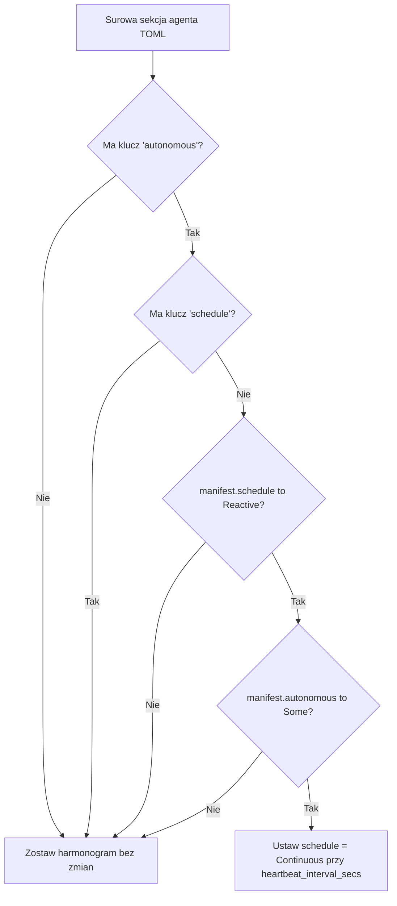

# crates — librefang-hands

# librefang-hands

Kuratowane pakiety autonomicznych możliwości — system typów, schemat TOML, klient marketplace'u oraz lokalny rejestr dla „Rąk" LibreFang.

**Ręka** (Hand) to gotowa, kompletna w danej domenie konfiguracja agenta, którą użytkownicy aktywują z marketplace'u. W przeciwieństwie do zwykłych agentów (z którymi użytkownicy rozmawiają interaktywnie), Ręce działają *za* użytkownika zgodnie z harmonogramem lub w reakcji na zdarzenia — użytkownik sprawdza ich stan, zamiast sterować nimi ruch po ruchu.

## Układ modułu

| Plik | Odpowiedzialność |
|------|-----------------|
| `src/lib.rs` | Typy podstawowe, enum błędów, schemat `HAND.toml`, rozwiązywanie ustawień, normalizacja formatu agenta |
| `src/hands_hub.rs` | Zdalny klient marketplace'u (`HandsHubClient`) — przeglądanie indeksu, pobieranie pakietów, weryfikacja sum kontrolnych |
| `src/registry.rs` | Lokalny rejestr rąk — instalacja, aktywacja, deaktywacja, utrwalanie stanu, skanowanie dysku, skanowanie łańcucha dostaw |

## Podstawowy model danych

### HandDefinition

`HandDefinition` to sparsowana reprezentacja pliku `HAND.toml`. Implementuje `Serialize` (ale posiada niestandardową `Deserialize`, która uruchamia walidację i normalizację formatu agenta podczas deserializacji).

Kluczowe pola:

- **`id`** — identyfikator bezpieczny dla systemu plików (walidowany pod kątem przechodzenia ścieżek; staje się `home/workspaces/{id}/`).
- **`agents`** — `BTreeMap<String, HandAgentManifest>`, indeksowany po nazwie roli. Ręki jednagentowe są przechowywane pod kluczem `"main"` z `coordinator = true`.
- **`settings`** — schemat konfigurowalnych ustawień wyświetlanych w modalu aktywacji.
- **`requires`** — wymagania środowiskowe/binarne sprawdzane przed aktywacją.
- **`skill_content` / `agent_skill_content`** — wypełniane w czasie ładowania z plików `SKILL.md` / `SKILL-{role}.md`; nie jest częścią TOML.
- **`i18n`** — zlokalizowane ciągi znaków nazwy/opisu/agenta/ustawień indeksowane kodem języka.
- **`routing`** — silne (`aliases`, ×3) i słabe (`weak_aliases`, ×1) słowa kluczowe dla deterministycznego wyboru ręki.

### HandInstance

Rekord środowiska uruchomieniowego łączący `HandDefinition` z uruchomionymi agentami:

```rust
pub struct HandInstance {
    pub instance_id: Uuid,
    pub hand_id: String,
    pub status: HandStatus,           // Active | Paused | Error(String) | Inactive
    pub agent_ids: BTreeMap<String, AgentId>,
    pub coordinator_role: Option<String>,
    pub config: HashMap<String, serde_json::Value>,
    pub agent_runtime_overrides: BTreeMap<String, HandAgentRuntimeOverride>,
    pub activated_at: DateTime<Utc>,
    pub updated_at: DateTime<Utc>,
}
```

`HandAgentRuntimeOverride` pozwala na nadpisywanie modelu/dostawcy/tokena/temperatury dla poszczególnych agentów, które przetrwają restarty demona, ale są czyszczone przy deaktywacji.

### Rozwiązywanie koordynatora

`HandDefinition::coordinator()` zwraca agenta oznaczonego `coordinator = true`, z awarią na pierwszego agenta według nazwy roli (porządek BTreeMap). `HandInstance::coordinator_role()` stosuje tę samą logikę względem uruchomionej mapy `agent_ids`, z priorytetem jawnego pola `coordinator_role`.

## Parsowanie HAND.toml

### Dwa formaty agentów

Ręka deklaruje agentów w jednym z dwóch wzajemnie wykluczających się formatów:

**Jednoagentowy** (`[agent]`):
```toml
[agent]
name = "clip-agent"
system_prompt = "..."
```
Automatycznie konwertowany do `{"main": HandAgentManifest { coordinator: true, .. }}`.

**Wieloagentowy** (`[agents.<role>]`):
```toml
[agents.planner]
coordinator = true
invoke_hint = "Use planner for task decomposition"

[agents.analyst]
system_prompt = "..."
```

### Płaski vs zagnieżdżony format modelu

Każda sekcja agenta obsługuje dwa formaty opisu modelu:

- **Płaski (legacy):** `provider`, `model`, `system_prompt`, `max_tokens`, `temperature`, `api_key_env`, `base_url` jako skalary najwyższego poziomu w sekcji agenta. Parsowane przez `LegacyHandAgentConfig`.
- **Zagnieżdżony:** podtabela `[agents.<role>.model]`. Parsowane przez `AgentManifest::deserialize`.

Parser wykrywa obecny format, sprawdzając czy sekcja zawiera *tabelę* `model` (nie skalar `model = "..."`). Dla sekcji płaskich próbowane jest najpierw `LegacyHandAgentConfig` — nie ma `deny_unknown_fields`, więc `schedule`, `[autonomous]` i `exec_policy` są jawnie przepuszczane (zagadnienia #6594, #6595).

### Rozwiązywanie autonomicznego harmonogramu

`apply_explicit_autonomous_schedule` to funkcja krytyczna dla semantyki harmonogramowania:



Kluczowe rozróżnienie: samo `manifest.autonomous` nie może odpowiedzieć na pytanie „czy autor poprosił o autonomię?", ponieważ `From<LegacyHandAgentConfig>` syntetyzuje `AutonomousConfig` tylko po to, by przenieść płaski limit głębokości pętli `max_iterations`. Tylko *surowa tabela TOML* potrafi odróżnić blok `[autonomous]` napisany przez autora od zsyntetyzowanego. Dlatego decyzja jest podejmowana w czasie parsowania względem `toml::Value`, a nie w dół strumienia względem zdeserializowanego manifestu.

To rozwiązanie jest **idempotentne przez cykle serializacji/re-parsowania**: rozwiązane pole `schedule` jest zawsze serializowane (bez `skip_serializing_if`), więc sprawdzenie klucza `schedule` zapobiega ponownemu wyzwoleniu harmonogramowania ciągłego przy re-parsowaniu.

Ta zasada jest celowo specyficzna dla rąk — samodzielne pliki `agent.toml` uruchamiane bezpośrednio nie podlegają temu traktowaniu, mimo że ten sam plik użyty jako szablon `base =` nim podlega.

### Dziedziczenie szablonu bazowego

Wpisy wieloagentowe mogą odwoływać się do współdzielonego szablonu agenta:

```toml
[agents.writer]
base = "my-writer"           # ładuje agents/my-writer/agent.toml

[agents.writer.model]
system_prompt = "Override"   # głęboko scalone na szczycie bazy
```

Przepływ rozwiązywania w `parse_multi_agent_entry`:

1. Walidacja nazwy szablonu (brak `..`, `/` lub `\` — zabezpieczenie przed przechodzeniem ścieżek).
2. Odczyt `agents/<name>/agent.toml`.
3. `normalize_flat_to_nested` — przeniesienie płaskich pól modelu legacy do podtabeli `[model]` aby głębokie scalanie działało poprawnie.
4. `deep_merge_toml(base, overlay)` — pola ręki nadpisują bazę; tabele scalają się rekursywnie, skalary/tablice zastępują.
5. Parsowanie scalonej wartości przez `parse_single_agent_section`.

### Walidacja identyfikatora ręki

`validate_hand_id` odrzuca wartości, które byłyby niebezpieczne jako składniki ścieżki systemu plików (`../`, `/`, `\`, `.`, początkowe kropki, znaki kontrolne, białe znaki). Wymuszane wewnątrz `build_hand_from_raw`, aby każdy ścieżka parsowania — implementacja `Deserialize` i `parse_hand_definition` — była objęta.

## Rozwiązywanie ustawień

Ustawienia są deklarowane w blokach `[[settings]]` ze schematem (`HandSetting`), a użytkownicy dostarczają wartości przez mapę konfiguracyjną `HashMap<String, serde_json::Value>`.

### Obliczanie efektywnej wartości

`effective_setting_value` jest jedynym źródłem prawdy dla „na co jest ustawione to ustawienie":

1. Wyszukanie zapisanej wartości; wymuszenie typów skalarów przez `setting_value_as_str` (ciągi znaków przechodzą, `true`/`false` → `"true"`/`"false"`, liczby → ich forma tekstowa). Nieskalary (tablice, obiekty, null) zwracają `None`.
2. Dla ustawień `Select` z zadeklarowanymi opcjami, sprawdzenie czy wymuszona wartość odpowiada zadeklarowanej opcji. Jeśli nie, awaria na `setting.default`.
3. W przeciwnym razie wymuszona wartość wygrywa.

To zapobiega sytuacji, w której zapisane `{"trading_mode": true}` renderuje w prompcie `- Trading Mode: true (true)` i cicho pomija `provider_env` dopasowanej opcji z allowlisty zmiennych środowiskowych podprocesu (zagadnienie #6636).

`resolve_settings` buduje `ResolvedSettings` zawierające:
- Blok markdown `## User Configuration` dołączany do system promptu.
- Listę nazw zmiennych środowiskowych, które podproces agenta powinien otrzymać (z dopasowanej opcji `provider_env` lub ustawienia tekstowego `env_var`).

`undeclared_setting_keys` raportuje zapisane klucze, których schemat nie deklaruje — wyłapuje literówki takie jak `tradingmode` vs `trading_mode`, które są przechowywane trwale, ale nic nie wpływają.

## Model bezpieczeństwa

### Przechodzenie ścieżek

`id` ręki jest walidowane w czasie parsowania (alphanumeric ASCII + `-`/`_`, początek alfanumeryczny, max 128 znaków). Ta wartość trafia do ścieżek katalogów `home/workspaces/{id}/`.

### Uodparnianie na SSRF marketplace'u

`HandsHubClient` stosuje trzy warstwy obrony:

1. **Sprawdzenie SSRF na granicy API** — wykonywane przez wywołującego (`routes::skills::install_hand_from_marketplace`) przed zbudowaniem klienta.
2. **Wyłączone automatyczne przekierowania** — `reqwest::redirect::Policy::none()`. Odpowiedź 3xx z rejestru jest zgłaszana jako błąd zamiast być podążaną do adresu wewnętrznego. Rejestr serwuje `/index` i `/bundle` bezpośrednio; żaden prawidłowy przepływ nie wymaga przekierowania.
3. **Pinning DNS** — `HandsHubClient::with_pinned_url` przypina nazwę hosta do dokładnych wartości `IpAddr` zwalidowanych przez sprawdzenie SSRF, zamykając okno TOCTOU rebindingu DNS.

### Integralność pakietu

`download_bundle` strumieniuje treść odpowiedzi, haszując SHA-256 w miarę napływu fragmentów:

- **Limit rozmiaru** — 8 MiB twardy limit (`MAX_BUNDLE_BYTES`). `Content-Length` to szybkie wstępne odrzucenie; strumieniowa guardia jest autorytatywna i przerywa w momencie przekroczenia limitu przez bieżącą sumę.
- **Weryfikacja sumy kontrolnej** — porównywana z `expected_sha256` z wpisu indeksu *przed* parsowaniem lub zapisem treści. Jeśli rejestr nie reklamuje digestu, pakiet instaluje się niezweryfikowany (logowane jako ostrzeżenie).

Pakiet to koperta JSON:
```json
{ "toml": "<zawartość HAND.toml>", "skill": "<zawartość SKILL.md>" }
```
Pole `skill` jest opcjonalne (ręki bez promptu je pomijają).

## API klienta HandsHub

```rust
// Domyślny rejestr
let client = HandsHubClient::new();

// Niestandardowy rejestr (bez pinningu DNS — tylko testy)
let client = HandsHubClient::with_url("https://custom.registry/api/v1");

// Produkcyjny: przypięty DNS
let client = HandsHubClient::with_pinned_url(url, hostname, &validated_ips);
```

| Metoda | Endpoint | Opis |
|--------|----------|-----|
| `fetch_index()` | `GET /index` | Pełny katalog rejestru |
| `browse(limit)` | `GET /index` | Wpisy posortowane po id, obcięte |
| `search(query, limit)` | `GET /index` | Niewrażliwy na wielkość liter podciąg po id/nazwa/opis |
| `get_entry(id)` | `GET /index` | Wyszukiwanie pojedynczego wpisu |
| `download_bundle(id, sha)` | `GET /hands/{id}/bundle` | Strumieniowane, z limitem rozmiaru, weryfikacją sumy kontrolnej |

Wszystkie wywołania HTTP przechodzą przez `get_with_retry`: wykładnicze wycofywanie (baza 1.5s, limit 30s, max 5 prób) przy 429/5xx z poszanowaniem nagłówka `Retry-After`. Przekierowania są zawsze odrzucane.

## Rejestr (lokalna persystencja)

Moduł `registry` zarządza cyklem życia ręki na dysku. Kluczowe operacje udostępnione kernelowi:

- **`install_from_content` / `install_from_content_persisted`** — parsowanie HAND.toml + SKILL.md, uruchomienie skanowania łańcucha dostaw (`librefang_skills::supply_chain::scan`), utrwalenie w `workspaces/` lub katalogu rejestru.
- **`install_from_remote`** — pobieranie przez `HandsHubClient::download_bundle`, następnie delegacja do lokalnego instalatora.
- **`activate` / `deactivate`** — zarządzanie cyklem życia `HandInstance`, uruchamianie/pauzowanie agentów.
- **`reload_from_disk` / `scan_hands_dir`** — ponowne skanowanie rejestru + katalogów nadpisań, re-parsowanie definicji.
- **`check_requirements`** — ewaluacja sprawdzeń `HandRequirement` (binary na PATH, zmienna środowiskowa ustawiona, klucz API obecny).
- **`persist_state` / `load_state_detailed`** — serializacja/przywracanie rekordów `HandInstance` przez restarty demona.

Rejestr obsługuje **warstwowy model nadpisań**: operator może edytować `HAND.toml` lub `SKILL.md` ręki z rejestru w katalogu nadpisań przestrzeni roboczej, a te edycje przetrwają resetowanie rejestru, podczas gdy bazowa ręka z rejestru nadal dostarcza wartości domyślne.

## Integracja z LibreFang

```
librefang-types     ← AgentManifest, ModelConfig, ScheduleMode, ExecPolicy
librefang-skills    ← supply_chain::scan (sprawdzanie wstrzyknięcia promptu / bezpieczeństwa przy instalacji)
librefang-runtime   ← registry_sync, mcp_migrate (pomocnicy systemu plików używani w testach)
```

Kernel konsumuje ten crate przez:

- **`hands_lifecycle.rs`** — aktywacja, deaktywacja, aktualizacje konfiguracji, zarządzanie nadpisami środowiska uruchomieniowego.
- **`background_lifecycle.rs`** — `load_state_detailed` przy starcie do przywrócenia aktywnych rąk.
- **`assistant_routing.rs`** — `check_requirements` przed trasowaniem do ręki.
- **`kernel-router`** — `parse_hand_toml_with_agents_dir` + `hand_override_dir` do budowania kandydatów tras z zainstalowanych rąk.
- **`routes/skills/hands.rs`** — API HTTP dla instalacji z marketplace'u, pobierania manifestu, raportowania ustawień (`effective_setting_values`, `undeclared_setting_keys`).
- **`routes/agents/config.rs`** — `HandAgentRuntimeOverride` do łatania konfiguracji modelu poszczególnych agentów.

## Obsługa błędów

`HandError` pokrywa wszystkie tryby awarii:

| Wariant | Kiedy |
|---------|-------|
| `NotFound` | Id ręki nie w rejestrze |
| `AlreadyActive` | Próba duplikatnej aktywacji |
| `AlreadyRegistered` | Konflikt instalacji |
| `BuiltinHand` | Próba odinstalowania ręki wbudowanej |
| `InstanceNotFound` | UUID nie w aktywnych instancjach |
| `ActivationFailed` | Awaria uruchamiania lub wymagań |
| `TomlParse` | Nieprawidłowy HAND.toml |
| `Io` | Błąd systemu plików |
| `Config` | Błędy marketplace'u/transportu/walidacji |
| `SecurityBlocked` | Odrzucenie przez skan łańcucha dostaw |
