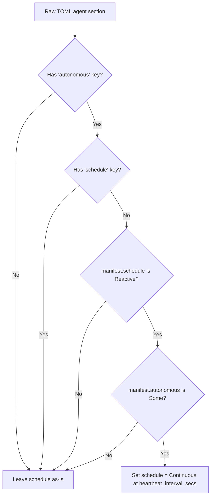

# crates — librefang-hands

# librefang-hands

Curated autonomous capability packages — the type system, TOML schema, marketplace client, and local registry for LibreFang "Hands."

A **Hand** is a pre-built, domain-complete agent configuration that users activate from a marketplace. Unlike regular agents (which users chat with interactively), Hands run *for* the user on a schedule or in reaction to events — the user checks in on them rather than driving them turn-by-turn.

## Module layout

| File | Responsibility |
|------|---------------|
| `src/lib.rs` | Core types, error enum, `HAND.toml` schema, settings resolution, agent-format normalization |
| `src/hands_hub.rs` | Remote marketplace client (`HandsHubClient`) — index browsing, bundle download, checksum verification |
| `src/registry.rs` | Local hand registry — install, activate, deactivate, persist state, scan disk, supply-chain scan |

## Core data model

### HandDefinition

`HandDefinition` is the parsed representation of a `HAND.toml` file. It is `Serialize` (but has a custom `Deserialize` that runs validation and agent-format normalization during deserialization).

Key fields:

- **`id`** — filesystem-safe identifier (validated against path traversal; becomes `home/workspaces/{id}/`).
- **`agents`** — `BTreeMap<String, HandAgentManifest>`, keyed by role name. Single-agent hands are stored under `"main"` with `coordinator = true`.
- **`settings`** — schema of configurable settings shown in the activation modal.
- **`requires`** — environment/binary prerequisites checked before activation.
- **`skill_content` / `agent_skill_content`** — populated at load time from `SKILL.md` / `SKILL-{role}.md` files; not part of TOML.
- **`i18n`** — localized name/description/agent/setting strings keyed by language code.
- **`routing`** — strong (`aliases`, ×3) and weak (`weak_aliases`, ×1) keywords for deterministic hand selection.

### HandInstance

A runtime record linking a `HandDefinition` to its spawned agents:

```rust
pub struct HandInstance {
    pub instance_id: Uuid,
    pub hand_id: String,
    pub status: HandStatus,           // Active | Paused | Error(String) | Inactive
    pub agent_ids: BTreeMap<String, AgentId>,
    pub coordinator_role: Option<String>,
    pub config: HashMap<String, serde_json::Value>,
    pub agent_runtime_overrides: BTreeMap<String, HandAgentRuntimeOverride>,
    pub activated_at: DateTime<Utc>,
    pub updated_at: DateTime<Utc>,
}
```

`HandAgentRuntimeOverride` allows per-agent model/provider/token/temperature overrides that survive daemon restarts but are cleared on deactivation.

### Coordinator resolution

`HandDefinition::coordinator()` returns the agent marked `coordinator = true`, falling back to the first agent by role name (BTreeMap ordering). `HandInstance::coordinator_role()` applies the same logic against the spawned `agent_ids` map, with an explicit `coordinator_role` field taking precedence.

## HAND.toml parsing

### Two agent formats

A hand declares agents in one of two mutually exclusive shapes:

**Single-agent** (`[agent]`):
```toml
[agent]
name = "clip-agent"
system_prompt = "..."
```
Auto-converted to `{"main": HandAgentManifest { coordinator: true, .. }}`.

**Multi-agent** (`[agents.<role>]`):
```toml
[agents.planner]
coordinator = true
invoke_hint = "Use planner for task decomposition"

[agents.analyst]
system_prompt = "..."
```

### Flat vs nested model format

Each agent section supports two model-description shapes:

- **Flat (legacy):** `provider`, `model`, `system_prompt`, `max_tokens`, `temperature`, `api_key_env`, `base_url` as top-level scalars in the agent section. Parsed via `LegacyHandAgentConfig`.
- **Nested:** a `[agents.<role>.model]` sub-table. Parsed via `AgentManifest::deserialize`.

The parser detects which shape is present by checking whether the section contains a `model` *table* (not the scalar `model = "..."`). For flat sections, `LegacyHandAgentConfig` is tried first — it has no `deny_unknown_fields`, so `schedule`, `[autonomous]`, and `exec_policy` are explicitly passed through (issues #6594, #6595).

### Autonomous schedule resolution

`apply_explicit_autonomous_schedule` is the load-bearing function for scheduling semantics:



The critical distinction: `manifest.autonomous` alone cannot answer "did the author ask for autonomy?" because `From<LegacyHandAgentConfig>` synthesizes an `AutonomousConfig` just to carry the flat `max_iterations` loop-depth cap. Only the *raw TOML table* can distinguish an author-written `[autonomous]` block from a synthesized one. This is why the decision is made at parse time against `toml::Value`, not downstream against the deserialized manifest.

This resolution is **idempotent across serialize/reparse round trips**: the resolved `schedule` field is always serialized (no `skip_serializing_if`), so the `schedule`-key check prevents re-parsing from re-triggering continuous scheduling.

This rule is deliberately hand-specific — standalone `agent.toml` files spawned directly do not get this treatment, even though the same file used as a `base =` template does.

### Base template inheritance

Multi-agent entries can reference a shared agent template:

```toml
[agents.writer]
base = "my-writer"           # loads agents/my-writer/agent.toml

[agents.writer.model]
system_prompt = "Override"   # deep-merged on top of base
```

Resolution flow in `parse_multi_agent_entry`:

1. Validate template name (no `..`, `/`, or `\` — path traversal guard).
2. Read `agents/<name>/agent.toml`.
3. `normalize_flat_to_nested` — move legacy flat model fields into a `[model]` sub-table so deep-merge works correctly.
4. `deep_merge_toml(base, overlay)` — hand fields override base; tables merge recursively, scalars/arrays replace.
5. Parse the merged value via `parse_single_agent_section`.

### Hand ID validation

`validate_hand_id` rejects values that would be unsafe as filesystem path components (`../`, `/`, `\`, `.`, leading dots, control chars, whitespace). Enforced inside `build_hand_from_raw` so every parse path — the `Deserialize` impl and `parse_hand_definition` — is covered.

## Settings resolution

Settings are declared in `[[settings]]` blocks with a schema (`HandSetting`), and users provide values via a `HashMap<String, serde_json::Value>` config map.

### Effective value computation

`effective_setting_value` is the single source of truth for "what is this setting set to":

1. Look up the stored value; coerce scalars via `setting_value_as_str` (strings pass through, `true`/`false` → `"true"`/`"false"`, numbers → their string form). Non-scalars (arrays, objects, null) return `None`.
2. For `Select` settings with declared options, verify the coerced value matches a declared option. If not, fall back to `setting.default`.
3. Otherwise, the coerced value wins.

This prevents a stored `{"trading_mode": true}` from rendering `- Trading Mode: true (true)` in the prompt and silently dropping the matched option's `provider_env` from the subprocess env allowlist (issue #6636).

`resolve_settings` builds a `ResolvedSettings` containing:
- A `## User Configuration` markdown block appended to the system prompt.
- A list of env var names the agent's subprocess should receive (from matched option `provider_env` or text setting `env_var`).

`undeclared_setting_keys` reports saved keys the schema doesn't declare — catches typos like `tradingmode` vs `trading_mode` that are stored permanently but affect nothing.

## Security model

### Path traversal

Hand `id` is validated at parse time (ASCII alphanumeric + `-`/`_`, starting alphanumeric, max 128 chars). This value flows into `home/workspaces/{id}/` directory paths.

### Marketplace SSRF hardening

The `HandsHubClient` applies three layers of defense:

1. **API-boundary SSRF check** — performed by the caller (`routes::skills::install_hand_from_marketplace`) before the client is built.
2. **Disabled auto-redirects** — `reqwest::redirect::Policy::none()`. A 3xx from the registry is surfaced as an error rather than followed into an internal address. The registry serves `/index` and `/bundle` directly; no legitimate flow needs a redirect.
3. **DNS pinning** — `HandsHubClient::with_pinned_url` pins the hostname to the exact `IpAddr` values the SSRF check validated, closing the DNS-rebinding TOCTOU window.

### Bundle integrity

`download_bundle` streams the response body, hashing with SHA-256 as chunks arrive:

- **Size cap** — 8 MiB hard limit (`MAX_BUNDLE_BYTES`). `Content-Length` is a fast pre-reject; the streaming guard is authoritative and aborts the instant the running total exceeds the cap.
- **Checksum verification** — compared against `expected_sha256` from the index entry *before* the body is parsed or written. If the registry advertises no digest, the bundle installs unverified (logged as a warning).

A bundle is a JSON envelope:
```json
{ "toml": "<HAND.toml contents>", "skill": "<SKILL.md contents>" }
```
The `skill` field is optional (prompt-less hands omit it).

## HandsHub client API

```rust
// Default registry
let client = HandsHubClient::new();

// Custom registry (no DNS pinning — tests only)
let client = HandsHubClient::with_url("https://custom.registry/api/v1");

// Production: pinned DNS
let client = HandsHubClient::with_pinned_url(url, hostname, &validated_ips);
```

| Method | Endpoint | Description |
|--------|----------|-------------|
| `fetch_index()` | `GET /index` | Full registry catalog |
| `browse(limit)` | `GET /index` | Sorted-by-id entries, truncated |
| `search(query, limit)` | `GET /index` | Case-insensitive substring over id/name/description |
| `get_entry(id)` | `GET /index` | Single entry lookup |
| `download_bundle(id, sha)` | `GET /hands/{id}/bundle` | Streamed, size-capped, checksum-verified |

All HTTP calls go through `get_with_retry`: exponential backoff (1.5s base, 30s cap, 5 attempts max) on 429/5xx with `Retry-After` header honored. Redirects are always refused.

## Registry (local persistence)

The `registry` module manages the on-disk hand lifecycle. Key operations surfaced to the kernel:

- **`install_from_content` / `install_from_content_persisted`** — parse HAND.toml + SKILL.md, run supply-chain scan (`librefang_skills::supply_chain::scan`), persist to `workspaces/` or registry dir.
- **`install_from_remote`** — downloads via `HandsHubClient::download_bundle`, then delegates to the local installer.
- **`activate` / `deactivate`** — manage `HandInstance` lifecycle, spawn/pause agents.
- **`reload_from_disk` / `scan_hands_dir`** — re-scan registry + override directories, re-parse definitions.
- **`check_requirements`** — evaluate `HandRequirement` checks (binary on PATH, env var set, API key present).
- **`persist_state` / `load_state_detailed`** — serialize/restore `HandInstance` records across daemon restarts.

The registry supports a **layered override model**: an operator can edit a registry hand's `HAND.toml` or `SKILL.md` in a workspace override directory, and those edits survive registry resets while the base registry hand still provides defaults.

## Integration with LibreFang

```
librefang-types     ← AgentManifest, ModelConfig, ScheduleMode, ExecPolicy
librefang-skills    ← supply_chain::scan (prompt-injection / security check on install)
librefang-runtime   ← registry_sync, mcp_migrate (filesystem helpers used in tests)
```

The kernel consumes this crate through:

- **`hands_lifecycle.rs`** — activation, deactivation, config updates, runtime override management.
- **`background_lifecycle.rs`** — `load_state_detailed` on boot to restore active hands.
- **`assistant_routing.rs`** — `check_requirements` before routing to a hand.
- **`kernel-router`** — `parse_hand_toml_with_agents_dir` + `hand_override_dir` to build route candidates from installed hands.
- **`routes/skills/hands.rs`** — HTTP API for marketplace install, manifest retrieval, settings reporting (`effective_setting_values`, `undeclared_setting_keys`).
- **`routes/agents/config.rs`** — `HandAgentRuntimeOverride` for per-agent model config patching.

## Error handling

`HandError` covers all failure modes:

| Variant | When |
|---------|------|
| `NotFound` | Hand id not in registry |
| `AlreadyActive` | Duplicate activation attempt |
| `AlreadyRegistered` | Install conflict |
| `BuiltinHand` | Attempt to uninstall a built-in |
| `InstanceNotFound` | UUID not in active instances |
| `ActivationFailed` | Spawn or requirement failure |
| `TomlParse` | Invalid HAND.toml |
| `Io` | Filesystem error |
| `Config` | Marketplace/transport/validation errors |
| `SecurityBlocked` | Supply-chain scan rejection |