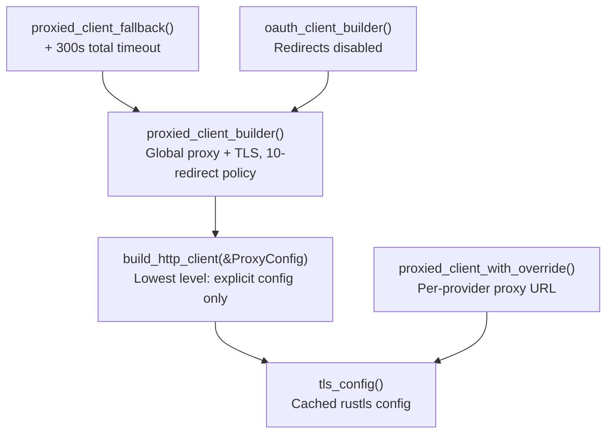

# crates — librefang-http

# librefang-http

Centralized HTTP client builder providing proxy support and TLS fallback for all outbound connections in LibreFang.

## Purpose

Every outbound HTTP request in LibreFang should flow through a client built by this crate. It solves two problems that would otherwise plague the codebase:

1. **Missing system CA certificates** — On minimal Docker images, musl/Alpine builds, and Termux/Android, reqwest's default TLS initialization panics because the system cert store is empty. This crate always seeds the trust store with bundled Mozilla CA roots (`webpki-roots`) and supplements them with whatever system certificates are available.

2. **Proxy consistency** — Proxy settings from `config.toml` need to reach every `reqwest::Client` uniformly, including crates that build their own clients without reading the global config. This is solved by exporting config values as environment variables during bootstrap, so reqwest's built-in env-var detection picks them up everywhere.

## TLS Configuration

TLS is configured once and cached in a `OnceLock`. The initialization seeds the root store in two layers:

```rust,ignore
// Layer 1: Bundled Mozilla CAs — always present, no runtime dependency
root_store.extend(webpki_roots::TLS_SERVER_ROOTS.iter().cloned());

// Layer 2: System certs — adds org-internal CAs, keeps anchors current
let result = rustls_native_certs::load_native_certs();
root_store.add_parsable_certificates(result.certs);
```

The Mozilla roots are seeded first so that public CAs are always trusted regardless of system state. System certificates supplement this for corporate environments with private CAs. If no system certs are found, a debug log is emitted and the Mozilla roots carry the load.

Call `tls_config()` to get a clone of the cached `rustls::ClientConfig`. The first invocation performs the cert scan; subsequent calls return the cached value.

## Proxy Configuration

### Global State

Proxy settings live in a global `RwLock<Option<ProxyConfig>>`:

| State | Behavior |
|---|---|
| `None` (before `init_proxy`) | `active_proxy()` returns `ProxyConfig::default()` (all fields `None`) |
| `Some(cfg)` | All builders use the configured values |

### Bootstrap vs. Hot-Reload

`init_proxy(cfg)` is called once at daemon startup with the `[proxy]` section from `config.toml`. It can also be called during config hot-reload. The two paths differ:

**Initial call** (`GLOBAL_PROXY` is `None`):
- Writes `HTTP_PROXY`/`http_proxy`, `HTTPS_PROXY`/`https_proxy`, and `NO_PROXY`/`no_proxy` environment variables.
- This happens before the Tokio runtime spawns worker threads, so the `unsafe { std::env::set_var(...) }` calls cannot race.
- Proxy URLs are validated (`http://`, `https://`, `socks5://`, `socks5h://`). Invalid schemes are logged with a redacted URL and skipped.

**Hot-reload call** (`GLOBAL_PROXY` already set):
- Updates `GLOBAL_PROXY` only.
- Does **not** call `std::env::set_var`, which is unsound in a multi-threaded context. New clients built after hot-reload will pick up the updated config from `active_proxy()`.

### Proxy Resolution Order

When building a client, `build_http_client` applies proxy settings from `ProxyConfig` fields. If a field is `None` (not set in config), reqwest falls back to its built-in environment variable detection — which the bootstrap call has already populated. This avoids double-application and ensures that env-var-only consumers (like `librefang-channels`) also respect the proxy settings.

## Client Builders



### Choosing the Right Builder

| Function | When to use | Redirect policy | Timeout |
|---|---|---|---|
| `proxied_client()` | General outbound requests (drivers, pairing, token refresh) | Default (10 hops) | connect: 30s, read: 300s |
| `proxied_client_builder()` | When you need to customize the builder before `.build()` | Default (10 hops) | connect: 30s, read: 300s |
| `oauth_client()` / `oauth_client_builder()` | OAuth flows (metadata discovery, token exchange, DCR, refresh) | **Disabled** | connect: 30s, read: 300s |
| `proxied_client_fallback()` | Fallback when a per-provider proxy override is invalid | Default (10 hops) | connect: 30s, read: 300s, **total: 300s** |
| `proxied_client_with_override(url)` | Per-provider proxy override (bypasses global config) | Default (10 hops) | connect: 30s, read: 300s |
| `build_http_client(&proxy)` | Lowest level — explicit `ProxyConfig`, no global read | Default (10 hops) | connect: 30s, read: 300s |

### Backward-Compatible Aliases

`client_builder()` and `new_client()` are aliases for `proxied_client_builder()` and `proxied_client()` respectively. Prefer the `proxied_*` names in new code.

## Security: Why OAuth Clients Disable Redirects

OAuth machine-to-machine endpoints return JSON directly and have no legitimate reason to emit a 3xx mid-flow. Following a redirect on these calls is a security vulnerability:

- A **307/308** on a credential-bearing POST replays the request body (`client_secret`, `code_verifier`, `refresh_token`) to the redirect target.
- A **302** on discovery becomes a blind SSRF / cloud-metadata pivot.

The per-URL SSRF guard validates only the initial URL — never the redirect `Location` header — so it cannot catch this class of attack. `oauth_client_builder()` calls `.redirect(reqwest::redirect::Policy::none())` to close the gap. Use it for **every** outbound OAuth request.

## Default Timeouts

`build_http_client` sets two timeouts on every builder:

- **`connect_timeout`: 30s** — Caps the TCP/TLS handshake. Generous enough for slow international links to LLM providers.
- **`read_timeout`: 300s** — Per-read inactivity timeout, not total request time. Streaming LLM responses keep this alive as long as tokens arrive; a true upstream stall triggers it. Callers can override via `.timeout()`, `.connect_timeout()`, etc. on the returned builder.

## Usage Patterns

### Standard client for an LLM driver

```rust
let client = librefang_http::proxied_client();
// or with per-provider proxy override:
let client = librefang_http::proxied_client_with_override(proxy_url)
    .unwrap_or_else(|_| {
        tracing::warn!("invalid provider proxy, falling back");
        librefang_http::proxied_client_fallback()
    });
```

The driver `with_proxy_and_timeout` functions exemplify this pattern — Anthropic, Gemini, OpenAI, and Ollama drivers all call through these builders. Gemini additionally demonstrates the fallback chain by trying `proxied_client_with_override` first, then `proxied_client_fallback` on error.

### OAuth client for MCP auth flows

```rust
let client = librefang_http::oauth_client();
// Safe for: metadata discovery, token exchange, refresh, dynamic client registration
```

Used by `librefang-kernel/src/mcp_oauth_provider.rs` in `register_client` and `try_refresh`, triggered by the `auth_start` route handler.

### RL export integration

Export modules (`librefang-rl-export` for W&B, Atropos, Tinker) use `proxied_client_builder()` so they can add custom headers or configuration before building.

## Validation

Proxy URLs are validated in two places:
- `init_proxy`: checks scheme before exporting to env vars.
- `build_http_client`: passes URLs to `Proxy::http()` / `Proxy::https()`, which will return `Err` on malformed input. Errors are logged with `redact_proxy_url()` and the proxy is skipped rather than panicking.

`is_valid_proxy_url` accepts `http://`, `https://`, `socks5://`, and `socks5h://` schemes. Credentials embedded in URLs are redacted in all log output via `librefang_types::config::redact_proxy_url`.

## Initialization Contract

Call `init_proxy(cfg)` exactly once during daemon bootstrap, before spawning the Tokio runtime. The function is safe to call again during hot-reload, but the initial call must happen in a single-threaded context for the `set_var` calls to be sound. If `init_proxy` is never called, `proxied_client()` still works — it builds with an empty `ProxyConfig` and relies on reqwest's env-var detection.