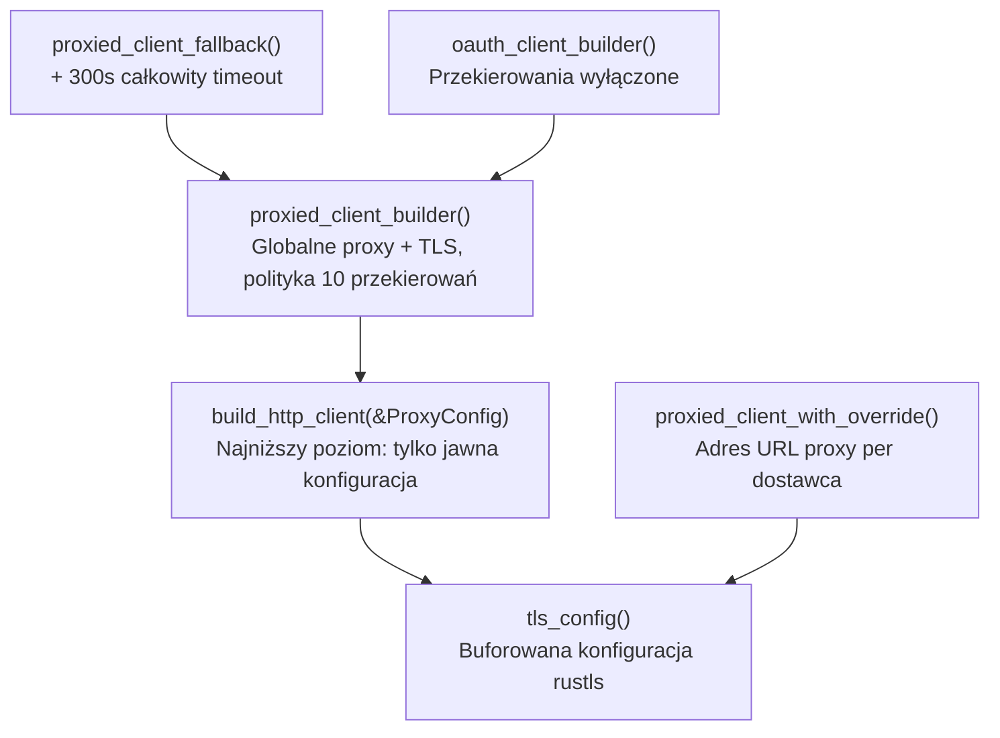

# crates — librefang-http

# librefang-http

Centralizowany kreator klienta HTTP zapewniający obsługę proxy i awaryjną konfigurację TLS dla wszystkich połączeń wychodzących w LibreFang.

## Przeznaczenie

Każde żądanie HTTP wychodzące z LibreFang powinno przechodzić przez klienta utworzonego przez ten crate. Rozwiązuje dwa problemy, które w przeciwnym razie mogłyby dotknąć kodu:

1. **Brak systemowych certyfikatów CA** — Na minimalistycznych obrazach Docker, kompilacjach musl/Alpine oraz w Termux/Android domyślne inicjalizacja TLS biblioteki reqwest powoduje panikę, ponieważ systemowy magazyn certyfikatów jest pusty. Ten crate zawsze zasiewa magazyn zaufania załączonymi korzeniami CA Mozilli (`webpki-roots`) i uzupełnia je o dostępne certyfikaty systemowe.

2. **Spójność proxy** — Ustawienia proxy z `config.toml` muszą dotrzeć do każdego `reqwest::Client` jednolicie, w tym do crate'ów, które tworzą własnych klientów bez odczytywania globalnej konfiguracji. Rozwiązano to poprzez eksportowanie wartości konfiguracyjnych jako zmiennych środowiskowych podczas uruchamiania, dzięki czemu wbudowana detekcja zmiennych środowiskowych reqwest je wykrywa wszędzie.

## Konfiguracja TLS

TLS jest konfigurowany raz i buforowany w `OnceLock`. Inicjalizacja zasiewa magazyn korzeni w dwóch warstwach:

```rust,ignore
// Warstwa 1: Dołączone certyfikaty CA Mozilli — zawsze obecne, brak zależności środowiska wykonawczego
root_store.extend(webpki_roots::TLS_SERVER_ROOTS.iter().cloned());

// Warstwa 2: Certyfikaty systemowe — dodaje wewnętrzne certyfikaty organizacyjne, utrzymuje aktualność kotwic
let result = rustls_native_certs::load_native_certs();
root_store.add_parsable_certificates(result.certs);
```

Korzenie Mozilli są zasiewane jako pierwsze, aby publiczne CA były zawsze zaufane niezależnie od stanu systemu. Certyfikaty systemowe uzupełniają je w środowiskach korporacyjnych z prywatnymi CA. Jeśli nie znaleziono certyfikatów systemowych, emitowany jest dziennik debugowania, a korzenie Mozilli przejmują ciężar.

Wywołaj `tls_config()`, aby uzyskać kopię buforowanej `rustls::ClientConfig`. Pierwsze wywołanie wykonuje skanowanie certyfikatów; kolejne wywołania zwracają buforowaną wartość.

## Konfiguracja proxy

### Stan globalny

Ustawienia proxy znajdują się w globalnym `RwLock<Option<ProxyConfig>>`:

| Stan | Zachowanie |
|---|---|
| `None` (przed `init_proxy`) | `active_proxy()` zwraca `ProxyConfig::default()` (wszystkie pola `None`) |
| `Some(cfg)` | Wszystkie kreatory używają skonfigurowanych wartości |

### Uruchomienie vs. hot-reload

`init_proxy(cfg)` jest wywoływane raz podczas uruchamiania demona z sekcją `[proxy]` z `config.toml`. Może być również wywołane podczas hot-reload konfiguracji. Ścieżki te różnią się:

**Pierwsze wywołanie** (`GLOBAL_PROXY` to `None`):
- Zapisuje zmienne środowiskowe `HTTP_PROXY`/`http_proxy`, `HTTPS_PROXY`/`https_proxy` oraz `NO_PROXY`/`no_proxy`.
- Dzieje się to przed uruchomieniem wątków roboczych Tokio, więc wywołania `unsafe { std::env::set_var(...) }` nie mogą się ścigać.
- Adresy URL proxy są walidowane (`http://`, `https://`, `socks5://`, `socks5h://`). Nieprawidłowe schematy są logowane z zanonimizowanym adresem URL i pomijane.

**Wywołanie hot-reload** (`GLOBAL_PROXY` już ustawione):
- Aktualizuje tylko `GLOBAL_PROXY`.
- **Nie** wywołuje `std::env::set_var`, co jest niebezpieczne w kontekście wielowątkowym. Nowi klienci utworzeni po hot-reload odczytają zaktualizowaną konfigurację z `active_proxy()`.

### Kolejność rozwiązywania proxy

Podczas tworzenia klienta `build_http_client` aplikuje ustawienia proxy z pól `ProxyConfig`. Jeśli pole to `None` (nie ustawione w konfiguracji), reqwest cofa się do wbudowanej detekcji zmiennych środowiskowych — którą wywołanie uruchamiające już wypełniło. Zapobiega to podwójnemu zastosowaniu i zapewnia, że konsumenci polegający wyłącznie na zmiennych środowiskowych (jak `librefang-channels`) również respektują ustawienia proxy.

## Kreatory klientów



### Wybór odpowiedniego kreatora

| Funkcja | Kiedy użyć | Polityka przekierowań | Timeout |
|---|---|---|---|
| `proxied_client()` | Ogólne żądania wychodzące (sterowniki, parowanie, odświeżanie tokenów) | Domyślna (10 przeskoków) | connect: 30s, read: 300s |
| `proxied_client_builder()` | Gdy potrzebujesz dostosować kreator przed `.build()` | Domyślna (10 przeskoków) | connect: 30s, read: 300s |
| `oauth_client()` / `oauth_client_builder()` | Przepływy OAuth (odnajdywanie metadanych, wymiana tokenów, DCR, odświeżanie) | **Wyłączona** | connect: 30s, read: 300s |
| `proxied_client_fallback()` | Awaryjny, gdy nadpisanie proxy per dostawca jest nieprawidłowe | Domyślna (10 przeskoków) | connect: 30s, read: 300s, **całkowity: 300s** |
| `proxied_client_with_override(url)` | Nadpisanie proxy per dostawca (pomija globalną konfigurację) | Domyślna (10 przeskoków) | connect: 30s, read: 300s |
| `build_http_client(&proxy)` | Najniższy poziom — jawny `ProxyConfig`, brak odczytu globalnego | Domyślna (10 przeskoków) | connect: 30s, read: 300s |

### Aliasy wstecznie kompatybilne

`client_builder()` i `new_client()` to aliasy odpowiednio dla `proxied_client_builder()` i `proxied_client()`. W nowym kodzie preferuj nazwy `proxied_*`.

## Bezpieczeństwo: Dlaczego klienci OAuth wyłączają przekierowania

Punktowe końcowe machine-to-machine OAuth zwracają JSON bezpośrednio i nie mają uzasadnionego powodu do emitowania 3xx w trakcie przepływu. Podążanie za przekierowaniem w tych wywołaniach stanowi podatność bezpieczeństwa:

- **307/308** na POST z danymi autoryzacyjnymi powtarza treść żądania (`client_secret`, `code_verifier`, `refresh_token`) do celu przekierowania.
- **302** na odnajdywanie staje się ślepym obrotem SSRF / cloud-metadata.

Straż SSRF per adres URL waliduje tylko początkowy adres URL — nigdy nagłówek `Location` przekierowania — więc nie może przechwycić tej klasy ataków. `oauth_client_builder()` wywołuje `.redirect(reqwest::redirect::Policy::none())`, aby zamknąć lukę. Używaj go dla **każdego** wychodzącego żądania OAuth.

## Domyślne timeouty

`build_http_client` ustawia dwa timeouty na każdym kreatorze:

- **`connect_timeout`: 30s** — Ogranicza czas handshake'u TCP/TLS. Wystarczająco hojny dla wolnych połączeń międzynarodowych do dostawców LLM.
- **`read_timeout`: 300s** — Timeout nieaktywności per odczyt, a nie całkowity czas żądania. Strumieniowe odpowiedzi LLM utrzymują go aktywnym, dopóki napływają tokeny; prawdziwe zatrzymanie nadrzędnego uruchamia go. Wywołujący mogą nadpisać poprzez `.timeout()`, `.connect_timeout()` itd. na zwróconym kreatorze.

## Wzorce użycia

### Standardowy klient dla sterownika LLM

```rust
let client = librefang_http::proxied_client();
// lub z nadpisaniem proxy per dostawca:
let client = librefang_http::proxied_client_with_override(proxy_url)
    .unwrap_or_else(|_| {
        tracing::warn!("invalid provider proxy, falling back");
        librefang_http::proxied_client_fallback()
    });
```

Funkcje `with_proxy_and_timeout` sterowników exemplify this pattern — sterowniki Anthropic, Gemini, OpenAI i Ollama all call through these builders. Gemini dodatkowo demonstruje łańcuch awaryjny próbując najpierw `proxied_client_with_override`, a następnie `proxied_client_fallback` w przypadku błędu.

### Klient OAuth dla przepływów autoryzacji MCP

```rust
let client = librefang_http::oauth_client();
// Bezpieczny do: odnajdywania metadanych, wymiany tokenów, odświeżania, dynamicznej rejestracji klientów
```

Używany przez `librefang-kernel/src/mcp_oauth_provider.rs` w `register_client` i `try_refresh`, wyzwalany przez obsługę trasy `auth_start`.

### Integracja eksportu RL

Moduły eksportu (`librefang-rl-export` dla W&B, Atropos, Tinker) używają `proxied_client_builder()`, aby móc dodać niestandardowe nagłówki lub konfigurację przed zbudowaniem.

## Walidacja

Adresy URL proxy są walidowane w dwóch miejscach:
- `init_proxy`: sprawdza schemat przed eksportem do zmiennych środowiskowych.
- `build_http_client`: przekazuje adresy URL do `Proxy::http()` / `Proxy::https()`, co zwróci `Err` przy nieprawidłowym wejściu. Błędy są logowane z `redact_proxy_url()`, a proxy jest pomijane zamiast powodować panikę.

`is_valid_proxy_url` akceptuje schematy `http://`, `https://`, `socks5://` oraz `socks5h://`. Dane uwierzytelniające osadzone w adresach URL są zanonimizowane w całym wyjściu dziennika poprzez `librefang_types::config::redact_proxy_url`.

## Kontrakt inicjalizacji

Wywołaj `init_proxy(cfg)` dokładnie raz podczas uruchamiania demona, przed utworzeniem środowiska wykonawczego Tokio. Funkcja jest bezpieczna do ponownego wywołania podczas hot-reload, ale początkowe wywołanie musi nastąpić w kontekście jednowątkowym, aby wywołania `set_var` były bezpieczne. Jeśli `init_proxy` nigdy nie zostanie wywołane, `proxied_client()` nadal działa — tworzy z pustym `ProxyConfig` i polega na detekcji zmiennych środowiskowych reqwest.