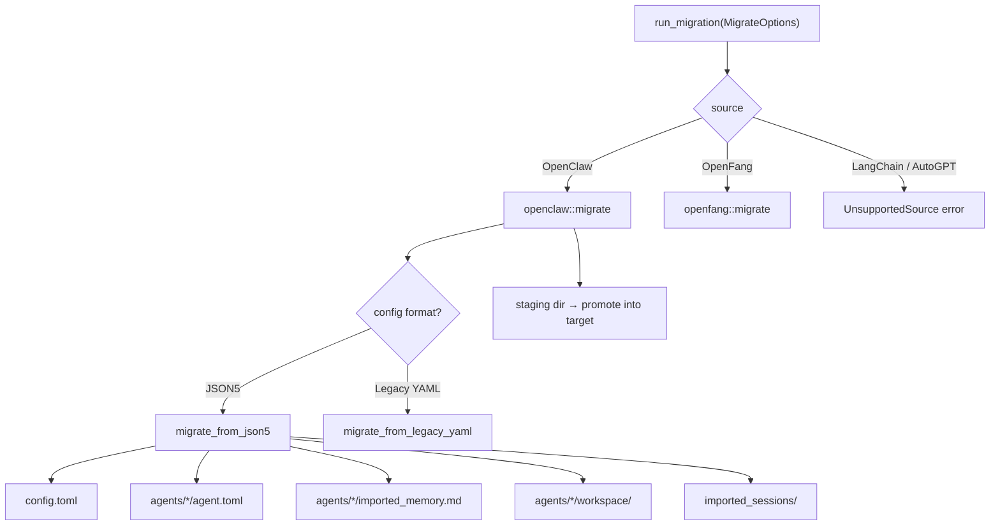

# crates — librefang-import

# librefang-import

Migration engine for importing agents, memory, sessions, skills, and channel configurations from external agent frameworks into LibreFang. Currently supports OpenClaw (JSON5 and legacy YAML formats) and OpenFang (a format-compatible community fork). LangChain and AutoGPT are stubbed for future work.

## Architecture Overview



The crate exposes three public surfaces consumed by the rest of the codebase:

| Caller | Entry point |
|---|---|
| HTTP API (`routes/config/migration.rs`) | `run_migration`, `scan_openclaw_workspace`, `detect_openclaw_home` |
| CLI (`src/commands/system.rs`) | `run_migration`, `MigrateOptions` |
| TUI init wizard (`tui/screens/init_wizard.rs`) | `scan_openclaw_workspace`, `detect_openclaw_home`, `run_migration` |
| xtask (`xtask/src/migrate.rs`) | `run_migration`, `MigrateOptions` |

## Core Types

### `MigrateOptions`

The single configuration struct passed to `run_migration`:

```rust
pub struct MigrateOptions {
    pub source: MigrateSource,      // OpenClaw, OpenFang, etc.
    pub source_dir: PathBuf,        // Path to source workspace
    pub target_dir: PathBuf,        // Path to ~/.librefang (or equivalent)
    pub dry_run: bool,              // Report-only mode; never touches disk
}
```

### `MigrateSource`

Enumerates supported source frameworks. `LangChain` and `AutoGpt` are defined but return `MigrateError::UnsupportedSource` — they exist so the API shape is stable when those migrators land.

### `MigrateError`

All failure modes are typed via `thiserror`. Notable variants:

- `SourceNotFound(PathBuf)` — the source directory doesn't exist.
- `ConfigParse(String)` / `AgentParse(String)` — malformed source files.
- `Json5Parse(String)` — JSON5 deserialization failure with file context.
- `UnsupportedVersion(u32)` — `openclaw.json` declares a schema version outside the supported set (currently `[1, 2]`). Refers to issue #3797.
- `StagingExists(PathBuf)` — a staging directory from a previous failed migration is present; the user must remove it explicitly. Refers to #3798.
- `InvalidId(String)` — agent ID contains path traversal components or control characters. Refers to #3794.

## Migration Flow

### Entry Point

`run_migration` dispatches on `MigrateOptions::source` to the appropriate submodule. For OpenClaw, it calls `openclaw::migrate`.

### Atomic Staging and Promotion

The OpenClaw migrator does not write directly to the target directory (except in dry-run mode). Instead it uses a workspace-level atomicity strategy (#3798):

1. **Staging directory**: `staging_dir_for(target)` computes a sibling directory named `<leaf>.migrate-staging`. The name is fixed (no timestamp) so a stale directory from a previous failed run is detectable.
2. **Refuse if staging exists**: If the staging directory is already present, the migrator returns `StagingExists` rather than silently overwriting. This forces explicit cleanup and prevents data loss.
3. **Write into staging**: All file writes (`config.toml`, `agent.toml`, memory, sessions, workspace copies) go to the staging tree.
4. **Promote**: `promote_staging` recursively moves staging contents into the real target. Each entry is moved via same-filesystem rename (atomic per-entry). If a cross-device rename fails, it falls back to copy-to-tmp + rename.
5. **Never clobber (#3795)**: Existing files in the target are never overwritten. If a destination file already exists, the staged copy is dropped and a warning is added to the report.
6. **Cleanup**: On full success, the staging directory is removed. On any error, it is left in place for inspection.

The migration marker file (`.openclaw_migrated`) is written into staging so it promotes with the rest. On re-runs, the marker's presence causes the migrator to skip — user edits since the first import are preserved.

### Re-run Safety

The `.openclaw_migrated` marker file prevents re-runs from clobbering user edits. To force a re-import, the user deletes the marker file. Even then, `promote_staging` never clobbers existing files — it backs them up instead (see below).

### Backup-before-overwrite

`write_with_backup` renames any existing destination file to `<original>.bak.<timestamp>` before writing the new content. This applies to `config.toml`, `agent.toml`, and `imported_memory.md`. If a nanosecond-precision collision occurs (extremely unlikely), the backup name falls back to nanosecond precision.

### Atomic file writes

`atomic_write` writes to a sibling `.tmp` file first, then renames into place. This prevents torn writes if the process is interrupted mid-write.

## What Gets Migrated

### From OpenClaw JSON5 (`openclaw.json`)

The modern OpenClaw format stores everything in a single JSON5 file at `~/.openclaw/openclaw.json`. The migrator produces:

| Source | Destination | Notes |
|---|---|---|
| Global config (provider, model, memory) | `config.toml` | Serialized as TOML via `LibreFangConfig`. |
| Each agent in `agents.list[]` | `agents/<id>/agent.toml` | Full manifest with model, capabilities, tools, system prompt. |
| `memory/<agent>/MEMORY.md` | `agents/<agent>/imported_memory.md` | Also checks legacy `agents/<agent>/MEMORY.md` layout. |
| `workspaces/<agent>/` | `agents/<agent>/workspace/` | Recursive copy. Also checks legacy `agents/<agent>/workspace/`. |
| `sessions/*.jsonl` | `imported_sessions/` | Conversation logs, file-by-file copy. |
| Bot tokens (Telegram, Discord, Slack, Mattermost) | `secrets.env` | Written with mode 0o600 on Unix. |

### From Legacy OpenClaw YAML

Very old OpenClaw installations use a multi-file YAML layout (`config.yaml`, `agents/<name>/agent.yaml`, `messaging/<channel>.yaml`). The migrator handles these through a parallel code path (`migrate_from_legacy_yaml` and its sub-functions) that produces the same output structure.

### Agent Manifest Construction

`convert_agent_from_json` (and its legacy counterpart `convert_legacy_agent`) build the TOML agent manifest string. Key transformations:

- **Model resolution**: Extracts the primary model from agent-level config or defaults, falling back to `anthropic/claude-sonnet-4-20250514`. Fallback models are emitted as `[[fallback_models]]` arrays.
- **Provider mapping**: `map_provider` normalizes provider names (e.g., `"claude"` → `"anthropic"`, `"gemini"` → `"google"`). Unknown providers pass through unchanged.
- **API key env derivation**: `default_api_key_env` maps each provider to its conventional environment variable name (e.g., `ANTHROPIC_API_KEY`). Ollama returns an empty string (no key needed).
- **Tool mapping**: Uses `librefang_types::tool_compat::{is_known_librefang_tool, map_tool_name}` to translate OpenClaw tool names. Unmappable tools are collected and reported as warnings, not errors.
- **Tool profiles**: `tools_for_profile` delegates to `librefang_types::agent::ToolProfile` so migration and kernel use identical definitions.
- **Capability derivation**: `derive_capabilities` inspects the tool list to set `shell`, `network`, `agent_message`, and `agent_spawn` capability grants.
- **Identity/system prompt**: `extract_identity_prompt` handles both raw string identities and structured objects, checking common keys (`systemPrompt`, `prompt`, `instructions`, `persona`, etc.) and recursing into nested objects/arrays.
- **Tool deny list**: Migrated as `tool_blocklist` (previously silently dropped, which widened agent access).
- **Per-agent skills**: Emitted as a `skills` array (previously silently dropped).
- **Custom workspace path**: Emitted as `workspace` (previously dropped, reverting agents to default).

## What Gets Skipped

The migrator is explicit about features that cannot be automatically migrated. Each skipped item produces a `SkippedItem` in the report with a reason and suggested manual action.

### Channels — Sidecar Migration

All messaging channels (Telegram, Discord, Slack, WhatsApp, Signal, Matrix, Google Chat, Teams, IRC, Mattermost, Feishu) have migrated from in-process adapters to out-of-process sidecar adapters. The migrator does **not** emit `[channels.<name>]` blocks (the kernel would reject them). Instead:

- **Bot tokens** for Telegram, Discord, Slack, and Mattermost are still migrated to `secrets.env` (the sidecars read them from there).
- Each channel produces a `SkippedItem` with instructions to add a `[[sidecar_channels]]` block pointing at the appropriate sidecar adapter (e.g., `librefang.sidecar.adapters.telegram`).
- iMessage and BlueBubbles are skipped with different reasons (macOS-only, no adapter).

### Other Skipped Features

| Feature | Reason |
|---|---|
| Cron jobs (`cron`) | Use LibreFang's `ScheduleMode::Periodic` |
| Webhook hooks (`hooks`) | Use LibreFang's event system |
| Auth profiles (`auth-profiles.json`) | Security: API keys/OAuth tokens not auto-migrated |
| Skill entries | Must be reinstalled via `librefang skill install` |
| Vector index (`memory-search/index.db`) | Not portable; LibreFang rebuilds embeddings |
| Cron run state (`cron-store.json`) | Not portable |
| Session config | Differs structurally from LibreFang's per-agent sessions |
| Memory backend config | LibreFang uses SQLite with vector embeddings |

## Security Hardening

### Agent ID Validation (#3794)

`validate_migration_id` rejects IDs that contain path traversal components (`../`, absolute paths), NUL bytes, control characters, double-quotes, or backslashes. This prevents:

- Path traversal during file creation.
- Manifest injection — since IDs are interpolated into TOML comment lines and description fields, a malicious ID could otherwise break out of those contexts and inject arbitrary manifest keys (e.g., widening `[capabilities]` with `shell = ["*"]`).

### TOML Escaping

`toml_escape` escapes backslash, double-quote, newlines, tabs, and control characters per the TOML spec. Every untrusted string interpolated into a TOML basic string passes through this function. This prevents manifest injection through agent names, descriptions, system prompts, model names, provider names, tags, and skills.

`toml_comment_safe` collapses control characters to spaces for safe inclusion in TOML `#` comment lines, where backslash-escaping doesn't apply.

### Secrets File Permissions

`write_secret_env` creates `secrets.env` with mode `0o600` from the moment it exists (via `OpenOptionsExt::mode` on Unix), rather than write-then-chmod. The parent directory is created with mode `0o700`. This closes the window where tokens could be world-readable on shared hosts if the process dies between file creation and `set_permissions`.

## Workspace Scanning

`scan_openclaw_workspace` provides a read-only inventory of what's available for migration. It returns a `ScanResult` containing:

- `has_config`: Whether a config file was found.
- `agents`: List of `ScannedAgent` with name, provider, model, tool count, and flags for memory/sessions/workspace presence.
- `channels`: List of channel names detected.
- `skills`: List of skill names detected.
- `has_memory`: Whether any agent memory was found.

This is used by the TUI init wizard and HTTP API to show a preview before the user commits to a migration.

### Auto-detection

`detect_openclaw_home` searches standard locations (`~/.openclaw`, `~/.clawdbot`, `~/.moldbot`, `~/.moltbot`, `~/.config/openclaw`, Windows `%APPDATA%/openclaw`, `%LOCALAPPDATA%/openclaw`) and the `OPENCLAW_STATE_DIR` environment variable. A directory is accepted if it contains a recognized config file or has `sessions/` or `memory/` subdirectories.

## Report Module

`MigrationReport` captures the outcome of a migration run:

- `source`: Framework name string.
- `dry_run`: Whether this was a report-only run.
- `imported`: `Vec<MigrateItem>` — each item has a `kind` (Config, Agent, Memory, Session, Secret, Skill, Channel), a `name`, and a `destination` path.
- `skipped`: `Vec<SkippedItem>` — each item has a `kind`, `name`, and `reason`.
- `warnings`: `Vec<String>` — non-fatal issues (backups made, unmapped tools, write failures).

`MigrationReport::to_markdown` renders the report as a Markdown document, which is written to `migration_report.md` in the target directory after a successful migration.

## OpenFang Module

The `openfang` module handles the OpenFang community fork, which uses the same format as LibreFang. Migration is largely a structural copy with schema-drift detection via `warn_on_schema_drift`, which calls into `librefang_types` config validation (`detect_unknown_fields`) to flag fields that may have diverged between forks.

## Adding a New Source Framework

1. Add a variant to `MigrateSource` and its `Display` impl.
2. Create a module (e.g., `pub mod myframework;`) with a `pub fn migrate(options: &MigrateOptions) -> Result<MigrationReport, MigrateError>`.
3. Add a match arm in `run_migration`.
4. Use the security helpers (`validate_migration_id`, `toml_escape`, `toml_comment_safe`, `write_secret_env`, `atomic_write`, `write_with_backup`) from `openclaw.rs` — they are not yet pub but follow the established pattern.
5. Populate a `MigrationReport` with `imported`, `skipped`, and `warnings` entries.
6. If the source has a schema version, add a version check early in the flow (following the `SUPPORTED_OPENCLAW_VERSIONS` pattern).