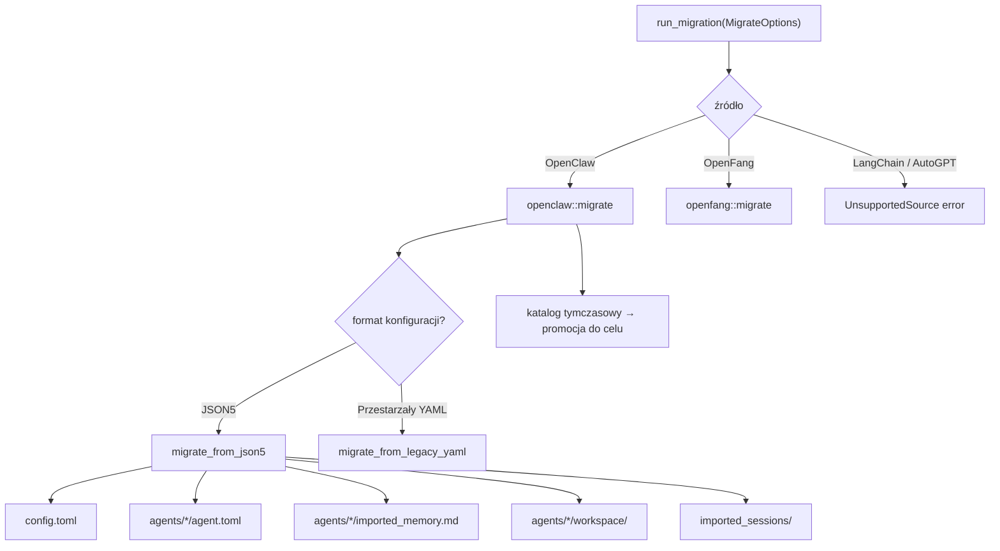

# crates — librefang-import

# librefang-import

Silnik migracji do importowania agentów, pamięci, sesji, umiejętności i konfiguracji kanałów z zewnętrznych szkieletów agentowych do LibreFang. Obecnie obsługuje OpenClaw (formaty JSON5 i przestarzały YAML) oraz OpenFang (kompatybilny fork społecznościowy). LangChain i AutoGPT są przygotowane jako stuby do przyszłej pracy.

## Przegląd architektury



Crate udostępnia trzy publiczne interfejsy konsumowane przez resztę bazy kodu:

| Wywołujący | Punkt wejścia |
|---|---|
| HTTP API (`routes/config/migration.rs`) | `run_migration`, `scan_openclaw_workspace`, `detect_openclaw_home` |
| CLI (`src/commands/system.rs`) | `run_migration`, `MigrateOptions` |
| TUI init wizard (`tui/screens/init_wizard.rs`) | `scan_openclaw_workspace`, `detect_openclaw_home`, `run_migration` |
| xtask (`xtask/src/migrate.rs`) | `run_migration`, `MigrateOptions` |

## Podstawowe typy

### `MigrateOptions`

Jedyna struktura konfiguracyjna przekazywana do `run_migration`:

```rust
pub struct MigrateOptions {
    pub source: MigrateSource,      // OpenClaw, OpenFang, itd.
    pub source_dir: PathBuf,        // Ścieżka do katalogu źródłowego
    pub target_dir: PathBuf,        // Ścieżka do ~/.librefang (lub odpowiednika)
    pub dry_run: bool,              // Tryb tylko raportowania; nie dotyka dysku
}
```

### `MigrateSource`

Wylicza obsługiwane szkielety źródłowe. `LangChain` i `AutoGpt` są zdefiniowane, ale zwracają `MigrateError::UnsupportedSource` — istnieją, aby kształt API był stabilny, gdy te migratory zostaną zaimplementowane.

### `MigrateError`

Wszystkie tryby awarii są typowane przez `thiserror`. Znaczące warianty:

- `SourceNotFound(PathBuf)` — katalog źródłowy nie istnieje.
- `ConfigParse(String)` / `AgentParse(String)` — błędnie sformatowane pliki źródłowe.
- `Json5Parse(String)` — błąd deserializacji JSON5 z kontekstem pliku.
- `UnsupportedVersion(u32)` — `openclaw.json` deklaruje wersję schematu spoza obsługiwanego zbioru (obecnie `[1, 2]`). Odnosi się do zgłoszenia #3797.
- `StagingExists(PathBuf)` — katalog tymczasowy z poprzedniej nieudanej migracji istnieje; użytkownik musi go jawnie usunąć. Odnosi się do #3798.
- `InvalidId(String)` — identyfikator agenta zawiera komponenty przejścia ścieżki lub znaki sterujące. Odnosi się do #3794.

## Przepływ migracji

### Punkt wejścia

`run_migration` rozsyła na podstawie `MigrateOptions::source` do odpowiedniego podmodułu. Dla OpenClaw wywołuje `openclaw::migrate`.

### Atomowy staging i promocja

Migrator OpenClaw nie zapisuje bezpośrednio do katalogu docelowego (z wyjątkiem trybu dry-run). Zamiast tego korzysta ze strategii atomowości na poziomie workspace (#3798):

1. **Katalog tymczasowy**: `staging_dir_for(target)` oblicza katalog równorzędny o nazwie `<leaf>.migrate-staging`. Nazwa jest stała (bez znacznika czasu), aby stary katalog z poprzedniego nieudanego uruchomienia był wykrywalny.
2. **Odmowa, jeśli staging istnieje**: Jeśli katalog tymczasowy już istnieje, migrator zwraca `StagingExists` zamiast po cichu nadpisać. Wymusza to jawną czyszczenie i zapobiega utracie danych.
3. **Zapis do staging**: Wszystkie zapisy plików (`config.toml`, `agent.toml`, pamięć, sesje, kopie workspace) trafiają do drzewa tymczasowego.
4. **Promocja**: `promote_staging` rekursywnie przenosi zawartość staging do rzeczywistego celu. Każdy element jest przenoszony przez zmianę nazwy w tej samej systemie plików (atomowa na element). Jeśli zmiana nazwy między urządzeniami zawiedzie, następuje fallback do kopia-do-tmp + zmiana nazwy.
5. **Nigdy nie nadpisuj (#3795)**: Istniejące pliki w celu nigdy nie są nadpisywane. Jeśli plik docelowy już istnieje, tymczasowa kopia jest odrzucana, a do raportu dodawane jest ostrzeżenie.
6. **Czyszczenie**: Po pełnym sukcesie katalog tymczasowy jest usuwany. Przy jakimkolwiek błędzie pozostawiony w miejscu do inspekcji.

Plik znacznika migracji (`.openclaw_migrated`) jest zapisywany do staging, więc promuje się razem z resztą. Przy ponownych uruchomieniach obecność znacznika powoduje pominięcie migracji — edycje użytkownika od pierwszego importu są zachowane.

### Bezpieczeństwo ponownego uruchomienia

Plik znacznika `.openclaw_migrated` zapobiega nadpisywaniu edycji użytkownika przy ponownych uruchomieniach. Aby wymusić ponowny import, użytkownik usuwa plik znacznika. Nawet wtedy `promote_staging` nigdy nie nadpisuje istniejących plików — zamiast tego tworzy ich kopię zapasową (patrz poniżej).

### Kopia zapasowa przed nadpisaniem

`write_with_backup` zmienia nazwę istniejącego pliku docelowego na `<oryginał>.bak.<znacznik_czasu>` przed zapisaniem nowej zawartości. Dotyczy to `config.toml`, `agent.toml` i `imported_memory.md`. W przypadku kolizji z precyzją do nanosekundy (skrajnie nieprawdopodobnej), nazwa kopii zapasowej cofa się do precyzji nanosekundowej.

### Atomowe zapisy plików

`atomic_write` zapisuje najpierw do równorzędnego pliku `.tmp`, a następnie zmienia jego nazwę na właściwe miejsce. Zapobiega to rozdartym zapisom, jeśli proces zostanie przerwany w trakcie.

## Co jest migrowane

### Z OpenClaw JSON5 (`openclaw.json`)

Nowoczesny format OpenClaw przechowuje wszystko w jednym pliku JSON5 w `~/.openclaw/openclaw.json`. Migrator tworzy:

| Źródło | Cel | Uwagi |
|---|---|---|
| Konfiguracja globalna (dostawca, model, pamięć) | `config.toml` | Serializowana jako TOML przez `LibreFangConfig`. |
| Każdy agent w `agents.list[]` | `agents/<id>/agent.toml` | Pełny manifest z modelem, możliwościami, narzędziami, promptem systemowym. |
| `memory/<agent>/MEMORY.md` | `agents/<agent>/imported_memory.md` | Sprawdza również przestarzały układ `agents/<agent>/MEMORY.md`. |
| `workspaces/<agent>/` | `agents/<agent>/workspace/` | Kopiowanie rekursywne. Sprawdza również przestarzały `agents/<agent>/workspace/`. |
| `sessions/*.jsonl` | `imported_sessions/` | Logi konwersacji, kopiowanie plik po pliku. |
| Tokeny bota (Telegram, Discord, Slack, Mattermost) | `secrets.env` | Zapisywane z trybem 0o600 na systemach Unix. |

### Z przestarzałego OpenClaw YAML

Bardzo stare instalacje OpenClaw używają wieloplikowego układu YAML (`config.yaml`, `agents/<name>/agent.yaml`, `messaging/<channel>.yaml`). Migrator obsługuje je przez równoległą ścieżkę kodu (`migrate_from_legacy_yaml` i jej podfunkcje), która tworzy taką samą strukturę wyjściową.

### Budowa manifestu agenta

`convert_agent_from_json` (i jego przestarzały odpowiednik `convert_legacy_agent`) buduje ciąg manifestu agenta w TOML. Kluczowe transformacje:

- **Rozpoznawanie modelu**: Wyodrębnia model główny z konfiguracji na poziomie agenta lub wartości domyślne, z fallbackiem do `anthropic/claude-sonnet-4-20250514`. Modele zapasowe są emitowane jako tablice `[[fallback_models]]`.
- **Mapowanie dostawców**: `map_provider` normalizuje nazwy dostawców (np. `"claude"` → `"anthropic"`, `"gemini"` → `"google"`). Nieznani dostawcy przechodzą bez zmian.
- **Pochodzenie klucza API env**: `default_api_key_env` mapuje każdego dostawcę na jego konwencjonalną nazwę zmiennej środowiskowej (np. `ANTHROPIC_API_KEY`). Ollama zwraca pusty ciąg (klucz nie jest potrzebny).
- **Mapowanie narzędzi**: Używa `librefang_types::tool_compat::{is_known_librefang_tool, map_tool_name}` do tłumaczenia nazw narzędzi OpenClaw. Niezmapowalne narzędzia są zbierane i raportowane jako ostrzeżenia, a nie błędy.
- **Profile narzędzi**: `tools_for_profile` deleguje do `librefang_types::agent::ToolProfile`, aby migracja i jądro używały identycznych definicji.
- **Pochodzenie możliwości**: `derive_capabilities` bada listę narzędzi, aby ustawić przydziały możliwości `shell`, `network`, `agent_message` i `agent_spawn`.
- **Tożsamość/prompt systemowy**: `extract_identity_prompt` obsługuje zarówno surowe tożsamości tekstowe, jak i strukturyzowane obiekty, sprawdzając typowe klucze (`systemPrompt`, `prompt`, `instructions`, `persona` itd.) i wchodząc rekursywnie w zagnieżdżone obiekty/tablice.
- **Lista odrzuconych narzędzi**: Migrowana jako `tool_blocklist` (wcześniej cicho pomijana, co poszerzało dostęp agentów).
- **Umiejętności na agenta**: Emitowane jako tablica `skills` (wcześniej cicho pomijana).
- **Niestandardowa ścieżka workspace**: Emitowana jako `workspace` (wcześniej pomijana, powodując powrót agentów do wartości domyślnych).

## Co jest pomijane

Migrator jest jawny w kwestii funkcji, których nie da się automatycznie zmigrować. Każdy pominięty element tworzy `SkippedItem` w raporcie z przyczyną i sugerowaną ręczną akcją.

### Kanały — Migracja sidecar

Wszystkie kanały komunikacyjne (Telegram, Discord, Slack, WhatsApp, Signal, Matrix, Google Chat, Teams, IRC, Mattermost, Feishu) przeszły migrację z adapterów in-process na adaptery sidecar out-of-process. Migrator **nie** emituje bloków `[channels.<name>]` (jądro by je odrzuciło). Zamiast tego:

- **Tokeny bota** dla Telegram, Discord, Slack i Mattermost są nadal migrowane do `secrets.env` (sidecary odczytują je stamtąd).
- Każdy kanał tworzy `SkippedItem` z instrukcjami dodania bloku `[[sidecar_channels]]` wskazującego odpowiedni adapter sidecar (np. `librefang.sidecar.adapters.telegram`).
- iMessage i BlueBubbles są pomijane z innych przyczyn (tylko macOS, brak adaptera).

### Inne pomijane funkcje

| Funkcja | Przyczyna |
|---|---|
| Zadania cron (`cron`) | Użyj `ScheduleMode::Periodic` z LibreFang |
| Hooki webhook (`hooks`) | Użyj systemu zdarzeń LibreFang |
| Profile autoryzacji (`auth-profiles.json`) | Bezpieczeństwo: klucze API/tokeny OAuth nie są migrowane automatycznie |
| Wpisy umiejętności | Należy przeinstalować przez `librefang skill install` |
| Indeks wektorowy (`memory-search/index.db`) | Nieprzenośny; LibreFang przebudowuje osadzenia |
| Stan zadań cron (`cron-store.json`) | Nieprzenośny |
| Konfiguracja sesji | Różni się strukturalnie od sesji per-agent LibreFang |
| Konfiguracja backendu pamięci | LibreFang używa SQLite z osadzeniami wektorowymi |

## Uzmocnienie bezpieczeństwa

### Walidacja identyfikatora agenta (#3794)

`validate_migration_id` odrzuca identyfikatory zawierające komponenty przejścia ścieżki (`../`, ścieżki absolutne), bajty NUL, znaki sterujące, cudzysłowy lub ukośniki wsteczne. Zapobiega to:

- Przejściu ścieżki podczas tworzenia plików.
- Wstrzykiwaniu manifestu — ponieważ identyfikatory są interpolowane do linii komentarzy TOML i pól opisu, złośliwy identyfikator mógłby w przeciwnym razie wydostać się z tych kontekstów i wstrzyknąć arbitralne klucze manifestu (np. rozszerzając `[capabilities]` o `shell = ["*"]`).

### Uciekanie TOML

`toml_escape` uczykuje ukośnik wsteczny, cudzysłów, nowej linii, tabulatory i znaki sterujące zgodnie ze specyfikacją TOML. Każdy niezaufany ciąg interpolowany do podstawowego ciągu TOML przechodzi przez tę funkcję. Zapobiega to wstrzykiwaniu manifestu przez nazwy agentów, opisy, prompty systemowe, nazwy modeli, nazwy dostawców, tagi i umiejętności.

`toml_comment_safe` zastępuje znaki sterujące spacjami w celu bezpiecznego włączenia w linie komentarzy TOML `#`, gdzie uciekanie ukośnikiem wstecznym nie ma zastosowania.

### Uprawnienia pliku sekretów

`write_secret_env` tworzy `secrets.env` z trybem `0o600` od momentu jego istnienia (przez `OpenOptionsExt::mode` na systemach Unix), zamiast zapis-then-chmod. Katalog nadrzędny jest tworzony z trybem `0o700`. Zamyka to okno, w którym tokeny mogłyby być czytelne dla wszystkich na współdzielonych hostach, jeśli proces zginie między utworzeniem pliku a `set_permissions`.

## Skanowanie workspace

`scan_openclaw_workspace` dostarcza tylko-do-odczytu inwentaryzację tego, co jest dostępne do migracji. Zwraca `ScanResult` zawierający:

- `has_config`: Czy znaleziono plik konfiguracyjny.
- `agents`: Lista `ScannedAgent` z nazwą, dostawcą, modelem, liczbą narzędzi i flagami obecności pamięci/sesji/workspace.
- `channels`: Lista wykrytych nazw kanałów.
- `skills`: Lista wykrytych nazw umiejętności.
- `has_memory`: Czy znaleziono jakąkolwiek pamięć agenta.

Używane przez TUI init wizard i HTTP API do pokazania podglądu przed zatwierdzeniem migracji przez użytkownika.

### Autodetekcja

`detect_openclaw_home` przeszukuje standardowe lokalizacje (`~/.openclaw`, `~/.clawdbot`, `~/.moldbot`, `~/.moltbot`, `~/.config/openclaw`, Windows `%APPDATA%/openclaw`, `%LOCALAPPDATA%/openclaw`) oraz zmienną środowiskową `OPENCLAW_STATE_DIR`. Katalog jest akceptowany, jeśli zawiera rozpoznawalny plik konfiguracyjny lub ma podkatalogi `sessions/` lub `memory/`.

## Moduł raportu

`MigrationReport` przechwytuje wynik uruchomienia migracji:

- `source`: Ciąg nazwy szkieletu.
- `dry_run`: Czy to było uruchomienie tylko raportowania.
- `imported`: `Vec<MigrateItem>` — każdy element ma `kind` (Config, Agent, Memory, Session, Secret, Skill, Channel), `name` i ścieżkę `destination`.
- `skipped`: `Vec<SkippedItem>` — każdy element ma `kind`, `name` i `reason`.
- `warnings`: `Vec<String>` — problemy niekrytyczne (utworzone kopie zapasowe, niezmapowane narzędzia, błędy zapisu).

`MigrationReport::to_markdown` renderuje raport jako dokument Markdown, który jest zapisywany do `migration_report.md` w katalogu docelowym po udanej migracji.

## Moduł OpenFang

Moduł `openfang` obsługuje fork społecznościowy OpenFang, który używa tego samego formatu co LibreFang. Migracja jest w dużej mierze kopia strukturalną z detekcją rozbieżności schematu przez `warn_on_schema_drift`, która wywołuje walidację konfiguracji `librefang_types` (`detect_unknown_fields`), aby oflagować pola, które mogły rozbiec się między forkami.

## Dodawanie nowego szkieletu źródłowego

1. Dodaj wariant do `MigrateSource` i jego implementacji `Display`.
2. Utwórz moduł (np. `pub mod myframework;`) z `pub fn migrate(options: &MigrateOptions) -> Result<MigrationReport, MigrateError>`.
3. Dodaj ramię match w `run_migration`.
4. Użyj pomocników bezpieczeństwa (`validate_migration_id`, `toml_escape`, `toml_comment_safe`, `write_secret_env`, `atomic_write`, `write_with_backup`) z `openclaw.rs` — nie są jeszcze pub, ale podążają za ustalonym wzorcem.
5. Wypełnij `MigrationReport` wpisami `imported`, `skipped` i `warnings`.
6. Jeśli źródło ma wersję schematu, dodaj sprawdzenie wersji wcześnie w przepływie (podążając za wzorcem `SUPPORTED_OPENCLAW_VERSIONS`).
