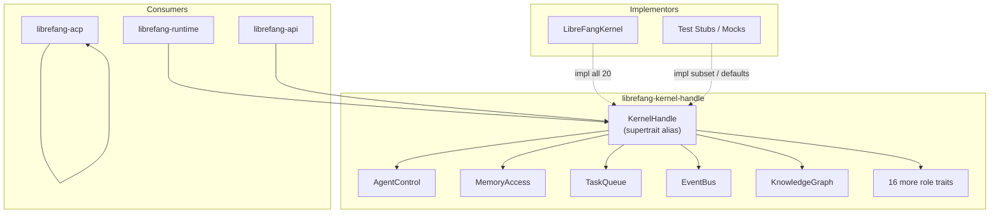

# crates — librefang-kernel-handle

# `librefang-kernel-handle`

Role traits that define the contract between the LibreFang agent runtime and the kernel. Every kernel operation the runtime needs—spawning agents, reading/writing memory, posting tasks, running workflows, sending channel messages, querying the model catalog—is declared here as a trait method. The concrete `LibreFangKernel` implements these traits; the runtime consumes them through `Arc<dyn SomeRole>` or `Arc<dyn KernelHandle>`.

## Architecture

The crate was refactored (issue #3746) from a single 50+ method `KernelHandle` god-trait into **20 focused role traits**, each living in its own module file. The original `KernelHandle` is preserved as a supertrait alias with a blanket impl, so all existing `Arc<dyn KernelHandle>` call sites continue to work while new code can narrow its bounds.



### Why role traits?

1. **Narrower bounds** — A function that only needs memory access can take `T: MemoryAccess` instead of pulling the entire kernel surface.
2. **Compile-time capability checking** — A missing capability is a compile error in the role-trait impl, not a silent `Err("not available")` at first runtime call.
3. **Testable stubs** — Mocks group fakes by capability. A stub that doesn't need cron can use the default `CronControl` impl without writing any code for it.

## Error Handling

All trait methods return `KernelResult<T>`, which is `Result<T, KernelOpError>`. `KernelOpError` is a re-export of `librefang_types::error::LibreFangError`—the canonical structured business-error enum used across the workspace.

This replaced the previous `Result<_, String>` pattern, which forced callers to substring-match error messages. Now callers can pattern-match on variants:

```rust
match err {
    KernelOpError::AgentNotFound(_) => /* 404 */,
    KernelOpError::CapabilityDenied(_) => /* 403 */,
    KernelOpError::Unavailable(_) => /* 503 */,
    // ...
}
```

## Role Traits

### AgentControl — Agent Lifecycle & Inter-Agent Communication

The largest and most complex role trait. Covers spawning agents, sending messages, async delegation, heartbeats, and forked one-shot calls.

**Core operations:**
- `spawn_agent(manifest_toml, parent_id)` → `(agent_id, agent_name)`
- `spawn_agent_checked(manifest_toml, parent_id, parent_caps)` — enforces capability inheritance; default delegates to `spawn_agent`
- `send_to_agent(agent_id, message)` → response string
- `list_agents()` / `find_agents(query)` / `kill_agent(agent_id)`
- `touch_heartbeat(agent_id)` — prevents heartbeat false-positives during long LLM calls
- `run_forked_agent_oneshot(agent_id, prompt, allowed_tools)` — structured-output via forked call; used by the proactive memory extractor for prompt-cache alignment

**Cancel cascade and session pinning:**
- `send_to_agent_as(agent_id, message, parent_agent_id)` — records the call lineage so `/stop` on the parent cascades into the callee (#3044)
- `send_to_agent_with_key(agent_id, message, conversation_key)` — pins the callee to a deterministic session derived from the key
- `send_to_agent_as_with_key(...)` — combines both behaviors

**Async tracked delegation:**

`send_to_agent_async_tracked` registers a delegation on the kernel's async-task tracker and returns immediately with a task id, rather than blocking. The callee's reply is later injected into the caller's session as a `TaskCompletionEvent`. This method returns `AsyncSendOutcome`, **not** a bare string:

```rust
pub enum AsyncSendOutcome {
    Tracked(String),  // task id — reply arrives later
    Inline(String),   // blocking fallback — reply is already complete
}
```

This distinction fixes #6650, where both outcomes previously shared a single `String` slot, causing the caller to label an already-complete response body as a `task_id` and tell the model to wait for a reply that would never arrive.

### MemoryAccess — Per-Agent Key/Value Store

Scoped memory with three-tier namespacing:

| `agent_id` | `peer_id` | Namespace |
|---|---|---|
| `Some(id)` | `Some(peer)` | Agent + peer scoped |
| `Some(id)` | `None` | Agent scoped |
| `None` | `None` | Shared (backward compat) |

**Design note:** Internal kernel subsystems (messaging, prompt_context, goal_control) write to the shared namespace via `shared_memory_agent_id()`. LLM-facing tools must use per-agent scoping (`Some(caller_uuid)`).

`memory_acl_for_sender` resolves per-user RBAC access for proactive-memory reads (#3054). Returns `None` when RBAC is disabled.

### WikiAccess — Durable Markdown Knowledge Vault

Mirrors `MemoryAccess` but targets the `librefang-memory-wiki` vault. Results cross the seam as `serde_json::Value` so this trait doesn't depend on the wiki crate's owned types.

- `wiki_get(topic)` — returns `{ topic, frontmatter, body }`
- `wiki_search(query, limit)` — case-insensitive substring search, topic-name hits outrank body hits
- `wiki_write(topic, body, provenance, force)` — supports `[[topic]]` cross-references; `force = false` refuses to silently overwrite externally-modified pages (returns `conflict`)

Provenance is monotonic — the vault appends, never overwrites.

### TaskQueue — Shared Task Queue

CRUD operations for the shared task queue: `task_post`, `task_claim`, `task_complete`, `task_list`, `task_get`, `task_delete`, `task_retry`, `task_update_status`.

### EventBus — Fire-and-Forget Proactive Triggers

Single method: `publish_event(event_type, payload)`. Events can trigger proactive agents.

### KnowledgeGraph — Entity/Relation Graph

- `knowledge_add_entity(&entity, agent_id, peer_id)` — takes entity by reference to avoid forced moves (#3553)
- `knowledge_add_relation(&relation, agent_id, peer_id)` — same by-reference pattern
- `knowledge_query(pattern, peer_id)` — pattern query returning `GraphMatch` results

Entities and relations are scoped by `agent_id` (agent-scoped reads/deletes) and optionally `peer_id` (per-user isolation, #6494).

### CronControl — Agent-Owned Scheduled Jobs

- `cron_create(agent_id, job_json)` → job id
- `cron_list(agent_id)` / `cron_cancel(job_id)`
- `cron_set_enabled(job_id, enabled)` — pauses without losing config (#6159); agent tools route "stop" here, hard deletion is human-only

### ApprovalGate — Tool Approval Policy & Lifecycle

- `requires_approval(tool_name)` and contextual variants (`requires_approval_with_context`, `is_tool_denied_with_context`)
- `resolve_user_tool_decision(tool, sender, channel, system_call)` — per-user RBAC gate (#3054). Returns `Allow`, `Deny`, or `NeedsApproval`. The `system_call` flag bypasses the per-user gate for daemon-internal forks (e.g., auto_dream) that have no attributable user (#6463).
- `request_approval(...)` — blocking, returns `ApprovalDecision`
- `submit_tool_approval(...)` / `resolve_tool_approval(...)` — non-blocking approval workflow with deferred execution payloads

### HandsControl — Specialized Agent Lifecycle

Manages "Hands"—specialized autonomous agents: `hand_list`, `hand_install`, `hand_activate`, `hand_status`, `hand_deactivate`.

### A2ARegistry — Discovered External Agents

Read-only directory of external A2A agents: `list_a2a_agents()` returns `(name, url)` pairs, `get_a2a_agent_url(name)` returns `Option<String>`.

### ChannelSender — Outbound Channel Adapters

Multi-channel message delivery (email, Telegram, etc.):

- `send_channel_message(channel, recipient, message, thread_id, account_id)`
- `send_channel_media(...)` — image/file via URL
- `send_channel_file_data(channel, recipient, data: Bytes, ...)` — raw bytes; uses `bytes::Bytes` for zero-cost cloning in wrapping layers (#3553)
- `send_channel_poll(...)`
- Roster management: `roster_upsert`, `roster_members`, `roster_remove_member`
- `resolve_channel_owner(channel, chat_id)` — finds the agent that owns a channel/chat pair, used to mirror outbound messages into the inbound-routing session

### PromptStore — Prompt Versioning & Experiments

Full prompt lifecycle: versions, experiments with A/B metrics, auto-tracking when system prompts change. Key methods: `get_running_experiment`, `record_experiment_request`, `list_prompt_versions`, `create_prompt_version` (by reference, #3553), `set_active_prompt_version`, `create_experiment`, `update_experiment_status`, `get_experiment_metrics`, `auto_track_prompt_version`.

### WorkflowRunner — Declarative Workflow Execution

Workflow discovery, execution, and status tracking.

**Discovery types** (all `#[non_exhaustive]`, constructed via `new()`):
- `WorkflowSummary` — id, name, description, step_count, `has_input_schema`
- `WorkflowDescription` — step names in declaration order, `input_schema` sorted by name for deterministic LLM output (#3298)
- `WorkflowInputParam` — name, `param_type` (`"string" | "number" | "boolean" | "file" | "image" | "agent_id"`), required, description
- `WorkflowRunSummary` — run state, timing, output, per-step `StepOutputSummary` in execution order

**Execution:**
- `run_workflow(workflow_id, input)` → `(run_id, output)` — blocking
- `start_workflow_async(workflow_id, input)` → `run_id` — fire-and-forget
- `start_workflow_async_tracked(workflow_id, input, caller_agent_id, caller_session_id)` — registers on the async-task tracker for completion event injection (#4983)
- `cancel_workflow_run(run_id)`

### GoalControl — Agent Goals

- `goal_list_active(agent_id)` — pending/in_progress goals
- `goal_update(goal_id, status, progress)` → updated goal JSON

### ToolPolicy — Tool Configuration Queries

Read-side surface for tool execution parameterization:

- `tool_timeout_secs()` / `tool_timeout_secs_for(tool_name)` — resolution: exact match → longest glob → global default
- `skill_env_passthrough_policy()` — operator gate over skill env requests
- `readonly_workspace_prefixes(agent_id)` / `named_workspace_prefixes(agent_id)` — sandbox access modes
- `channel_file_download_dir()` — widens sandbox for bridge-downloaded attachments (#4434)
- `deduplicate_file_reads()` — collapse repeated reads within a session (#4971)
- `effective_upload_dir()` — honors `[channels].file_download_dir` or falls back to `<temp>/librefang_uploads`
- `protected_write_paths()` — paths the WASM sandbox must never write to

### ApiAuth — Auth Config Snapshot

`auth_snapshot()` returns an `ApiAuthSnapshot` capturing every auth-relevant config field from a single `config.load()` so all fields observe the same hot-reload generation. Contains: `api_key`, `api_key_hash`, dashboard credentials (`DashboardRawConfig`), `home_dir`, `device_api_keys`, and `config_users` (`ApiUserConfigSnapshot`). The HTTP server resolves raw values (env-var override, `vault:` prefix) independently.

### SessionWriter — Pre-Turn Content Injection

- `inject_attachment_blocks(agent_id, session_id, blocks)` — pre-inserts content blocks as a User message before the next LLM turn (#3744). **Session isolation invariant:** callers must derive `session_id` with the same resolver used by the matching `send_message_*` call. Passing the wrong session causes cross-chat leaks.
- `append_to_session(session_id, agent_id, message)` — best-effort message append for outbound message mirroring

> **Blocking I/O notice:** The current implementation calls `MemorySubstrate::save_session` synchronously (SQLite write). Callers in async contexts should wrap in `tokio::task::spawn_blocking` (#3579 will make this async).

### AcpFsBridge & AcpTerminalBridge — Editor-Backed Reverse-RPC

Route file I/O and terminal commands through an attached ACP editor instead of the agent's local filesystem/process spawning (#3313).

**Client traits** (implemented by `librefang-acp`):
- `AcpFsClient` — `read_text_file`, `write_text_file`, `capabilities() -> (bool, bool)`
- `AcpTerminalClient` — `run_command(...)` (full create→wait→output→release cycle), `capabilities() -> bool`

**Bridge traits** (implemented by the kernel):
- `register_acp_fs_client(session_id, client)` / `unregister_acp_fs_client(session_id)` / `acp_fs_client(session_id)` → `Option<Arc<dyn AcpFsClient>>`
- Convenience: `acp_read_text_file(session_id, path, line, limit)` / `acp_write_text_file(session_id, path, content)` — returns `Unavailable` when no editor is bound
- Same registration/lookup/convenience pattern for `AcpTerminalBridge`

When no editor is bound (dashboard/TUI/cron/channel-bridge cases), these return `Unavailable` and runtime tools should **fall back to local fs/process spawning**, not error out.

### CatalogQuery — Model Catalog Metadata

Read-side projection for request-build-time decisions:

- `reasoning_echo_policy_for(model)` — how the OpenAI-compat driver handles `reasoning_content` on historical turns (#4842). Default: `None` (fall back to substring detection).
- `supports_vision_for(model)` — whether to send image content blocks or redact to text. Default: `true` (fail open, #6010).
- `proactive_memory_extraction_model_for(agent_id)` — effective extraction model (#5475). Default: `None`.

## The `KernelHandle` Supertrait Alias

`KernelHandle` requires all 20 role traits plus `Send + Sync`. A blanket impl means any type implementing every role trait automatically gets `KernelHandle`:

```rust
impl<T> KernelHandle for T where
    T: AgentControl + MemoryAccess + WikiAccess + TaskQueue + EventBus
     + KnowledgeGraph + CronControl + ApprovalGate + HandsControl
     + A2ARegistry + ChannelSender + PromptStore + WorkflowRunner
     + GoalControl + ToolPolicy + ApiAuth + SessionWriter
     + AcpFsBridge + AcpTerminalBridge + CatalogQuery
     + Send + Sync + ?Sized
{}
```

This keeps ~117 existing `Arc<dyn KernelHandle>` call sites working unchanged. New code should prefer narrower bounds.

## Default Implementations

Default impls follow a consistent pattern:

| Category | Default behavior | Reason |
|---|---|---|
| Read queries (lists, lookups) | Empty vec / `None` / `false` | Stubs compile without wiring |
| Write operations (create, store, send) | `Err(KernelOpError::unavailable(...))` | Fail loudly at runtime |
| Policy gates | Permissive (`Allow`, `true` for vision) | Preserve pre-existing behavior |
| Convenience wrappers | Delegate to the core method | Composability without re-impl |

These defaults are deliberately preserved to keep the role-trait split a pure structural refactor. Follow-up PRs can tighten individual contracts independently.

## Usage Patterns

**Broad bound (legacy, still works):**
```rust
use librefang_kernel_handle::KernelHandle;

async fn do_stuff(kernel: &dyn KernelHandle) {
    kernel.send_to_agent("agent-1", "hello").await?;
}
```

**Narrow bound (preferred for new code):**
```rust
use librefang_kernel_handle::ApprovalGate;

async fn check_approval<T: ApprovalGate + Send + Sync>(gate: &T) {
    if gate.requires_approval("dangerous_tool") {
        // ...
    }
}
```

**Prelude for convenience:**
```rust
use librefang_kernel_handle::prelude::*;
```

This brings `KernelHandle`, every role trait, and all public structs (`AgentInfo`, `AsyncSendOutcome`, `ApiAuthSnapshot`, `WorkflowRunSummary`, `AcpTerminalRunResult`, etc.) into scope.

## Test Infrastructure

The crate includes compile-time tests (`src/tests.rs`) that verify:

1. `stub_satisfies_kernel_handle_via_blanket_impl` — a `StubKernel` implementing all role traits reaches `KernelHandle` through the blanket impl
2. `dyn_kernel_handle_is_object_safe` — `Arc<dyn KernelHandle>` can be constructed
3. `role_traits_are_individually_object_safe` — each role trait can be used as `Arc<dyn Role>` independently

Integration tests (`tests/`) verify default-method delegation behavior:
- `defaults_approval.rs` — approval defaults auto-approve, context methods delegate
- `defaults_delegation.rs` — `send_to_agent_as` → `send_to_agent`, `spawn_agent_checked` → `spawn_agent`, `requires_approval_with_context` → `requires_approval`
- `defaults_returns.rs` — typed error variants on default impls (`KernelOpError::Unavailable`)