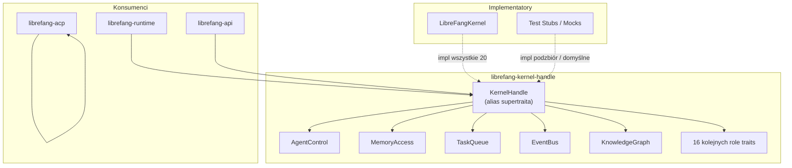

# crates — librefang-kernel-handle

# `librefang-kernel-handle`

Role traits definiujące kontrakt między środowiskiem uruchomieniowym agenta LibreFang a jądrem. Każda operacja jądra wymagana przez środowisko uruchomieniowe — tworzenie agentów, odczyt/zapis pamięci, publikowanie zadań, uruchamianie przepływów pracy, wysyłanie wiadomości kanałowych, odpytywanie katalogu modeli — jest zadeklarowana tutaj jako metoda traita. Konkretny `LibreFangKernel` implementuje te traity; środowisko uruchomieniowe korzysta z nich poprzez `Arc<dyn SomeRole>` lub `Arc<dyn KernelHandle>`.

## Architektura

Ten crate został zrefaktoryzowany (issue #3746) z pojedynczego „bogotraita" `KernelHandle` obejmującego 50+ metod na **20 wyspecjalizowanych role traits**, z których każdy znajduje się we własnym pliku modułu. Oryginalny `KernelHandle` jest zachowany jako alias supertraita z blanket impl, dzięki czemu wszystkie istniejące punkty wywołań `Arc<dyn KernelHandle>` działają bez zmian, a nowy kod może zawężać swoje granice.



### Dlaczego role traits?

1. **Węższe granice** — funkcja potrzebująca tylko dostępu do pamięci może przyjmować `T: MemoryAccess` zamiast ciągnąć całą powierzchnię jądra.
2. **Sprawdzanie możliwości w czasie kompilacji** — brakująca możliwość to błąd kompilacji w implu role traita, a nie ciche `Err("not available")` przy pierwszym wywołaniu w środowisku uruchomieniowym.
3. **Testowalne stuby** — Mocki grupują fałszywe implementacje według możliwości. Stub niepotrzebujący crona może użyć domyślnego impla `CronControl` bez pisania dla niego żadnego kodu.

## Obsługa błędów

Wszystkie metody traitów zwracają `KernelResult<T>`, czyli `Result<T, KernelOpError>`. `KernelOpError` to re-eksport `librefang_types::error::LibreFangError` — kanonicznego, ustrukturyzowanego enumu błędów biznesowych używanego w całym workspace.

To zastąpiło poprzedni wzorzec `Result<_, String>`, który wymuszał na wywołujących dopasowywanie substringów w komunikatach błędów. Teraz wywołujący mogą dopasowywać wzorce do wariantów:

```rust
match err {
    KernelOpError::AgentNotFound(_) => /* 404 */,
    KernelOpError::CapabilityDenied(_) => /* 403 */,
    KernelOpError::Unavailable(_) => /* 503 */,
    // ...
}
```

## Role Traits

### AgentControl — Cykl życia agenta i komunikacja międzyagentowa

Największy i najbardziej złożony role trait. Obejmuje tworzenie agentów, wysyłanie wiadomości, asynchroniczne delegowanie, heartbeaty i rozforkowane wywołania jednorazowe.

**Podstawowe operacje:**
- `spawn_agent(manifest_toml, parent_id)` → `(agent_id, agent_name)`
- `spawn_agent_checked(manifest_toml, parent_id, parent_caps)` — wymusza dziedziczenie możliwości; domyślnie deleguje do `spawn_agent`
- `send_to_agent(agent_id, message)` → ciąg odpowiedzi
- `list_agents()` / `find_agents(query)` / `kill_agent(agent_id)`
- `touch_heartbeat(agent_id)` — zapobiega fałszywym alarmom heartbeat podczas długich wywołań LLM
- `run_forked_agent_oneshot(agent_id, prompt, allowed_tools)` — wyjście ustrukturyzowane poprzez wywołanie rozforkowane; używane przez proaktywny ekstraktor pamięci do wyrównania prompt-cache

**Kaskada anulowań i przypinanie sesji:**
- `send_to_agent_as(agent_id, message, parent_agent_id)` — rejestruje linię wywołań, aby `/stop` na nadrzędnym kaskadował do wywoływanego (#3044)
- `send_to_agent_with_key(agent_id, message, conversation_key)` — przypina wywoływanego do deterministycznej sesji pochodzącej z klucza
- `send_to_agent_as_with_key(...)` — łączy oba zachowania

**Asynchroniczne śledzone delegowanie:**

`send_to_agent_async_tracked` rejestruje delegację w asynchronicznym trackerze zadań jądra i zwraca natychmiast identyfikator zadania, zamiast blokować. Odpowiedź wywoływanego jest później wstrzykiwana do sesji wywołującego jako `TaskCompletionEvent`. Ta metoda zwraca `AsyncSendOutcome`, **nie** surowy ciąg:

```rust
pub enum AsyncSendOutcome {
    Tracked(String),  // task id — odpowiedź przychodzi później
    Inline(String),   // awaryjne blokowanie — odpowiedź jest już gotowa
}
```

To rozróżnienie naprawia #6650, gdzie wcześniej oba wyniki współdzieliły pojedynczy slot `String`, co powodowało, że wywołujący oznaczał już gotową treść odpowiedzi jako `task_id` i nakazywał modelowi oczekiwać na odpowiedź, która nigdy by nie nadeszła.

### MemoryAccess — Per-agentowy magazyn klucz/wartość

Pamięć z zakresem i trójpoziomową przestrzenią nazw:

| `agent_id` | `peer_id` | Przestrzeń nazw |
|---|---|---|
| `Some(id)` | `Some(peer)` | Zakres agent + peer |
| `Some(id)` | `None` | Zakres agenta |
| `None` | `None` | Współdzielona (wsteczna kompatybilność) |

**Uwaga projektowa:** Wewnętrzne podsystemy jądra (messaging, prompt_context, goal_control) zapisują do współdzielonej przestrzeni nazw poprzez `shared_memory_agent_id()`. Narzędzia skierowane do LLM muszą używać zakresu per-agent (`Some(caller_uuid)`).

`memory_acl_for_sender` rozwiązuje dostęp RBAC per-użytkownika dla odczytów proaktywnej pamięci (#3054). Zwraca `None`, gdy RBAC jest wyłączone.

### WikiAccess — Trwała wiedza w Markdown

Odbija `MemoryAccess`, ale celuje w skarbiec `librefang-memory-wiki`. Wyniki przechodzą granicę jako `serde_json::Value`, więc ten trait nie zależy od typów własnościowych crate'a wiki.

- `wiki_get(topic)` — zwraca `{ topic, frontmatter, body }`
- `wiki_search(query, limit)` — wyszukiwanie substringów bez uwzględniania wielkości liter, trafienia w nazwie tematu mają wyższy priorytet niż trafienia w treści
- `wiki_write(topic, body, provenance, force)` — obsługuje odnośniki krzyżowe `[[topic]]`; `force = false` odmawia cichego nadpisywania stron zmodyfikowanych zewnętrznie (zwraca `conflict`)

Provenance jest monotoniczne — skarbiec dopisuje, nigdy nie nadpisuje.

### TaskQueue — Współdzielona kolejka zadań

Operacje CRUD dla współdzielonej kolejki zadań: `task_post`, `task_claim`, `task_complete`, `task_list`, `task_get`, `task_delete`, `task_retry`, `task_update_status`.

### EventBus — Proaktywne wyzwalacze fire-and-forget

Pojedyncza metoda: `publish_event(event_type, payload)`. Zdarzenia mogą wyzwalać agentów proaktywnych.

### KnowledgeGraph — Graf encji/relacji

- `knowledge_add_entity(&entity, agent_id, peer_id)` — przyjmuje encję przez referencję, aby uniknąć wymuszonych przeniesień (#3553)
- `knowledge_add_relation(&relation, agent_id, peer_id)` — ten sam wzorzec przez referencję
- `knowledge_query(pattern, peer_id)` — zapytanie wzorcem zwracające wyniki `GraphMatch`

Encje i relacje są ograniczone przez `agent_id` (odczyty/usuwanie w zakresie agenta) i opcjonalnie `peer_id` (izolacja per-użytkownik, #6494).

### CronControl — Zaplanowane zadania własne agenta

- `cron_create(agent_id, job_json)` → id zadania
- `cron_list(agent_id)` / `cron_cancel(job_id)`
- `cron_set_enabled(job_id, enabled)` — pauzuje bez utraty konfiguracji (#6159); narzędzia agenta kierują „stop" tutaj, twarde usunięcie jest tylko dla ludzi

### ApprovalGate — Polityka zatwierdzania narzędzi i cykl życia

- `requires_approval(tool_name)` i warianty kontekstowe (`requires_approval_with_context`, `is_tool_denied_with_context`)
- `resolve_user_tool_decision(tool, sender, channel, system_call)` — bramka RBAC per-użytkownik (#3054). Zwraca `Allow`, `Deny` lub `NeedsApproval`. Flaga `system_call` omija bramkę per-użytkownik dla wewnętrznych forków demona (np. auto_dream), które nie mają przypisanego użytkownika (#6463).
- `request_approval(...)` — blokujące, zwraca `ApprovalDecision`
- `submit_tool_approval(...)` / `resolve_tool_approval(...)` — nieblokujący przepływ zatwierdzania z odroczonymi ładunkami wykonania

### HandsControl — Specjalizowany cykl życia agentów

Zarządza „Hands" — specjalizowanymi agentami autonomicznymi: `hand_list`, `hand_install`, `hand_activate`, `hand_status`, `hand_deactivate`.

### A2ARegistry — Odkryci agenci zewnętrzni

Katalog tylko do odczytu agentów zewnętrznych A2A: `list_a2a_agents()` zwraca pary `(name, url)`, `get_a2a_agent_url(name)` zwraca `Option<String>`.

### ChannelSender — Adaptery kanałów wychodzących

Wielokanałowa dostarczanie wiadomości (email, Telegram itp.):

- `send_channel_message(channel, recipient, message, thread_id, account_id)`
- `send_channel_media(...)` — obraz/plik przez URL
- `send_channel_file_data(channel, recipient, data: Bytes, ...)` — surowe bajty; używa `bytes::Bytes` dla klonowania bezkosztowego w warstwach opakowujących (#3553)
- `send_channel_poll(...)`
- Zarządzanie listą: `roster_upsert`, `roster_members`, `roster_remove_member`
- `resolve_channel_owner(channel, chat_id)` — znajduje agenta będącego właścicielem pary kanał/czat, używane do mirroringu wiadomości wychodzących do sesji routingu przychodzącego

### PromptStore — Wersjonowanie i eksperymenty z promptami

Pełny cykl życia promptów: wersje, eksperymenty z metrykami A/B, automatyczne śledzenie przy zmianach promptów systemowych. Kluczowe metody: `get_running_experiment`, `record_experiment_request`, `list_prompt_versions`, `create_prompt_version` (przez referencję, #3553), `set_active_prompt_version`, `create_experiment`, `update_experiment_status`, `get_experiment_metrics`, `auto_track_prompt_version`.

### WorkflowRunner — Wykonanie deklaratywnych przepływów pracy

Odkrywanie, wykonywanie i śledzenie statusu przepływów pracy.

**Typy odkrywania** (wszystkie `#[non_exhaustive]`, konstruowane przez `new()`):
- `WorkflowSummary` — id, nazwa, opis, step_count, `has_input_schema`
- `WorkflowDescription` — nazwy kroków w kolejności deklaracji, `input_schema` posortowane po nazwie dla deterministycznego wyjścia LLM (#3298)
- `WorkflowInputParam` — nazwa, `param_type` (`"string" | "number" | "boolean" | "file" | "image" | "agent_id"`), wymagany, opis
- `WorkflowRunSummary` — stan uruchomienia, czasy, wyjście, per-krokowe `StepOutputSummary` w kolejności wykonania

**Wykonywanie:**
- `run_workflow(workflow_id, input)` → `(run_id, output)` — blokujące
- `start_workflow_async(workflow_id, input)` → `run_id` — fire-and-forget
- `start_workflow_async_tracked(workflow_id, input, caller_agent_id, caller_session_id)` — rejestruje w asynchronicznym trackerze zadań dla wstrzykiwania zdarzenia ukończenia (#4983)
- `cancel_workflow_run(run_id)`

### GoalControl — Cele agenta

- `goal_list_active(agent_id)` — cele pending/in_progress
- `goal_update(goal_id, status, progress)` → zaktualizowany JSON celu

### ToolPolicy — Zapytania konfiguracji narzędzi

Powierzchnia odczytowa dla parametryzacji wykonania narzędzi:

- `tool_timeout_secs()` / `tool_timeout_secs_for(tool_name)` — rozdzielczość: dokładne dopasowanie → najdłuższy glob → domyślny globalny
- `skill_env_passthrough_policy()` — bramka operatora nad żądaniami env skilla
- `readonly_workspace_prefixes(agent_id)` / `named_workspace_prefixes(agent_id)` — tryby dostępu piaskownicy
- `channel_file_download_dir()` — poszerza piaskownicę dla załączników pobranych przez mostek (#4434)
- `deduplicate_file_reads()` — zwijanie powtarzających się odczytów w ramach sesji (#4971)
- `effective_upload_dir()` — honoruje `[channels].file_download_dir` lub cofa do `<temp>/librefang_uploads`
- `protected_write_paths()` — ścieżki, których piaskownica WASM nigdy nie może zapisywać

### ApiAuth — Migawka konfiguracji autoryzacji

`auth_snapshot()` zwraca `ApiAuthSnapshot` przechwytującą każde pole konfiguracji związane z autoryzacją z pojedynczego `config.load()`, dzięki czemu wszystkie pola obserwują tę samą generację hot-reload. Zawiera: `api_key`, `api_key_hash`, dane logowania dashboardu (`DashboardRawConfig`), `home_dir`, `device_api_keys` oraz `config_users` (`ApiUserConfigSnapshot`). Serwer HTTP rozwiązuje surowe wartości (nadpisanie env-var, prefiks `vault:`) niezależnie.

### SessionWriter — Wstrzykiwanie zawartości przed turą

- `inject_attachment_blocks(agent_id, session_id, blocks)` — wstawia bloki zawartości jako wiadomość User przed następną turą LLM (#3744). **Niezmiennik izolacji sesji:** wywołujący muszą wywodzić `session_id` za pomocą tego samego resolvera używanego przez pasujące wywołanie `send_message_*`. Przekazanie błędnej sesji powoduje przecieki między czatami.
- `append_to_session(session_id, agent_id, message)` — dołączanie wiadomości best-effort dla mirroringu wiadomości wychodzących

> **Uwaga o blokującym I/O:** Obecna implementacja wywołuje `MemorySubstrate::save_session` synchronicznie (zapis SQLite). Wywołujący w kontekstach asynchronicznych powinni otaczać to `tokio::task::spawn_blocking` (#3579 uczyni to asynchronicznym).

### AcpFsBridge i AcpTerminalBridge — Reverse-RPC wspierany przez edytor

Kieruje operacje I/O plików i polecenia terminala przez podłączony edytor ACP zamiast lokalnego systemu plików/procesów agenta (#3313).

**Traity klienta** (implementowane przez `librefang-acp`):
- `AcpFsClient` — `read_text_file`, `write_text_file`, `capabilities() -> (bool, bool)`
- `AcpTerminalClient` — `run_command(...)` (pełny cykl create→wait→output→release), `capabilities() -> bool`

**Traity mostka** (implementowane przez jądro):
- `register_acp_fs_client(session_id, client)` / `unregister_acp_fs_client(session_id)` / `acp_fs_client(session_id)` → `Option<Arc<dyn AcpFsClient>>`
- Wygoda: `acp_read_text_file(session_id, path, line, limit)` / `acp_write_text_file(session_id, path, content)` — zwraca `Unavailable`, gdy żaden edytor nie jest powiązany
- Ten sam wzorzec rejestracji/lookup/wygody dla `AcpTerminalBridge`

Gdy żaden edytor nie jest powiązany (przypadki dashboard/TUI/cron/channel-bridge), te zwracają `Unavailable` i narzędzia środowiska uruchomieniowego powinny **cofać do lokalnego fs/process spawning**, a nie rzucać błąd.

### CatalogQuery — Metadane katalogu modeli

Projekcja odczytowa dla decyzji w czasie budowania żądania:

- `reasoning_echo_policy_for(model)` — jak sterownik OpenAI-compat obsługuje `reasoning_content` na turach historycznych (#4842). Domyślnie: `None` (cofnięcie do wykrywania substringów).
- `supports_vision_for(model)` — czy wysyłać bloki zawartości obrazu, czy redukować do tekstu. Domyślnie: `true` (fail open, #6010).
- `proactive_memory_extraction_model_for(agent_id)` — efektywny model ekstrakcji (#5475). Domyślnie: `None`.

## Alias supertraita `KernelHandle`

`KernelHandle` wymaga wszystkich 20 role traits oraz `Send + Sync`. Blanket impl oznacza, że każdy typ implementujący każdy role trait automatycznie otrzymuje `KernelHandle`:

```rust
impl<T> KernelHandle for T where
    T: AgentControl + MemoryAccess + WikiAccess + TaskQueue + EventBus
     + KnowledgeGraph + CronControl + ApprovalGate + HandsControl
     + A2ARegistry + ChannelSender + PromptStore + WorkflowRunner
     + GoalControl + ToolPolicy + ApiAuth + SessionWriter
     + AcpFsBridge + AcpTerminalBridge + CatalogQuery
     + Send + Sync + ?Sized
{}
```

To utrzymuje ~117 istniejących punktów wywołań `Arc<dyn KernelHandle>` działających bez zmian. Nowy kod powinien preferować węższe granice.

## Implementacje domyślne

Domyślne imple dla następują spójnego wzorca:

| Kategoria | Domyślne zachowanie | Powód |
|---|---|---|
| Zapytania odczytowe (listy, lookupy) | Pusty wektor / `None` / `false` | Stuby kompilują się bez podłączania |
| Operacje zapisu (create, store, send) | `Err(KernelOpError::unavailable(...))` | Jawne błędy w czasie działania |
| Bramki polityki | Przechodzące (`Allow`, `true` dla vision) | Zachowanie zachowujące dotychczasowe |
| Wrappery wygody | Delegują do metody podstawowej | Komponowalność bez reimplementacji |

Te domyślne zachowania są celowo zachowane, aby podział role traits był czystą refaktoryzacją strukturalną. Kolejne PR-y mogą zaostrzać indywidualne kontrakty niezależnie.

## Wzorce użycia

**Szeroka granica (legacy, nadal działa):**
```rust
use librefang_kernel_handle::KernelHandle;

async fn do_stuff(kernel: &dyn KernelHandle) {
    kernel.send_to_agent("agent-1", "hello").await?;
}
```

**Wąska granica (preferowane dla nowego kodu):**
```rust
use librefang_kernel_handle::ApprovalGate;

async fn check_approval<T: ApprovalGate + Send + Sync>(gate: &T) {
    if gate.requires_approval("dangerous_tool") {
        // ...
    }
}
```

**Prelude dla wygody:**
```rust
use librefang_kernel_handle::prelude::*;
```

To wprowadza do zakresu `KernelHandle`, każdy role trait oraz wszystkie publiczne struktury (`AgentInfo`, `AsyncSendOutcome`, `ApiAuthSnapshot`, `WorkflowRunSummary`, `AcpTerminalRunResult` itd.).

## Infrastruktura testowa

Crate zawiera testy w czasie kompilacji (`src/tests.rs`), które weryfikują:

1. `stub_satisfies_kernel_handle_via_blanket_impl` — `StubKernel` implementujący wszystkie role traits osiąga `KernelHandle` przez blanket impl
2. `dyn_kernel_handle_is_object_safe` — `Arc<dyn KernelHandle>` może być skonstruowany
3. `role_traits_are_individually_object_safe` — każdy role trait może być używany jako `Arc<dyn Role>` niezależnie

Testy integracyjne (`tests/`) weryfikują zachowanie delegacji metod domyślnych:
- `defaults_approval.rs` — domyślne zatwierdzenia auto-approve, metody kontekstowe delegują
- `defaults_delegation.rs` — `send_to_agent_as` → `send_to_agent`, `spawn_agent_checked` → `spawn_agent`, `requires_approval_with_context` → `requires_approval`
- `defaults_returns.rs` — typowane warianty błędów na domyślnych implach (`KernelOpError::Unavailable`)
