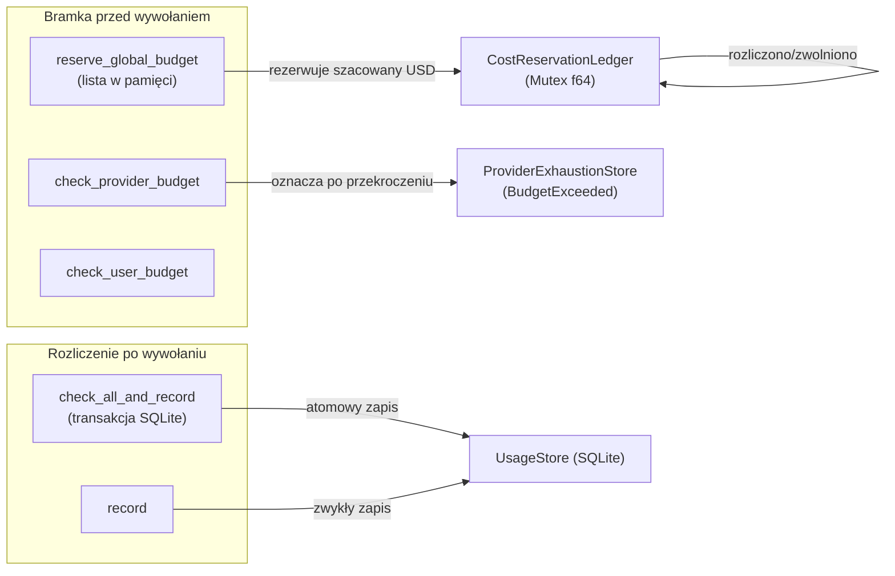

# crates — librefang-kernel-metering

# librefang-kernel-metering

Mierzanie kosztów i wymuszanie limitów w jądrze LibreFang. Śledzi wydatki na LLM w czterech zakresach — globalnym, na agenta, na użytkownika i na dostawcę — oraz blokuje wywołania przed ich wysłaniem, gdy skonfigurowane budżety zostałyby przekroczone.

## Architektura



Silnik działa w dwóch fazach wokół każdego wywołania LLM:

1. **Przed wywołaniem**: Rezerwuje szacowany koszt w ramach budżetu globalnego (`reserve_global_budget`) i/lub sprawdza limity na dostawcę/użytkownika (`check_provider_budget`, `check_user_budget`). Te bramki mogą odrzucić wywołanie przed jakimkolwiek wysłaniem w sieci.
2. **Po wywołaniu**: Zapisuje rzeczywiste rozliczone użycie i weryfikuje wszystkie limity atomowo (`check_all_and_record`), a następnie rozlicza lub zwalnia rezerwację, aby lista w pamięci pozostawała dokładna.

## Kluczowe komponenty

### `MeteringEngine`

Centralny typ. Konstruowany z `UsageStore` (oparty na SQLite) i opcjonalnie połączony z `ProviderExhaustionStore` przez `with_exhaustion_store`.

```rust
let engine = MeteringEngine::new(Arc::new(usage_store))
    .with_exhaustion_store(exhaustion_store);
```

Silnik udostępnia cztery zakresy wymuszania, każdy z oknami godzinowymi, dziennymi i miesięcznymi:

| Zakres | Bramka przed wywołaniem | Sprawdzenie po wywołaniu | Atomowe sprawdzenie + zapis |
|-------|--------------------------|---------------------------|------------------------------|
| Globalny | `reserve_global_budget` | `check_global_budget` | `check_global_budget_and_record` / `check_all_and_record` |
| Agent | `check_quota` | — | `check_quota_and_record` / `check_all_and_record` |
| Użytkownik | `check_user_budget` | `check_user_budget` | — |
| Dostawca | `check_provider_budget` | `check_provider_budget` | `check_all_and_record` (wewnątrz transakcji) |

### Lista rezerwacji w trakcie (`CostReservationLedger`)

Prywatny `Mutex<f64>`, który śledzi zarezerwowane, ale nierozliczone USD we wszystkich wywołaniach LLM w trakcie. Istnieje dlatego, że `check_global_budget` odczytuje rozliczone wydatki z SQLite, które odzwierciedlają tylko zakończone wywołania. Gdy N wyzwalaczy uruchamia się współbieżnie, wszystkie obserwują tę samą sumę przed wywołaniem, wszystkie przechodzą przez bramkę i wszystkie się zatwierdzają — tworząc wielokrotne przekroczenia.

Lista rozwiązuje ten problem za pomocą `check_and_add`, który wykonuje porównanie limitu i operację `+=` w ramach jednego przejęcia muteksu. Dwóch współbieżnych wywołujących nie może jednocześnie zaobserwować wartości `current()` przed dodaniem i obu się zatwierdzić, ponieważ drugi blokuje się na muteksie, dopóki pierwszy nie doda lub nie zwróci wartości.

Rezerwacja jest zwracana jako token `MeteringReservation`. Wywołujący muszą wywołać `.settle()` (po zapisaniu rzeczywistego użycia) lub `.release()` (w przypadku niepowodzenia wysłania). `Drop` zwalnia rezerwację jako zabezpieczenie, jeśli żadna z tych metod nie zostanie wywołana.

### `MeteringReservation`

Token `#[must_use]` zwracany przez `reserve_global_budget`. Przechowuje szacowany USD i referencję do listy. Trzy metody cyklu życia:

- **`settle(self)`** — Wywołać po zapisaniu rzeczywistego użycia. Zwalnia rezerwację, aby lista nie liczyła podwójnie razem z rozliczonym wierszem SQLite.
- **`release(self)`** — Wywołać, gdy wysłanie nie powiodło się bez poniesienia kosztów. Zwalnia rezerwację.
- **`estimated_usd()`** — Akcesor tylko do odczytu dla przechowywanej kwoty.

Jeśli ani `settle`, ani `release` nie zostaną wywołane, `Drop` zwalnia rezerwację defensywnie.

### Integracja z wyczerpaniem dostawcy (#4807)

Gdy bramka budżetu na dostawcę się uruchomi, silnik oznacza dostawcę jako `BudgetExceeded` w podłączonym `ProviderExhaustionStore` na czas `DEFAULT_LONG_BACKOFF`. Dzięki temu łańcuch awaryjny LLM może pominąć dostawcę w kolejnych wywołaniach bez wcześniejszego wysyłania żądania, które bramka i tak odrzuciłaby ponownie.

```rust
// Po przekroczeniu:
self.exhaustion.mark_exhausted(
    provider,
    ExhaustionReason::BudgetExceeded,
    Some(Instant::now() + DEFAULT_LONG_BACKOFF),
);
```

Gdy żaden sklep wyczerpania nie jest podłączony (starsi wywołujący), `flag_provider_budget_exhausted` jest operacją no-op.

## Szacowanie kosztów

Dwie metody statyczne obliczają szacowany USD na podstawie liczby tokenów:

- **`estimate_cost(model, input, output, cache_read, cache_creation)`** — Używa stałych domyślnych stawek ($1,00/M wejście, $3,00/M wyjście). Niezależne od katalogu; parametr modelu jest tylko etykietą. Przeznaczone do testów jednostkowych lub gdy katalog jest niedostępny.

- **`estimate_cost_with_catalog(catalog, model, ...)`** — Odczytuje ceny z katalogu modeli przez `find_model`. Przechodzi do domyślnych stawek, gdy model jest nieznany. Przechodzi również do konserwatywnych niezerowych domyślnych stawek dla:
  - Modeli, gdzie `pricing_known` to `false`
  - Modeli sesji ChatGPT z zerowym cenami (`should_use_legacy_budget_estimate`)

Cennik tokenów w pamięci podręcznej:

| Typ tokena | Mnożnik ceny |
|------------|-------------|
| Zwykłe wejście | 1,0× stawka wejścia |
| Wejście z pamięci podręcznej (cache-read) | 0,10× stawka wejścia |
| Wejście tworzące pamięć podręczną (cache-creation) | 1,25× stawka wejścia |
| Wyjście | 1,0× stawka wyjścia |

Obliczanie kosztu używa `saturating_add` / `saturating_sub` throughout, aby obsługiwać odpowiedzi dostawców zwracające `u64::MAX/2 + 1` w polach pamięci podręcznej bez paniki lub przekroczenia zakresu.

## Semantyka porównania w bramkach

Bramka rezerwacji przed wywołaniem używa `>` (odrzucenie, gdy przewidywany wydatek przekracza limit), podczas gdy sprawdzenie budżetu po wywołaniu używa `>=` (odrzucenie, gdy limit jest w pełni zużyty). Ta asymetria jest celowa: pojedyncze wywołanie, które dokładnie osiąga limit, jest przepuszczane przez bramkę przed wywołaniem, ale po zużyciu limitu sprawdzenie po wywołaniu odrzuca wszystkie kolejne wywołania.

Dla sprawdzeń na agenta, użytkownika i dostawcę wszystkie używają `>=` (semantyka po wywołaniu).

## Atomowe sprawdzenie i zapis

Preferowane metody zapisywania użycia po wywołaniu LLM łączą weryfikację limitu i wstawienie w jedną transakcję SQLite, zamykając wyścig TOCTOU między sprawdzeniem a zapisem:

- **`check_quota_and_record(record, quota)`** — Tylko limity na agenta.
- **`check_global_budget_and_record(record, budget)`** — Tylko limity globalne.
- **`check_all_and_record(record, quota, budget)`** — Limity na agenta, globalne i na dostawcę w jednej transakcji. Rozwiązuje budżet dostawcy z `budget.providers` na podstawie pola `provider` rekordu. W przypadku niepowodzenia rekord nie jest wstawiany.

## Wzorce użycia

### Typowy cykl życia wywołania LLM

```rust
// 1. Rezerwacja szacowanego kosztu przed wysłaniem
let reservation = engine.reserve_global_budget(&budget, estimated_usd)?;

// 2. Opcjonalnie sprawdzenie limitów na dostawcę/użytkownika
engine.check_provider_budget(&provider, &provider_budget)?;

// 3. Wysłanie wywołania LLM (zewnętrzne)
let result = llm_call().await;

// 4. Zapisanie rzeczywistego użycia i weryfikacja wszystkich limitów atomowo
engine.check_all_and_record(&usage_record, &quota, &budget)?;
reservation.settle();
```

### Status budżetu i raportowanie

```rust
let status: BudgetStatus = engine.budget_status(&budget);
// status.hourly_pct, daily_pct, monthly_pct — frakcja zużytego limitu
// status.alert_threshold — progowe ostrzeżenie konfigurowane przez operatora
```

`BudgetStatus` serializuje przez `serde::Serialize` na potrzeby odpowiedzi API i paneli sterowania.

## Zależności

Ten crate ma celowo wąską zależność od `librefang-llm-driver`: importuje tylko `ProviderExhaustionStore`, `ExhaustionReason` i `DEFAULT_LONG_BACKOFF`. Nic innego z crate sterownika nie jest używane. Dzięki temu mierzenie kosztów jest odłączone od kwestii transportu LLM.

Oparty na SQLite `UsageStore` (z `librefang-memory`) jest jedyną warstwą trwałości. Wszystkie zapytania o wydatki (`query_global_hourly`, `query_provider_daily`, `query_user_monthly` itd.) delegują do niego. `ModelCatalog` (z `librefang-runtime`) jest źródłem cen dla `estimate_cost_with_catalog`.

## Uwagi o współbieżności

- Lista rezerwacji synchronizuje tylko wywołujących w ramach jednego procesu. Dwa procesy — lub proces plus zewnętrzny moduł zapisujący SQL — mogą nadal rywalizować. Dopasowanie do atomowości SQLite w `check_all_and_record` jest odpowiedzialnością ścieżki rozliczania po wywołaniu.
- `reserve_global_budget` odczytuje rozliczone wydatki z SQLite poza blokadą listy (te zapytania mogą być wolne i mogą się nie udać). Blokada chroni tylko procesowy `f64`. Rozliczone wydatki są monotoniczne w ramach okna czasowego, więc użycie właśnie zaobserwowanej wartości zamiast ponownego odczytu po blokadzie nie może niedoszacować bramki.
