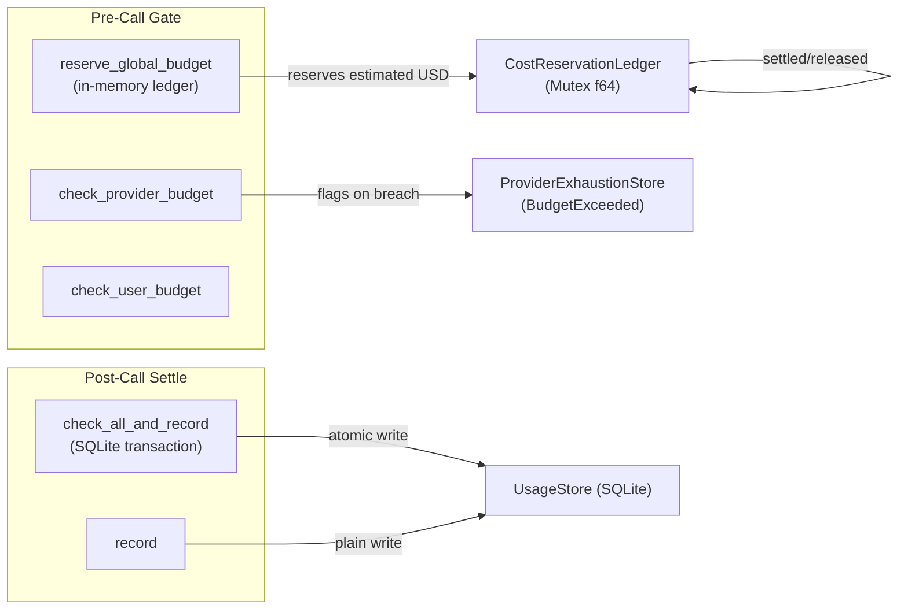

# crates — librefang-kernel-metering

# librefang-kernel-metering

Cost metering and quota enforcement for the LibreFang kernel. Tracks LLM spending across four scopes — global, per-agent, per-user, and per-provider — and gates calls before they dispatch when configured budgets would be exceeded.

## Architecture



The engine operates in two phases around each LLM call:

1. **Pre-call**: Reserve an estimated cost against the global budget (`reserve_global_budget`), and/or check per-provider / per-user caps (`check_provider_budget`, `check_user_budget`). These gates can reject a call before any network dispatch.
2. **Post-call**: Record the actual settled usage and verify all caps atomically (`check_all_and_record`), then settle or release the reservation so the in-memory ledger stays accurate.

## Key Components

### `MeteringEngine`

The central type. Constructed with a `UsageStore` (SQLite-backed) and optionally wired to a `ProviderExhaustionStore` via `with_exhaustion_store`.

```rust
let engine = MeteringEngine::new(Arc::new(usage_store))
    .with_exhaustion_store(exhaustion_store);
```

The engine exposes four scopes of enforcement, each with hourly, daily, and monthly windows:

| Scope | Pre-call gate | Post-call check | Atomic check + record |
|-------|--------------|-----------------|----------------------|
| Global | `reserve_global_budget` | `check_global_budget` | `check_global_budget_and_record` / `check_all_and_record` |
| Agent | `check_quota` | — | `check_quota_and_record` / `check_all_and_record` |
| User | `check_user_budget` | `check_user_budget` | — |
| Provider | `check_provider_budget` | `check_provider_budget` | `check_all_and_record` (inside the transaction) |

### In-Flight Reservation Ledger (`CostReservationLedger`)

A private `Mutex<f64>` that tracks reserved-but-not-settled USD across all in-flight LLM calls. This exists because `check_global_budget` reads settled spend from SQLite, which only reflects completed calls. When N triggers fire concurrently they all observe the same pre-call total, all pass the gate, and all commit — producing multi-x overshoots.

The ledger solves this with `check_and_add`, which performs the limit comparison and the `+=` under a single mutex acquisition. Two concurrent callers cannot both observe the pre-add `current()` and both commit, because the second blocks on the mutex until the first has either added or returned.

The reservation is returned as a `MeteringReservation` token. Callers must call `.settle()` (after recording actual usage) or `.release()` (on dispatch failure). `Drop` releases as a safety net if neither is called.

### `MeteringReservation`

A `#[must_use]` token returned by `reserve_global_budget`. It holds the estimated USD and a reference to the ledger. The three lifecycle methods are:

- **`settle(self)`** — Call after the actual usage record is recorded. Releases the reservation so the ledger no longer double-counts alongside the settled SQLite row.
- **`release(self)`** — Call when the dispatch failed before any cost was incurred. Releases the reservation.
- **`estimated_usd()`** — Read-only accessor for the held amount.

If neither `settle` nor `release` is called, `Drop` releases the reservation defensively.

### Provider Exhaustion Integration (#4807)

When a per-provider budget gate trips, the engine marks the provider as `BudgetExceeded` in the attached `ProviderExhaustionStore` for `DEFAULT_LONG_BACKOFF`. This lets the LLM fallback chain skip the provider on subsequent calls without first dispatching a request that the gate would only deny again.

```rust
// On breach:
self.exhaustion.mark_exhausted(
    provider,
    ExhaustionReason::BudgetExceeded,
    Some(Instant::now() + DEFAULT_LONG_BACKOFF),
);
```

When no exhaustion store is wired (legacy callers), `flag_provider_budget_exhausted` is a no-op.

## Cost Estimation

Two static methods compute estimated USD from token counts:

- **`estimate_cost(model, input, output, cache_read, cache_creation)`** — Uses fixed default rates ($1.00/M input, $3.00/M output). Catalog-agnostic; the model parameter is just a label. Intended for unit tests or when no catalog is available.

- **`estimate_cost_with_catalog(catalog, model, ...)`** — Reads pricing from the model catalog via `find_model`. Falls back to default rates when the model is unknown. Also falls back to conservative non-zero default rates for:
  - Models where `pricing_known` is `false`
  - Zero-priced ChatGPT session-auth models (`should_use_legacy_budget_estimate`)

Cache token pricing:

| Token type | Price multiplier |
|------------|-----------------|
| Regular input | 1.0× input rate |
| Cache-read input | 0.10× input rate |
| Cache-creation input | 1.25× input rate |
| Output | 1.0× output rate |

The cost computation uses `saturating_add` / `saturating_sub` throughout to handle provider responses returning `u64::MAX/2 + 1` in cache fields without panicking or wrapping.

## Gate Comparison Semantics

The pre-call reservation gate uses `>` (reject when projected spend exceeds the limit), while the post-call budget check uses `>=` (reject once the limit is fully consumed). This asymmetry is intentional: a single call that exactly reaches the cap is allowed through the pre-call gate, but once the limit is consumed, the post-call check denies all subsequent calls.

For per-agent, per-user, and per-provider checks, all use `>=` (post-call semantics).

## Atomic Check-and-Record

The preferred methods for recording usage after an LLM call combine quota verification and insertion into a single SQLite transaction, closing the TOCTOU race between check and record:

- **`check_quota_and_record(record, quota)`** — Per-agent caps only.
- **`check_global_budget_and_record(record, budget)`** — Global caps only.
- **`check_all_and_record(record, quota, budget)`** — Per-agent, global, and per-provider caps in one transaction. Resolves the provider budget from `budget.providers` by the record's `provider` field. On failure, the record is not inserted.

## Usage Patterns

### Typical LLM Call Lifecycle

```rust
// 1. Reserve estimated cost before dispatch
let reservation = engine.reserve_global_budget(&budget, estimated_usd)?;

// 2. Optionally check per-provider / per-user caps
engine.check_provider_budget(&provider, &provider_budget)?;

// 3. Dispatch the LLM call (external)
let result = llm_call().await;

// 4. Record actual usage and verify all caps atomically
engine.check_all_and_record(&usage_record, &quota, &budget)?;
reservation.settle();
```

### Budget Status and Reporting

```rust
let status: BudgetStatus = engine.budget_status(&budget);
// status.hourly_pct, daily_pct, monthly_pct — fraction of limit consumed
// status.alert_threshold — operator-configured warning threshold
```

`BudgetStatus` serializes via `serde::Serialize` for API responses and dashboards.

## Dependencies

The crate has a deliberately narrow dependency on `librefang-llm-driver`: it imports only `ProviderExhaustionStore`, `ExhaustionReason`, and `DEFAULT_LONG_BACKOFF`. Nothing else from the driver crate is used. This keeps metering decoupled from LLM transport concerns.

The SQLite-backed `UsageStore` (from `librefang-memory`) is the sole persistence layer. All spend queries (`query_global_hourly`, `query_provider_daily`, `query_user_monthly`, etc.) delegate to it. The `ModelCatalog` (from `librefang-runtime`) is the pricing source for `estimate_cost_with_catalog`.

## Concurrency Notes

- The reservation ledger synchronizes in-process callers only. Two processes — or a process plus an out-of-band SQL writer — can still race. Matching the SQLite atomicity of `check_all_and_record` is the responsibility of the post-call settle path.
- `reserve_global_budget` reads settled spend from SQLite outside the ledger lock (those queries can be slow and may fail). The lock guards only the in-process `f64`. Settled spend is monotonic within a time window, so using the just-observed value rather than a re-read after the lock cannot under-count the gate.