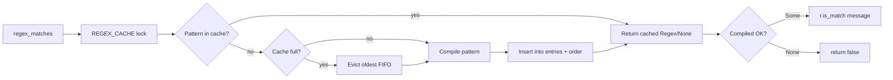

# crates — librefang-kernel-router

# librefang-kernel-router

Silnik routingu słów kluczowych i semantycznego dla jądra LibreFang. Na podstawie wiadomości przychodzącej wybiera najbardziej odpowiednią **rękojęść** (specjalistyczny agent) lub **szablon** (definicję agenta) do obsłużenia żądania, wykorzystując ważone dopasowywanie słów kluczowych i opcjonalne ocenianie podobieństwa na podstawie osadzeń (embeddings).

## Jak to pasuje do całości

Router znajduje się pomiędzy odbiorem wiadomości a wysyłaniem agentów. Warstwa routingu asystenta jądra wywołuje `auto_select_template` i `auto_select_hand`, aby zdecydować, jakiego specjalistę wywołać. Router jest czystym podejmującym decyzje — zwraca wynik wyboru i nigdy nie tworzy sam agentów.

```
Wiadomość przychodząca
       │
       ▼
┌──────────────┐     auto_select_template()     ┌─────────────────┐
│   Router     │ ──────────────────────────────► │ TemplateSelection│
│              │     auto_select_hand()          ┌─────────────────┐
│              │ ──────────────────────────────► │ HandSelection   │
└──────────────┘                                 └─────────────────┘
       │
       │  Wywołujący (assistant_routing.rs) następnie:
       │  1. Używa wyboru do rozpoznania lub utworzenia specjalisty
       │  2. Ładuje manifest za pomocą load_template_manifest()
```

## Model oceniania

Każdy kandydat routingu akumuluje wynik z wielu typów sygnałów. Wygrywa wyższy wynik; remisy rozstrzyga się liczbą dopasowań, a następnie kolejnością plików dla reguł szablonów.

| Sygnał | Waga | Źródło |
|---|---|---|
| Jawny alias / silne słowo kluczowe | 6 | `HAND.toml [routing] aliases`, `agent.toml [metadata.routing] aliases`, wzorce `strong` w regułach szablonu |
| Wygenerowana fraza | 2 | Pochodna nazwy szablonu, tagów, opisu |
| Słaby alias / słabe słowo kluczowe | 1 | `HAND.toml weak_aliases`, `agent.toml weak_aliases`, wzorce `weak` w regułach szablonu |
| Bonus semantyczny | 0–5 (zaokrąglone) | `similarity * MAX_SEMANTIC_BONUS` z wyników osadzeń dostarczonych przez wywołującego |

### Progi

- **Rękojeści**: minimalny wynik `MIN_HAND_SCORE` (2). Pojedyncze słabe dopasowanie (wynik 1) jest odrzucane jako zbyt hałaśliwe. Wymagane jest jedno silne dopasowanie (6) lub dwa słabe (2), aby przekroczyć próg.
- **Szablony**: dowolny wynik > 0 kwalifikuje. Jeśli nie znaleziono dopasowania słów kluczowych, włącza się dopasowanie wyłącznie semantyczne przy podobieństwie `SEMANTIC_ONLY_THRESHOLD` (0.55).
- **Awaryjny orchestrator**: jeśli co najmniej dwa szablony uzyskają równy wynik, a wiadomość zawiera wyzwalacze wielodomenowe (`同时`, `分别`, `协作`, `多个`, `multi`, `together`), routing zostaje podniesiony do szablonu `orchestrator` zamiast wyboru jednego specjalisty.

## Routing rękojeści

`auto_select_hand(message, semantic_scores)` kieruje do rękojeści zdefiniowanych w plikach `HAND.toml`.

### Budowa kandydatów

Kandydaci tras routingu rękojeści są budowani z plików `HAND.toml` odkrytych w dwóch katalogach (w kolejności pierwszeństwa):

1. Katalog nadpisań operatora: `<home>/hands/` (przez `librefang_hands::registry::hand_override_dir`)
2. Kopia rejestru: `<home>/registry/hands/`

Rękojeść w katalogu nadpisań przesłania tę o tym samym identyfikatorze w rejestrze — zgodnie z zachowaniem `librefang_hands::registry::scan_hands_dir`.

Dla każdej rękojeści frazy są wydobywane z jej `HandDefinition`:

- **Silne frazy**: jawne `[routing] aliases` + frazy pochodne z opisu
- **Słabe frazy**: jawne `weak_aliases` + tokeny identyfikatora (podzielone po `-`/`_`, przefiltrowane do długości ≥ 3, z wykluczeniem ogólnych angielskich słów takich jak „assistant", „helper", „expert")

Frazy pochodne z opisu przechodzą przez `description_phrases()`, który dzieli po znakach interpunkcyjnych i separatorach CJK, usuwa ogólne angielskie słowa wypełniające i tworzy znaczące słowa kluczowe zarówno dla tekstu ASCII, jak i Unicode.

### Awaryjne dopasowanie semantyczne

Samo angielskie dopasowywanie słów kluczowych nie może kierować wiadomości nieanglojęzycznych. Wywołujący mogą przekazać `semantic_scores: Option<&HashMap<String, f32>>` — mapę identyfikatora rękojeści do podobieństwa cosinusowego — aby połączyć dopasowywanie na podstawie osadzeń. Bonus semantyczny jest dodawany do wyniku słów kluczowych. Gdy dopasowywanie słów kluczowych nic nie zwraca, wystarczająco wysokie podobieństwo (≥ 0.55 niejawne poprzez próg wyniku) nadal może przekierować.

## Routing szablonów

`auto_select_template(message, agents_dir, semantic_scores)` kieruje do szablonów agentów przy użyciu dwóch równoległych systemów, których wyniki są scalane.

### System 1: Katalogowa zbiórka reguł

Wbudowane reguły znajdują się w `default_routing.toml`, osadzonym w binarium przez `include_str!`. Każdy wpis `[[template]]` definiuje szablon docelowy i wzorce regex oznaczone jako `strong`/`weak`:

```toml
[[template]]
target = "coder"
strong = [
  { label = "implement", regex = '\bimplement\b|\bbuild\b|\brefactor\b|\bpatch\b' },
  { label = "写代码", regex = '写代码|实现功能|补丁|脚本|编码|重构|开发' },
]
weak = [
  { label = "code", regex = '\bcode\b|\bfunction\b|\bapi\b' },
]
```

Dołączony zestaw obejmuje 30 szablonów specjalistycznych (coder, debugger, architect, security-auditor itd.) z dwujęzycznymi wzorcami angielsko-chińskimi. Wyrażenia regularne są dopasowywane bez uwzględniania wielkości liter.

### System 2: Metadane manifestu

Dla każdego szablonu w `agents_dir` router odczytuje `agent.toml` i buduje frazy z:

- `[metadata.routing] aliases` / `strong_aliases` → jawne aliasy (waga 6)
- Warianty nazwy szablonu, tagi, opis → wygenerowane frazy (waga 2)
- `weak_aliases` + tokeny nazwy szablonu → słabe frazy (waga 1)

Szablon może zrezygnować z automatycznie generowanych fraz, ustawiając `exclude_generated = true` w `[metadata.routing]`.

### Logika scalania

Oba systemy oceniają niezależnie. Wybór końcowy:

1. Jeśli zbiórka reguł wyprodukuje dopasowania, zwycięża najwyższa reguła domyślnie.
2. Dopasowanie manifestu może nadpisać dopasowanie reguły tylko wtedy, gdy ma znacząco wyższy wynik (≥ 2 punkty więcej, lub wynik reguły wynosi ≤ 1).
3. Jeśli żaden system nie dopasuje i istnieją wyniki semantyczne, stosuje się awaryjne dopasowanie wyłącznie semantyczne.
4. Jeśli nic się nie dopasuje, routing domyślnie kieruje do szablonu `orchestrator`.

## System nadpisywania reguł

Operatorzy nadpisują dołączone reguły szablonów umieszczając `routing.toml` w:

```
$LIBREFANG_HOME/registry/templates/routing.toml
```

Nadpisania scalają się po `target`:

| Wpis nadpisania | Efekt |
|---|---|
| Ten sam `target`, `enabled = true` (domyślnie) | **Zastępuje** regułę domyślną w miejscu (zachowuje pozycję do rozstrzygania remisów) |
| Ten sam `target`, `enabled = false` | **Usuwa** regułę domyślną |
| Nowy `target`, `enabled = true` | **Dołącza** nową regułę na końcu |
| Nowy `target`, `enabled = false` | Brak operacji |

Nadpisania wchodzą w życie przy przeładowaniu konfiguracji (`POST /api/config/reload`) lub restarcie demona — zbiórka reguł jest buforowana i nie jest przeładowywana automatycznie przy samej zmianie pliku.

### Zachowanie awaryjne

- Brakujący plik nadpisań → domyślne pozostają bez zmian
- Nieczytelny lub niespójny plik nadpisań → zapisane ostrzeżenie, domyślne pozostają w użyciu
- Nieprawidłowe wyrażenie regularne w nadpisaniu → wzorzec kompiluje się do `None` w pamięci podręcznej regex (nigdy się nie dopasuje), ale ładowanie się udaje

Routing nigdy nie kończy się awaryjnie z powodu złej konfiguracji.

## Pamięć podręczna wyrażeń regularnych

Wzorce reguł szablonów i dopasowywanie fraz ASCII kompilują wyrażenia regularne przez globalną ograniczoną pamięć podręczną (`REGEX_CACHE`). Zapobiega to ponownemu kompilowaniu tych samych wzorców przy każdej wiadomości przychodzącej.



Pamięć podręczna jest ograniczona do `MAX_REGEX_CACHE_ENTRIES` (4096) z ewikcją FIFO. Błędy kompilacji są buforowane jako `None`, aby gwałtowny napływ nieprawidłowych wzorców nie powtarzał wywołań kompilatora regex. Każdy wpis zajmuje małe pojedyncze cyfrowe kilobajty, co utrzymuje najgorszy przypadek zużycia pamięci w dolnych dziesiątkach megabajtów.

## Strategia buforowania

Trzy niezależne pamięci podręczne, wszystkie wykorzystujące `OnceLock<Mutex<Option<...>>>` z `Arc` do taniego zwiększania licznika referencji dla każdej wiadomości:

| Pamięć podręczna | Statyczna | Klucz | Zawartość |
|---|---|---|---|
| `HAND_ROUTE_CACHE` | `hand_route_candidates()` | Ciąg katalogu domowego | `Vec<HandRouteCandidate>` ze sparsowanych plików HAND.toml |
| `TEMPLATE_RULE_CACHE` | `template_rules()` | Ciąg katalogu domowego | `Vec<RouteRule>` ze scalonych domyślnych + nadpisanych TOML |
| `MANIFEST_CACHE` | `manifest_route_candidates()` | Ścieżka katalogu agentów | `Vec<ManifestRouteCandidate>` z plików agent.toml |

### Unieważnianie pamięci podręcznej

Wszystkie trzy pamięci podręczne muszą być unieważnione razem przy zmianach konfiguracji. Obsługa przeładowania konfiguracji jądra (`config_reload_ops.rs`) wywołuje:

```rust
invalidate_manifest_cache();
invalidate_hand_route_cache();
invalidate_template_rule_cache();
```

Katalog domowy jest ustawiany raz przy uruchomieniu przez `set_hand_route_home_dir()` i może również używać zmiennej środowiskowej `LIBREFANG_HOME` lub `~/.librefang`.

## Publiczne API

### Funkcje wyboru

```rust
pub fn auto_select_hand(
    message: &str,
    semantic_scores: Option<&HashMap<String, f32>>,
) -> HandSelection

pub fn auto_select_template(
    message: &str,
    agents_dir: &Path,
    semantic_scores: Option<&HashMap<String, f32>>,
) -> TemplateSelection
```

Obie zwracają strukturę z wybranym identyfikatorem, czytelnym dla człowieka ciągiem powodu i numerycznym wynikiem. `HandSelection.hand_id` wynosi `None`, gdy żaden kandydat nie przekroczy progu.

### Ładowanie manifestu

```rust
pub fn load_template_manifest(home_dir: &Path, template: &str) -> Result<AgentManifest, String>
```

Ładuje `agent.toml` z `<home_dir>/workspaces/agents/<template>/agent.toml`. Nazwy szablonów są walidowane tak, aby zawierały tylko znaki `[a-zA-Z0-9_-]`.

### Obsługa osadzeń

```rust
pub fn all_template_descriptions(agents_dir: &Path) -> Vec<(String, String)>
```

Zwraca pary `(template_name, embed_text)` dla wszystkich kierujących szablonów (z wyłączeniem szablonu `assistant`). Format tekstu osadzenia to `"name: description. Tags: tag1, tag2"`. Jądro używa tego do obliczenia podobieństw cosinusowych osadzeń, które są następnie przekazywane z powrotem do funkcji wyboru jako `semantic_scores`.

## Bezpieczeństwo nazw szablonów

`is_safe_template_name()` wymusza, aby nazwy szablonów zawierały tylko znaki alfanumeryczne ASCII, myślniki i podkreślenia. Ta ochrona jest uruchamiana zarówno przy skanowaniu katalogów, jak i ładowaniu manifestu, zapobiegając traversowaniu ścieżek przez spreparowane nazwy szablonów.

## Wykluczone szablony

Szablon `assistant` jest wykluczony z kandydatów routingu (`ROUTING_EXCLUDED_TEMPLATES`). Sam obsługuje routing za pomocą narzędzi LLM, zamiast być celem routingu.

## Odniesienie stałych

| Stała | Wartość | Przeznaczenie |
|---|---|---|
| `EXPLICIT_ALIAS_WEIGHT` | 6 | Wynik za trafienie jawnego/silnego aliasu |
| `GENERATED_PHRASE_WEIGHT` | 2 | Wynik za trafienie automatycznie wygenerowanej frazy |
| `WEAK_PHRASE_WEIGHT` | 1 | Wynik za trafienie słabego aliasu/słowa kluczowego |
| `MAX_SEMANTIC_BONUS` | 5.0 | Maksymalna liczba punktów z podobieństwa osadzeń |
| `SEMANTIC_ONLY_THRESHOLD` | 0.55 | Minimalne podobieństwo dla awaryjnego dopasowania wyłącznie semantycznego |
| `MIN_HAND_SCORE` | 2 | Minimalny wynik kwalifikujący dopasowanie rękojeści |
| `MAX_REGEX_CACHE_ENTRIES` | 4096 | Twardy limit skompilowanych wzorców regex w pamięci podręcznej |
