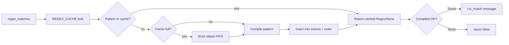

# crates — librefang-kernel-router

# librefang-kernel-router

Keyword and semantic routing engine for the LibreFang kernel. Given an inbound message, it selects the most appropriate **hand** (specialized agent) or **template** (agent definition) to handle the request, using weighted keyword matching and optional embedding-based similarity scoring.

## How It Fits In

The router sits between message intake and agent dispatch. The kernel's assistant routing layer calls `auto_select_template` and `auto_select_hand` to decide which specialist to invoke. The router is a pure routing decision-maker — it returns a selection result and never spawns agents itself.

```
Inbound message
       │
       ▼
┌──────────────┐     auto_select_template()     ┌─────────────────┐
│   Router     │ ──────────────────────────────► │ TemplateSelection│
│              │     auto_select_hand()          ┌─────────────────┐
│              │ ──────────────────────────────► │ HandSelection   │
└──────────────┘                                 └─────────────────┘
       │
       │  Caller (assistant_routing.rs) then:
       │  1. Uses selection to resolve or spawn the specialist
       │  2. Loads manifest via load_template_manifest()
```

## Scoring Model

Every routing candidate accumulates a score from multiple signal types. Higher score wins; ties break by number of matched hits, then by file order for template rules.

| Signal | Weight | Source |
|---|---|---|
| Explicit alias / strong keyword | 6 | `HAND.toml [routing] aliases`, `agent.toml [metadata.routing] aliases`, template rule `strong` patterns |
| Generated phrase | 2 | Derived from template name, tags, description |
| Weak alias / weak keyword | 1 | `HAND.toml weak_aliases`, `agent.toml weak_aliases`, template rule `weak` patterns |
| Semantic bonus | 0–5 (rounded) | `similarity * MAX_SEMANTIC_BONUS` from caller-supplied embedding scores |

### Thresholds

- **Hands**: minimum score of `MIN_HAND_SCORE` (2). A single weak hit (score 1) is rejected as too noisy. Either one strong hit (6) or two weak hits (2) clears the bar.
- **Templates**: any score > 0 qualifies. If no keyword match is found, semantic-only matching kicks in at `SEMANTIC_ONLY_THRESHOLD` (0.55) similarity.
- **Orchestrator fallback**: if two or more templates score equally and the message contains multi-domain triggers (`同时`, `分别`, `协作`, `多个`, `multi`, `together`), routing escalates to the `orchestrator` template instead of picking one specialist.

## Hand Routing

`auto_select_hand(message, semantic_scores)` routes to hands defined in `HAND.toml` files.

### Candidate Construction

Hand route candidates are built from `HAND.toml` files discovered in two directories (in precedence order):

1. Operator override dir: `<home>/hands/` (via `librefang_hands::registry::hand_override_dir`)
2. Registry checkout: `<home>/registry/hands/`

A hand in the override dir shadows one with the same ID in the registry — matching the behavior of `librefang_hands::registry::scan_hands_dir`.

For each hand, phrases are extracted from its `HandDefinition`:

- **Strong phrases**: explicit `[routing] aliases` + description-derived phrases
- **Weak phrases**: explicit `weak_aliases` + ID tokens (split on `-`/`_`, filtered to length ≥ 3, excluding generic English words like "assistant", "helper", "expert")

Description-derived phrases go through `description_phrases()`, which splits on punctuation and CJK separators, strips generic English filler words, and produces content-bearing keywords for both ASCII and Unicode text.

### Semantic Fallback

English keyword matching alone cannot route non-English messages. Callers can pass `semantic_scores: Option<&HashMap<String, f32>>` — a map of hand ID to cosine similarity — to blend embedding-based matching. The semantic bonus is added to the keyword score. When keyword matching returns nothing, a high enough similarity (≥ 0.55 implicit via score threshold) can still route.

## Template Routing

`auto_select_template(message, agents_dir, semantic_scores)` routes to agent templates using two parallel systems whose results are merged.

### System 1: Curated Rule Set

Built-in rules live in `default_routing.toml`, embedded into the binary via `include_str!`. Each `[[template]]` entry defines a target template and `strong`/`weak` labeled regex patterns:

```toml
[[template]]
target = "coder"
strong = [
  { label = "implement", regex = '\bimplement\b|\bbuild\b|\brefactor\b|\bpatch\b' },
  { label = "写代码", regex = '写代码|实现功能|补丁|脚本|编码|重构|开发' },
]
weak = [
  { label = "code", regex = '\bcode\b|\bfunction\b|\bapi\b' },
]
```

The bundled set covers 30 specialist templates (coder, debugger, architect, security-auditor, etc.) with bilingual English/Chinese patterns. Regexes are matched case-insensitively.

### System 2: Manifest Metadata

For each template in `agents_dir`, the router reads `agent.toml` and builds phrases from:

- `[metadata.routing] aliases` / `strong_aliases` → explicit aliases (weight 6)
- Template name variants, tags, description → generated phrases (weight 2)
- `weak_aliases` + template name tokens → weak phrases (weight 1)

A template can opt out of auto-generated phrases by setting `exclude_generated = true` in `[metadata.routing]`.

### Merge Logic

Both systems score independently. The final selection:

1. If the rule set produces matches, the top rule wins by default.
2. The manifest match can override the rule match only if it has a meaningfully higher score (≥ 2 points more, or the rule score is ≤ 1).
3. If neither system matches and semantic scores exist, semantic-only fallback applies.
4. If nothing matches at all, routing defaults to the `orchestrator` template.

## Rule Override System

Operators override bundled template rules by placing a `routing.toml` at:

```
$LIBREFANG_HOME/registry/templates/routing.toml
```

Overrides merge by `target`:

| Override entry | Effect |
|---|---|
| Same `target`, `enabled = true` (default) | **Replaces** the default rule in place (preserves position for tie-breaking) |
| Same `target`, `enabled = false` | **Removes** the default rule |
| New `target`, `enabled = true` | **Appends** a new rule at the end |
| New `target`, `enabled = false` | No-op |

Overrides take effect on config reload (`POST /api/config/reload`) or daemon restart — the rule set is cached and not hot-reloaded on file change alone.

### Fail-Soft Behavior

- Missing override file → defaults used unchanged
- Unreadable or unparseable override file → WARN logged, defaults used
- Invalid regex in an override → the pattern compiles to `None` in the regex cache (never matches), but loading succeeds

Routing never fails closed on a bad configuration.

## Regex Cache

Template rule patterns and ASCII phrase matching both compile regexes through a global bounded cache (`REGEX_CACHE`). This avoids recompiling the same patterns on every inbound message.



The cache is capped at `MAX_REGEX_CACHE_ENTRIES` (4096) with FIFO eviction. Compilation failures are cached as `None` so a flood of invalid patterns doesn't repeatedly invoke the regex compiler. Each entry is low single-digit KB, keeping worst-case memory in the low tens of MB.

## Caching Strategy

Three independent caches, all using `OnceLock<Mutex<Option<...>>>` with `Arc` for cheap per-message refcount bumps:

| Cache | Static | Key | Contents |
|---|---|---|---|
| `HAND_ROUTE_CACHE` | `hand_route_candidates()` | Home dir string | `Vec<HandRouteCandidate>` from parsed HAND.toml files |
| `TEMPLATE_RULE_CACHE` | `template_rules()` | Home dir string | `Vec<RouteRule>` from merged default + override TOML |
| `MANIFEST_CACHE` | `manifest_route_candidates()` | Agents dir path | `Vec<ManifestRouteCandidate>` from agent.toml files |

### Cache Invalidation

All three caches must be invalidated together on config changes. The kernel's config reload handler (`config_reload_ops.rs`) calls:

```rust
invalidate_manifest_cache();
invalidate_hand_route_cache();
invalidate_template_rule_cache();
```

The home directory is set once at boot via `set_hand_route_home_dir()` and can also fall back to the `LIBREFANG_HOME` environment variable or `~/.librefang`.

## Public API

### Selection Functions

```rust
pub fn auto_select_hand(
    message: &str,
    semantic_scores: Option<&HashMap<String, f32>>,
) -> HandSelection

pub fn auto_select_template(
    message: &str,
    agents_dir: &Path,
    semantic_scores: Option<&HashMap<String, f32>>,
) -> TemplateSelection
```

Both return a struct with the selected ID, a human-readable reason string, and the numeric score. `HandSelection.hand_id` is `None` when no candidate clears the threshold.

### Manifest Loading

```rust
pub fn load_template_manifest(home_dir: &Path, template: &str) -> Result<AgentManifest, String>
```

Loads `agent.toml` from `<home_dir>/workspaces/agents/<template>/agent.toml`. Template names are validated to contain only `[a-zA-Z0-9_-]` characters.

### Embedding Support

```rust
pub fn all_template_descriptions(agents_dir: &Path) -> Vec<(String, String)>
```

Returns `(template_name, embed_text)` pairs for all routable templates (excluding the `assistant` template). The embed text format is `"name: description. Tags: tag1, tag2"`. The kernel uses this to compute embedding cosine similarities, which are then passed back into the selection functions as `semantic_scores`.

## Template Name Safety

`is_safe_template_name()` enforces that template names contain only ASCII alphanumeric characters, hyphens, and underscores. This guard runs on both directory scanning and manifest loading, preventing path traversal through crafted template names.

## Excluded Templates

The `assistant` template is excluded from routing candidates (`ROUTING_EXCLUDED_TEMPLATES`). It handles routing itself via LLM tools rather than being a routing target.

## Constants Reference

| Constant | Value | Purpose |
|---|---|---|
| `EXPLICIT_ALIAS_WEIGHT` | 6 | Score per strong/explicit alias hit |
| `GENERATED_PHRASE_WEIGHT` | 2 | Score per auto-generated phrase hit |
| `WEAK_PHRASE_WEIGHT` | 1 | Score per weak alias/keyword hit |
| `MAX_SEMANTIC_BONUS` | 5.0 | Maximum points from embedding similarity |
| `SEMANTIC_ONLY_THRESHOLD` | 0.55 | Minimum similarity for semantic-only fallback |
| `MIN_HAND_SCORE` | 2 | Minimum score for a hand match to qualify |
| `MAX_REGEX_CACHE_ENTRIES` | 4096 | Hard cap on cached compiled regex patterns |