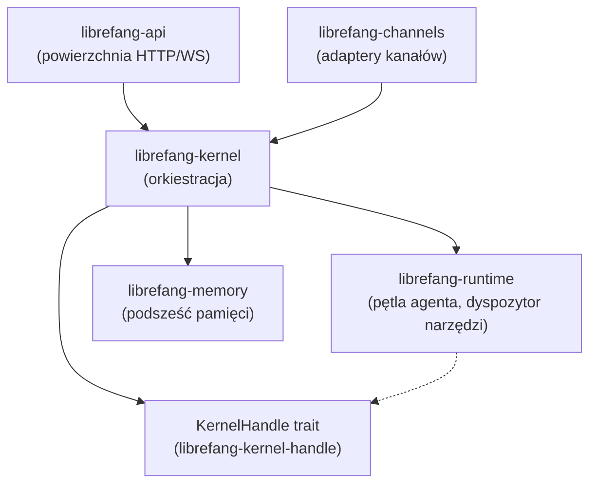

# crates — librefang-kernel

# librefang-kernel

Podstawowy kernel orkiestracji dla LibreFang Agent OS. Zarządza cyklami życia agentów, planowaniem, uprawnieniami, komunikacją międzyagentową oraz pętlą obsługi wiadomości, która rozdziela żądania do sterowników LLM, narzędzi i podsześci pamięci.

## Przegląd architektury



Kernel znajduje się między warstwą HTTP (`librefang-api`) a warstwą wykonawczą (`librefang-runtime`). Zewnętrzne crate wymagające wywołań zwrotnych kernela przechodzą przez trait `KernelHandle` (zdefiniowany w `librefang-kernel-handle`), odwracając kierunek zależności tak, aby kernel nigdy nie zależał od crate'a API ani od rozszerzeń.

## Rozruch

Punkt wejścia: `LibreFangKernel::boot_with_config(KernelConfig)`.

Jest to duża struktura-god (~18k LOC, 50+ pól — śledzona w #3565). Nie dodawaj nowych pól bez koordynacji. Sekwencja rozruchu:

1. Wczytuje `KernelConfig` (z wartościami domyślnymi `Default` dla brakujących pól).
2. Inicjalizuje `AgentRegistry`, `ApprovalManager`, `AgentIdentityRegistry`, magistralę zdarzeń i moduły podsystemów.
3. Wywołuje `recover_stale_running_runs` używając `KernelConfig.workflow_stale_timeout_minutes` jako punktu odcięcia.
4. Uruchamia zadania w tle (cykl zatwierdzeń, planista cron, automatyczne „marzenie").

## Kluczowe komponenty

### LibreFangKernel

Główna struktura orkiestratora. Udostępnia swoją powierzchnię poprzez metody w `kernel_api.rs`:

- `oauth_provider_ref` — zwraca podłączalny dostawca MCP OAuth.
- `skill_registry_ref` — zwraca rejestr umiejętności z obsługą hot-reload.
- `reload_config` — przeładowuje konfigurację kernela w locie.
- `set_user_provider_key` — wstrzykuje klucze API dostawcy dla poszczególnych użytkowników.
- `clear_driver_cache` — opróżnia buforowany stan sterownika LLM.
- `export_session_trajectory` — eksportuje pełną trajektorię sesji do odtworzenia/debugowania.

### AgentRegistry

Współbieżna tabela agentów udostępniająca operacje `spawn`, `lookup` i `kill`. Agenty są kluczowane przez `AgentId` (UUID v5 wyprowadzony z nazwy agenta poprzez `AgentId::from_name`).

### AgentIdentityRegistry

Kanoniczny rejestr UUID agentów (`agent_identity_registry.rs`). Utrzymuje mapowania `agent_name → canonical_uuid` niezależnie od rejestru agentów, dzięki czemu ponowne uruchomienia (po panikach, przeładowaniach manifestów, jawnych killach) używają tego samego `AgentId` zamiast generować nowy.

**Pamięć**: plik TOML w `<home_dir>/agent_identities.toml`, zapisywany atomowo (zapis do `.tmp.<pid>.<seq>.<nanos>`, fsync, rename).

**Semantyka**:
- `register_if_absent` — pierwszy UUID wygrywa. Kolejne rejestracje dla tej samej nazwy zwracają istniejący UUID, nigdy go nie nadpisują.
- `purge` — całkowicie usuwa wpis. Kolejne uruchomienie otrzymuje UUID od zera.
- Zwykłe `kill_agent` **nie** dotyka wpisu w rejestrze — UUID przetrwa, aby pozostałe sesje/pamięci/zadania cron pozostały osiągalne.
- Zniekształcone pliki są traktowane jako puste, ale **nigdy nie są nadpisywane** — operator może odzyskać je ręcznie.

### ApprovalManager

Menedżer zatwierdzeń wykonań (`approval.rs`). Bramkuje niebezpieczne operacje za pomocą zatwierdzenia przez człowieka z klasyfikacją ryzyka opartą na polityce, obsługą drugiego czynnika TOTP i trwałym logowaniem audytowym.

**Klasyfikacja ryzyka** (`classify_risk`):

| Poziom ryzyka | Narzędzia |
|---|---|
| Krytyczny | `shell_exec`, `agent_spawn`, `agent_kill`, `config_set`, `kernel_reload` |
| Wysoki | `file_write`, `file_delete`, `apply_patch`, wszystkie narzędzia `mcp_*` |
| Średni | `web_fetch`, `browser_navigate` |
| Niski | wszystko inne |

Bypass `trusted_senders` dotyczy tylko narzędzi sklasyfikowanych poniżej poziomu `High`. Wykonywanie kodu, mutacje płaszczyzny sterowania i destruktywne zapisy zawsze wymagają jawnego zatwierdzenia, niezależnie od tożsamości nadawcy.

**Dwie ścieżki wykonania**:

1. **Blokująca** (`request_approval`): pętla agenta oczekuje na rozwiązanie przez kanał `oneshot`. Zachowanie w przypadku przekroczenia czasu jest określane przez politykę `TimeoutFallback` (eskalacja do 3 razy, a następnie rozwiązanie decyzją zastępczą).

2. **Odłożona** (`submit_request`): zwraca natychmiast UUID. Ładunek `DeferredToolExecution` jest przechowywany i zwracany atomowo przy `resolve()`, umożliwiając nieblokujące zatwierdzanie narzędzi w przepływach zintegrowanych z edytorem.

**Warstwy buforowania decyzji**:
- `remembered` (`DashMap<(agent_id, tool_name), ApprovalDecision>`) — trwałe decyzje „zawsze pozwól" / „zawsze odrzuć" z powierzchni zewnętrznych (most ACP). Tylko w pamięci; nie przetrwa restartu demona.
- `session_approvals` (`DashMap<(session_id, tool_name), ()>`) — pamięć podręczna autoryzacji sesji (#5600). Pomijana, gdy odłożone wywołanie miało `force_human=true` (wymóg RBAC per-wywołanie).

**Obsługa drugiego czynnika TOTP**:
- RFC 6238 z SHA-1, 6 cyfr, krok 30-sekundowy, tolerancja odchyłki ±1 krok.
- Śledzenie okresu prolongaty, aby uniknąć ponownego monitowania w konfigurowalnym oknie.
- Ochrona przed brute-force: 5 kolejnych niepowodzeń → blokada 300 sekund. Stan blokady jest utrwalany w SQLite i odtwarzany po restartach. Metoda `check_and_record_totp_failure` wykonuje atomową kontrolę i zapis pod `failure_rw_mutex`, eliminując wyścigi TOCTOU (#3584).
- Zapobieganie replay: zweryfikowane kody są haszowane (SHA-256) i przechowywane w `totp_used_codes` z oknem 90 sekund.
- Kody odzyskiwania: 8 losowych kodów szesnastkowych (`XXXX-XXXX-XXXX-XXXX`, 64 bity entropii każdy). Weryfikowane w stałym czasie we wszystkich przechowywanych kodach, aby zapobiec atakom typu timing side-channel (#3591).

**Trwałość**: `ApprovalManager::new_with_db` łączy pulę połączeń SQLite (`r2d2_sqlite`). Oczekujące zatwierdzenia przetrwają restarty demona — odtworzone wpisy nie mają aktywnego `oneshot::Sender`, więc pojawiają się w dashboardzie do ręcznego rozwiązania przez operatora. Ładunki odłożone są sprawdzane pod kątem integralności względem kolumn `agent_id`, `tool_name` i `session_id` wiersza przed zaufaniem im do automatycznego wznowienia (przegląd bezpieczeństwa #3313).

**Rozgłaszanie zdarzeń**: `subscribe()` zwraca `broadcast::Receiver<ApprovalEvent>` (pojemność 256), aby transporty zewnętrzne (adapter ACP) otrzymywały powiadomienia z niskim opóźnieniem zamiast odpytywać `list_pending`.

### MCP OAuth Provider

Podłączalny przepływ OAuth dla serwerów narzędzi MCP. Zdefiniowany jako `Arc<dyn McpOAuthProvider + Send + Sync>`, zaimplementowany w `librefang-api`, aby utrzymać demona wolnym od zależności HTTP. Kernel udostępnia operacje na sejfie (`vault_get`, `vault_set`, `vault_remove`, `vault_key`, `vault_get_or_warn`), rejestrację klientów (`register_client`) oraz redakcję odpowiedzi punktu końcowego tokenów (`redact_token_endpoint_response`).

Zapobieganie replay OAuth nonce: zużyte nonce są haszowane i przechowywane w `oauth_used_nonces` z oknem 1 godziny, zapobiegając replay przechwyconych URL-i zwrotnych (#3944).

### Metering i Router (re-eksportowane)

- `metering` — re-eksportowane z `librefang-kernel-metering`. Księgowanie tokenów i kosztów; używa `model_catalog` kernela.
- `router` — re-eksportowane z `librefang-kernel-router`. Router modeli z rozwiązywaniem aliasów.

## Strategia blokad dla aktywnych pól

| Pole | Typ | Strategia | Uzasadnienie |
|---|---|---|---|
| `model_catalog` | `ArcSwap<ModelCatalog>` | RCU poprzez `model_catalog_update(\|cat\| ...)` | Odczyty atomowego ładowania (#3384). Nie przechodź na `RwLock`. |
| `skill_registry` | `RwLock<SkillRegistry>` | `std::sync::RwLock` | Hot-reload przy instalacji/deinstalacji. Utrzymuj krótkie odczyty. |
| `running_tasks` | `DashMap<(AgentId, SessionId), RunningTask>` | DashMap | Kluczowane krotką `(agent, session)`, nie samym `AgentId` (#3172). Stare kluczowanie cicho nadpisywało współbieżne pętle. |
| Historia `event_bus` | `Mutex<VecDeque<Arc<Event>>>` | `parking_lot::Mutex` | Historia tylko-do-dodawania (#3385). Nie przechodź na `RwLock<VecDeque<Event>>`. |

Dodając nowe pole, wybierz:
- **Częsty odczyt, rzadki zapis** → `arc_swap::ArcSwap`
- **Częsty odczyt, częsty zapis** → `parking_lot::Mutex` lub `dashmap::DashMap`
- **Historia tylko-do-dodawania** → `parking_lot::Mutex<VecDeque<Arc<T>>>`

## Determinizm

Wszystko, co trafia do promptu LLM, **musi** być uporządkowane przed konwersją na ciąg znaków. Używaj `BTreeMap` / `BTreeSet`. Kolejność iteracji `HashMap` różni się między procesami i cicho unieważnia bufory promptów dostawcy (#3298). Testy regresji znajdują się obok każdej granicy — patrz `kernel::tests::mcp_summary_is_byte_identical_across_input_orders`.

To jest twarde tabu: brak `HashMap<K, V>` w żadnym polu, które trafia do promptu LLM.

## Przełączniki konfiguracji

| Przełącznik | Domyślnie | Uwagi |
|---|---|---|
| `max_history_messages` | — | Domyślna globalna; ograniczona od góry do `MIN_HISTORY_MESSAGES = 4` z logiem WARN. Nadpisanie per-agent w `agent.toml`. |
| `queue.concurrency.trigger_lane` | 8 | Globalny semafor na `Lane::Trigger`. |
| `queue.concurrency.default_per_agent` | 1 | Wartość zastępcza gdy `agent.toml: max_concurrent_invocations` nie jest ustawione. |
| `workflow_stale_timeout_minutes` | — | Punkt odcięcia `recover_stale_running_runs` przy rozruchu. |

## Moduły podsystemów

| Moduł | Odpowiedzialność |
|---|---|
| `registry` | `AgentRegistry` — spawn / lookup / kill agentów |
| `kernel::cron` | Planowanie cron. Rozwiązywanie `session_mode`: per-zadanie > manifest > historyczne Persistent |
| `kernel::cron_compaction` | Rozwiązywanie trybu kompakcji cron i obliczanie liczby zachowań |
| `kernel::event_bus` | Magistrala rozgłaszania zdarzeń |
| `kernel::session_lifecycle` | Maszyn stanów sesji |
| `approval` | `ApprovalManager` — bramkuje niebezpieczne operacje |
| `auth` | Parsowanie ról (`from_str_role` / `try_from_str_role`) |
| `auto_dream` | Tło „marzenia" / konsolidacja |
| `inbox` | Skrzynka odbiorcza agenta |
| `pairing` | Parowanie urządzeń (`PairedDevice`) |
| `scheduler` | Planowanie zadań |
| `triggers` | Trwałość wyzwalaczy i wykonywanie przepływów pracy |
| `capabilities` | Wyliczanie zdolności narzędzi (`available_tools`, `list`) |
| `skill_workshop` | Przepływ pracy zatwierdzania umiejętności z przechowywaniem kandydatów |
| `supervised_spawn` | Nadzorowane uruchamianie zadań dla serwerów MCP |
| `mcp_oauth_provider` | Sejf OAuth MCP i rejestracja klientów |
| `workspace_setup` | `generate_identity_files`, `create_new_or_cleanup` |
| `persist_tmp_path` | Pomocnik atomowego zapisu pliku |

## Testowanie

- Testy jednostkowe znajdują się w `crates/librefang-kernel/src/kernel/` (wbudowane moduły `#[cfg(test)]`).
- Testy integracyjne z prawdziwym routerem znajdują się w `librefang-api/tests/` — tam należą testy `#[tokio::test]` względem `TestServer` (#3721).
- Zależności deweloperskie obejmują `tokio` z `test-util` (dla `time::pause`/`advance`/`resume` w testach czasu przepływów pracy/cron), `wiremock` do mockowania HTTP, `proptest` oraz `librefang-testing`.

**Polecenia**:
```
cargo test -p librefang-kernel
cargo check --workspace --lib
```

Przestrzeniowe `cargo test` i `cargo build` są zabronione (konkurencja w target/). Prawdziwe kompilacje uruchamiają się w CI.

## Przecinające przepływy wykonania

**Autoryzacja MCP OAuth** (`auth_start` → konfiguracja TLS/proxy):
Trasa API wywołuje `register_client` na dostawcy OAuth kernela, który buduje klienta HTTP przez `oauth_client_builder` z `librefang-http` → `proxied_client_builder` → `build_http_client` → `tls_config` / `active_proxy`. To jest ścieżka łącząca rejestrację serwera MCP z infrastrukturą proxy i TLS warstwy HTTP.

**Uruchomienie agenta w tle → GC artefaktów**:
`start_background_agents` wyzwala `run_startup_gc_once` w magazynie artefaktów runtime'u, który ewiktuje nieaktualne artefakty poprzez `gc_evict_older_than` → `remove_file` w warstwie synchronizacji katalogu.

**Autoryzacja terminala → parsowanie ról**:
`terminal_ws` → `authorize_terminal_request` → `configured_user_api_keys` → `from_str_role` → `try_from_str_role` w module `auth` kernela.

## Tabu

- Brak uruchamiania demonów. Binarny CLI odpowiada za `start`. Kernel po prostu działa.
- Brak `tokio::block_on` w tym crate. Kernel zawsze znajduje się wewnątrz runtime'u.
- Brak bezpośrednich wywołań HTTP LLM. Przechodź przez sterowniki `librefang-runtime`.
- Brak metody `KernelHandle::*` zwracającej `Result<_, String>` (#3541). Użyj typowanego błędu.
- Brak `HashMap<K, V>` w żadnym polu, które trafia do promptu LLM (#3298). Używaj `BTreeMap`.

## Dodawanie nowego pola do LibreFangKernel

1. Pole musi być `pub(crate)`, chyba że zewnętrzny crate naprawdę potrzebuje dostępu do odczytu.
2. Dodaj odpowiednik po stronie konfiguracji do impl `Default` na `KernelConfig` — w przeciwnym razie kompilacja jest cicho zepsuta.
3. Jeśli pole to `Option<Arc<dyn Trait>>`, oznacz je `#[serde(skip)]` i zaimplementuj `Serialize`/`Deserialize`/`Clone`/`Debug` ręcznie.
4. Wybierz strategię blok zgodnie z tabelą powyżej.

## Zależności

Kernel korzysta z podstawowego systemu typów (`librefang-types`), podsześci pamięci (`librefang-memory`, `librefang-memory-wiki`), sub-crate'ów routingu i meteringu (`librefang-kernel-router`, `librefang-kernel-metering`), warstwy wykonawczej (`librefang-runtime`), umiejętności (`librefang-skills`, `librefang-hands`), rozszerzeń (`librefang-extensions`), sterowników LLM (`librefang-llm-driver`, `librefang-llm-drivers`), protokołu liniowego (`librefang-wire`), kanałów (`librefang-channels`) oraz eksportu RL (`librefang-rl-export`).

Znaczące zależności workspace'u: `tokio`, `dashmap`, `arc-swap`, `parking_lot`, `rusqlite`/`r2d2`/`r2d2_sqlite`, `tera` (szablonowanie izolowane dla operatorów Transform przepływów pracy), `totp-rs`, `subtle` (porównanie w stałym czasie), `cron` (0.17).
