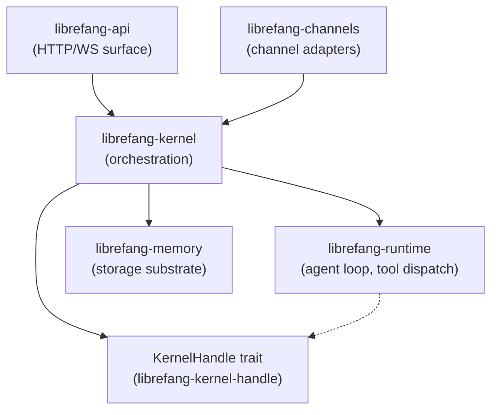

# crates — librefang-kernel

# librefang-kernel

Core orchestration kernel for the LibreFang Agent OS. Owns agent lifecycles, scheduling, permissions, inter-agent communication, and the message-handling loop that fans requests out to LLM drivers, tools, and the memory substrate.

## Architecture Overview



The kernel sits between the HTTP surface (`librefang-api`) and the execution layer (`librefang-runtime`). External crates that need kernel callbacks go through the `KernelHandle` trait (defined in `librefang-kernel-handle`), reversing the dependency direction so the kernel never depends on the API or extensions crates.

## Boot

Entry point: `LibreFangKernel::boot_with_config(KernelConfig)`.

This is a large god-struct (~18k LOC, 50+ fields — tracked in #3565). Do not add new fields without coordination. The boot sequence:

1. Loads `KernelConfig` (with `Default` fallbacks for missing fields).
2. Initializes the `AgentRegistry`, `ApprovalManager`, `AgentIdentityRegistry`, event bus, and subsystem modules.
3. Calls `recover_stale_running_runs` using `KernelConfig.workflow_stale_timeout_minutes` as the cutoff.
4. Spawns background tasks (approval sweep, cron scheduler, auto-dream).

## Key Components

### LibreFangKernel

The top-level orchestrator struct. Exposes its surface through `kernel_api.rs` methods:

- `oauth_provider_ref` — returns the pluggable MCP OAuth provider.
- `skill_registry_ref` — returns the hot-reloadable skill registry.
- `reload_config` — hot-reloads kernel configuration.
- `set_user_provider_key` — injects per-user provider API keys.
- `clear_driver_cache` — flushes cached LLM driver state.
- `export_session_trajectory` — exports a session's full trajectory for replay/debugging.

### AgentRegistry

Concurrent agent table providing `spawn`, `lookup`, and `kill` operations. Agents are keyed by `AgentId` (UUID v5 derived from agent name via `AgentId::from_name`).

### AgentIdentityRegistry

Canonical agent UUID registry (`agent_identity_registry.rs`). Persists `agent_name → canonical_uuid` mappings independently of the agent registry so that respawns (after panics, manifest reloads, explicit kills) reuse the same `AgentId` instead of generating a fresh one.

**Storage**: TOML file at `<home_dir>/agent_identities.toml`, written atomically (write to `.tmp.<pid>.<seq>.<nanos>`, fsync, rename).

**Semantics**:
- `register_if_absent` — first UUID wins. Subsequent registrations for the same name return the existing UUID, never overwrite.
- `purge` — removes the entry entirely. Next spawn gets a clean-slate UUID.
- A normal `kill_agent` does **not** touch the registry entry — the UUID survives so surviving sessions/memories/cron jobs remain reachable.
- Malformed files are treated as empty but **never overwritten** — the operator can recover by hand.

### ApprovalManager

Execution approval manager (`approval.rs`). Gates dangerous operations behind human approval with policy-based risk classification, TOTP second-factor support, and persistent audit logging.

**Risk classification** (`classify_risk`):

| Risk Level | Tools |
|---|---|
| Critical | `shell_exec`, `agent_spawn`, `agent_kill`, `config_set`, `kernel_reload` |
| High | `file_write`, `file_delete`, `apply_patch`, all `mcp_*` tools |
| Medium | `web_fetch`, `browser_navigate` |
| Low | everything else |

The `trusted_senders` bypass only applies to tools classified below `High`. Code execution, control-plane mutations, and destructive writes always require explicit approval regardless of sender identity.

**Two execution paths**:

1. **Blocking** (`request_approval`): the agent loop awaits resolution via a `oneshot` channel. Timeout behavior is governed by `TimeoutFallback` policy (escalate up to 3 times, then resolve with the fallback decision).

2. **Deferred** (`submit_request`): returns immediately with a UUID. The `DeferredToolExecution` payload is stored and returned atomically on `resolve()`, enabling non-blocking tool approval for editor-integrated flows.

**Decision caching layers**:
- `remembered` (`DashMap<(agent_id, tool_name), ApprovalDecision>`) — persistent "allow always" / "reject always" decisions from external surfaces (ACP bridge). In-memory only; does not survive daemon restart.
- `session_approvals` (`DashMap<(session_id, tool_name), ()>`) — per-session auto-approval cache (#5600). Skipped when the deferred call had `force_human=true` (RBAC per-call requirement).

**TOTP second-factor support**:
- RFC 6238 with SHA-1, 6 digits, 30-second step, ±1 step skew tolerance.
- Grace period tracking to avoid re-prompting within a configurable window.
- Brute-force protection: 5 consecutive failures → 300-second lockout. Lockout state is persisted to SQLite and restored across restarts. The `check_and_record_totp_failure` method performs an atomic check-and-record under `failure_rw_mutex` to eliminate TOCTOU races (#3584).
- Replay prevention: verified codes are hashed (SHA-256) and stored in `totp_used_codes` with a 90-second window.
- Recovery codes: 8 random hex codes (`XXXX-XXXX-XXXX-XXXX`, 64 bits entropy each). Verified in constant time across all stored codes to prevent timing side-channels (#3591).

**Persistence**: `ApprovalManager::new_with_db` wires a SQLite connection pool (`r2d2_sqlite`). Pending approvals survive daemon restarts — restored entries have no live `oneshot::Sender`, so they surface in the dashboard for manual operator resolution. Deferred payloads are integrity-checked against the row's `agent_id`, `tool_name`, and `session_id` columns before being trusted for auto-resume (#3313 security review).

**Event broadcast**: `subscribe()` returns a `broadcast::Receiver<ApprovalEvent>` (capacity 256) so external transports (ACP adapter) get low-latency notification instead of polling `list_pending`.

### MCP OAuth Provider

Pluggable OAuth flow for MCP tool servers. Defined as `Arc<dyn McpOAuthProvider + Send + Sync>`, implemented in `librefang-api` to keep the daemon free of HTTP concerns. The kernel exposes vault operations (`vault_get`, `vault_set`, `vault_remove`, `vault_key`, `vault_get_or_warn`), client registration (`register_client`), and token endpoint response redaction (`redact_token_endpoint_response`).

OAuth nonce replay prevention: consumed nonces are hashed and stored in `oauth_used_nonces` with a 1-hour window, preventing replay of captured callback URLs (#3944).

### Metering and Router (re-exported)

- `metering` — re-exported from `librefang-kernel-metering`. Token and cost accounting; uses the kernel's `model_catalog`.
- `router` — re-exported from `librefang-kernel-router`. Model router with alias resolution.

## Lock Strategy for Hot Fields

| Field | Type | Strategy | Rationale |
|---|---|---|---|
| `model_catalog` | `ArcSwap<ModelCatalog>` | RCU via `model_catalog_update(\|cat\| ...)` | Atomic-load reads (#3384). Do not switch to `RwLock`. |
| `skill_registry` | `RwLock<SkillRegistry>` | `std::sync::RwLock` | Hot-reload on install/uninstall. Keep reads brief. |
| `running_tasks` | `DashMap<(AgentId, SessionId), RunningTask>` | DashMap | Keyed by `(agent, session)` tuple, not `AgentId` alone (#3172). The old keying silently overwrote concurrent loops. |
| `event_bus` history | `Mutex<VecDeque<Arc<Event>>>` | `parking_lot::Mutex` | Append-only history (#3385). Do not switch to `RwLock<VecDeque<Event>>`. |

When adding a new field, choose:
- **Hot read, rare write** → `arc_swap::ArcSwap`
- **Hot read, hot write** → `parking_lot::Mutex` or `dashmap::DashMap`
- **Append-only history** → `parking_lot::Mutex<VecDeque<Arc<T>>>`

## Determinism

Anything that reaches an LLM prompt **must** be ordered before stringification. Use `BTreeMap` / `BTreeSet`. `HashMap` iteration order varies across processes and silently invalidates provider prompt caches (#3298). Regression tests live next to each boundary — see `kernel::tests::mcp_summary_is_byte_identical_across_input_orders`.

This is a hard taboo: no `HashMap<K, V>` in any field that ends up in an LLM prompt.

## Configuration Knobs

| Knob | Default | Notes |
|---|---|---|
| `max_history_messages` | — | Global default; clamped up to `MIN_HISTORY_MESSAGES = 4` with a WARN log. Per-agent override in `agent.toml`. |
| `queue.concurrency.trigger_lane` | 8 | Global semaphore on `Lane::Trigger`. |
| `queue.concurrency.default_per_agent` | 1 | Fallback when `agent.toml: max_concurrent_invocations` is unset. |
| `workflow_stale_timeout_minutes` | — | `recover_stale_running_runs` cutoff at boot. |

## Subsystem Modules

| Module | Responsibility |
|---|---|
| `registry` | `AgentRegistry` — spawn / lookup / kill agents |
| `kernel::cron` | Cron scheduling. `session_mode` resolution: per-job > manifest > historical Persistent |
| `kernel::cron_compaction` | Cron compaction mode resolution and keep-count computation |
| `kernel::event_bus` | Broadcast event bus |
| `kernel::session_lifecycle` | Session state machine |
| `approval` | `ApprovalManager` — gates dangerous operations |
| `auth` | Role parsing (`from_str_role` / `try_from_str_role`) |
| `auto_dream` | Background "dreaming" / consolidation |
| `inbox` | Agent inbox |
| `pairing` | Device pairing (`PairedDevice`) |
| `scheduler` | Task scheduling |
| `triggers` | Trigger persistence and workflow execution |
| `capabilities` | Tool capability enumeration (`available_tools`, `list`) |
| `skill_workshop` | Skill approval workflow with candidate storage |
| `supervised_spawn` | Supervised task spawning for MCP servers |
| `mcp_oauth_provider` | MCP OAuth vault and client registration |
| `workspace_setup` | `generate_identity_files`, `create_new_or_cleanup` |
| `persist_tmp_path` | Atomic file write helper |

## Testing

- Unit tests live inside `crates/librefang-kernel/src/kernel/` (inline `#[cfg(test)]` modules).
- Integration tests against a real router live in `librefang-api/tests/` — that's where `#[tokio::test]` against `TestServer` belongs (#3721).
- Dev dependencies include `tokio` with `test-util` (for `time::pause`/`advance`/`resume` in workflow/cron timing tests), `wiremock` for HTTP mocking, `proptest`, and `librefang-testing`.

**Commands**:
```
cargo test -p librefang-kernel
cargo check --workspace --lib
```

Workspace-wide `cargo test` and `cargo build` are forbidden (target/ contention). Real builds run in CI.

## Cross-Cutting Execution Flows

**MCP OAuth authorization** (`auth_start` → TLS/proxy configuration):
The API route calls `register_client` on the kernel's OAuth provider, which builds an HTTP client through `librefang-http`'s `oauth_client_builder` → `proxied_client_builder` → `build_http_client` → `tls_config` / `active_proxy`. This is the path that connects MCP server registration to the HTTP layer's proxy and TLS infrastructure.

**Background agent startup → artifact GC**:
`start_background_agents` triggers `run_startup_gc_once` in the runtime's artifact store, which evicts stale artifacts via `gc_evict_older_than` → `remove_file` in the catalog sync layer.

**Terminal authorization → role parsing**:
`terminal_ws` → `authorize_terminal_request` → `configured_user_api_keys` → `from_str_role` → `try_from_str_role` in the kernel's `auth` module.

## Taboos

- No daemon spawning. The CLI binary owns `start`. The kernel just runs.
- No `tokio::block_on` in this crate. The kernel is always inside a runtime.
- No direct LLM HTTP calls. Go through `librefang-runtime` drivers.
- No `KernelHandle::*` method returning `Result<_, String>` (#3541). Use a typed error.
- No `HashMap<K, V>` in any field that ends up in an LLM prompt (#3298). Use `BTreeMap`.

## Adding a New Field to LibreFangKernel

1. Field must be `pub(crate)` unless an external crate truly needs read access.
2. Add a config-side counterpart to the `Default` impl on `KernelConfig` — otherwise the build is silently broken.
3. If the field is `Option<Arc<dyn Trait>>`, mark it `#[serde(skip)]` and implement `Serialize`/`Deserialize`/`Clone`/`Debug` manually.
4. Pick a lock strategy per the table above.

## Dependencies

The kernel pulls in the core type system (`librefang-types`), memory substrate (`librefang-memory`, `librefang-memory-wiki`), routing and metering sub-crates (`librefang-kernel-router`, `librefang-kernel-metering`), the execution layer (`librefang-runtime`), skills (`librefang-skills`, `librefang-hands`), extensions (`librefang-extensions`), LLM drivers (`librefang-llm-driver`, `librefang-llm-drivers`), wire protocol (`librefang-wire`), channels (`librefang-channels`), and RL export (`librefang-rl-export`).

Notable workspace dependencies: `tokio`, `dashmap`, `arc-swap`, `parking_lot`, `rusqlite`/`r2d2`/`r2d2_sqlite`, `tera` (sandboxed templating for workflow Transform operators), `totp-rs`, `subtle` (constant-time comparison), `cron` (0.17).