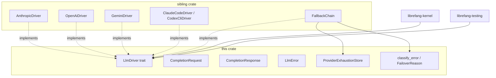

# crates — librefang-llm-driver

# `librefang-llm-driver`

The trait crate for LibreFang's LLM abstraction layer. Defines the `LlmDriver` trait, request/response types, error taxonomy, and the in-memory exhaustion ledger used by fallback chains. **No concrete provider implementations live here** — those live in the sibling `librefang-llm-drivers` crate (note the trailing `s`).

## Purpose & Boundary

This crate exists to give consumers (kernel, test harnesses, agent loop) a stable trait contract they can depend on *without* transitively pulling in `reqwest`, TLS stacks, or vendored provider SDKs. Every concrete driver (Anthropic, OpenAI, Gemini, Groq, Ollama, Claude Code, Codex CLI, …) is implemented against this trait in `librefang-llm-drivers`.

What this crate owns:

- `LlmDriver` trait and the supporting `CompletionRequest` / `CompletionResponse` / `StreamEvent` types
- `LlmError` enum (the only error type allowed in trait return positions)
- Error classification: `FailoverReason`, `ProviderErrorCode`, `LlmErrorCategory`, `classify_error`
- Provider exhaustion ledger (`ProviderExhaustionStore`) consulted by fallback chains
- `DriverConfig` — provider-agnostic configuration handed to the factory

What it deliberately does **not** own:

- Any HTTP wiring, retry strategy, or prompt formatting
- Provider-specific request/response bodies
- Tool execution, agent loop, or kernel concerns

## Architecture



## Core Types

### `LlmDriver` trait

The single abstraction concrete providers implement:

```rust
#[async_trait]
pub trait LlmDriver: Send + Sync {
    async fn complete(&self, request: CompletionRequest)
        -> Result<CompletionResponse, LlmError>;

    async fn stream(
        &self,
        request: CompletionRequest,
        tx: tokio::sync::mpsc::Sender<StreamEvent>,
    ) -> Result<CompletionResponse, LlmError> { /* default impl */ }

    fn is_configured(&self) -> bool { true }
    fn family(&self) -> LlmFamily { LlmFamily::Other }
    fn is_coding_agent(&self) -> bool { false }
}
```

- `complete` is the only required method.
- `stream` has a default that wraps `complete()` and emits a single `TextDelta` + `ContentComplete`. Real streaming drivers override it. The default propagates `tx.send` errors as `LlmError::Http("stream receiver dropped")` so client disconnects surface as cancellation rather than silent swallows (#3543).
- `family()` returns the high-level wire-format family (`Anthropic`, `OpenAi`, `Google`, `Local`, `Other`). Intentionally coarser than per-driver identity — future cross-cutting policy hooks off this axis.
- `is_coding_agent()` distinguishes CLI-based coding agents (Claude Code, Codex CLI, Gemini CLI, …) from raw HTTP providers. Coding agents own model selection and may populate `CompletionResponse::actual_model`.

### `CompletionRequest`

All fields a driver needs to fulfill a turn. A few design points worth knowing:

- `messages` and `tools` are wrapped in `Arc<Vec<_>>`. Retries, fallback, and agent-loop turn sharing only bump refcounts instead of deep-cloning multi-hundred-KB message history (#3586, #3766). Driver code reads through `&request.messages` / `request.tools.iter()` and gets auto-deref.
- `extra_body` is `BTreeMap<String, serde_json::Value>`, **not** `HashMap`. Deterministic key order is required because the map is flattened into wire requests; unstable ordering silently invalidates provider prompt caches (#3298).
- `prompt_caching` / `cache_ttl` / `prompt_cache_strategy` drive Anthropic `cache_control` breakpoint placement. The strategy enum (`PromptCacheStrategy::SystemAndN(n)`) is clipped to provider-specific caps (4 on Anthropic).
- The `agent_id` / `session_id` / `step_id` / `sender_*` fields propagate caller identity. HTTP-compatible drivers surface them as `x-librefang-{agent,session,step}-id` headers; subprocess drivers forward them so MCP bridges can rehydrate `ToolExecContext` on the far side.
- `reasoning_echo_policy` carries model-catalog metadata that tells the OpenAI driver how to handle `reasoning_content` on historical assistant turns (#4842).

`Default` is implemented for ergonomics — every real call site must still set `model` and `messages` explicitly; the default request is not usable as-is.

### `CompletionResponse`

Carries the content blocks, stop reason, tool calls, token usage, and two provider attribution fields:

- `actual_provider` — set by fallback wrappers (`FallbackChain`, `BudgetGatedDriver`) so the billing layer attributes spend to the slot that did the work, not the nominated slot. Always `None` on inner leaf drivers.
- `actual_model` — set only by coding-agent drivers whose spawned CLI may resolve a different model than the one requested. Raw providers honour the requested id and leave this `None`.

`text()` concatenates `ContentBlock::Text` variants, skipping thinking blocks.

### `StreamEvent`

A non-exhaustive enum emitted through the `mpsc::Sender` passed to `stream()`. Notable variants:

- `TextDelta`, `ThinkingDelta` — incremental text/reasoning
- `ToolUseStart` / `ToolInputDelta` / `ToolUseEnd` — tool-call lifecycle
- `ContentComplete { stop_reason, usage }` — terminal
- `PhaseChange { phase, detail }` — UX lifecycle signal; the canonical `PHASE_RESPONSE_COMPLETE` constant signals that post-processing (session save, proactive memory) is about to start
- `ToolExecutionResult`, `OwnerNotice` — emitted by the agent loop, **not** LLM drivers; channel-bridge consumers route `OwnerNotice` to the owner's DM

### `LlmFamily`

Five variants serialized as snake_case (`anthropic`, `open_ai`, `google`, `local`, `other`). The `Display` impl matches the serde form so logs and JSON agree.

## Error Handling

Error handling is layered: `LlmError` is the wire type returned from drivers; `FailoverReason` is the structural classification used by fallback chains; `classify_error` / `LlmErrorCategory` is the heuristic classifier used for user-facing diagnostics.

### `LlmError`

`#[non_exhaustive]` enum. Variants include `Http`, `Api`, `RateLimited`, `Parse`, `MissingApiKey`, `Overloaded`, `AuthenticationFailed`, `ModelNotFound`, `TimedOut`, `AllProvidersExhausted`. Notable design constraints enforced throughout the codebase:

- **No `String` catch-all variant.** All variants carry structured fields (#3541, #3711).
- **No `Box<dyn Error>` in trait return types.** Use `LlmError`.
- `Api` carries an optional `ProviderErrorCode` so classification doesn't depend on substring matching of human-readable messages (#3745).
- `TimedOut` stores `partial_text: Option<Arc<str>>` so cloning the error is an O(1) refcount bump even for megabyte partials. The `Display` impl references only `partial_text_len` — most consumers never touch the body. Pattern-matching the variant is the supported way to forward the partial (#3552).
- `AllProvidersExhausted` carries a sorted `details: Vec<ProviderExhaustionDetail>` and an optional `cause: Option<Box<LlmError>>` exposed through `Error::source()` via thiserror's `#[source]`. When every slot was pre-skipped from the exhaustion store, `cause` is `None`.

### `failover_reason()` — structural classification

`LlmError::failover_reason()` is allocation-free, infallible, and purely structural. It maps each variant to one of nine `FailoverReason` values:

| Variant           | Recovery                          |
|-------------------|-----------------------------------|
| `RateLimit(ms)`   | sleep, retry same provider        |
| `CreditExhausted` | skip to next provider             |
| `ModelUnavailable`| skip to next provider             |
| `ContextTooLong`  | propagate — caller must compress  |
| `Timeout`         | skip to next provider             |
| `HttpError`       | skip to next provider             |
| `AuthError`       | skip to next provider             |
| `ChainExhausted`  | terminal — propagate to user      |
| `Unknown`         | propagate immediately             |

`ChainExhausted` is distinct from `Unknown`: classification succeeded, the chain is simply dry. This split matters because conflating them would cause callers to loop on a known-terminal state.

### `ProviderErrorCode`

Typed tag attached to `LlmError::Api { code, .. }` by drivers that parse the provider's structured error body. Variants: `RateLimit`, `CreditExhausted`, `ContextLengthExceeded`, `ModelNotFound`, `AuthError`, `ServerUnavailable`, `ServerError`, `BadRequest`. When `code` is present, `failover_reason()` classifies via the typed value (exhaustive, locale-independent); otherwise it falls back to status-code-only classification. Drivers that need fine-grained behaviour from ambiguous statuses (403, 404, 400) **must** populate `code`.

### Heuristic classification (`llm_errors.rs`)

`classify_error(message, status)` returns a `ClassifiedError` with category, retryability, billing flag, suggested delay, sanitized message, raw message, and optional provider/model context. `classify_error_with_context` enriches the result with provider/model metadata and an actionable `suggestion`.

Classification priority (most specific first):

1. **Status-code fast paths** — 429 → RateLimit, 402 → Billing, 401 → Auth, 404 → ModelNotFound. The 403 case is special: it checks rate-limit, billing, context-overflow, model-not-found patterns, then `FORBIDDEN_NON_AUTH_PATTERNS` (which redirects non-auth 403s to the general pipeline instead of misclassifying them as auth failures — important for Chinese providers that return 403 for quota/region/model-permission issues).
2. **Pattern matching** in priority order: ContextOverflow → Billing → Auth → RateLimit → ModelNotFound → Format → Overloaded → Timeout. Patterns are case-insensitive substring checks against curated tables; no regex dependency.
3. **HTML error page detection** (`is_html_error_page`) — catches Cloudflare 521–530 responses masquerading as JSON; classified as Overloaded.
4. **Fallback** — 5xx → Overloaded, 4xx → Format, network-sounding text → Timeout, else Format.

Key correctness invariants pinned by tests:

- `insufficient_quota` on a 403 classifies as **Billing**, not Format. This both reports the right thing to operators and triggers the long billing cooldown so an out-of-funds account isn't retried indefinitely.
- `ssl handshake failure` is intentionally **excluded** from transient SSL patterns — handshake failures are configuration errors that will fail identically on retry.
- `FORBIDDEN_NON_AUTH_PATTERNS` deliberately overrides generic 403 → Auth when the body mentions quota, region, model-permission, capacity, etc.

### Sanitization

`sanitize_for_user(category, raw)` produces user-safe messages by extracting a JSON `.error.message` / `.message` / `.detail` field when present, redacting anything that looks like a secret (`sk-…`, `key-…`, `Bearer …`), stripping the `LLM driver error: API error (NNN):` wrapper, and capping length at 200 chars (300 for the final user-facing message). `cap_message` walks back to the nearest UTF-8 char boundary to avoid panicking on CJK/emoji input.

`extract_retry_delay` parses `retry after N`, `retry-after: N`, `try again in N` from error text and returns milliseconds (an `ms` suffix is honoured; otherwise seconds are converted).

`is_transient(message)` is the quick heuristic used by callers that don't need full classification — it ORs together the timeout, overloaded, rate-limit, and transient-SSL pattern tables.

## Provider Exhaustion Store

`ProviderExhaustionStore` is the in-memory ledger consulted by fallback chains before each dispatch and updated by the metering layer when an operator-set budget cap fires. It exists in this crate (not the drivers crate) so the trait-level `AllProvidersExhausted` error and the chain implementation share a single type without a circular import.

### Semantics

- **Process-local.** A daemon restart clears all state by design — persisting exhaustion across restarts would risk locking out a slot whose underlying issue (key rotation, billing top-up) was fixed out-of-band.
- **Auto-clear on read.** `is_exhausted` returns `None` and atomically removes the entry once `until` passes, so the chain naturally re-attempts the slot without an external sweeper. The removal uses `remove_if` so a concurrent `mark_exhausted` with a fresh `until` is never clobbered.
- **Indefinite entries.** `until: None` parks a slot until an operator explicitly clears it. Every caller in practice passes `Some(_)`.
- **Replace-on-mark.** Marking the same provider twice replaces the previous entry — the most recent reason is the actionable one.

### `ExhaustionReason` variants

`RateLimited`, `QuotaExceeded`, `BudgetExceeded`, `AuthFailed`. Variants drive nothing here — they're recorded for logs/metrics/surfaced error detail. The fallback chain treats every variant identically: skip until `until` passes. Each variant exposes `as_metric_label()` returning a stable kebab-case string suitable for Prometheus tags.

Reasons without a server-reported reset hint (`QuotaExceeded`, `BudgetExceeded`, `AuthFailed`) use `DEFAULT_LONG_BACKOFF` (1 hour) — short enough that operator fixes heal the chain automatically, long enough that the chain doesn't waste an attempt every minute.

### Determinism guarantee

`DashMap` iteration order is non-deterministic. `snapshot()` returns rows sorted by `provider_id` ascending (via `BTreeMap`) so any stringified output — error messages, logs, prompt-included exhaustion text — is byte-identical across processes. This preserves prompt-cache determinism (#3298) even when exhaustion data leaks into a prompt. `live_count()` and `record_skip()` are observational-only and never affect routing.

### Logging

`mark_exhausted` and `record_skip` emit `tracing::info!` events with `target: "metering"`. Exhaustion events are operator-actionable signal, not debug noise — the target lets existing tracing-subscriber filters route metering events to a dashboard without extra wiring.

## `DriverConfig`

Provider-agnostic configuration handed to the driver factory. Two security properties are pinned by tests and must not regress:

- `api_key` and `proxy_url` use `#[serde(skip_serializing)]`. Any `serde_json::to_*` / `toml::to_*` of a `DriverConfig` (cache dump, diagnostic snapshot, `mcp_config.json`, cross-process trace) must never emit these fields in cleartext. `Deserialize` is unaffected — config files still populate them on load.
- The hand-written `Debug` impl redacts `api_key`, `proxy_url`, `vertex_ai.credentials_path` as `<redacted>`.

Other notable fields:

- `skip_permissions` defaults to `true` because LibreFang runs as a daemon with no interactive terminal; permission prompts would block indefinitely. LibreFang's own capability/RBAC layer is the real boundary.
- `max_retries` defaults to 3 (four total attempts). Set to 0 to disable in-driver retries and rely solely on `FallbackChain`. CLI-based providers ignore this field.
- `message_timeout_secs` is inactivity-based for CLI providers — the subprocess is killed after this many seconds of stdout silence, not wall-clock time.
- `emit_caller_trace_headers` lets regulated tenants suppress `x-librefang-{agent,session,step}-id` wire-side regardless of whether the request carries caller-id fields. Currently honoured only by the OpenAI-compatible driver.
- `mcp_bridge` carries `McpBridgeConfig` so `DriverConfig` can hold CLI-bridge wiring without a circular dependency on `librefang-llm-drivers`. The field is `#[serde(skip)]` — it's only ever populated by the kernel at driver-construction time.

## Constraints (Taboos)

These are hard rules, not preferences:

- **No `reqwest`, no TLS deps, no vendored client SDKs.** Pure trait + types. The whole reason this crate is split from `librefang-llm-drivers` is to keep test builds dep-light.
- **No `librefang-llm-drivers` import.** Circular.
- **No `librefang-runtime` / `librefang-kernel` imports.** The driver trait must stand alone.
- **No new `String`-typed error variants** on `LlmError`. Use a structured enum field.
- **No `Box<dyn Error>` in trait return types.** Use `LlmError`.
- **Don't merge this crate with `librefang-llm-drivers`** "for simplicity." Test crates depend on the trait alone precisely to avoid pulling in HTTP/TLS deps.

## Adding a New Driver

New drivers go in `librefang-llm-drivers`, **not here**. Implementing `LlmDriver` should not require touching this crate at all unless one of the following is genuinely true:

- A new method is needed on the trait — rare; discuss in an issue first.
- A new error variant is needed in `LlmError`. Add it as a typed variant and preserve the `source()` chain (#3745).
- A new shared driver-side type is genuinely needed by multiple providers.

## Testing

- Trait conformance is exercised by mock drivers in `librefang-testing` (`MockKernelBuilder`).
- **Do not add HTTP fixture tests here.** Those belong in `librefang-llm-drivers` next to the implementation under test.
- Unit tests in this crate cover: error classification priority and edge cases (insufficient_quota, CJK truncation, SSL-transient exclusion), exhaustion store semantics (auto-clear, replace-on-mark, snapshot ordering, clone-shares-state), `LlmError` source-chain preservation, `DriverConfig` secret redaction on both `Debug` and `Serialize`, default `stream()` behaviour including receiver-dropped error propagation, and `LlmFamily` serde round-tripping.