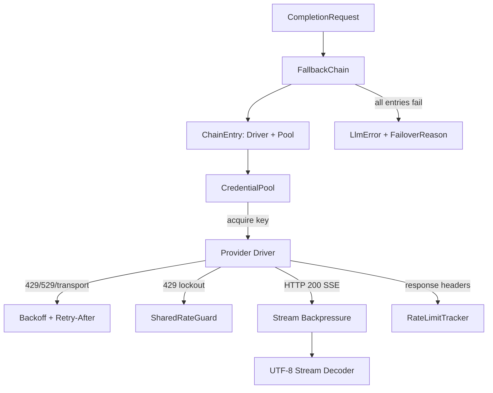

# crates — librefang-llm-drivers

# librefang-llm-drivers

Concrete LLM provider driver implementations for LibreFang. This crate bridges the abstract `librefang-llm-driver` trait to real HTTP/CLI backends — Anthropic, OpenAI, Gemini, Groq, Ollama, Aider, Claude Code, Codex CLI, Copilot, and others — and layers cross-cutting infrastructure on top: credential pooling, fallback chains, retry/backoff, rate-limit observability, and stream handling.

## Architecture Overview



Every driver implements the `LlmDriver` trait from `librefang-llm-driver`, which defines `complete()` and `stream()`. The crate re-exports that trait and its error types (`llm_driver`, `llm_errors`, `FailoverReason`) so downstream code can depend on this one crate alone.

## Provider Drivers (`drivers/`)

Each driver lives in its own submodule under `src/drivers/`. They fall into two categories:

### HTTP-based drivers

**Anthropic** (`drivers/anthropic.rs`) — The most feature-complete driver. Supports the Messages API with tool use, system prompt extraction, extended thinking (`budget_tokens`), prompt caching with configurable breakpoint strategies (`SystemOnly`, `SystemAndN`), and image inputs. The `build_anthropic_request` helper is shared between `complete()` and `stream()` and handles cache-control marker placement, max_tokens normalization for thinking budgets, and response_format injection into the system prompt.

**OpenAI** (`drivers/openai.rs`) — OpenAI Chat Completions / Responses API. Includes `parse_tool_args` and `malformed_tool_input` helpers reused by other drivers for tool-call argument validation.

Other HTTP drivers include **Gemini**, **Groq**, **Ollama**, **ChatGPT** (Responses API with session token management), **Copilot** (GitHub Copilot token exchange), **Vertex AI**, **Qwen Code**, and **CodeWhale**.

### CLI-based drivers

These spawn a subprocess rather than making HTTP calls:

- **Aider** (`drivers/aider.rs`) — Spawns `aider --message ... --yes-always --no-git`. Provider auth is delegated to environment variables. Includes `AiderDriver::detect()` and the `aider_available()` convenience function.
- **Claude Code** (`drivers/claude_code.rs`) — Manages credential files, MCP config, environment filtering, and stdin/stdout streaming.
- **Codex CLI** (`drivers/codex_cli.rs`) — Parses model from banner output, manages config directory.

### Driver module registry (`drivers/mod.rs`)

The `mod.rs` file provides provider-detection helpers used by the runtime:

- `create_driver(...)` — Factory function called by `librefang-runtime` to instantiate a driver from resolved configuration.
- `provider_api_format(...)` — Returns the wire format identifier for a provider.
- `is_cli_provider(...)` / `cli_provider_available(...)` — Used by `model_catalog.rs` and route handlers to detect whether a provider requires a local CLI binary and whether it's installed.
- `detect_available_provider(...)` — Used during quick-init to find a working provider.

## Credential Pool (`credential_pool.rs`)

A thread-safe pool of API keys for a single provider, designed to be shared behind an `Arc` (`ArcCredentialPool`).

### Selection strategies

| Strategy | Behavior |
|---|---|
| `FillFirst` | Always picks the highest-priority available key. Maximizes premium key utilization. |
| `RoundRobin` (default) | Cycles through available keys in priority order. Load-balancing. |
| `Random` | Picks a random available key using a lightweight LCG (no `rand` dependency). |
| `LeastUsed` | Picks the key with the lowest `request_count`. |

All mutable state is behind a single `Mutex<CredentialPoolInner>`, so the round-robin cursor and credential list are always read/written atomically — eliminating TOCTOU between index reads and credential selection.

### Cooldown tracking

Credentials can be marked into three cooldown states:

- `mark_exhausted` — 429 rate-limit. Default cooldown: 1 hour (`DEFAULT_EXHAUSTED_TTL`).
- `mark_credit_exhausted` — 402 quota exhausted. Default cooldown: 24 hours (`DEFAULT_CREDIT_EXHAUSTED_TTL`).
- `mark_permanent` — Auth failure. Effectively permanent (100-year sentinel timestamp).
- `mark_success` — Clears any exhaustion marker immediately and increments `request_count`.

### Construction

```rust
// Simple — keys carry empty labels:
let pool = CredentialPool::new(
    vec![("sk-key-a".to_string(), 10), ("sk-key-b".to_string(), 5)],
    PoolStrategy::RoundRobin,
);

// With operator-facing labels (preferred at boot — see #5260):
let pool = CredentialPool::new_with_labels(
    vec![
        ("sk-high".to_string(), "Primary".to_string(), 10),
        ("sk-low".to_string(), "Backup".to_string(), 5),
    ],
    PoolStrategy::FillFirst,
);

// Arc handle for sharing across async tasks:
let pool = new_arc_pool_with_labels(keys, PoolStrategy::RoundRobin);
```

Labels are carried inside each `PooledCredential` and surfaced via `snapshot()` — never reconstructed by positional indexing into the original config, which would lose alignment when boot skips a key whose env var is unset.

### Diagnostics

`snapshot()` returns `Vec<CredentialSnapshot>` — a fully redacted view with `key_hint` (`****abcd`), priority, request count, exhaustion status, and remaining cooldown seconds. Safe for HTTP/CLI/dashboard rendering. The `redact_key_hint` helper is Unicode-safe (counts by `char`, never by byte boundary).

## Fallback Chain (`drivers/fallback.rs`, `drivers/fallback_chain.rs`)

Composes multiple `ChainEntry` (each wrapping a driver + optional credential pool) into a failover sequence. When a driver returns an error, the chain classifies it via `FailoverReason` and decides whether to try the next entry or propagate. This is the outer retry layer; per-driver in-driver retries (see below) run inside each chain entry.

The runtime's `aux_client.rs` resolves configured providers into `ChainEntry` instances and wraps them in a `FallbackChain`.

## Backoff and Retry (`backoff.rs`)

### Jittered exponential backoff

```rust
pub fn jittered_backoff(
    attempt: u32,
    base_delay: Duration,
    max_delay: Duration,
    jitter_ratio: f64,
    floor: Duration,
) -> Duration
```

Formula: `max(base * 2^(attempt-1), floor) + jitter`, where `jitter ∈ [0, jitter_ratio * base_for_jitter]`.

Key properties:
- All exponential computation happens in `f64` space and is clamped before constructing a `Duration`, avoiding overflow panics at high attempt counts.
- The `floor` parameter (capped at 300 s) honours server-supplied `Retry-After` values deterministically, regardless of jitter.
- Non-finite `jitter_ratio` (NaN, Infinity) is coerced to `0.0` rather than panicking.
- The PRNG seed combines wall-clock nanoseconds with a process-global Weyl-sequence counter (`JITTER_COUNTER`), ensuring diversity across concurrent retry loops.

Pre-built profiles:

| Function | Base | Cap | Jitter |
|---|---|---|---|
| `standard_retry_delay(attempt, floor)` | 2 s | 60 s | 50% |
| `tool_use_retry_delay(attempt)` | 1.5 s | 60 s | 50% |

### Transport error classification

`transport_error_is_retryable(&reqwest::Error)` determines whether a pre-response network failure (connection refused, TLS hiccup, read timeout) is safe to retry. Uses reqwest's structured predicates (`is_timeout`, `is_connect`, `is_request`) first, then falls back to `llm_errors::is_transient` for substring matching. This ensures a single network hiccup on a single-provider deployment doesn't fail the turn outright.

### Test support

`enable_test_zero_backoff()` returns a `ZeroBackoffGuard` that makes all backoff delays zero for the duration of the guard. Used by integration tests to avoid real sleeps.

## Rate-Limit Infrastructure

### Rate-limit header tracking (`rate_limit_tracker.rs`)

`RateLimitSnapshot::from_headers()` parses provider-specific rate-limit headers (e.g. Anthropic's `anthropic-ratelimit-*` family, OpenAI's `x-ratelimit-*`). When a warning threshold is detected, the snapshot is logged at `WARN` level with a human-readable `display()`.

### Shared rate guard (`shared_rate_guard.rs`)

Cross-process 429 lockout persistence. When a provider returns HTTP 429, the key is recorded with its `Retry-After` value so subsequent requests with the same key short-circuit via `pre_request_check()` without burning a network round-trip. Only 429s trigger lockouts — 529 (overloaded) is a server-capacity issue, not account-level.

Key identifiers are hashed via `key_id_hash()` so raw API keys never touch disk.

### Retry-After parsing (`retry_after.rs`)

Parses the HTTP `Retry-After` header in both delta-seconds and HTTP-date formats. `duration_to_ms_or_fallback()` converts to milliseconds with a caller-supplied fallback when the header is absent, invalid, or already elapsed.

## Stream Handling

### Backpressure (`stream_backpressure.rs`)

Drivers that support streaming use `tokio::sync::mpsc::Sender<StreamEvent>` to push deltas to the consumer. The `send_or_mark_dropped!` macro detects when the receiver is dropped (consumer cancelled) and aborts the upstream SSE connection rather than continuing to fetch responses for nobody.

### UTF-8 stream decoding (`utf8_stream.rs`)

`Utf8StreamDecoder` buffers partial UTF-8 codepoints across SSE chunk boundaries. HTTP response chunks can split a multi-byte character, so raw `String::push_str` would panic or lose data. The decoder is also reused outside the LLM path — e.g. `librefang-runtime-media` uses it for MiniMax audio decode, and `password_hash.rs` uses `decode()` for SHA-256 token verification.

### Think filtering (`think_filter.rs`)

Filters extended-thinking blocks from responses when the caller has not opted into receiving them.

## Prompt Caching (Anthropic)

The Anthropic driver supports configurable cache breakpoint strategies via `PromptCacheStrategy`:

- `Disabled` — No markers. Master switch (`request.prompt_caching = false`) overrides everything.
- `SystemOnly` — Single marker on the system prompt block.
- `SystemAndN` — System prompt + last tool + rolling window of the last N messages. Capped at Anthropic's 4-breakpoint limit, with system and tools taking priority.

The 1-hour cache TTL requires the `anthropic-beta: extended-cache-ttl-2025-04-11` header, which is conditionally emitted via `request_uses_1h_cache()`.

## Caller Trace Headers (`drivers/trace_headers.rs`)

Builds the `x-librefang-{agent,session,step}-id` header set from `CompletionRequest` fields. Controlled per-driver via `with_emit_caller_trace_headers(bool)` (mirrors `KernelConfig.telemetry.emit_caller_trace_headers`). Non-trace `extra_headers` are unaffected by this flag.

## Token Rotation (`drivers/token_rotation.rs`)

`advance()` rotates OAuth tokens (used by Copilot, ChatGPT) on expiry. Called from `workflow.rs` in the kernel, which tests cancellation behavior during the rotation sleep.

## Error Handling

The crate re-exports `LlmError` from `librefang-llm-driver` with rich variants:

- `RateLimited { retry_after_ms, message }` — HTTP 429, with server-supplied delay.
- `Overloaded { retry_after_ms }` — HTTP 529 (Anthropic capacity).
- `Api { status, message, code }` — Non-success status, with optional `ProviderErrorCode` for typed classification.
- `Http(String)` — Transport-level failure.

`ProviderErrorCode` (in `llm_errors`) enables `FailoverReason` classification without substring-matching human-readable error messages. The Anthropic driver's `anthropic_error_code()` maps provider-specific `error.type` discriminants to these codes.

## Example: Token Estimation Corpus Capture

The `examples/capture_token_truth.rs` binary is a human-run tool for building the token-estimation benchmark ground truth. It reads the committed corpus, sends each sample with `max_tokens = 1` and prompt caching disabled, and records the provider-reported `usage.input_tokens`. Never run in CI.

```bash
OPENAI_API_KEY=<key> cargo run -p librefang-llm-drivers \
  --example capture_token_truth -- \
  --provider openai --model gpt-4o-mini \
  --out crates/librefang-runtime/tests/fixtures/token_estimation/tokens_truth.json
```

## Key Dependencies

| Crate | Role |
|---|---|
| `librefang-llm-driver` | Trait definitions, error types, request/response types |
| `librefang-types` | Domain types (`Message`, `ContentBlock`, `TokenUsage`, `ToolDefinition`, config enums) |
| `librefang-http` | Shared HTTP client with proxy support (`proxied_client`, `proxied_client_fallback`) |
| `reqwest` | HTTP transport |
| `tokio` | Async runtime, subprocess management, MPSC channels |
| `futures` | Stream combinators for SSE parsing |
| `zeroize` | API key memory scrubbing (`Zeroizing<String>`) |