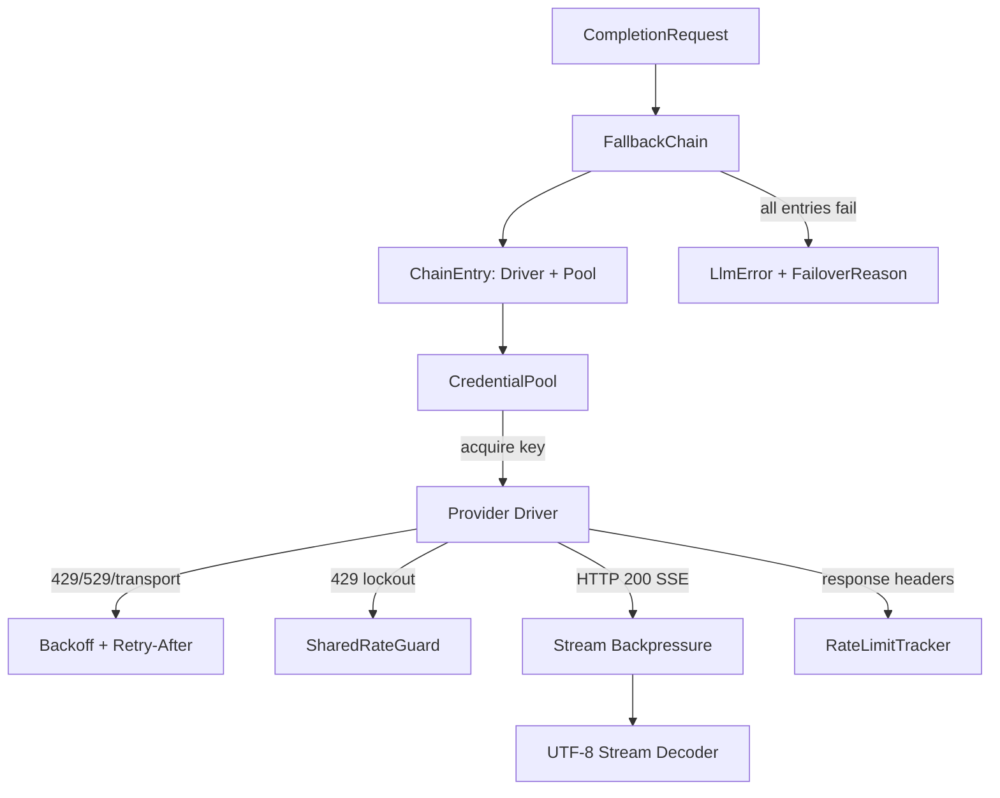

# crates — librefang-llm-drivers

# librefang-llm-drivers

Konkretne implementacje sterowników dostawców LLM dla LibreFang. Ten crate łączy abstrakcyjną cechę `librefang-llm-driver` z rzeczywistymi backendami HTTP/CLI — Anthropic, OpenAI, Gemini, Groq, Ollama, Aider, Claude Code, Codex CLI, Copilot i innymi — oraz nakłada na to infrastrukturę przekrojową: pulowanie poświadczeń, łańcuchy awaryjne, ponowienia/wycofanie, observowalność limitów zapytań i obsługę strumieni.

## Przegląd architektury



Każdy sterownik implementuje cechę `LlmDriver` z `librefang-llm-driver`, która definiuje `complete()` i `stream()`. Crate reeksportuje tę cechę i jej typy błędów (`llm_driver`, `llm_errors`, `FailoverReason`), dzięki czemu kod podrzędny może zależeć tylko od tego jednego crate'a.

## Sterowniki dostawców (`drivers/`)

Każdy sterownik znajduje się we własnym submodule w `src/drivers/`. Dzielą się na dwie kategorie:

### Sterowniki oparte na HTTP

**Anthropic** (`drivers/anthropic.rs`) — Najbardziej kompletny funkcyjnie sterownik. Obsługuje Messages API z użyciem narzędzi, ekstrakcją promptu systemowego, rozszerzonym myśleniem (`budget_tokens`), buforowaniem promptów z konfigurowalnymi strategiami punktów przerwania (`SystemOnly`, `SystemAndN`) oraz wejściami obrazowymi. Helper `build_anthropic_request` jest współdzielony między `complete()` i `stream()` i obsługuje umieszczanie znaczników cache-control, normalizację max_tokens dla budżetów myślenia oraz wstrzykiwanie response_format do promptu systemowego.

**OpenAI** (`drivers/openai.rs`) — OpenAI Chat Completions / Responses API. Zawiera helpery `parse_tool_args` i `malformed_tool_input` reused przez inne sterowniki do walidacji argumentów wywołań narzędzi.

Inne sterowniki HTTP obejmują **Gemini**, **Groq**, **Ollama**, **ChatGPT** (Responses API z zarządzaniem tokenem sesji), **Copilot** (wymianę tokenów GitHub Copilot), **Vertex AI**, **Qwen Code** i **CodeWhale**.

### Sterowniki oparte na CLI

Te uruchamiają proces podrzędny zamiast wykonywać wywołania HTTP:

- **Aider** (`drivers/aider.rs`) — Uruchamia `aider --message ... --yes-always --no-git`. Uwierzytelnienie dostawcy jest delegowane do zmiennych środowiskowych. Zawiera `AiderDriver::detect()` oraz wygodną funkcję `aider_available()`.
- **Claude Code** (`drivers/claude_code.rs`) — Zarządza plikami poświadczeń, konfiguracją MCP, filtrowaniem środowiska oraz strumieniowaniem stdin/stdout.
- **Codex CLI** (`drivers/codex_cli.rs`) — Parsuje model z danych wyjściowych banera, zarządza katalogiem konfiguracji.

### Rejestr modułów sterowników (`drivers/mod.rs`)

Plik `mod.rs` dostarcza helpery detekcji dostawców używane przez runtime:

- `create_driver(...)` — Funkcja fabryczna wywoływana przez `librefang-runtime` do tworzenia instancji sterownika z rozwiązanej konfiguracji.
- `provider_api_format(...)` — Zwraca identyfikator formatu przesyłu dla dostawcy.
- `is_cli_provider(...)` / `cli_provider_available(...)` — Używane przez `model_catalog.rs` i handlery tras do wykrywania, czy dostawca wymaga lokalnego binary CLI i czy jest zainstalowany.
- `detect_available_provider(...)` — Używane podczas szybkiej inicjalizacji do znalezienia działającego dostawcy.

## Pula poświadczeń (`credential_pool.rs`)

Wątkowo-bezpieczna pula kluczy API dla pojedynczego dostawcy, zaprojektowana do współdzielenia za `Arc` (`ArcCredentialPool`).

### Strategie wyboru

| Strategia | Zachowanie |
|---|---|
| `FillFirst` | Zawsze wybiera najwyższy-priorytetowo dostępny klucz. Maksymalizuje wykorzystanie kluczy premium. |
| `RoundRobin` (domyślna) | Przechodzi przez dostępne klucze w kolejności priorytetu. Balansowanie obciążenia. |
| `Random` | Wybiera losowy dostępny klucz za pomocą lekkiego LCG (bez zależności `rand`). |
| `LeastUsed` | Wybiera klucz z najniższym `request_count`. |

Cały stan mutowalny znajduje się za pojedynczym `Mutex<CredentialPoolInner>`, dzięki czemu kursor round-robin i lista poświadczeń są zawsze odczytywane/zapisywane atomowo — eliminując TOCTOU między odczytami indeksu a wyborem poświadczeń.

### Śledzenie cooldownu

Poświadczenia mogą być oznaczone jednym z trzech stanów cooldownu:

- `mark_exhausted` — Limit zapytań 429. Domyślny cooldown: 1 godzina (`DEFAULT_EXHAUSTED_TTL`).
- `mark_credit_exhausted` — Wyczerpanie limitu 402. Domyślny cooldown: 24 godziny (`DEFAULT_CREDIT_EXHAUSTED_TTL`).
- `mark_permanent` — Błąd autoryzacji. Efektywnie permanentny (setna roczna wartość sentynelowa).
- `mark_success` — Natychmiast czyści wszelkie znaczniki wyczerpania i inkrementuje `request_count`.

### Konstrukcja

```rust
// Prosta — klucze niosą puste etykiety:
let pool = CredentialPool::new(
    vec![("sk-key-a".to_string(), 10), ("sk-key-b".to_string(), 5)],
    PoolStrategy::RoundRobin,
);

// Z etykietami operacyjnymi (preferowane przy starcie — patrz #5260):
let pool = CredentialPool::new_with_labels(
    vec![
        ("sk-high".to_string(), "Primary".to_string(), 10),
        ("sk-low".to_string(), "Backup".to_string(), 5),
    ],
    PoolStrategy::FillFirst,
);

// Uchwyt Arc do współdzielenia między zadaniami async:
let pool = new_arc_pool_with_labels(keys, PoolStrategy::RoundRobin);
```

Etykiety są przenoszone wewnątrz każdego `PooledCredential` i udostępniane przez `snapshot()` — nigdy nie są rekonstruowane przez pozycyjne indeksowanie do oryginalnej konfiguracji, co spowodowałoby utratę wyrównania, gdy boot pomija klucz, którego zmienna env jest nieustawiona.

### Diagnostyka

`snapshot()` zwraca `Vec<CredentialSnapshot>` — w pełni zanonimizowany widok z `key_hint` (`****abcd`), priorytetem, liczbą zapytań, statusem wyczerpania i pozostałymi sekundami cooldownu. Bezpieczny dla renderowania HTTP/CLI/dashboardu. Helper `redact_key_hint` jest bezpieczny dla Unicode (liczy przez `char`, nigdy przez granice bajtów).

## Łańcuch awaryjny (`drivers/fallback.rs`, `drivers/fallback_chain.rs`)

Komponuje wiele `ChainEntry` (każde zawijające sterownik + opcjonalną pulę poświadczeń) w sekwencję failover. Gdy sterownik zwraca błąd, łańcuch klasyfikuje go przez `FailoverReason` i decyduje, czy spróbować następny wpis, czy propagować. Jest to zewnętrzna warstwa ponowień; wewnątrzsterownikowe ponowienia (patrz poniżej) działają wewnątrz każdego wpisu łańcucha.

Runtime'owy `aux_client.rs` rozwiązuje skonfigurowanych dostawców na instancje `ChainEntry` i zawija je w `FallbackChain`.

## Wycofanie i ponowienia (`backoff.rs`)

### Wycofanie wykładnicze z jitterem

```rust
pub fn jittered_backoff(
    attempt: u32,
    base_delay: Duration,
    max_delay: Duration,
    jitter_ratio: f64,
    floor: Duration,
) -> Duration
```

Formuła: `max(base * 2^(attempt-1), floor) + jitter`, gdzie `jitter ∈ [0, jitter_ratio * base_for_jitter]`.

Kluczowe właściwości:
- Całe obliczenie wykładnicze dzieje się w przestrzeni `f64` i jest clampowane przed konstrukcją `Duration`, unikając panik przepełnienia przy wysokich numerach prób.
- Parametr `floor` (ograniczony do 300 s) honoruje wartości `Retry-After` dostarczone przez serwer deterministycznie, niezależnie od jittera.
- Nieskończony `jitter_ratio` (NaN, Infinity) jest wymuszany do `0.0` zamiast powodowania paniki.
- Ziarno PRNG łączy nanosekundy zegara ściennego z globalnym procesowo licznikiem sekwencji Weyla (`JITTER_COUNTER`), zapewniając różnorodność między współbieżnymi pętlami ponowień.

Wstępnie zbudowane profile:

| Funkcja | Baza | Limit | Jitter |
|---|---|---|---|
| `standard_retry_delay(attempt, floor)` | 2 s | 60 s | 50% |
| `tool_use_retry_delay(attempt)` | 1.5 s | 60 s | 50% |

### Klasyfikacja błędów transportu

`transport_error_is_retryable(&reqwest::Error)` określa, czy awaria sieciowa przed odpowiedzią (odmowa połączenia, błąd TLS, timeout odczytu) jest bezpieczna do ponowienia. Używa najpierw strukturalnych predykatów reqwesta (`is_timeout`, `is_connect`, `is_request`), a następnie przechodzi do `llm_errors::is_transient` dla dopasowywania podciągów. Zapewnia to, że pojedynczy zakłócenie sieciowe na wdrożeniu z pojedynczym dostawcą nie spowoduje całkowitego niepowodzenia tury.

### Obsługa testów

`enable_test_zero_backoff()` zwraca `ZeroBackoffGuard`, który zeruje wszystkie opóźnienia wycofania na czas trwania guarda. Używane przez testy integracyjne do unikania rzeczywistych usypian.

## Infrastruktura limitów zapytań

### Śledzenie nagłówków limitów zapytań (`rate_limit_tracker.rs`)

`RateLimitSnapshot::from_headers()` parsuje specyficzne dla dostawcy nagłówki limitów zapytań (np. rodzinę `anthropic-ratelimit-*` Anthropic, `x-ratelimit-*` OpenAI). Gdy wykryty zostanie próg ostrzeżenia, snapshot jest logowany na poziomie `WARN` z czytelnym dla człowieka `display()`.

### Współdzielona straż limitów (`shared_rate_guard.rs`)

Międzyprocesowa persystencja blokad 429. Gdy dostawca zwraca HTTP 429, klucz jest rejestrowany z wartością `Retry-After`, tak że kolejne żądania z tym samym kluczem skracają drogę przez `pre_request_check()` bez zużywania rundy sieciowej. Tylko 429 wyzwalają blokady — 529 (przeciążenie) to problem wydajności serwera, nie na poziomie konta.

Identyfikatory kluczy są haszowane przez `key_id_hash()`, tak że surowe klucze API nigdy nie trafiają na dysk.

### Parsowanie Retry-After (`retry_after.rs`)

Parsuje nagłówek HTTP `Retry-After` w formatach delta-sekund i HTTP-date. `duration_to_ms_or_fallback()` konwertuje do milisekund z dostarczonym przez wywołującego fallbackiem, gdy nagłówek jest nieobecny, nieprawidłowy lub już upłynął.

## Obsługa strumieni

### Ciśnienie wsteczne (`stream_backpressure.rs`)

Sterowniki obsługujące strumieniowanie używają `tokio::sync::mpsc::Sender<StreamEvent>` do wypychania delt do konsumenta. Makro `send_or_mark_dropped!` wykrywa, gdy odbiornik został porzucony (konsument anulował), i przerywa nadrzędne połączenie SSE zamiast kontynuować pobieranie odpowiedzi dla nikogo.

### Dekodowanie strumieni UTF-8 (`utf8_stream.rs`)

`Utf8StreamDecoder` buforuje częściowe codepointy UTF-8 pomiędzy granicami fragmentów SSE. Fragmenty odpowiedzi HTTP mogą podzielić znak wielobajtowy, więc surowe `String::push_str` spowodowałoby panikę lub utratę danych. Dekoder jest również reużywany poza ścieżką LLM — np. `librefang-runtime-media` używa go do dekodowania audio MiniMax, a `password_hash.rs` używa `decode()` do weryfikacji tokenów SHA-256.

### Filtrowanie myślenia (`think_filter.rs`)

Filtruje bloki rozszerzonego myślenia z odpowiedzi, gdy wywołujący nie wyraził na nie zgody.

## Buforowanie promptów (Anthropic)

Sterownik Anthropic obsługuje konfigurowalne strategie punktów przerwania buforowania przez `PromptCacheStrategy`:

- `Disabled` — Brak znaczników. Główny przełącznik (`request.prompt_caching = false`) nadpisuje wszystko.
- `SystemOnly` — Pojedynczy znacznik na bloku promptu systemowego.
- `SystemAndN` — Prompt systemowy + ostatnie narzędzie + przesuwna okno ostatnich N wiadomości. Ograniczone do limitu 4 punktów przerwania Anthropic, z priorytetem dla systemu i narzędzi.

1-godzinny TTL bufora wymaga nagłówka `anthropic-beta: extended-cache-ttl-2025-04-11`, który jest emitowany warunkowo przez `request_uses_1h_cache()`.

## Nagłówki śledzenia wywołującego (`drivers/trace_headers.rs`)

Buduje zestaw nagłówków `x-librefang-{agent,session,step}-id` z pól `CompletionRequest`. Kontrolowany per-sterownik przez `with_emit_caller_trace_headers(bool)` (odzwierciedla `KernelConfig.telemetry.emit_caller_trace_headers`). Nieśledzące `extra_headers` nie są dotknięte przez tę flagę.

## Rotacja tokenów (`drivers/token_rotation.rs`)

`advance()` rotuje tokeny OAuth (używane przez Copilot, ChatGPT) przy wygaśnięciu. Wywoływane z `workflow.rs` w jądrze, które testuje zachowanie anulowania podczas usypiania rotacji.

## Obsługa błędów

Crate reeksportuje `LlmError` z `librefang-llm-driver` z bogatymi wariantami:

- `RateLimited { retry_after_ms, message }` — HTTP 429, z opóźnieniem dostarczonym przez serwer.
- `Overloaded { retry_after_ms }` — HTTP 529 (wydajność Anthropic).
- `Api { status, message, code }` — Status nie będący sukcesem, z opcjonalnym `ProviderErrorCode` dla typowanej klasyfikacji.
- `Http(String)` — Awaria na poziomie transportu.

`ProviderErrorCode` (w `llm_errors`) umożliwia klasyfikację `FailoverReason` bez dopasowywania podciągów czytelnych dla człowieka komunikatów błędów. Funkcja `anthropic_error_code()` sterownika Anthropic mapuje dyskryminanty specyficzne dla dostawcy `error.type` na te kody.

## Przykład: Przechwytywanie korpusu szacowania tokenów

Binary `examples/capture_token_truth.rs` jest narzędziem uruchamianym przez człowieka do budowania truth ground dla benchmarku szacowania tokenów. Czyta zatwierdzony korpus, wysyła każdy próbkę z `max_tokens = 1` i wyłączonym buforowaniem promptów, i rejestruje zgłaszane przez dostawcę `usage.input_tokens`. Nigdy nie uruchamiać w CI.

```bash
OPENAI_API_KEY=<key> cargo run -p librefang-llm-drivers \
  --example capture_token_truth -- \
  --provider openai --model gpt-4o-mini \
  --out crates/librefang-runtime/tests/fixtures/token_estimation/tokens_truth.json
```

## Kluczowe zależności

| Crate | Rola |
|---|---|
| `librefang-llm-driver` | Definicje cech, typy błędów, typy żądań/odpowiedzi |
| `librefang-types` | Typy domenowe (`Message`, `ContentBlock`, `TokenUsage`, `ToolDefinition`, enumy konfiguracji) |
| `librefang-http` | Współdzielony klient HTTP z obsługą proxy (`proxied_client`, `proxied_client_fallback`) |
| `reqwest` | Transport HTTP |
| `tokio` | Runtime asynchroniczny, zarządzanie procesami podrzędnymi, kanały MPSC |
| `futures` | Kombinatory strumieniowe do parsowania SSE |
| `zeroize` | Czyszczenie pamięci kluczy API (`Zeroizing<String>`) |
